## Devtool Performance使用指南

如果我们要对网页做性能分析，也即是是当你的页面在浏览器运行时的性能表现，而不是下载页面的时候。我们常用的🔧就是Chrome DevToos Performance

本篇旨在给出使用Chrome DevToos Performance调优的一些基础知识，用Performance工具去分析一个现有的项目，怎么去分析，从而找到性能瓶颈

### 环境准备

1. 打开Chrome的匿名模式。匿名模式可以保证Chrome在一个相对干净的环境下运行。比如说，你安装了许多chrome插件，这些插件可能会影响我们分析性能表现
2. 打开网页
3. 打开Devtools
4. 根据机器不同，同一个网页表现可能就不一样，可以使用CPU Network来模拟CPU和网络状态，以模拟弱网或者较差硬件下的性能，如果你电脑性能比较好，可以 限制cpu速度，下图尖头标记
5. 勾选Screenshots选项，我们会看到各个时间渲染状态的截图

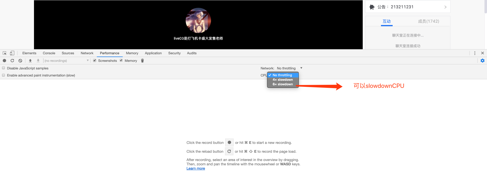

### 记录运行时性能表现

##### 记录

1. 在DevTools中，点击 Record 。这时候Devtools就开始录制各种性能指标

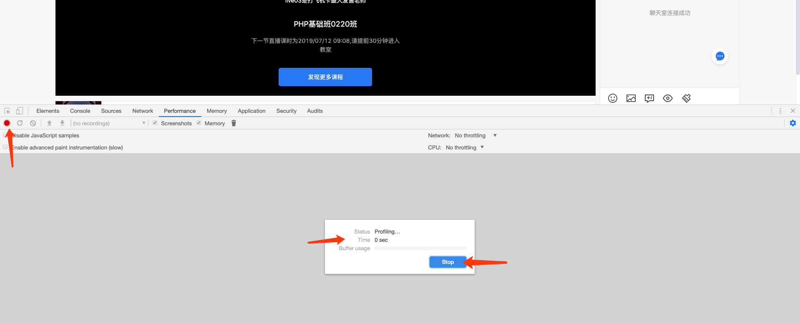

2. 等待几秒钟
3. 点击Stop按钮，Devtools停止录制，处理数据，然后显示性能报告

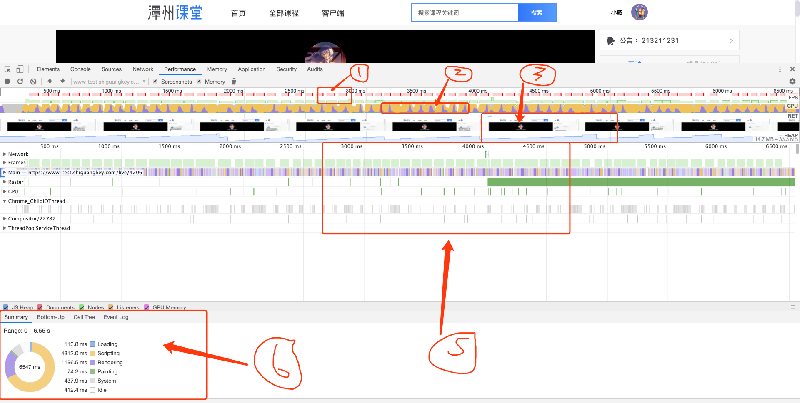

是不是感觉东西很多，我第一次看这个的时候很烦躁，这尼玛谁会看，太难了。后来坚持看，慢慢的发现一点不难。

##### 分析

我们平时用的多的就是图上的6个区域，具体含义：

1. 圈1：我们仔细看图就会发现，在这一长条最右边有一个“FPS”，这就是FPS图，我们应该已经看过FPS相关的文章，它是页面每秒帧数，是衡量性能的指标，如果能保持60FPS的话，则证明不错，如果小于24就会出现卡动。放大FPS图你会看到：

   - 红色的条，如果出现了红色的条就意味着帧数已经下降到影响用户体验的程度，chrome已经帮你标注了，这块有问题
   - 绿色的半透明条，其实就是FPS指数，所有绿色柱体高度越高，性能越好

2. 圈2：这块区域同理，右边有标注“CPU”，包括两种状态：

   - 充满颜色，cpu快满了
   - 不充满颜色

   cpu是否充满颜色和fps存在联系

3. 其实在CPU的下面还有一个NET，这个主要是将屏幕逐帧录制下来，可以帮助观察页面的状态，主要用处，可以帮助分析首屏渲染速度

4. 圈3：你☑️了Screenshots，每一时刻页面选择的快照

5. 圈6：是一个综合面板，

6. 圈5：是对圈一的一个详细面板，主要是看Frames，

   - 查看特定帧的fps，Frames会fps的对应关系，如下图这就是一帕

     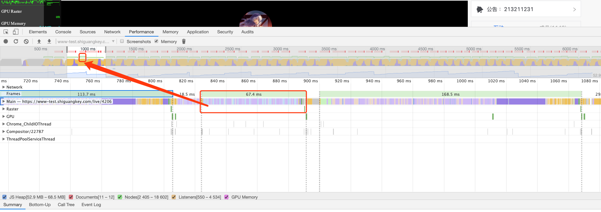

   - 鼠标悬停其上，可以查看数据，这一帕刷新需要的Duration、FPS和CPU time。这一帕的时间间隔，也就是页面两次刷新之间间隔了67.42ms，fps=1000/67.42 = 14.83fps，约等于14fps

     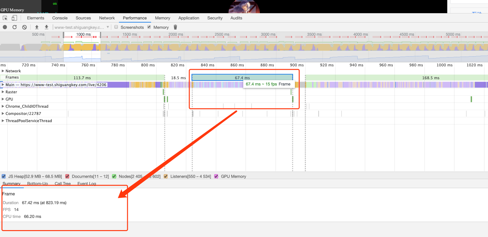

7. 圈6：如果你已经理解了其他4个面板，相信你也已经发现了一些有性能问题的页面了，但是你还不知道为什么会有性能问题吧？

   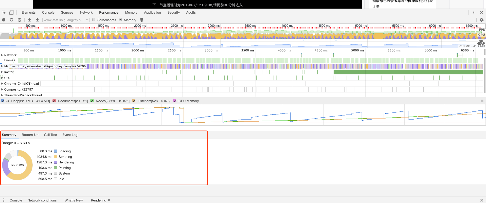

   - 对性能进行录制完成的时候，会默认在底部展示一个Summary摘要，显示全局的信息， 0 – 6.60 s录制时间的具体耗时：

     - script执行耗时4034.8ms
     - render渲染耗时1287.3ms
     - Painting重绘耗时103.6ms

   - 主要就是这3个耗时，知道了这三部分耗时，只是知道了，哪有问题，但具体问题在哪呢？

     1. 你可以去看圈5中的Main：

        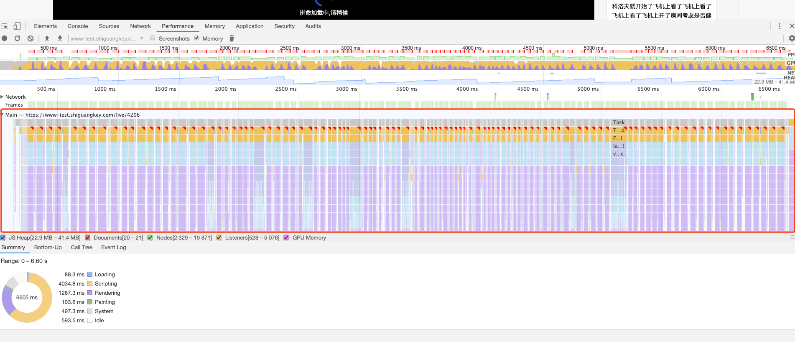

        红色边框圈出来的，就是Main部分，其中每一块是每一帧中所做的事情，目前这样看不出来什么，脑壳疼，为了方便我们观看，我们可以在fps、cpu、net模块，点击一下，或者滑动鼠标，缩小时间区间

        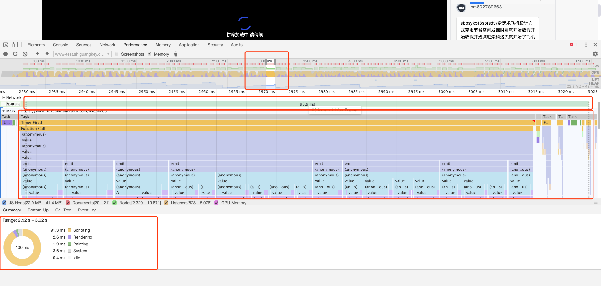

        注意看上图红色框标记的区域，基本是一个帕的信息了，现在已经能够看到，Main中展示的是火焰图，也就是函数调用的堆栈

        火焰图，可以简单理解，x轴表示时间，y轴表示调用的函数，函数中还包含依次调用的函数，y轴只占用x轴的一个时间维度

        同样可以看到“红色三角号”，这就是chrome自动帮助识别出有问题的部分，还记得FPS也有“红色三角号”吗？

        我们点击带“红色三角号”，再看底部的“Summary”的汇总：

        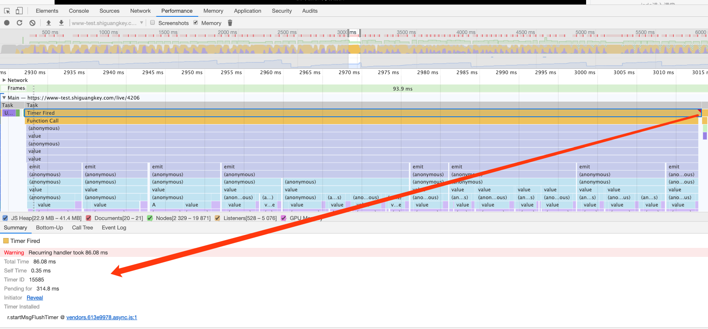

        注意：Wwring：Recurring handler took 86.08 ms（重复处理程序耗时86.08毫秒）

        我们可以点击底部的代码路径跳转：

        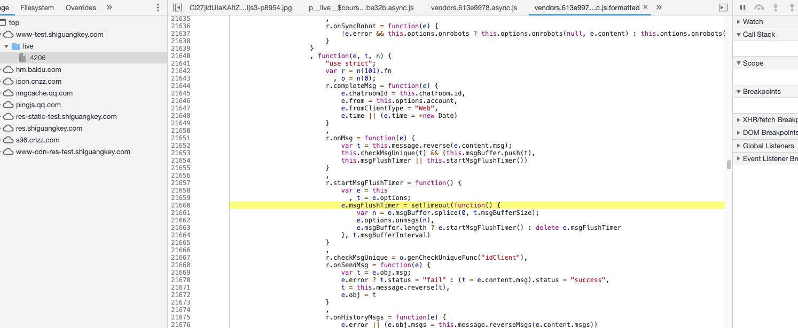

        目前还看不出问题，所以我们还需要继续按照函数调用栈找问题，直到找到我们业务代码块，才有可能定位问题

     2. 我们也可以根据选中某一个fps低的帕，去看Summary

        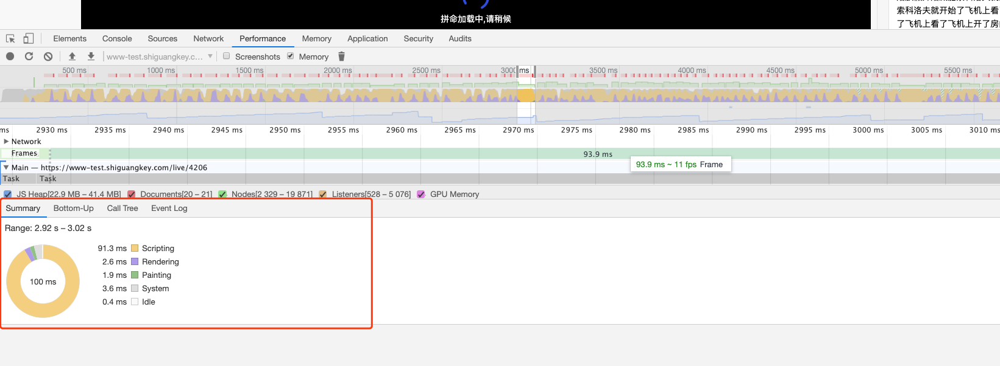

        既然汇总说这一帕总共共耗时100ms，其中：

        - script就用时91.3ms
        - rendering用时2.6ms

        Summary右边还有几个tab栏，

        - Button-Up 是从内到外执行的展示，下面会展示总时间和自己消耗的时间，一般是看自己消耗的时间，Activity 可以展开一层一层查找
        - call tree 是从外到内执行的展示，和 Button-Up 只有顺序的差别
        - Event log 展示的和 call tree 差不多，多了四个可筛选过滤的事件

        我一般喜欢看Event Log面板，其实它和Main差不多的意思，我们可以只看耗时较长的事件，然后看里面的调用栈：

        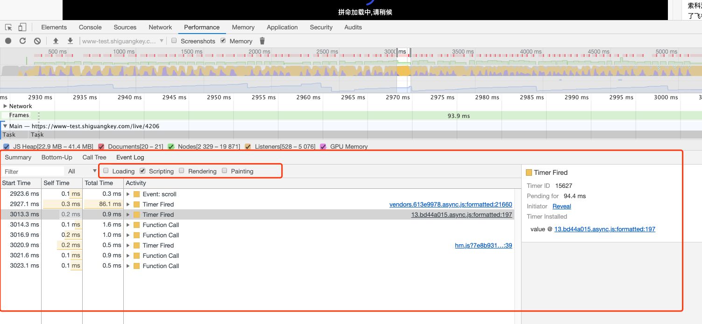

        就这样，一层一层往下看直到找到存在性能问题的代码块

### 常用概念

##### 火焰图

react 项目在地址栏后加上?react_perf 后事件会被归类到 user Timing 中 [React 文档](https://react.docschina.org/docs/optimizing-performance.html),就是图中的 Timings

图中 1 区域表示每一帧，一格代表一帧，区域 2 表示 react 组件更新，可以看出更新的组件以及花费的时间，区域 3 就是主进程，结合一帧可以看出 react 组件已经更新了多次，但是页面渲染只执行了一次，查阅文档后发现 js 引擎线程与 GUI 渲染线程是互斥的，只有 js 引擎线程空闲时才会调用 GUI 渲染线程，这里可能是一个优化点

椭圆标记的区域是四个可以切换的 tab:

Self Time和Total Time以及Activity，其中的Self Time代表函数本身执行消耗时间，Total Time则是函数本身消耗再加上在调用它的函数中消耗的总时间

- summary 展示的是总览图和信息
- Button-Up 是从内到外执行的展示
- call tree 是从外到内执行的展示,Button-Up 只有顺序的差别
- Event log 顾名思义就是事件日志的意思，可以很方便的选择想查看的某一阶段的日志。

##### Loading 事件

| 事件             | 描述                                                         |
| ---------------- | ------------------------------------------------------------ |
| Parse HTML       | 浏览器执行 HTML 解析                                         |
| Finish Loading   | 网络请求完毕事件                                             |
| Receive Data     | 请求的响应数据到达事件，如果响应数据很大（拆包），可能会多次触发该事件 |
| Receive Response | 响应头报文到达时触发                                         |
| Send Request     | 发送网络请求时触发                                           |

##### Scriprting 事件

| 事件                    | 描述                                                  |
| ----------------------- | ----------------------------------------------------- |
| Animation Frame Fired   | 一个定义好的动画帧发生并开始回调处理时触发            |
| Cancel Animation Frame  | 取消一个动画帧时触发                                  |
| GC Event                | 垃圾回收时触发                                        |
| DOMContentLoaded        | 当页面中的 DOM 内容加载并解析完毕时触发               |
| Evaluate Script         | A script was evaluated.                               |
| Event                   | js 事件                                               |
| Function Call           | 只有当浏览器进入到 js 引擎中时触发                    |
| Install Timer           | 创建计时器（调用 setTimeout()和 setInterval()）时触发 |
| Request Animation Frame | A requestAnimationFrame() call scheduled a new frame  |
| Remove Timer            | 当清除一个计时器时触发                                |
| Time                    | 调用 console.time()触发                               |
| Time End                | 调用 console.timeEnd()触发                            |
| Timer Fired             | 定时器激活回调后触发                                  |
| XHR Ready State Change  | 当一个异步请求为就绪状态后触发                        |
| XHR Load                | 当一个异步请求完成加载后触发                          |

##### Rending 事件

| 事件              | 描述                              |
| ----------------- | --------------------------------- |
| Invalidate layout | 当 DOM 更改导致页面布局失效时触发 |
| Layout            | 页面布局计算执行时触发            |
| Recalculate style | Chrome 重新计算元素样式时触发     |
| Scroll            | 内嵌的视窗滚动时触发              |

##### Painting 事件

| 事件             | 描述                                  |
| ---------------- | ------------------------------------- |
| Composite Layers | Chrome 的渲染引擎完成图片层合并时触发 |
| Image Decode     | 一个图片资源完成解码后触发            |
| Image Resize     | 一个图片被修改尺寸后触发              |
| Paint            | 合并后的层被绘制到对应显示区域后触发  |

选中红点的框之后可在详情区查看信息，此时浏览器已经给出了性能瓶颈的警告，
'Idle callback execution extended beyond deadline by 19.72 ms',点击 utils.js 文件可以看到具体是哪个方法，这里可能是一个可以优化的地方,如图

##### 浏览器渲染的一些概念

- DOM Tree： 浏览器将 HTML 解析成树形的数据结构。
- CSS Rule Tree：浏览器将 CSS 解析成树形的数据结构。
- Render Tree：DOM 树和 CSS 规则树合并后生产 Render 树。
- layout：有了 Render Tree，浏览器已经能知道网页中有哪些节点、各个节点的 CSS 定义以及他们的从属关系，从而去计算出每个节点在屏幕中的位置。
- painting: 按照算出来的规则，通过显卡，把内容画到屏幕上。
- reflow（回流）：当浏览器发现某个部分发生了点变化影响了布局，需要倒回去重新渲染，内行称这个回退的过程叫 reflow。reflow 会从 html 这个 root frame 开始递归往下，依次计算所有

### 参考文章

- [使用Chrome DevTools的Timeline分析页面性能](https://segmentfault.com/a/1190000003991459)
- [从浏览器多进程到JS单线程，JS运行机制最全面的一次梳理](https://juejin.im/post/5a6547d0f265da3e283a1df7#heading-4)
- [浅谈浏览器多进程与JS线程](https://segmentfault.com/a/1190000013083967)
- [性能为何至关重要](https://developers.google.com/web/fundamentals/performance/why-performance-matters/)
- [浏览器加载、解析、渲染](https://www.jianshu.com/p/2d522fc2a8f8)
- [浏览器的回流与重绘](https://juejin.im/post/5a9923e9518825558251c96a)
- [chrome对页面重绘和回流以及优化进行优化](https://www.zhoulujun.cn/html/webfront/browser/webkit/2016_0506_7820.html)
- [你真的了解回流和重绘吗？](https://segmentfault.com/a/1190000017329980)
- [What forces layout / reflow](https://gist.github.com/paulirish/5d52fb081b3570c81e3a)
- [如何减少浏览器回流](https://www.ahonn.me/post/24)
- [浏览器渲染页面过程与页面优化](https://segmentfault.com/a/1190000010298038)
- [16毫秒的优化](http://velocity.oreilly.com.cn/2013/ppts/16_ms_optimization--web_front-end_performance_optimization.pdf)
- [页面重绘和回流以及优化](https://www.html.cn/archives/4996)

