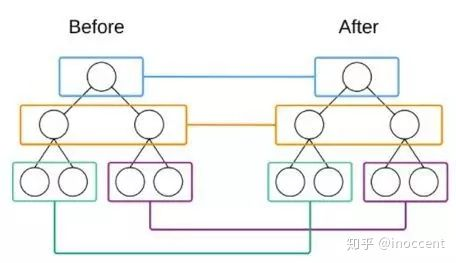

## react 性能优化

其实渲染原理决定着性能优化的方法，只有在了解原理之后，才能完全理解为什么这样做可以优化性能。正所谓：知其然，然后知其所以然。

### react 渲染

#### JSX 如何生成 element

```javascript
return (
  <div className="cn">
    <Header> Hello, This is React </Header>
    <div>Start to learn right now!</div>
    Right Reserve.
  </div>
);
```

首先，它会经过 babel 编译成 React.createElement 的表达式

```javascript
return React.createElement(
  "div",
  { className: "cn" },
  React.createElement(Header, null, "Hello, This is React"),
  React.createElement("div", null, "Start to learn right now!"),
  "Right Reserve"
);
```

#### React 是如何对比出页面变化最小的部分?

你可能会说 React 用 virtual DOM 表示了页面结构, 每次更新, React 都会 re-render 出新的 virtual DOM, 再通过 diff 算法对比出前后变化, 最后批量更新. 没错, 很好, 这就是大致过程, 但这里存在着一些隐藏的深层问题值得探讨 :

- React 是如何用 virtual DOM 表示了页面结构, 从而使任何页面变化都能被 diff 出来?
- React 是如何 diff 出页面变化最小的部分?

##### React 如何表示页面结构

```javascript
class C extends React.Component {
    render () {
        return (
            <div className='container'>
                  "dscsdcsd"
                  <i onClick={(e) => console.log(e)}>{this.state.val}</i>
                  <Children val={this.state.val}/>
            </div>
        )
    }
}
// virtual DOM(React element)
{
  $$typeof: Symbol(react.element)
  key: null
  props: {  // props 代表元素上的所有属性, 有children属性, 描述子组件, 同样是元素
    children: [
      ""dscsdcsd"",
	  {$$typeof: Symbol(react.element), type: "i", key: null, ref: null, props: {…}, …},
	  {$$typeof: Symbol(react.element), type: class Children, props: {…}, …}
    ]
    className: 'container'
  }
  ref: null
  type: "div"
  _owner: ReactCompositeComponentWrapper {...} // class C 实例化后的对象
  _store: {validated: false}
  _self: null
  _source: null
}
```

每个标签, 无论是 DOM 元素还是自定义组件, 都会有 key、type、props、ref 等属性

- key 代表元素唯一 id 值, 意味着只要 id 改变, 就算前后元素种类相同, 元素也肯定不一样了
- type 代表元素种类, 有 function(空的 wrapper)、class(自定义类)、string(具体的 DOM 元素名称)类型, 与 key 一样, 只要改变, 元素肯定不一样
- props 是元素的属性, 任何写在标签上的属性(如 className='container')都会被存在这里, 如果这个元素有子元素(包括文本内容), props 就会有 children 属性, 存储子元素; children 属性是递归插入、递归更新的依据

也就是说, 如果元素唯一标识符或者类别或者属性有变化, 那么它们 re-render 后对应的 key、type 和 props 里面的属性也会改变, 前后一对比即可找出变化. 综上来看, React 这么表示页面结构确实能够反映前后所有变化

##### 那么 React 是如何 diff 的？

`React`基于两个假设：

- 两个相同的组件产生类似的`DOM结构`，不同组件产生不同`DOM结构`
- 对于同一层次的一组子节点，它们可以通过唯一的 id 区分

同时，基于第一点假设，我们可以推论出，`Diff`算法只会对同层的节点进行比较。如图，它只会对颜色相同的节点进行比较。



也就是说如果父节点不同，`React`将不会在去对比子节点。因为不同的组件`DOM结构`会不相同，所以就没有必要在去对比子节点了，这也提高了对比的效率。直接将算法复杂度 O(n^3)变成了 O(n)。

#### Fiber 机制

react 最新版已经引入了核心调度算法即 fiber 机制，为什么需要引入 fiber？

- 通过上面我们已经知道，React 渲染页面分为两个阶段：
  - 调度阶段（reconciliation）：在这个阶段 React 会更新数据生成新的 Virtual DOM，然后通过 Diff 算法，快速找出需要更新的元素，放到更新队列中去，得到新的更新队列。
  - 渲染阶段（commit）：这个阶段 React 会遍历更新队列，将其所有的变更一次性更新到 DOM 上
- React 渲染的不可控，虽然 react 的 diff 算法很优，但是如果存在一个状态发生变化，涉及到 1000 个组件的更新，这样有可能主线程被 React 占着用来调度，这段时间内用户的操作不会得到任何的反馈，只有当 React 中需要同步更新的任务完成后，主线程才被释放。对于这段时间内 React 的调度，我们是无能为力的，那么浏览器失去响应，用户体验非常差

Fiber 的中文解释是"纤程"，是线程的颗粒化的一个概念。也就是说一个线程可以包含多个 Fiber

简单说就是依赖 requestIdleCallback`/`requestAnimationFrame 实现调度器

`requestIdleCallback`_会让一个低优先级的任务在空闲期被调用，而_`requestAnimationFrame`_会让一个高优先级的任务在下一个栈帧被调用，从而保证了主线程按照优先级执行 Fiber 单元。_

```javascript
组件的 props/state 更改(开发者控制) -> shouldComponentUpdate（开发者控制）-> 计算 VDOM 的更新（React 的 diff 算法会计算出最小化的更新）-> 更新真实 DOM (React 控制)
```

**当组件的状态发生变化，React 将会构建新的 virtual DOM，使用 diff 算法把新老的 virtual DOM 进行比较，如果新老 virtual DOM 树不相等则重新渲染，相等则不重新渲染，这个过程需要耗费的时间。**

**react 在渲染的过程中避免不了对 DOM 的 操作，DOM 操作是非常耗时的**

**因此要提高组件的性能就应该尽一切可能的减少组件的重新渲染**

### 优化实践

说白了对于 react 应用的优化，先看看一般情况下影响应用性能的几个核心因素：

- react 组件无谓的 re-render，可以说这是所有影响 react 性能的罪魁祸首，至于说为什么是首要？那就需要了解清楚我们上面说到的 react 渲染机制，那么很明显要调优，就是要尽可能去控制组件的 re-render
- 其次就是众所周知的，高昂的 DOM 渲染，说白了就是控制回流和重绘，这个和第一点 re-render 本质是一样的，大家可以思考我为什么要分为两条呢？
- 最后就是高昂的计算，我们知道浏览器在一帕的过程中给我们的时间只有 10ms 左右，那么我们如何让复杂计算在 10ms 内完成，如果完不成那么怎么保证不占用主线程，不发生掉帧呢？

#### re-render

##### props 和 state

组件的 props 或 state 变化，React 将会尝试渲染

- 状态数据层次不能过深，尽可能扁平化，便于数据对比，数组遍历从而减小带来的性能消耗
- 给 map 列表项添加 key
- 不要随意更改 props 和 state 的地址引用
- 尽可能保证 handler 是同一个引用，思考如下代码片刻，给出你的理解？

```javascript
<div onClick={this.tap.bind(this)} />
constructor(props) {
    super(props);
    this.tap= this.tap.bind(this);
}
tap =(value)=> {};
<div onClik={()=>this.tap(value)} />
```

##### 别滥用 SFC

SFC 组件没有 ref，没有生命周期，没有 state（现在有了），可以避免不必要的内存申请及检查，这意味着更高效的渲染，React 会直接调用 createElement 返回 VDOM

SFC 组件的设计本身是一种优化，但是我认为对于写组件的人的要求是比 class 组件高，理解不深刻，往往适得其反，反而是降低了性能，所以要慎用，但不是不用。

如果父组件想要对 SFC 组件的以下行为做控制：

- 何时渲染？，因为 SFC 没有生命周期，只要传入新的 props/state 就会 re-render，而且这意味着，一旦 SFC 的父组件更新，SFC 就会 re-render
- 渲染什么？，本身没法控制，高频的 re-render 就会带来 VDOM 的 diff，这笔开销累计起来就会很大

对于 SFC 的使用一定要节制，也就是说在使用 SFC 之前要思考清楚具体做什么，更新的频率等

#### shouldComponentUpdate

但我们没法通过合理的组件设计和状态设计来让应用达到高性能的时候，就需要我们使用组件的生命周期来控制组件的渲染，也就是说控制组件渲染的权利在开发手里

##### Pure Component

如果一个组件只和 props 和 state 有关系，给定相同的 props 和 state 就会渲染出相同的结果，那么这个组件就叫做纯组件，换一句话说纯组件只依赖于组件的 props 和 state，下面的代码表示的就是一个纯组件（Pure Component）。

```javascript
class extends React.PuerComponent {
  render() {
    return (
      <div style={{ width: this.props.width }}>
        {this.state.rows}
      </div>
    );
  }
}
```

##### 手动控制

`shouldComponentUpdate` 这个函数会在组件重新渲染之前调用，函数的返回值确定了组件是否需要重新渲染。函数默认的返回值是 `true`，意思就是只要组件的 props 或者 state 发生了变化，就会重新构建 virtual DOM，然后使用 diff 算法进行比较，再接着根据比较结果决定是否重新渲染整个组件。函数的返回值为 `false` 表示不需要重新渲染。 `shouldComponentUpdate` 在组件的重新渲染的过程中的位置如下图：


##### 优化一：Container and Component

我们可以通过组件的容器来隔离外界的变化。容器就是一个数据层，而组件就是专门负责渲染，不进行任何数据交互，只根据得到的数据渲染相应的组件，下面就是一个容器以及他的组件。

```javascript
class BudgetContainer extends Component {
  constructor(props) {
    super(props);
  }

  shouldComponentUpdate() {
    //	进行相应的更新控制
  }

  computeState() {
    return BudgetStore.getStore();
  }

  render() {
    return <Budget {...this.state} />;
  }
}
```

容器不应该有 props 和 children，这样就能够把容器自己和父组件进行隔离，不会因为外界因素去重新渲染，也没有必要重新渲染。

设想一下，如果设计师觉得这个组件需要移动位置，你不需要做任何的更改只需要把组件放到对应的位置即可，我们可以把它移到任何地方，可以放在不同的应用中，同时也可以应用于测试，我们只需要关心容器的内部的数据的来源即可，在不同的环境中编写不同的容器。

eg：

**在直播聊天室里有一个互动区域和成员列表的 tab 切换，最开始我们认为如果在切换的过程中不断销毁和挂载组件，初始化的成本会很高，比如互动区域和成员列表初始化需要很多的时间，所以我们选择了 display:none，后面发现两个 tab 的子组件同时存在，比初始化带来的消耗更大，这时候是直接会影响两个 tab 的性能，后面才改成直接销毁组件**

我们在使用容器组件的时候，不可避免的需要控制子组件的显示，使用 return null 而不是 CSS 的 display:none 来控制节点的显示隐藏。保证同一时间页面的 DOM 节点尽可能的少

##### 优化二：动静分离

假设我们有一个下面这样的组件：

```javascript
<ContainerScroll width={300} color="blue" scrollTop={this.props.offsetTop} />
```

这是一个可以滚动的表格，`offsetTop` 代表着可视区距离浏览器的的上边界的距离，随着鼠标的滚动，这个值将会不断的发生变化，导致组件的 props 不断地发生变化，组件也将会不断的重新渲染。如果使用下面的这种写法：

```javascript
<ContainerScroll>
  <CompoentTable width={300} color="blue" /> //
  如何保证CompoentTable组件的滚动位置呢？
</ContainerScroll>
```

因为 `CompoentTable` 这个组件的 props 是固定的不会发生变化，在这个组件里面使用 `shouldComponentUpdate` ，返回一直为 `false`， 因此不管组件的父组件也就是 `ContainerScroll` 组件的状态是怎么变化，组件 `CompoentTable` 都不会重新渲染。也就是子组件**隔离**了父组件的状态变化。

通过把变化的属性和不变的属性进行分离，减少了重新渲染，获得了性能的提升，同时这样做也能够让组件更容易进行分离，更好的被复用。

【问题】：那么子组件如何同步滚动条的位置呢？

##### 优化三：最小化变动

下面来看一个例子，一个 list 有 >= 10000 个未标记的 Item，点击某一 Item 该 Item 就会变为已标记，再点击就会变为未标记。很简单对不对，我们采用 dva 来实现。

jsx：

```javascript
return (
  <ul>
    {list.map(item => (
      <Item
        className={item.marked ? "active" : ""}
        key={item.key}
        onClick={this.onClickHandle.bind(this, item)} //注意这个地方也可以优化？
      />
    ))}
  </ul>
);
```

store 中存储的 state：

```javascript
{
    [{id:0, marked: false}, {id:1, marked: false}, ...]
}
```

我们给每一个 item 绑定 onClick 对应的回调函数

```javascript
function onClickHandle(id) {
    return state.map((item) =>
      action.id === item.id ? {...item, marked: !item.marked } : item
}
```

可以尝试写一个 dome，运行下看看性能如何，你如果觉得性能还 ok，那么下面的可以不看，😄

###### 思考一：让未被修改的组件对改变无感知

继续改进，想一下最优解，当我们在更新一个 Item 时，如果其他未被修改的 Item 的 props 和 state 没有任何的改变，那么就完全不会经过他们的生命周期。对，就是减少无谓的 re-render

所以，这里要将数据和组件重新组合。

- 为了避免父组件的 re-render，我们将每个 Item 和 redux store 直接连接
- 将 store 拆分为 ids 和 items，用 ids 给父组件完成 Item 初始化提供一些必要的信息，用 items 对 Item 进行初始化和更新
- 每次点击的时候 ids 不变，所以父组件不会 re-render，只更新对应的子组件

```javascript
updateState(state, { payload }) {
  return {
    ...state,
  [action.id]: {...item, marked: !item.marked}
  };
}
```

当某个 Item 被 mark 时，虽然返回了一个新的对象，但是 `…` 解构函数是浅拷贝，所以 items 数组中对象的引用不变，只有发生更新的那个对象是新的。这样就做到了只改变需要改变的 Item 的 props。

除了真正要更新的 Item，其他所有 Item 对这次点击都是无感知的，性能好了很多。

###### 思考二：范式化 store

但是 ids 和 items 中的 id 冗余了，如果后面还要再加上添加和删除的功能就要同时修改两个属性，如果 ids 只是用来初始化 App 的话就会一直在 store 中残留，还容易引起误会。所以，还是将 store 变回如下的组织：

```javascript
store:{
    items:[
        {id: 0, marked: false},
        {id: 1, marked: false},
		...
    ]
}
```

其他的处理的方式类似**优化一**，每次进行局部更新

但是要补全 App 的 shouldComponentUpdate，因为虽然是局部更新，但是 reducer 是一个纯函数，纯函数每次不修改原 state，返回一个新 state，所以只要手动控制一个 App 的 shouldComponentUpdate 即可，根据业务需要写即可，这里只是做个演示，就直接返回了 false，相当于 App 只是完成初始化的功能。

```javascript
shouldComponentUpdate() {
  return false
}
```

###### 思考三：提升状态

提升之后：

```javascript
return (
  <ul>
    {list.map(item => (
      <Item
        key={item.id}
        item={item}
        selected={item.id === currentId}
        onClick={this.onClickHandle} //注意这个地方也可以优化？
      />
    ))}
  </ul>
);
```

现在看看性能如何？

###### 思考四：可视化渲染

可视化渲染顾名思义就是只渲染可以看的见的区域，看不见的 dom 不要去渲染，本质上是减少 dom 可带来的性能消耗，具体看[react 官方文档性能优化](https://zh-hans.reactjs.org/docs/optimizing-performance.html)

##### 优化四：Immutable.js

对于复杂的数据的比较是非常耗时的，而且可能无法比较，通过使用 Immutable.js 能够很好地解决这个问题， Immutable.js 和 shouldComponentUpdate 是最佳配合。

Immutable.js 的基本原则是对于不变的对象返回相同的引用，而对于变化的对象，返回新的引用。因此对于状态的比较只需要使用如下代码即可：

```javascript
shouldComponentUpdate() {
	return ref1 !== ref2;
}
```

#### state vs store

不要将所有的状态全部放在 store 中,store 中应该存放异步获取的数据或者多个组件需要访问的数据等等

redux 官方文档中也有写什么数据应该放入 store 中

> - 应用中的其他部分需要用到这部分数据吗？
> - 是否需要根据这部分原始数据创建衍生数据？
> - 这部分相同的数据是否用于驱动多个组件？
> - 你是否需要能够将数据恢复到某个特定的时间点（比如：在时间旅行调试的时候）？
> - 是否需要缓存数据？（比如：直接使用已经存在的数据，而不是重新请求）

store 中不应该保存 UI 的状态(除非符合上面的某一点，比如回退时页面的滚动位置)

state 也应该用最少的数据表示尽可能多的信息，在 render 函数中，根据 state 去衍生其他的信息而不是将这样冗余的信息都存在 state 中

store 和 state 都应该尽可能的做到**熵最小**，具体可以看[redux store 取代 react state 合理吗？](https://www.zhihu.com/question/271693121)

### 问题思考

- pure 和 sfc 各自的优缺点？两种类型的组件设计在我们实际的开发过程中有何区别？
- 在 render 中是否可以定义变量？并且作为 props 传给子组件？
- 对于事件 handler，如何做到彻底的引用传值？
- state vs store 是否可以思考下 store vs state vs render？

### 未完待续。。。

这篇文章我规划的很多内容，比如我定义的 react 中影响性能的核心三要素，现在也就是只写了第一个，其他两个涉及的比较少，第一条是重点，其他两条是无关于框架的

关于第二条我在 [PERFORMACE](./PERFORMACE.md) 的最后贴了几篇参考文章，大家可以先看，后续这两块我会从直播的优化的角度去简单介绍如何应用