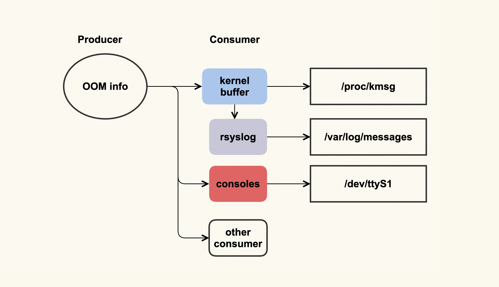
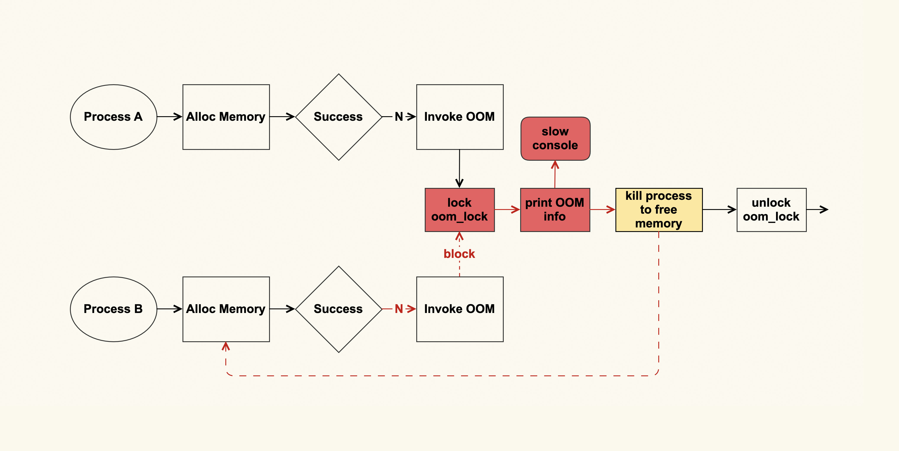

---
date: "2019-06-23"
---  
      
# 07 案例篇 | 如何预防内存泄漏导致的系统假死？
你好，我是邵亚方。

上节课，我们讲了有哪些进程的内存类型会容易引起内存泄漏，这一讲我们来聊一聊，到底应该如何应对内存泄漏的问题。

我们知道，内存泄漏是件非常容易发生的事，但如果它不会给应用程序和系统造成危害，那它就不会构成威胁。当然我不是说这类内存泄漏无需去关心，对追求完美的程序员而言，还是需要彻底地解决掉它的。

而有一些内存泄漏你却需要格外重视，比如说长期运行的后台进程的内存泄漏，这种泄漏日积月累，会逐渐耗光系统内存，甚至会引起系统假死。

我们在了解内存泄漏造成的危害之前，先一起看下什么样的内存泄漏是有危害的。

## 什么样的内存泄漏是有危害的？

下面是一个内存泄漏的简单示例程序。

```
    #include <stdlib.h>
    #include <string.h>
    
    #define SIZE (1024 * 1024 * 1024) /* 1G */
    int main()
    {
        char *p = malloc(SIZE);
        if (!p)
          return -1;
        
        memset(p, 1, SIZE);
        /* 然后就再也不使用这块内存空间 */
        /* 没有释放p所指向的内存进程就退出了 */
        /* free(p); */
        return 0;
    }
    

```

我们可以看到，这个程序里面申请了1G的内存后，没有进行释放就退出了，那这1G的内存空间是泄漏了吗？

我们可以使用一个简单的内存泄漏检查工具\(valgrind\)来看看。

```
    $ valgrind --leak-check=full  ./a.out 
    ==20146== HEAP SUMMARY:
    ==20146==     in use at exit: 1,073,741,824 bytes in 1 blocks
    ==20146==   total heap usage: 1 allocs, 0 frees, 1,073,741,824 bytes allocated
    ==20146== 
    ==20146== 1,073,741,824 bytes in 1 blocks are possibly lost in loss record 1 of 1
    ==20146==    at 0x4C29F73: malloc (vg_replace_malloc.c:309)
    ==20146==    by 0x400543: main (in /home/yafang/test/mmleak/a.out)
    ==20146== 
    ==20146== LEAK SUMMARY:
    ==20146==    definitely lost: 0 bytes in 0 blocks
    ==20146==    indirectly lost: 0 bytes in 0 blocks
    ==20146==      possibly lost: 1,073,741,824 bytes in 1 blocks
    ==20146==    still reachable: 0 bytes in 0 blocks
    ==20146==         suppressed: 0 bytes in 0 blocks
    

```

从valgrind的检查结果里我们可以清楚地看到，申请的内存只被使用了一次（memset）就再没被使用，但是在使用完后却没有把这段内存空间给释放掉，这就是典型的内存泄漏。那这个内存泄漏是有危害的吗？

这就要从进程地址空间的分配和销毁来说起，下面是一个简单的示意图：

<!-- [[[read_end]]] -->


从上图可以看出，进程在退出的时候，会把它建立的映射都给解除掉。换句话说，进程退出时，会把它申请的内存都给释放掉，这个内存泄漏就是没危害的。不过话说回来，虽然这样没有什么危害，但是我们最好还是要在程序里加上free §，这才是符合编程规范的。我们修改一下这个程序，加上free§，再次编译后通过valgrind来检查，就会发现不存在任何内存泄漏了：

```
    $ valgrind --leak-check=full  ./a.out 
    ==20123== HEAP SUMMARY:
    ==20123==     in use at exit: 0 bytes in 0 blocks
    ==20123==   total heap usage: 1 allocs, 1 frees, 1,073,741,824 bytes allocated
    ==20123== 
    ==20123== All heap blocks were freed -- no leaks are possible
    

```

总之，如果进程不是长时间运行，那么即使存在内存泄漏（比如这个例子中的只有malloc没有free），它的危害也不大，因为进程退出时，内核会把进程申请的内存都给释放掉。

我们前面举的这个例子是对应用程序无害的内存泄漏，我们继续来看下哪些内存泄漏会给应用程序产生危害 。我们同样以malloc为例，看一个简单的示例程序：

```
    #include <stdlib.h>
    #include <string.h>
    #include <unistd.h>
    
    #define SIZE (1024 * 1024 * 1024) /* 1G */
    
    void process_memory()
    {
            char *p; 
            p = malloc(SIZE);
            if (!p)
                    return;
            memset(p, 1, SIZE);
            /* Forget to free this memory */
    }
    
    /* 处理其他事务，为了简便起见，我们就以sleep为例 */
    void process_others()
    {
            sleep(1);
    }
    
    
    int main()
    {
            /* 这部分内存只处理一次，以后再也不会用到 */
            process_memory();
    
    
            /* 进程会长时间运行 */
            while (1) {
                    process_others();
            }   
            return 0;
    

```

这是一个长时间运行的程序，process\_memory\(\)中我们申请了1G的内存去使用，然后就再也不用它了，由于这部分内存不会再被利用，这就造成了内存的浪费，如果这样的程序多了，被泄漏出去的内存就会越来越多，然后系统中的可用内存就会越来越少。

对于后台服务型的业务而言，基本上都是需要长时间运行的程序，所以后台服务的内存泄漏会给系统造成实际的危害。那么，究竟会带来什么样的危害，我们又该如何去应对呢？

## 如何预防内存泄漏导致的危害？

我们还是以上面这个malloc\(\)程序为例，在这个例子中，它只是申请了1G的内存，如果说持续不断地申请内存而不释放，你会发现，很快系统内存就会被耗尽，进而触发OOM killer去杀进程。这个信息可以通过dmesg（该命令是用来查看内核日志的）这个命令来查看：

```
    $ dmesg
    [944835.029319] a.out invoked oom-killer: gfp_mask=0x100dca(GFP_HIGHUSER_MOVABLE|__GFP_ZERO), order=0, oom_score_adj=0
    [...]
    [944835.052448] Out of memory: Killed process 1426 (a.out) total-vm:8392864kB, anon-rss:7551936kB, file-rss:4kB, shmem-rss:0kB, UID:0 pgtables:14832kB oom_score_adj:0
    

```

系统内存不足时会唤醒OOM killer来选择一个进程给杀掉，在我们这个例子中它杀掉了这个正在内存泄漏的程序，该进程被杀掉后，整个系统也就变得安全了。但是你要注意，**OOM killer选择进程是有策略的，它未必一定会杀掉正在内存泄漏的进程，很有可能是一个无辜的进程被杀掉。**而且，OOM本身也会带来一些副作用。

我来说一个发生在生产环境中的实际案例，这个案例我也曾经[反馈给Linux内核社区来做改进](https://lore.kernel.org/linux-mm/1586597774-6831-1-git-send-email-laoar.shao@gmail.com/)，接下来我们详细说一下它。

这个案例跟OOM日志有关，OOM日志可以理解为是一个单生产者多消费者的模型，如下图所示：



这个单生产者多消费者模型，其实是由OOM killer打印日志（OOM info）时所使用的printk（类似于userspace的printf）机制来决定的。printk会检查这些日志需要输出给哪些消费者，比如写入到内核缓冲区（kernel buffer），然后通过dmesg命令来查看；我们通常也都会配置rsyslog，然后rsyslogd会将内核缓冲区的内容给转储到日志文件（/var/log/messages）中；服务器也可能会连着一些控制台（console ），比如串口，这些日志也会输出到这些console。

问题就出在console这里，如果console的速率很慢，输出太多日志会非常消耗时间，而当时我们配置了“console=ttyS1,19200”，即波特率为19200的串口，这是个很低速率的串口。一个完整的OOM info需要约10s才能打印完，这在系统内存紧张时就会成为一个瓶颈点，为什么会是瓶颈点呢？答案如下图所示：



进程A在申请内存失败后会触发OOM，在发生OOM的时候会打印很多很多日志（这些日志是为了方便分析为什么OOM会发生），然后会选择一个合适的进程来杀掉，从而释放出来空闲的内存，这些空闲的内存就可以满足后续内存申请了。

如果这个OOM的过程耗时很长（即打印到slow console所需的时间太长，如上图红色部分所示），其他进程（进程B）也在此时申请内存，也会申请失败，于是进程B同样也会触发OOM来尝试释放内存，而OOM这里又有一个全局锁（oom\_lock）来进行保护，进程B尝试获取（trylock）这个锁的时候会失败，就只能再次重试。

如果此时系统中有很多进程都在申请内存，那么这些申请内存的进程都会被阻塞在这里，这就形成了一个恶性循环，甚至会引发系统长时间无响应（假死）。

针对这个问题，我与Linux内核内存子系统的维护者Michal Hocko以及OOM子模块的活跃开发者Tetsuo Handa进行了[一些讨论](https://lore.kernel.org/linux-mm/1586597774-6831-1-git-send-email-laoar.shao@gmail.com/)，不过我们并没有讨论出一个完美的解决方案，目前仍然是只有一些规避措施，如下：

* **在发生OOM时尽可能少地打印信息**  
  通过将[vm.oom\_dump\_tasks](https://www.kernel.org/doc/Documentation/sysctl/vm.txt)调整为0，可以不去备份（dump）当前系统中所有可被kill的进程信息，如果系统中有很多进程，这些信息的打印可能会非常消耗时间。在我们这个案例里，这部分耗时约为6s多，占OOM整体耗时10s的一多半，所以减少这部分的打印能够缓解这个问题。

  但是，**这并不是一个完美的方案，只是一个规避措施**。因为当我们把vm.oom\_dump\_tasks配置为1时，是可以通过这些打印的信息来检查OOM killer是否选择了合理的进程，以及系统中是否存在不合理的OOM配置策略的。如果我们将它配置为0，就无法得到这些信息了，而且这些信息不仅不会打印到串口，也不会打印到内核缓冲区，导致无法被转储到不会产生问题的日志文件中。

  * **调整串口打印级别，不将OOM信息打印到串口**  
  通过调整[/proc/sys/kernel/printk](https://www.kernel.org/doc/Documentation/sysctl/kernel.txt)可以做到避免将OOM信息输出到串口，我们通过设置console\_loglevel来将它的级别设置的比OOM日志级别（为4）小，就可以避免OOM的信息打印到console，比如将它设置为3:

```
    # 初始配置(为7)：所有信息都会输出到console
    $ cat /proc/sys/kernel/printk
    7	4	1	7
    
    # 调整console_loglevel级别，不让OOM信息打印到console
    $ echo "3 4 1 7" > /proc/sys/kernel/printk
    
    # 查看调整后的配置
    $ cat /proc/sys/kernel/printk
    3	4	1	
    

```

但是这样做会导致所有低于默认级别（为4）的内核日志都无法输出到console，在系统出现问题时，我们有时候（比如无法登录到服务器上面时）会需要查看console信息来判断问题是什么引起的，如果某些信息没有被打印到console，可能会影响我们的分析。

这两种规避方案各有利弊，你需要根据你的实际情况来做选择，如果你不清楚怎么选择时，我建议你选择第二种，因为我们使用console的概率还是较少一些，所以第二种方案的影响也相对较小一些。

OOM相关的一些日志输出后，就到了下一个阶段：选择一个最需要杀死的进程来杀掉。OOM killer在选择杀掉哪个进程时，也是一个比较复杂的过程，而且如果配置不当也会引起其他问题。关于这部分的案例，我们会在下节课来分析。

## 课堂总结

这节课我们讲了什么是内存泄漏，以及内存泄漏可能造成的危害。对于长时间运行的后台任务而言，它存在的内存泄漏可能会给系统带来比较严重的危害，所以我们一定要重视这些任务的内存泄漏问题。

内存泄漏问题是非常容易发生的，所以我们需要提前做好内存泄漏的兜底工作：即使有泄漏了也不要让它给系统带来很大的危害。长时间的内存泄漏问题最后基本都会以OOM结束，所以你需要去掌握OOM的相关知识，来做好这个兜底工作。

如果你的服务器有慢速的串口设备，那你一定要防止它接收太多的日志，尤其是OOM产生的日志，因为OOM的日志量是很大的，打印完整个OOM信息kennel会很耗时，进而导致阻塞申请内存的进程，甚至会严重到让整个系统假死。

墨菲定律告诉我们，如果事情有变坏的可能，不管这种可能性有多小，它总会发生。对应到内存泄漏就是，当你的系统足够复杂后，它总是可能会发生的。所以，对于内存泄漏问题，你在做好预防的同时，也一定要对它发生后可能带来的危害做好预防。

## 课后作业

请写一些应用程序来构造内存泄漏的测试用例，然后使用valgrind来进行观察。欢迎在留言区分享你的看法。

感谢你的阅读，如果你认为这节课的内容有收获，也欢迎把它分享给你的朋友，我们下一讲见。