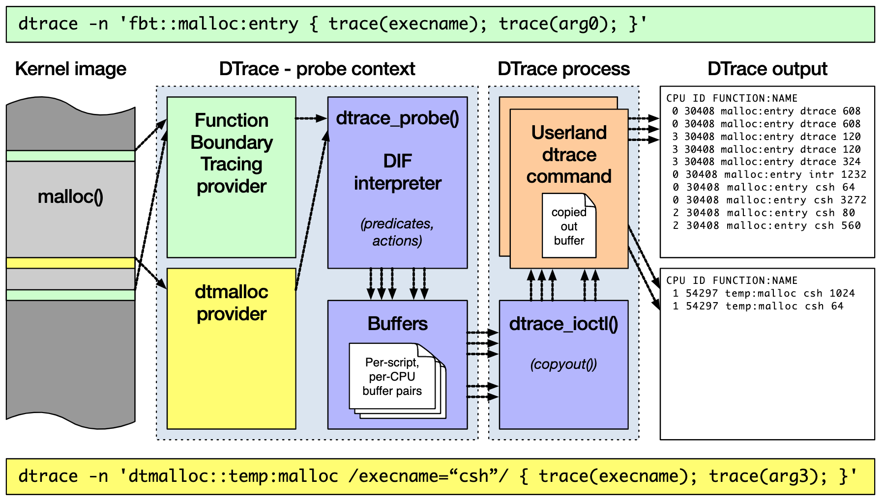

---
date: "2019-06-23"
---  
      
# 50 | 案例篇：动态追踪怎么用？（上）
你好，我是倪朋飞。

上一节，我以 ksoftirqd CPU 使用率高的问题为例，带你一起学习了内核线程 CPU 使用率高时的分析方法。先简单回顾一下。

当碰到内核线程的资源使用异常时，很多常用的进程级性能工具，并不能直接用到内核线程上。这时，我们就可以使用内核自带的 perf 来观察它们的行为，找出热点函数，进一步定位性能瓶颈。不过，perf 产生的汇总报告并不直观，所以我通常也推荐用火焰图来协助排查。

其实，使用 perf 对系统内核线程进行分析时，内核线程依然还在正常运行中，所以这种方法也被称为动态追踪技术。

**动态追踪技术，通过探针机制，来采集内核或者应用程序的运行信息，从而可以不用修改内核和应用程序的代码，就获得丰富的信息，帮你分析、定位想要排查的问题。**

以往，在排查和调试性能问题时，我们往往需要先为应用程序设置一系列的断点（比如使用 GDB），然后以手动或者脚本（比如 GDB 的 Python 扩展）的方式，在这些断点处分析应用程序的状态。或者，增加一系列的日志，从日志中寻找线索。

不过，断点往往会中断应用的正常运行；而增加新的日志，往往需要重新编译和部署。这些方法虽然在今天依然广泛使用，但在排查复杂的性能问题时，往往耗时耗力，更会对应用的正常运行造成巨大影响。

<!-- [[[read_end]]] -->

此外，这类方式还有大量的性能问题。比如，出现的概率小，只有线上环境才能碰到。这种难以复现的问题，亦是一个巨大挑战。

而动态追踪技术的出现，就为这些问题提供了完美的方案：它既不需要停止服务，也不需要修改应用程序的代码；所有一切还按照原来的方式正常运行时，就可以帮你分析出问题的根源。

同时，相比以往的进程级跟踪方法（比如 ptrace），动态追踪往往只会带来很小的性能损耗（通常在 5\% 或者更少）。

既然动态追踪有这么多好处，那么，都有哪些动态追踪的方法，又该如何使用这些动态追踪方法呢？今天，我就带你一起来看看这个问题。由于动态追踪涉及的知识比较多，我将分为上、下两篇为你讲解，先来看今天这部分内容。

## 动态追踪

说到动态追踪（Dynamic Tracing），就不得不提源于 Solaris 系统的 DTrace。DTrace 是动态追踪技术的鼻祖，它提供了一个通用的观测框架，并可以使用 D 语言进行自由扩展。

DTrace 的工作原理如下图所示。**它的运行常驻在内核中，用户可以通过 dtrace 命令，把D 语言编写的追踪脚本，提交到内核中的运行时来执行**。DTrace 可以跟踪用户态和内核态的所有事件，并通过一些列的优化措施，保证最小的性能开销。



（图片来自 [BSDCan](<https://www.bsdcan.org/2017/schedule/attachments/433_dtrace_internals.html#(24)>)）

虽然直到今天，DTrace 本身依然无法在 Linux 中运行，但它同样对 Linux 动态追踪产生了巨大的影响。很多工程师都尝试过把 DTrace 移植到 Linux 中，这其中，最著名的就是 RedHat 主推的 SystemTap。

同 DTrace 一样，SystemTap 也定义了一种类似的脚本语言，方便用户根据需要自由扩展。不过，不同于 DTrace，SystemTap 并没有常驻内核的运行时，它需要先把脚本编译为内核模块，然后再插入到内核中执行。这也导致 SystemTap 启动比较缓慢，并且依赖于完整的调试符号表。


（图片来自[动态追踪技术漫谈](https://openresty.org/posts/dynamic-tracing/)）

总的来说，为了追踪内核或用户空间的事件，Dtrace 和 SystemTap 都会把用户传入的追踪处理函数（一般称为 Action），关联到被称为探针的检测点上。这些探针，实际上也就是各种动态追踪技术所依赖的事件源。

### 动态追踪的事件源

根据事件类型的不同，**动态追踪所使用的事件源，可以分为静态探针、动态探针以及硬件事件等三类**。它们的关系如下图所示：


（图片来自 [Brendan Gregg Blog](http://www.brendangregg.com/perf.html#Events)）

其中，**硬件事件通常由性能监控计数器 PMC（Performance Monitoring Counter）产生**，包括了各种硬件的性能情况，比如 CPU 的缓存、指令周期、分支预测等等。

**静态探针，是指事先在代码中定义好，并编译到应用程序或者内核中的探针**。这些探针只有在开启探测功能时，才会被执行到；未开启时并不会执行。常见的静态探针包括内核中的跟踪点（tracepoints）和 USDT（Userland Statically Defined Tracing）探针。

* 跟踪点（tracepoints），实际上就是在源码中插入的一些带有控制条件的探测点，这些探测点允许事后再添加处理函数。比如在内核中，最常见的静态跟踪方法就是 printk，即输出日志。Linux 内核定义了大量的跟踪点，可以通过内核编译选项，来开启或者关闭。

* USDT 探针，全称是用户级静态定义跟踪，需要在源码中插入 DTRACE\_PROBE\(\) 代码，并编译到应用程序中。不过，也有很多应用程序内置了 USDT 探针，比如 MySQL、PostgreSQL 等。

**动态探针，则是指没有事先在代码中定义，但却可以在运行时动态添加的探针**，比如函数的调用和返回等。动态探针支持按需在内核或者应用程序中添加探测点，具有更高的灵活性。常见的动态探针有两种，即用于内核态的 kprobes 和用于用户态的 uprobes。

* kprobes 用来跟踪内核态的函数，包括用于函数调用的 kprobe 和用于函数返回的 kretprobe。

* uprobes 用来跟踪用户态的函数，包括用于函数调用的 uprobe 和用于函数返回的 uretprobe。

> 注意，kprobes 需要内核编译时开启 CONFIG\_KPROBE\_EVENTS；而 uprobes 则需要内核编译时开启 CONFIG\_UPROBE\_EVENTS。

### 动态追踪机制

而在这些探针的基础上，Linux 也提供了一系列的动态追踪机制，比如 ftrace、perf、eBPF 等。

**ftrace** 最早用于函数跟踪，后来又扩展支持了各种事件跟踪功能。ftrace 的使用接口跟我们之前提到的 procfs 类似，它通过 debugfs（4.1 以后也支持 tracefs），以普通文件的形式，向用户空间提供访问接口。

这样，不需要额外的工具，你就可以通过挂载点（通常为 /sys/kernel/debug/tracing 目录）内的文件读写，来跟 ftrace 交互，跟踪内核或者应用程序的运行事件。

**perf** 是我们的老朋友了，我们在前面的好多案例中，都使用了它的事件记录和分析功能，这实际上只是一种最简单的静态跟踪机制。你也可以通过 perf ，来自定义动态事件（perf probe），只关注真正感兴趣的事件。

**eBPF** 则在 BPF（Berkeley Packet Filter）的基础上扩展而来，不仅支持事件跟踪机制，还可以通过自定义的 BPF 代码（使用 C 语言）来自由扩展。所以，eBPF 实际上就是常驻于内核的运行时，可以说就是 Linux 版的 DTrace。

除此之外，还有很多内核外的工具，也提供了丰富的动态追踪功能。最常见的就是前面提到的 **SystemTap**，我们之前多次使用过的 **BCC**（BPF Compiler Collection），以及常用于容器性能分析的 **sysdig** 等。

而在分析大量事件时，使用我们上节课提到的火焰图，可以将大量数据可视化展示，让你更直观发现潜在的问题。

接下来，我就通过几个例子，带你来看看，要怎么使用这些机制，来动态追踪内核和应用程序的执行情况。以下案例还是基于 Ubuntu 18.04 系统，同样适用于其他系统。

> 注意，以下所有命令都默认以 root 用户运行，如果你用普通用户身份登陆系统，请运行 sudo su root 命令切换到 root 用户。

## ftrace

我们先来看 ftrace。刚刚提到过，ftrace 通过 debugfs（或者 tracefs），为用户空间提供接口。所以使用 ftrace，往往是从切换到 debugfs 的挂载点开始。

```
    $ cd /sys/kernel/debug/tracing
    $ ls
    README                      instances            set_ftrace_notrace  trace_marker_raw
    available_events            kprobe_events        set_ftrace_pid      trace_options
    ...
    

```

如果这个目录不存在，则说明你的系统还没有挂载 debugfs，你可以执行下面的命令来挂载它：

```
    $ mount -t debugfs nodev /sys/kernel/debug
    

```

ftrace 提供了多个跟踪器，用于跟踪不同类型的信息，比如函数调用、中断关闭、进程调度等。具体支持的跟踪器取决于系统配置，你可以执行下面的命令，来查询所有支持的跟踪器：

```
    $ cat available_tracers
    hwlat blk mmiotrace function_graph wakeup_dl wakeup_rt wakeup function nop
    

```

这其中，function 表示跟踪函数的执行，function\_graph 则是跟踪函数的调用关系，也就是生成直观的调用关系图。这便是最常用的两种跟踪器。

除了跟踪器外，使用 ftrace 前，还需要确认跟踪目标，包括内核函数和内核事件。其中，

* 函数就是内核中的函数名。

* 而事件，则是内核源码中预先定义的跟踪点。

同样地，你可以执行下面的命令，来查询支持的函数和事件：

```
    $ cat available_filter_functions
    $ cat available_events
    

```

明白了这些基本信息，接下来，我就以 ls 命令为例，带你一起看看 ftrace 的使用方法。

为了列出文件，ls 命令会通过 open 系统调用打开目录文件，而 open 在内核中对应的函数名为 do\_sys\_open。 所以，我们要做的第一步，就是把要跟踪的函数设置为 do\_sys\_open：

```
    $ echo do_sys_open > set_graph_function
    

```

接下来，第二步，配置跟踪选项，开启函数调用跟踪，并跟踪调用进程：

```
    $ echo function_graph > current_tracer
    $ echo funcgraph-proc > trace_options
    

```

接着，第三步，也就是开启跟踪：

```
    $ echo 1 > tracing_on
    

```

第四步，执行一个 ls 命令后，再关闭跟踪：

```
    $ ls
    $ echo 0 > tracing_on
    

```

第五步，也是最后一步，查看跟踪结果：

```
    $ cat trace
    # tracer: function_graph
    #
    # CPU  TASK/PID         DURATION                  FUNCTION CALLS
    # |     |    |           |   |                     |   |   |   |
     0)    ls-12276    |               |  do_sys_open() {
     0)    ls-12276    |               |    getname() {
     0)    ls-12276    |               |      getname_flags() {
     0)    ls-12276    |               |        kmem_cache_alloc() {
     0)    ls-12276    |               |          _cond_resched() {
     0)    ls-12276    |   0.049 us    |            rcu_all_qs();
     0)    ls-12276    |   0.791 us    |          }
     0)    ls-12276    |   0.041 us    |          should_failslab();
     0)    ls-12276    |   0.040 us    |          prefetch_freepointer();
     0)    ls-12276    |   0.039 us    |          memcg_kmem_put_cache();
     0)    ls-12276    |   2.895 us    |        }
     0)    ls-12276    |               |        __check_object_size() {
     0)    ls-12276    |   0.067 us    |          __virt_addr_valid();
     0)    ls-12276    |   0.044 us    |          __check_heap_object();
     0)    ls-12276    |   0.039 us    |          check_stack_object();
     0)    ls-12276    |   1.570 us    |        }
     0)    ls-12276    |   5.790 us    |      }
     0)    ls-12276    |   6.325 us    |    }
    ...
    

```

在最后得到的输出中：

* 第一列表示运行的 CPU；

* 第二列是任务名称和进程 PID；

* 第三列是函数执行延迟；

* 最后一列，则是函数调用关系图。

你可以看到，函数调用图，通过不同级别的缩进，直观展示了各函数间的调用关系。

当然，我想你应该也发现了 ftrace 的使用缺点——五个步骤实在是麻烦，用起来并不方便。不过，不用担心， [trace-cmd](https://git.kernel.org/pub/scm/utils/trace-cmd/trace-cmd.git/) 已经帮你把这些步骤给包装了起来。这样，你就可以在同一个命令行工具里，完成上述所有过程。

你可以执行下面的命令，来安装 trace-cmd ：

```
    # Ubuntu
    $ apt-get install trace-cmd
    # CentOS
    $ yum install trace-cmd
    

```

安装好后，原本的五步跟踪过程，就可以简化为下面这两步：

```
    $ trace-cmd record -p function_graph -g do_sys_open -O funcgraph-proc ls
    $ trace-cmd report
    ...
                  ls-12418 [000] 85558.075341: funcgraph_entry:                   |  do_sys_open() {
                  ls-12418 [000] 85558.075363: funcgraph_entry:                   |    getname() {
                  ls-12418 [000] 85558.075364: funcgraph_entry:                   |      getname_flags() {
                  ls-12418 [000] 85558.075364: funcgraph_entry:                   |        kmem_cache_alloc() {
                  ls-12418 [000] 85558.075365: funcgraph_entry:                   |          _cond_resched() {
                  ls-12418 [000] 85558.075365: funcgraph_entry:        0.074 us   |            rcu_all_qs();
                  ls-12418 [000] 85558.075366: funcgraph_exit:         1.143 us   |          }
                  ls-12418 [000] 85558.075366: funcgraph_entry:        0.064 us   |          should_failslab();
                  ls-12418 [000] 85558.075367: funcgraph_entry:        0.075 us   |          prefetch_freepointer();
                  ls-12418 [000] 85558.075368: funcgraph_entry:        0.085 us   |          memcg_kmem_put_cache();
                  ls-12418 [000] 85558.075369: funcgraph_exit:         4.447 us   |        }
                  ls-12418 [000] 85558.075369: funcgraph_entry:                   |        __check_object_size() {
                  ls-12418 [000] 85558.075370: funcgraph_entry:        0.132 us   |          __virt_addr_valid();
                  ls-12418 [000] 85558.075370: funcgraph_entry:        0.093 us   |          __check_heap_object();
                  ls-12418 [000] 85558.075371: funcgraph_entry:        0.059 us   |          check_stack_object();
                  ls-12418 [000] 85558.075372: funcgraph_exit:         2.323 us   |        }
                  ls-12418 [000] 85558.075372: funcgraph_exit:         8.411 us   |      }
                  ls-12418 [000] 85558.075373: funcgraph_exit:         9.195 us   |    }
    ...
    

```

你会发现，trace-cmd 的输出，跟上述 cat trace 的输出是类似的。

通过这个例子我们知道，当你想要了解某个内核函数的调用过程时，使用 ftrace ，就可以跟踪到它的执行过程。

## 小结

今天，我带你一起学习了常见的动态追踪方法。所谓动态追踪，就是在系统或应用程序正常运行时，通过内核中提供的探针来动态追踪它们的行为，从而辅助排查出性能瓶颈。

而在 Linux 系统中，常见的动态追踪方法包括 ftrace、perf、eBPF 以及 SystemTap 等。当你已经定位了某个内核函数，但不清楚它的实现原理时，就可以用 ftrace 来跟踪它的执行过程。至于其他动态追踪方法，我将在下节课继续为你详细解读。

## 思考

最后，给你留一个思考题。今天的案例中，我们使用Linux 内核提供的 ftrace 机制，来了解内核函数的执行过程；而上节课我们则用了 perf 和火焰图，来观察内核的调用堆栈。

根据这两个案例，你觉得这两种方法有什么不一样的地方？当需要了解内核的行为时，如何在二者中选择，或者说，这两种方法分别适用于什么样的场景呢？你可以结合今天的内容，和你自己的操作记录，来总结思路。

欢迎在留言区和我讨论，也欢迎把这篇文章分享给你的同事、朋友。我们一起在实战中演练，在交流中进步。