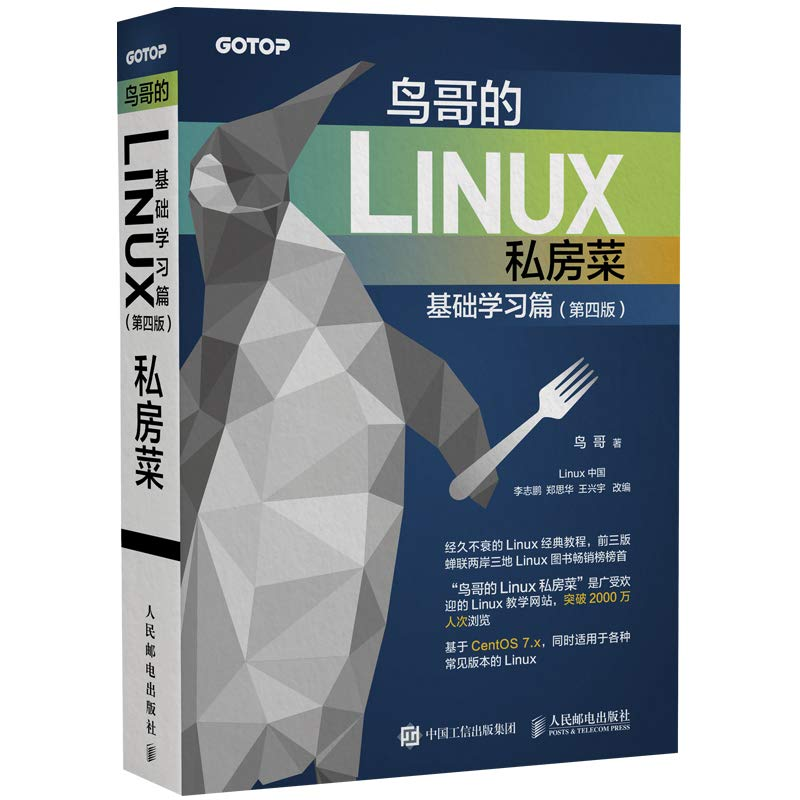
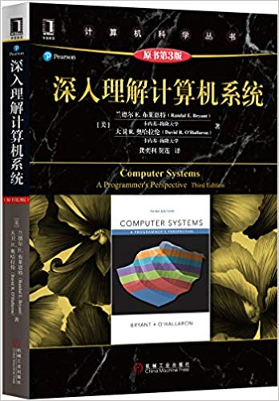
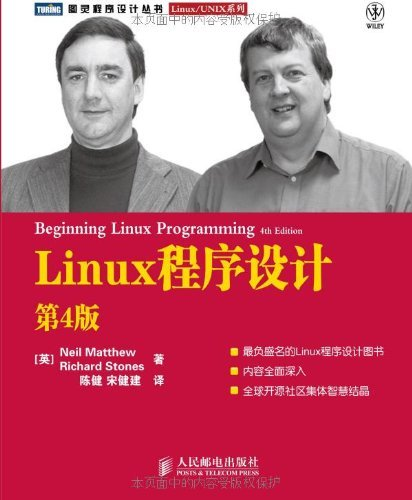
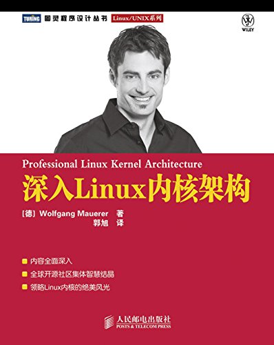
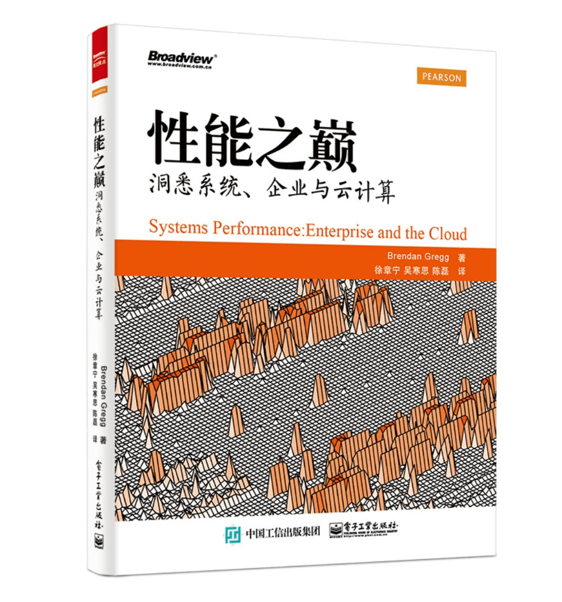

---
date: "2019-06-23"
---  
      
# 加餐（一） | 书单推荐：性能优化和Linux 系统原理
你好，我是倪朋飞。欢迎来到 Linux 性能优化专栏的加餐时间。

之前，很多同学留言让我推荐一些性能优化以及 Linux 系统原理方面的书，今天我就和你分享一些我认为不错的书。

Linux 系统原理和性能优化涉及的面很广，相关的书籍自然也很多。学习咱们专栏，你先要了解Linux 系统的工作原理，基于此，再去分析、理解各类性能瓶颈，最终找出方法、优化性能。围绕这几个方面，我来推荐一些相应书籍。

## Linux基础入门书籍：《鸟哥的Linux私房菜》

咱们专栏的目标是优化 Linux 系统以及在Linux上运行的软件性能。那么，第一步当然是要熟悉 Linux 本身。所以，我推荐的第一本书，正是小有名气的 Linux 系统入门书——《鸟哥的 Linux 私房菜》。

这本书以 CentOS 7 为例，介绍了 Linux 系统的基本使用和管理方法，主要内容包括系统安装、文件和目录操作、磁盘和文件系统管理、编辑器、Bash 以及 Linux 系统的管理维护等。这些内容都是 Linux 初学者需要掌握的基础知识，非常适合刚入门 Linux 系统的新手。

当然，掌握这些基础知识，其实也是学习咱们专栏的基本门槛。比如，我在很多案例里提到的软件包的安装、Bash 命令的运行、grep 和 awk 等基本命令的使用、文档的查询方法等，这本书都有涉及。

<!-- [[[read_end]]] -->

另外，这本书的大部分内容，还可以在其繁体中文[官方网站](http://linux.vbird.org/linux_basic/)上在线学习。

## 计算机原理书籍：《深入理解计算机系统》

掌握 Linux 基础后，接下来就该进一步理解计算机系统的工作原理。所以，我推荐的第二本书，正是计算机系统原理的经典黑皮书——《深入理解计算机系统》。

这也是一本经典的计算机学科入门教材，它的英文版名称“Computer Systems: A Programmer’s Perspective”，其实更能体现本书的核心，即从开发者的角度来理解计算机系统。

这本书介绍了计算机系统最基本的工作原理，内容比较广泛。它主要包括信息的计算机表示，程序的编译、链接及运行，处理器体系结构，虚拟内存，存储系统 I/O，网络以及并发等内容。

书本身比较厚，内容也比较多，但作为一本优秀的入门书籍，这本书介绍的各个知识点虽然有点偏向于编程和系统底层，但并不会过于深入这些，对初学者来说非常合适。

此外，这本书的[官方网站](http://csapp.cs.cmu.edu/)上还提供了丰富的资源，可以帮你进一步理解、深入书里的内容，还提供了多个实验操作，助你加深掌握。

## Linux编程书籍：《Linux程序设计》和《UNIX环境高级编程》

介绍完计算机系统工作原理的书籍，接下来，我要推荐的是编程相关的两本书，分别是《Linux 程序设计》和《UNIX 环境高级编程》。

之所以要推荐编程书籍，是因为优化性能的过程中，理解应用程序的执行逻辑至关重要。而要做到这一点，编程基础就是刚需。

我推荐的这两本书中，《Linux 程序设计》主要针对 Linux 系统中的应用程序开发，是一本入门书籍，内容包括 SHELL、标准库、数据库、多进程、进程间通信、套接字以及图像界面等。

《UNIX 环境高级编程》则被誉为 UNIX 编程圣经，是深入 UNIX 环境（包括Linux）编程的必读书籍。主要内容包括标准库、文件 I/O、进程控制、多进程和进程间通信、多线程以及高级 I/O 等，这些内容都是开发高性能、高可靠应用程序的必备基础。

这两本书籍，可以让你更清楚 Linux 系统以及应用程序的执行过程，甚至在必要时帮你更好地理解应用程序乃至内核的源代码。

## Linux内核书籍：《深入Linux内核架构》

为了方便你学习和运用，我们专栏内容都是从 Linux 系统的原理出发，借助系统内置或外部安装的各类工具，找出瓶颈所在。所以，理解 Linux 系统原理也是我们的重点，同时，了解内核架构，也可以帮助你分析清楚瓶颈为什么发生。

所以，我推荐的第五本，就是关于 Linux 内核原理的一本书籍——《深入Linux内核架构》。这是一本大块头，涉及了 Linux 内核中的进程管理、内存管理、文件系统、磁盘、网络、设备驱动、时钟等大量知识。书中还引用了大量 Linux 内核的源码（内核版本为 2.6.24，虽然有些老，但不影响你理解原理），帮你透彻掌握相关知识点。

如果你是第一次读这本书，不要因为厚厚的页码或者部分内容看不懂就放弃。换个时间重新来看，你会有不同的发现。

## 性能优化书籍：《性能之巅：洞悉系统、企业与云计算》

最后一本，是我曾在 [Linux 性能优化答疑（二）](https://time.geekbang.org/column/article/73738)中提到过的《性能之巅：洞悉系统、企业与云计算》。

这本书，堪称 Linux 性能优化最权威的一本书，而作者 Brendan Gregg ，也是很多我们熟悉的性能优化工具和方法的开创者。

书里主要提供了 Linux 性能分析和调优的基本思路，并具体讲解，如何借助动态追踪等性能工具，分析并优化各种性能问题。同时，这本书也介绍了很多性能工具的使用方法，可以当作你性能优化过程的工具参考书。

最后，我还想再说一句，读书不在多，而在精。

今天我推荐的这些书，你可能或多或少都看过一部分，但这远远不够。要真正掌握它们的核心内容，不仅需要你理解书中讲解的内容，更需要你用大量实践来融汇贯通。

有些书，你可能会觉得很难啃下来，还不如现在层出不穷的新技术时髦。但要注意，这些内容都是基本不会过时的硬知识，多花点儿时间坚持啃下来，相信你一定会有巨大的收获。