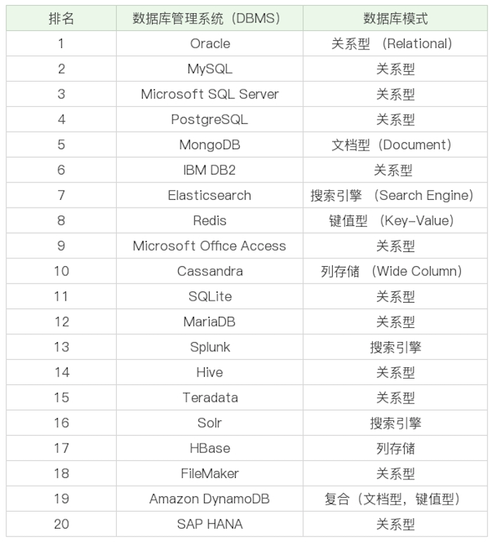

---
date: "2019-06-23"
---  
      
# 02丨DBMS的前世今生
上一讲我们介绍过两个IBM研究员在1974年发表了一篇有关结构化英语查询语言的论文，并将这门语言命名为SEQUEL。SEQUEL的语言标准是开放的，但是围绕它的商业化竞争却从来没有停止过。首先因为商标之争，SEQUEL改名为SQL，后来有一个重量级的公司基于那篇论文研发出了商业化的数据库管理软件，这就是Oracle。自此之后，又诞生了一堆大家熟知的DBMS，比如MySQL、SQL Server、PostgreSQL、DB2和MongoDB等。

我们今天了解一下这些数据库管理软件，也就是DBMS。为什么需要了解它们呢？因为在工作中，我们通常都是和这些数据库管理软件打交道，只不过SQL是它们的通用语言。

今天我们先从SQL语言中跳脱出来，来分析下这些DBMS。关于今天的内容，你可以从以下几个方面进行思考：

1.  主流的DBMS都有哪些，它们各自都有哪些特点；
2.  既然SQL是通用的标准语言，为什么能存在这么多DBMS；
3.  从这些DBMS的发展史中，你有哪些感悟。

## DB、DBS和DBMS的区别是什么

说到DBMS，有一些概念你需要了解。

DBMS的英文全称是DataBase Management System，数据库管理系统，实际上它可以对多个数据库进行管理，所以你可以理解为DBMS = 多个数据库（DB） + 管理程序。

<!-- [[[read_end]]] -->

DB的英文是DataBase，也就是数据库。数据库是存储数据的集合，你可以把它理解为多个数据表。

DBS的英文是DataBase System，数据库系统。它是更大的概念，包括了数据库、数据库管理系统以及数据库管理人员DBA。

这里需要注意的是，虽然我们有时候把Oracle、MySQL等称之为数据库，但确切讲，它们应该是数据库管理系统，即DBMS。

## 排名前20的DBMS都有哪些？

了解了DBMS的概念之后，我们来看下当前主流的DBMS都有哪些。下面这张表是2019年5月DB-Engines公布的DBMS的排名（每年的排名会有更新，主要依据这些DBMS在搜索引擎上的热度）：

从排名中我们能看出来，关系型数据库绝对是DBMS的主流，其中使用最多的DBMS分别是Oracle、MySQL和SQL Server。

关系型数据库（RDBMS）就是建立在关系模型基础上的数据库，SQL就是关系型数据库的查询语言。

相比于SQL，NoSQL泛指非关系型数据库，包括了榜单上的键值型数据库、文档型数据库、搜索引擎和列存储等，除此以外还包括图形数据库。

键值型数据库通过Key-Value键值的方式来存储数据，其中Key和Value可以是简单的对象，也可以是复杂的对象。Key作为唯一的标识符，优点是查找速度快，在这方面明显优于关系型数据库，同时缺点也很明显，它无法像关系型数据库一样自由使用条件过滤（比如WHERE），如果你不知道去哪里找数据，就要遍历所有的键，这就会消耗大量的计算。键值型数据库典型的使用场景是作为内容缓存。Redis是最流行的键值型数据库。

文档型数据库用来管理文档，在数据库中文档作为处理信息的基本单位，一个文档就相当于一条记录，MongoDB是最流行的文档型数据库。

搜索引擎也是数据库检索中的重要应用，常见的全文搜索引擎有Elasticsearch、Splunk和Solr。虽然关系型数据库采用了索引提升检索效率，但是针对全文索引效率却较低。搜索引擎的优势在于采用了全文搜索的技术，核心原理是“倒排索引”。

列式数据库是相对于行式存储的数据库，Oracle、MySQL、SQL Server等数据库都是采用的行式存储（Row-based），而列式数据库是将数据按照列存储到数据库中，这样做的好处是可以大量降低系统的I/O，适合于分布式文件系统，不足在于功能相对有限。

图形数据库，利用了图这种数据结构存储了实体（对象）之间的关系。最典型的例子就是社交网络中人与人的关系，数据模型主要是以节点和边（关系）来实现，特点在于能高效地解决复杂的关系问题。

## SQL阵营与NoSQL阵营

NoSQL的分类很多，刚才提到的键值型、文档型、搜索引擎、列式存储和图形数据库等都属于NoSQL阵营。也只有用NoSQL一词才能将这些技术囊括进来。即便如此，在DBMS排名中，还是SQL阵营的比重更大，影响力前5的DBMS中有4个是关系型数据库，而排名前20的DBMS中也有12个是关系型数据库。所以说，掌握SQL是非常有必要的。

由于SQL一直称霸DBMS，因此许多人在思考是否有一种数据库技术能远离SQL，于是NoSQL诞生了，但是随着发展却发现越来越离不开SQL。到目前为止NoSQL阵营中的DBMS都会有实现类似SQL的功能。下面是“NoSQL”这个名词在不同时期的诠释，从这些释义的变化中可以看出NoSQL功能的演变：

1970：NoSQL = We have no SQL

1980：NoSQL = Know SQL

2000：NoSQL = No SQL\!

2005：NoSQL = Not only SQL

2013：NoSQL = No, SQL\!

NoSQL对SQL做出了很好的补充，它可以让我们在云计算时代，更好地使用数据库技术，比如快速读写，这样可以用低廉的成本，更方便进行扩展。整个专栏的学习也将围绕SQL展开，同时你还需要了解SQL阵营中不同的DBMS之间的使用差异。这些DBMS除了支持SQL标准以外，还会有自己的“方言”，也就是自己独有的语法。在专栏中，我也会对近些年热门的NoSQL进行讲解，方便你在后续使用中更快上手。

## SQL阵营中的DBMS

如果我们把数据互通作为当今数字化社会发展的大中台能力，那么DBMS无疑是一个巨大的市场。在这个市场中，排名前20的DBMS有12个属于SQL阵营，其中排名前3名的DBMS均为SQL阵营，它们分别是Oracle、MySQL和SQL Server。这三家的市场份额远超其他DBMS的市场份额。

下面，我们来简单介绍下这三个主流DBMS的发展。

1979年，Oracle 2诞生，它是第一个商用的RDBMS（关系型数据库管理系统），随后被卖给了军方客户。随着Oracle软件的名气越来越大，公司也改叫Oracle公司。20世纪90年代，Oracle的创始人埃里森成为继比尔·盖茨之后第二富有的人，可以说IBM缔造了两个帝国，一个是软件业的霸主微软，另一个是企业软件市场的霸主Oracle。如今Oracle的年收入达到了400亿美金，足以证明商用数据库软件的价值。从这点我们也能看出，如果选择了一个大的赛道，就要尽早商业化，占据大型企业客户完全可以创建巨大的商业价值，也足以证明一个软件企业不需要靠卖硬件也可以挣到很多钱。

MySQL是1995年诞生的开源数据库管理系统，因为免费开源的特性，得到了开发者的喜爱，用户量迅速增长，成为开源数据库的No.1。但在发展过程中，MySQL先后两次被易手，先是在2008年被SUN收购，然后在2010年SUN被Oracle收购，于是Oracle同时拥有了MySQL的管理权，至此Oracle在数据库领域中成为绝对的领导者。从这里我们也能看到，虽然MySQL是免费的产品，但是使用人数多，就足以证明巨大的用户价值。一个有巨大用户价值的产品，即使没有直接的商业价值，但作为基础设施也会被商业巨头看上。

不过在Oracle收购MySQL的同时，MySQL的创造者担心MySQL有闭源的风险，因此创建了MySQL的分支项目MariaDB，MariaDB在绝大部分情况下都是与MySQL兼容的，并且增加了许多新的特性，比如支持更多的存储引擎类型。许多企业也由原来的MySQL纷纷转向了MariaDB。

SQL Server是微软开发的商业数据库，诞生于1989年。实际上微软还推出了Access数据库，它是一种桌面数据库，同时具备后台存储和前台界面开发的功能，更加轻量级，适合小型的应用场景。因为后台的存储空间有限，一般只有2G，Access的优势在于可以在前台便捷地进行界面开发。而SQL Server是大型数据库，用于后台的存储和查询，不具备界面开发的功能。从这里我们也能看出，即使SQL语言是通用的，但是为了满足不同用户的使用场景，会存在多个DBMS。比如Oracle更适合大型跨国企业的使用，因为他们对费用不敏感，但是对性能要求以及安全性有更高的要求，而MySQL更受到许多互联网公司，尤其是早期创业公司的青睐。

## 总结

今天我们简单梳理了DBMS的发展。1974年，SEQUEL论文发表，1979年，第一个商用关系型数据库Oracle 2诞生，1995年，MySQL开源数据库诞生，如今，NoSQL得到了发展，并且围绕SQL标准展开的DBMS竞赛从来没有停止过。在这段发展史中，既有SQL阵营，又有NoSQL阵营，既有商业数据库软件，又有开源产品，在不同的应用场景下，同一家公司也会有不同的DBMS布局。

如果说不同的DBMS代表了不同公司的利益，那么作为使用者的我们更应该注重的是这些DBMS的使用场景。比如Oracle作为市场占有率最高的商用数据库软件，适合大型的跨国企业，而针对轻量级的桌面数据库，我们采用Access就可以了。对于免费开源的产品来说，可以选用MySQL或者MariaDB。同时在NoSQL阵营中，我们也需要了解键值型、文档型、搜索引擎、列式数据库和图形数据库的区别。

我在文章中列举了排名前20的DBMS，你都使用过哪些呢？可以说说你的使用体会吗？另外你有没有想过，虽然SQL是通用的标准语言，但为什么能存在这么多DBMS呢？

欢迎你在评论区写下你的思考，也欢迎把这篇文章分享给你的朋友或者同事。