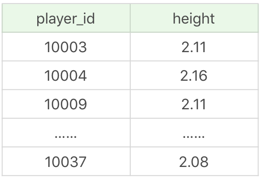
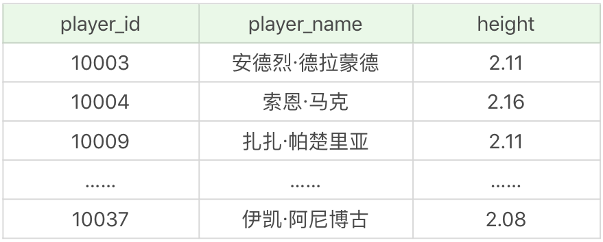
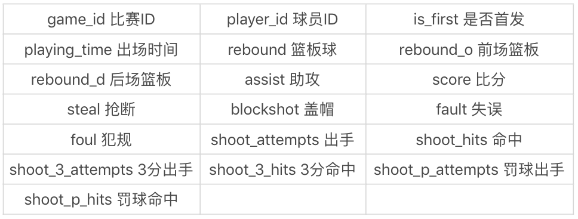

---
date: "2019-06-23"
---  
      
# 12丨视图在SQL中的作用是什么，它是怎样工作的？
我们之前对SQL中的数据表查询进行了讲解，今天我们来看下如何对视图进行查询。视图，也就是我们今天要讲的虚拟表，本身是不具有数据的，它是SQL中的一个重要概念。从下面这张图中，你能看到，虚拟表的创建连接了一个或多个数据表，不同的查询应用都可以建立在虚拟表之上。


视图一方面可以帮我们使用表的一部分而不是所有的表，另一方面也可以针对不同的用户制定不同的查询视图。比如，针对一个公司的销售人员，我们只想给他看部分数据，而某些特殊的数据，比如采购的价格，则不会提供给他。

刚才讲的只是视图的一个使用场景，实际上视图还有很多作用，今天我们就一起学习下。今天的文章里，你将重点掌握以下的内容：

1.  什么是视图？如何创建、更新和删除视图？
2.  如何使用视图来简化我们的SQL操作？
3.  视图和临时表的区别是什么，它们各自有什么优缺点？

## 如何创建，更新和删除视图

视图作为一张虚拟表，帮我们封装了底层与数据表的接口。它相当于是一张表或多张表的数据结果集。视图的这一特点，可以帮我们简化复杂的SQL查询，比如在编写视图后，我们就可以直接重用它，而不需要考虑视图中包含的基础查询的细节。同样，我们也可以根据需要更改数据格式，返回与底层数据表格式不同的数据。

<!-- [[[read_end]]] -->

通常情况下，小型项目的数据库可以不使用视图，但是在大型项目中，以及数据表比较复杂的情况下，视图的价值就凸显出来了，它可以帮助我们把经常查询的结果集放到虚拟表中，提升使用效率。理解和使用起来都非常方便。

### 创建视图：CREATE VIEW

那么该如何创建视图呢？创建视图的语法是：

```
    CREATE VIEW view_name AS
    SELECT column1, column2
    FROM table
    WHERE condition
    

```

实际上就是我们在SQL查询语句的基础上封装了视图VIEW，这样就会基于SQL语句的结果集形成一张虚拟表。其中view\_name为视图名称，column1、column2代表列名，condition代表查询过滤条件。

我们以NBA球员数据表为例。我们想要查询比NBA球员平均身高高的球员都有哪些，显示他们的球员ID和身高。假设我们给这个视图起个名字player\_above\_avg\_height，那么创建视图可以写成：

```
    CREATE VIEW player_above_avg_height AS
    SELECT player_id, height
    FROM player
    WHERE height > (SELECT AVG(height) from player)
    

```

视图查询结果（18条记录）：

  
当视图创建之后，它就相当于一个虚拟表，可以直接使用：

```
    SELECT * FROM player_above_avg_height
    

```

运行结果和上面一样。

### 嵌套视图

当我们创建好一张视图之后，还可以在它的基础上继续创建视图，比如我们想在虚拟表player\_above\_avg\_height的基础上，找到比这个表中的球员平均身高高的球员，作为新的视图player\_above\_above\_avg\_height，那么可以写成：

```
    CREATE VIEW player_above_above_avg_height AS
    SELECT player_id, height
    FROM player
    WHERE height > (SELECT AVG(height) from player_above_avg_height)
    

```

视图查询结果（11条记录）：


你能看到这个视图的数据记录数为11个，比之前的记录少了7个。

### 修改视图：ALTER VIEW

修改视图的语法是：

```
    ALTER VIEW view_name AS
    SELECT column1, column2
    FROM table
    WHERE condition
    

```

你能看出来它的语法和创建视图一样，只是对原有视图的更新。比如我们想更新视图player\_above\_avg\_height，增加一个player\_name字段，可以写成：

```
    ALTER VIEW player_above_avg_height AS
    SELECT player_id, player_name, height
    FROM player
    WHERE height > (SELECT AVG(height) from player)
    

```

这样的话，下次再对视图进行查询的时候，视图结果就进行了更新。

```
    SELECT * FROM player_above_avg_height
    

```

运行结果（18条记录）：



### 删除视图：DROP VIEW

删除视图的语法是：

```
    DROP VIEW view_name
    

```

比如我们想把刚才创建的视图删除，可以使用：

```
    DROP VIEW player_above_avg_height
    

```

需要说明的是，SQLite不支持视图的修改，仅支持只读视图，也就是说你只能使用CREATE VIEW和DROP VIEW，如果想要修改视图，就需要先DROP然后再CREATE。

## 如何使用视图简化SQL操作

从上面这个例子中，你能看出视图就是对SELECT语句进行了封装，方便我们重用它们。下面我们再来看几个视图使用的例子。

### 利用视图完成复杂的连接

我在讲解SQL99标准连接操作的时候，举了一个NBA球员和身高等级连接的例子，有两张表，分别为player和height\_grades。其中height\_grades记录了不同身高对应的身高等级。这里我们可以通过创建视图，来完成球员以及对应身高等级的查询。

首先我们对player表和height\_grades表进行连接，关联条件是球员的身高height（在身高等级表规定的最低身高和最高身高之间），这样就可以得到这个球员对应的身高等级，对应的字段为height\_level。然后我们通过SELECT得到我们想要查询的字段，分别为球员姓名player\_name、球员身高height，还有对应的身高等级height\_level。然后把取得的查询结果集放到视图player\_height\_grades中，即：

```
    CREATE VIEW player_height_grades AS
    SELECT p.player_name, p.height, h.height_level
    FROM player as p JOIN height_grades as h
    ON height BETWEEN h.height_lowest AND h.height_highest
    

```

运行结果（37条记录）：


以后我们进行查询的时候，可以直接通过视图查询，比如我想查询身高介于1.90m和2.08m之间的球员及他们对应的身高：

```
    SELECT * FROM player_height_grades WHERE height >= 1.90 AND height <= 2.08
    

```

运行结果（26条记录）：


这样就把一个相对复杂的连接查询转化成了视图查询。

### 利用视图对数据进行格式化

我们经常需要输出某个格式的内容，比如我们想输出球员姓名和对应的球队，对应格式为player\_name\(team\_name\)，就可以使用视图来完成数据格式化的操作：

```
    CREATE VIEW player_team AS 
    SELECT CONCAT(player_name, '(' , team.team_name , ')') AS player_team FROM player JOIN team WHERE player.team_id = team.team_id
    

```

首先我们将player表和team表进行连接，关联条件是相同的team\_id。我们想要的格式是`player_name(team_name)`，因此我们使用CONCAT函数，即`CONCAT(player_name, '(' , team.team_name , ')')`，将player\_name字段和team\_name字段进行拼接，得到了拼接值被命名为player\_team的字段名，将它放到视图player\_team中。

这样的话，我们直接查询视图，就可以得到格式化后的结果：

```
    SELECT * FROM player_team
    

```

运行结果（37条记录）：


### 使用视图与计算字段

我们在数据查询中，有很多统计的需求可以通过视图来完成。正确地使用视图可以帮我们简化复杂的数据处理。

我以球员比赛成绩表为例，对应的是player\_score表。这张表中一共有19个字段，它们代表的含义如下：

  
如果我想要统计每位球员在每场比赛中的二分球、三分球和罚球的得分，可以通过创建视图完成：

```
    CREATE VIEW game_player_score AS
    SELECT game_id, player_id, (shoot_hits-shoot_3_hits)*2 AS shoot_2_points, shoot_3_hits*3 AS shoot_3_points, shoot_p_hits AS shoot_p_points, score  FROM player_score
    

```

然后通过查询视图就可以完成。

```
    SELECT * FROM game_player_score
    

```

运行结果（19条记录）：


你能看出正确使用视图可以简化复杂的SQL查询，让SQL更加清爽易用。不过有一点需要注意，视图是虚拟表，它只是封装了底层的数据表查询接口，因此有些RDBMS不支持对视图创建索引（有些RDBMS则支持，比如新版本的SQL Server）。

## 总结

今天我讲解了视图的使用，包括创建，修改和删除视图。使用视图有很多好处，比如安全、简单清晰。

1.  安全性：虚拟表是基于底层数据表的，我们在使用视图时，一般不会轻易通过视图对底层数据进行修改，即使是使用单表的视图，也会受到限制，比如计算字段，类型转换等是无法通过视图来对底层数据进行修改的，这也在一定程度上保证了数据表的数据安全性。同时，我们还可以针对不同用户开放不同的数据查询权限，比如人员薪酬是个敏感的字段，那么只给某个级别以上的人员开放，其他人的查询视图中则不提供这个字段。
2.  简单清晰：视图是对SQL查询的封装，它可以将原本复杂的SQL查询简化，在编写好查询之后，我们就可以直接重用它而不必要知道基本的查询细节。同时我们还可以在视图之上再嵌套视图。这样就好比我们在进行模块化编程一样，不仅结构清晰，还提升了代码的复用率。

另外，我们也需要了解到视图是虚拟表，本身不存储数据，如果想要通过视图对底层数据表的数据进行修改也会受到很多限制，通常我们是把视图用于查询，也就是对SQL查询的一种封装。那么它和临时表又有什么区别呢？在实际工作中，我们可能会见到各种临时数据。比如你可能会问，如果我在做一个电商的系统，中间会有个购物车的功能，需要临时统计购物车中的商品和金额，那该怎么办呢？这里就需要用到临时表了，临时表是真实存在的数据表，不过它不用于长期存放数据，只为当前连接存在，关闭连接后，临时表就会自动释放。

  
今天我们对视图进行了讲解，你能用自己的语言来说下视图的优缺点么？另外视图在更新的时候会影响到数据表吗？

欢迎你在评论区写下你的思考，也欢迎把这篇文章分享给你的朋友或者同事，一起交流一下。