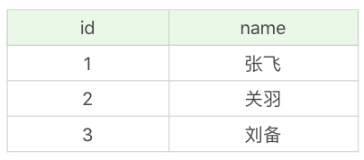
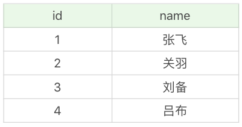
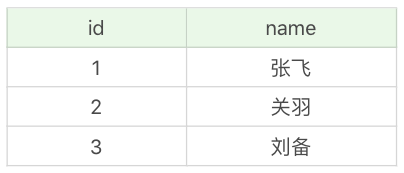
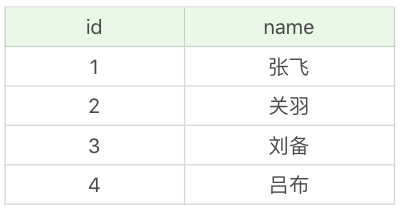
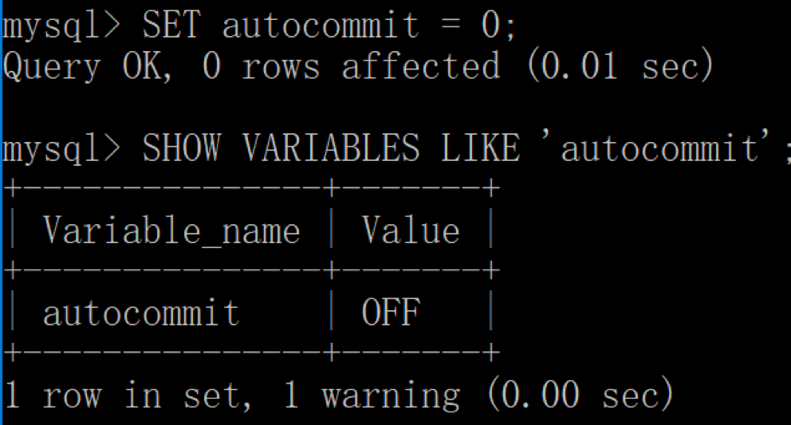
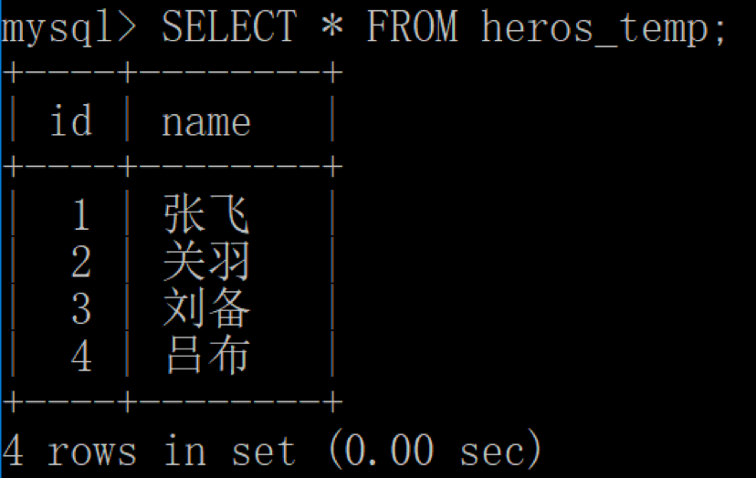

---
date: "2019-06-23"
---  
      
# 15丨初识事务隔离：隔离的级别有哪些，它们都解决了哪些异常问题？
上一篇文章中，我们讲到了事务的四大特性ACID，分别是原子性、一致性、隔离性和持久性，其中隔离性是事务的基本特性之一，它可以防止数据库在并发处理时出现数据不一致的情况。最严格的情况下，我们可以采用串行化的方式来执行每一个事务，这就意味着事务之间是相互独立的，不存在并发的情况。然而在实际生产环境下，考虑到随着用户量的增多，会存在大规模并发访问的情况，这就要求数据库有更高的吞吐能力，这个时候串行化的方式就无法满足数据库高并发访问的需求，我们还需要降低数据库的隔离标准，来换取事务之间的并发能力。

有时候我们需要牺牲一定的正确性来换取效率的提升，也就是说，我们需要通过设置不同的隔离等级，以便在正确性和效率之间进行平衡。同时，随着RDBMS种类和应用场景的增多，数据库的设计者需要统一对数据库隔离级别进行定义，说明这些隔离标准都解决了哪些问题。

我们今天主要讲解事务的异常以及隔离级别都有哪些，如果你已经对它们有所了解，可以跳过本次章节，当然你也可以通过今天的课程快速复习一遍：

1.  事务并发处理可能存在的三种异常有哪些？什么是脏读、不可重复读和幻读？
2.  针对可能存在的异常情况，四种事务隔离的级别分别是什么？
3.  如何使用MySQL客户端来模拟脏读、不可重复读和幻读？

<!-- [[[read_end]]] -->

## 事务并发处理可能存在的异常都有哪些？

在了解数据库隔离级别之前，我们需要了解设定事务的隔离级别都要解决哪些可能存在的问题，也就是事务并发处理时会存在哪些异常情况。实际上，SQL-92标准中已经对3种异常情况进行了定义，这些异常情况级别分别为脏读（Dirty Read）、不可重复读（Nonrepeatable Read）和幻读（Phantom Read）。

脏读、不可重复读和幻读都代表了什么，我用一个例子来给你讲解下。比如说我们有个英雄表heros\_temp，如下所示：

  
这张英雄表，我们会记录很多英雄的姓名，假设我们不对事务进行隔离操作，那么数据库在进行事务的并发处理时会出现怎样的情况？

第一天，小张访问数据库，正在进行事务操作，往里面写入一个新的英雄“吕布”：

```
    SQL> BEGIN;
    SQL> INSERT INTO heros_temp values(4, '吕布');
    

```

当小张还没有提交该事务的时候，小李又对数据表进行了访问，他想看下这张英雄表里都有哪些英雄：

```
    SQL> SELECT * FROM heros_temp;
    

```

这时，小李看到的结果如下：

  
你有没有发现什么异常？这个时候小张还没有提交事务，但是小李却读到了小张还没有提交的数据，这种现象我们称之为“脏读”。

那么什么是不可重复读呢？

第二天，小张想查看id=1的英雄是谁，于是他进行了SQL查询：

```
    SQL> BEGIN;
    SQL> SELECT name FROM heros_temp WHERE id = 1;
    

```

运行结果：

  
然而此时，小李开始了一个事务操作，他对id=1的英雄姓名进行了修改，把原来的“张飞”改成了“张翼德”：

```
    SQL> BEGIN;
    SQL> UPDATE heros_temp SET name = '张翼德' WHERE id = 1;
    

```

然后小张再一次进行查询，同样也是查看id=1的英雄是谁：

```
    SQL> SELECT name FROM heros_temp WHERE id = 1;
    

```

运行结果：

  
这个时候你会发现，两次查询的结果并不一样。小张会想这是怎么回事呢？他明明刚执行了一次查询，马上又进行了一次查询，结果两次的查询结果不同。实际上小张遇到的情况我们称之为“不可重复读”，也就是同一条记录，两次读取的结果不同。

从这个例子中，我们能看到小张和小李，分别开启了两个事务，针对客户端A和客户端B，我用时间顺序的方式展示下他们各自执行的内容：


那什么是幻读呢？

第三天，小张想要看下数据表里都有哪些英雄，他开始执行下面这条语句：

```
    SQL> SELECT * FROM heros_temp;
    

```

  
这时当小张执行完之后，小李又开始了一个事务，往数据库里插入一个新的英雄“吕布”：

```
    SQL> BEGIN;
    SQL> INSERT INTO heros_temp values(4, '吕布');
    

```

不巧的是，小张这时忘记了英雄都有哪些，又重新执行了一遍查询：

```
    SQL> SELECT * FROM heros_temp;
    

```

  
他发现这一次查询多了一个英雄，原来只有3个，现在变成了4个。这种异常情况我们称之为“幻读”。

我来总结下这三种异常情况的特点：

1.  脏读：读到了其他事务还没有提交的数据。
2.  不可重复读：对某数据进行读取，发现两次读取的结果不同，也就是说没有读到相同的内容。这是因为有其他事务对这个数据同时进行了修改或删除。
3.  幻读：事务A根据条件查询得到了N条数据，但此时事务B更改或者增加了M条符合事务A查询条件的数据，这样当事务A再次进行查询的时候发现会有N+M条数据，产生了幻读。

## 事务隔离的级别有哪些？

脏读、不可重复读和幻读这三种异常情况，是在SQL-92标准中定义的，同时SQL-92标准还定义了4种隔离级别来解决这些异常情况。

解决异常数量从少到多的顺序（比如读未提交可能存在3种异常，可串行化则不会存在这些异常）决定了隔离级别的高低，这四种隔离级别从低到高分别是：读未提交（READ UNCOMMITTED ）、读已提交（READ COMMITTED）、可重复读（REPEATABLE READ）和可串行化（SERIALIZABLE）。这些隔离级别能解决的异常情况如下表所示：

  
你能看到可串行化能避免所有的异常情况，而读未提交则允许异常情况发生。

关于这四种级别，我来简单讲解下。

读未提交，也就是允许读到未提交的数据，这种情况下查询是不会使用锁的，可能会产生脏读、不可重复读、幻读等情况。

读已提交就是只能读到已经提交的内容，可以避免脏读的产生，属于RDBMS中常见的默认隔离级别（比如说Oracle和SQL Server），但如果想要避免不可重复读或者幻读，就需要我们在SQL查询的时候编写带加锁的SQL语句（我会在进阶篇里讲加锁）。

可重复读，保证一个事务在相同查询条件下两次查询得到的数据结果是一致的，可以避免不可重复读和脏读，但无法避免幻读。MySQL默认的隔离级别就是可重复读。

可串行化，将事务进行串行化，也就是在一个队列中按照顺序执行，可串行化是最高级别的隔离等级，可以解决事务读取中所有可能出现的异常情况，但是它牺牲了系统的并发性。

## 使用MySQL客户端来模拟三种异常

我在讲解这三种异常的时候举了一个英雄数据表查询的例子，你还可以自己写SQL来模拟一下这三种异常。

首先我们需要一个英雄数据表heros\_temp，具体表结构和数据，你可以从[GitHub](https://github.com/cystanford/sql_heros_data)上下载heros\_temp.sql文件。

你也可以执行下面的SQL文件，来完成heros\_temp数据表的创建。

```
    -- ----------------------------
    -- Table structure for heros_temp
    -- ----------------------------
    DROP TABLE IF EXISTS `heros_temp`;
    CREATE TABLE `heros_temp`  (
      `id` int(11) NOT NULL,
      `name` varchar(255) CHARACTER SET utf8 COLLATE utf8_general_ci NOT NULL,
      PRIMARY KEY (`id`) USING BTREE
    ) ENGINE = InnoDB CHARACTER SET = utf8 COLLATE = utf8_general_ci ROW_FORMAT = Dynamic;
    
    -- ----------------------------
    -- Records of heros_temp
    -- ----------------------------
    INSERT INTO `heros_temp` VALUES (1, '张飞');
    INSERT INTO `heros_temp` VALUES (2, '关羽');
    INSERT INTO `heros_temp` VALUES (3, '刘备');
    

```

模拟的时候我们需要开两个MySQL客户端，分别是客户端1和客户端2。

在客户端1中，我们先来查看下当前会话的隔离级别，使用命令：

```
    mysql> SHOW VARIABLES LIKE 'transaction_isolation';
    

```

然后你能看到当前的隔离级别是REPEATABLE-READ，也就是可重复读。


现在我们把隔离级别降到最低，设置为READ UNCOMMITTED（读未提交）。

```
    mysql> SET SESSION TRANSACTION ISOLATION LEVEL READ UNCOMMITTED;
    

```

然后再查看下当前会话（SESSION）下的隔离级别，结果如下：


因为MySQL默认是事务自动提交，这里我们还需要将autocommit参数设置为0，命令如下：

```
    mysql> SET autocommit = 0;
    

```

然后我们再来查看SESSION中的autocommit取值，结果如下：

  
接着我们以同样的操作启动客户端2，也就是将隔离级别设置为READ UNCOMMITTED（读未提交），autocommit设置为0。

### 模拟“脏读”

我们在客户端2中开启一个事务，在heros\_temp表中写入一个新的英雄“吕布”，注意这个时候不要提交。

  
然后我们在客户端1中，查看当前的英雄表：


你能发现客户端1中读取了客户端2未提交的新英雄“吕布”，实际上客户端2可能马上回滚，从而造成了“脏读”。

### 模拟“不可重复读”

我们用客户端1来查看id=1的英雄：


然后用客户端2对id=1的英雄姓名进行修改：


这时用客户端1再次进行查询：


你能发现对于客户端1来说，同一条查询语句出现了“不可重复读”。

### 模拟“幻读”

我们先用客户端1查询数据表中的所有英雄：


然后用客户端2，开始插入新的英雄“吕布”：

  
这时，我们再用客户端1重新进行查看：

  
你会发现数据表多出一条数据。

如果你是初学者，那么你可以采用heros\_temp数据表简单模拟一下以上的过程，加深对脏读、不可重复读以及幻读的理解。对应的，你也会更了解不同的隔离级别解决的异常问题。

## 总结

我们今天只是简单讲解了4种隔离级别，以及对应的要解决的三种异常问题。我会在优化篇这一模块里继续讲解隔离级别以及锁的使用。

你能看到，标准的价值在于，即使是不同的RDBMS都需要达成对异常问题和隔离级别定义的共识。这就意味着一个隔离级别的实现满足了下面的两个条件：

1.  正确性：只要能满足某一个隔离级别，一定能解决这个隔离级别对应的异常问题。
2.  与实现无关：实际上RDBMS种类很多，这就意味着有多少种RDBMS，就有多少种锁的实现方式，因此它们实现隔离级别的原理可能不同，然而一个好的标准不应该限制其实现的方式。

隔离级别越低，意味着系统吞吐量（并发程度）越大，但同时也意味着出现异常问题的可能性会更大。在实际使用过程中我们往往需要在性能和正确性上进行权衡和取舍，没有完美的解决方案，只有适合与否。

  
今天的内容到这里就结束了，你能思考一下为什么隔离级别越高，就越影响系统的并发性能吗？以及不可重复读和幻读的区别是什么？

欢迎你在评论区写下你的思考，也欢迎把这篇文章分享给你的朋友或者同事。