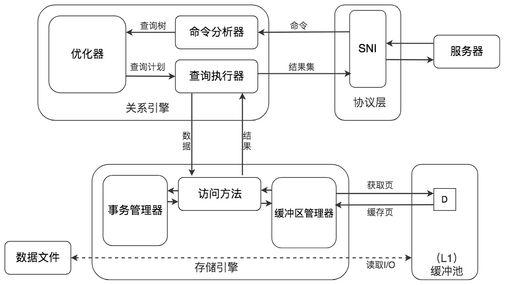
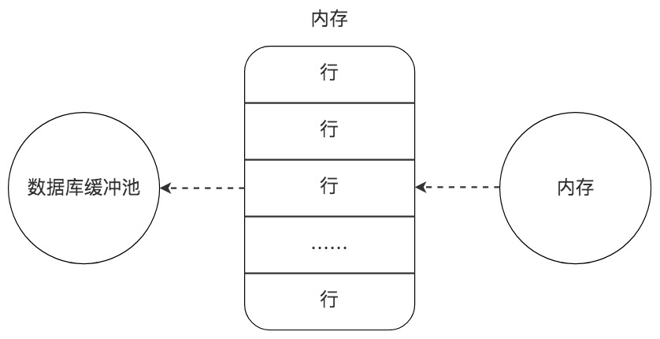
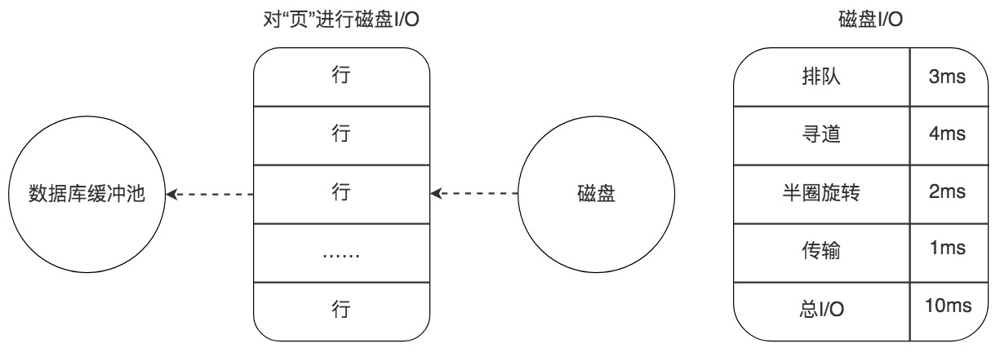

---
date: "2019-06-23"
---  
      
# 28丨从磁盘I/O的角度理解SQL查询的成本
在开始今天的内容前，我们先来回忆一下之前的内容。

数据库存储的基本单位是页，对于一棵B+树的索引来说，是先从根节点找到叶子节点，也就是先查找数据行所在的页，再将页读入到内存中，在内存中对页的记录进行查找，从而得到想要数据。你看，虽然我们想要查找的，只是一行记录，但是对于磁盘I/O来说却需要加载一页的信息，因为页是最小的存储单位。

那么对于数据库来说，如果我们想要查找多行记录，查询时间是否会成倍地提升呢？其实数据库会采用缓冲池的方式提升页的查找效率。

为了更好地理解SQL查询效率是怎么一回事，今天我们就来看看磁盘I/O是如何加载数据的。

这部分的内容主要包括以下几个部分：

1.  数据库的缓冲池在数据库中起到了怎样的作用？如果我们对缓冲池内的数据进行更新，数据会直接更新到磁盘上吗？
2.  对数据页进行加载都有哪些方式呢？
3.  如何查看一条SQL语句需要在缓冲池中进行加载的页的数量呢？

## 数据库缓冲池

磁盘I/O需要消耗的时间很多，而在内存中进行操作，效率则会高很多，为了能让数据表或者索引中的数据随时被我们所用，DBMS会申请占用内存来作为数据缓冲池，这样做的好处是可以让磁盘活动最小化，从而减少与磁盘直接进行I/O的时间。要知道，这种策略对提升SQL语句的查询性能来说至关重要。如果索引的数据在缓冲池里，那么访问的成本就会降低很多。

<!-- [[[read_end]]] -->

那么缓冲池如何读取数据呢？

缓冲池管理器会尽量将经常使用的数据保存起来，在数据库进行页面读操作的时候，首先会判断该页面是否在缓冲池中，如果存在就直接读取，如果不存在，就会通过内存或磁盘将页面存放到缓冲池中再进行读取。

缓存在数据库中的结构和作用如下图所示：

  
如果我们执行SQL语句的时候更新了缓存池中的数据，那么这些数据会马上同步到磁盘上吗？

实际上，当我们对数据库中的记录进行修改的时候，首先会修改缓冲池中页里面的记录信息，然后数据库会以一定的频率刷新到磁盘上。注意并不是每次发生更新操作，都会立刻进行磁盘回写。缓冲池会采用一种叫做checkpoint的机制将数据回写到磁盘上，这样做的好处就是提升了数据库的整体性能。

比如，当缓冲池不够用时，需要释放掉一些不常用的页，就可以采用强行采用checkpoint的方式，将不常用的脏页回写到磁盘上，然后再从缓冲池中将这些页释放掉。这里脏页（dirty page）指的是缓冲池中被修改过的页，与磁盘上的数据页不一致。

### 查看缓冲池的大小

了解完缓冲池的工作原理后，你可能想问，我们如何判断缓冲池的大小？

如果你使用的是MySQL MyISAM存储引擎，它只缓存索引，不缓存数据，对应的键缓存参数为key\_buffer\_size，你可以用它进行查看。

如果你使用的是InnoDB存储引擎，可以通过查看innodb\_buffer\_pool\_size变量来查看缓冲池的大小，命令如下：

```
    mysql > show variables like 'innodb_buffer_pool_size'
    

```

  
你能看到此时InnoDB的缓冲池大小只有8388608/1024/1024=8MB，我们可以修改缓冲池大小为128MB，方法如下：

  
然后再来看下修改后的缓冲池大小，此时已成功修改成了128MB：

  
在InnoDB存储引擎中，我们可以同时开启多个缓冲池，这里我们看下如何查看缓冲池的个数，使用命令：

```
    mysql > show variables like 'innodb_buffer_pool_instances'
    

```


你能看到当前只有一个缓冲池。实际上`innodb_buffer_pool_instances`默认情况下为8，为什么只显示只有一个呢？这里需要说明的是，如果想要开启多个缓冲池，你首先需要将`innodb_buffer_pool_size`参数设置为大于等于1GB，这时`innodb_buffer_pool_instances`才会大于1。你可以在MySQL的配置文件中对`innodb_buffer_pool_size`进行设置，大于等于1GB，然后再针对`innodb_buffer_pool_instances`参数进行修改。

### 数据页加载的三种方式

我们刚才已经对缓冲池有了基本的了解。

如果缓冲池中没有该页数据，那么缓冲池有以下三种读取数据的方式，每种方式的读取效率都是不同的：

**1\. 内存读取**

如果该数据存在于内存中，基本上执行时间在1ms左右，效率还是很高的。

  
**2\. 随机读取**

如果数据没有在内存中，就需要在磁盘上对该页进行查找，整体时间预估在10ms左右，这10ms中有6ms是磁盘的实际繁忙时间（包括了寻道和半圈旋转时间），有3ms是对可能发生的排队时间的估计值，另外还有1ms的传输时间，将页从磁盘服务器缓冲区传输到数据库缓冲区中。这10ms看起来很快，但实际上对于数据库来说消耗的时间已经非常长了，因为这还只是一个页的读取时间。

  
**3\. 顺序读取**

顺序读取其实是一种批量读取的方式，因为我们请求的数据在磁盘上往往都是相邻存储的，顺序读取可以帮我们批量读取页面，这样的话，一次性加载到缓冲池中就不需要再对其他页面单独进行磁盘I/O操作了。如果一个磁盘的吞吐量是40MB/S，那么对于一个16KB大小的页来说，一次可以顺序读取2560（40MB/16KB）个页，相当于一个页的读取时间为0.4ms。采用批量读取的方式，即使是从磁盘上进行读取，效率也比从内存中只单独读取一个页的效率要高。

## 通过last\_query\_cost统计SQL语句的查询成本

我们先前已经讲过，一条SQL查询语句在执行前需要确定查询计划，如果存在多种查询计划的话，MySQL会计算每个查询计划所需要的成本，从中选择成本最小的一个作为最终执行的查询计划。

如果我们想要查看某条SQL语句的查询成本，可以在执行完这条SQL语句之后，通过查看当前会话中的last\_query\_cost变量值来得到当前查询的成本。这个查询成本对应的是SQL语句所需要读取的页的数量。

我以product\_comment表为例，如果我们想要查询comment\_id=900001的记录，然后看下查询成本，我们可以直接在聚集索引上进行查找：

```
    mysql> SELECT comment_id, product_id, comment_text, user_id FROM product_comment WHERE comment_id = 900001;
    

```

运行结果（1条记录，运行时间为0.042s）：

  
然后再看下查询优化器的成本，实际上我们只需要检索一个页即可：

```
    mysql> SHOW STATUS LIKE 'last_query_cost';
    

```

  
如果我们想要查询comment\_id在900001到9000100之间的评论记录呢？

```
    mysql> SELECT comment_id, product_id, comment_text, user_id FROM product_comment WHERE comment_id BETWEEN 900001 AND 900100;
    

```

运行结果（100条记录，运行时间为0.046s）：

  
然后再看下查询优化器的成本，这时我们大概需要进行20个页的查询。

```
    mysql> SHOW STATUS LIKE 'last_query_cost';
    

```

  
你能看到页的数量是刚才的20倍，但是查询的效率并没有明显的变化，实际上这两个SQL查询的时间基本上一样，就是因为采用了顺序读取的方式将页面一次性加载到缓冲池中，然后再进行查找。虽然页数量（last\_query\_cost）增加了不少，但是通过缓冲池的机制，并没有增加多少查询时间。

## 总结

上一节我们了解到了页是数据库存储的最小单位，这一节我们了解了在数据库中是如何加载使用页的。SQL查询是一个动态的过程，从页加载的角度来看，我们可以得到以下两点结论：

1.  位置决定效率。如果页就在数据库缓冲池中，那么效率是最高的，否则还需要从内存或者磁盘中进行读取，当然针对单个页的读取来说，如果页存在于内存中，会比在磁盘中读取效率高很多。
2.  批量决定效率。如果我们从磁盘中对单一页进行随机读，那么效率是很低的（差不多10ms），而采用顺序读取的方式，批量对页进行读取，平均一页的读取效率就会提升很多，甚至要快于单个页面在内存中的随机读取。

所以说，遇到I/O并不用担心，方法找对了，效率还是很高的。我们首先要考虑数据存放的位置，如果是经常使用的数据就要尽量放到缓冲池中，其次我们可以充分利用磁盘的吞吐能力，一次性批量读取数据，这样单个页的读取效率也就得到了提升。

  
最后给你留两道思考题吧。你能解释下相比于单个页面的随机读，为什么顺序读取时平均一个页面的加载效率会提高吗？另外，对于今天学习的缓冲池机制和数据页加载的方式，你有什么心得体会吗？

欢迎在评论区写下你的答案，如果你觉得这篇文章有帮助，不妨把它分享给你的朋友或者同事吧。