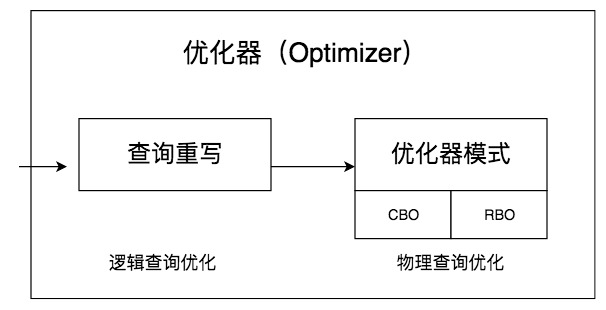
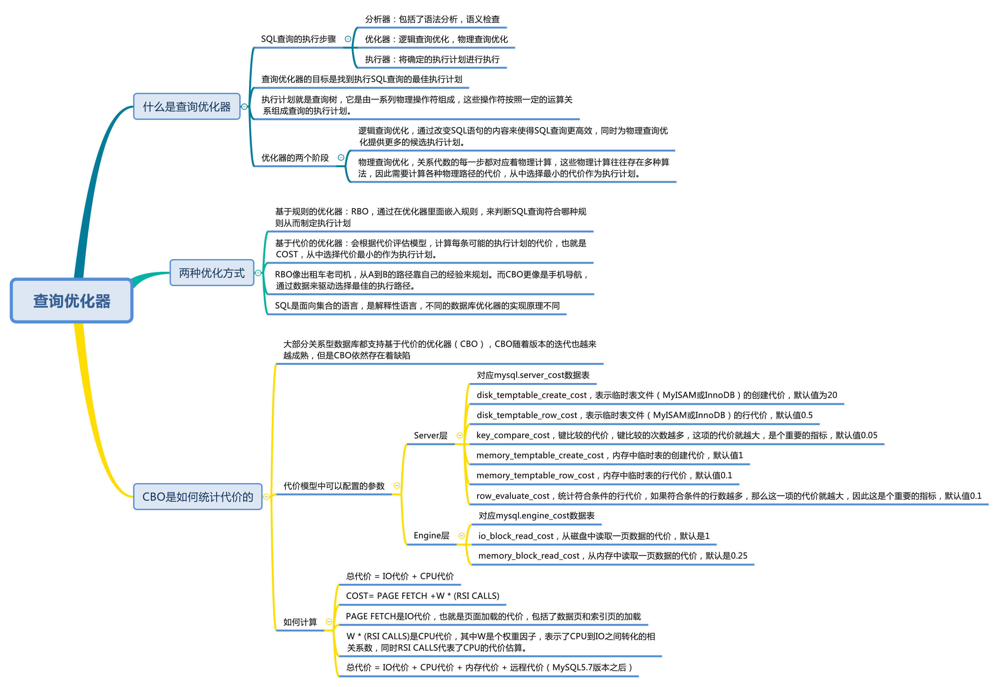

---
date: "2019-06-23"
---  
      
# 32丨查询优化器是如何工作的？
我们总是希望数据库可以运行得更快，也就是响应时间更快，吞吐量更大。想要达到这样的目的，我们一方面需要高并发的事务处理能力，另一方面需要创建合适的索引，让数据的查找效率最大化。事务和索引的使用是数据库中的两个重要核心，事务可以让数据库在增删查改的过程中，保证数据的正确性和安全性，而索引可以帮数据库提升数据的查找效率。

如果我们想要知道如何获取更高的SQL查询性能，最好的方式就是理解数据库是如何进行查询优化和执行的。

今天我们就来看看查询优化的原理是怎么一回事。今天的主要内容包括以下几个部分：

1.  什么是查询优化器？一条SQL语句的执行流程都会经历哪些环节，在查询优化器中都包括了哪些部分？
2.  查询优化器的两种优化方式分别是什么？
3.  基于代价的优化器是如何统计代价的？总的代价又如何计算？

## 什么是查询优化器

了解查询优化器的作用之前，我们先来看看一条SQL语句的执行都需要经历哪些环节，如下图所示：

  
你能看到一条SQL查询语句首先会经过分析器，进行语法分析和语义检查。我们之前讲过语法分析是检查SQL拼写和语法是否正确，语义检查是检查SQL中的访问对象是否存在。比如我们在写SELECT语句的时候，列名写错了，系统就会提示错误。语法检查和语义检查可以保证SQL语句没有错误，最终得到一棵语法分析树，然后经过查询优化器得到查询计划，最后交给执行器进行执行。

<!-- [[[read_end]]] -->

查询优化器的目标是找到执行SQL查询的最佳执行计划，执行计划就是查询树，它由一系列物理操作符组成，这些操作符按照一定的运算关系组成查询的执行计划。在查询优化器中，可以分为逻辑查询优化阶段和物理查询优化阶段。

逻辑查询优化就是通过改变SQL语句的内容来使得SQL查询更高效，同时为物理查询优化提供更多的候选执行计划。通常采用的方式是对SQL语句进行等价变换，对查询进行重写，而查询重写的数学基础就是关系代数。对条件表达式进行等价谓词重写、条件简化，对视图进行重写，对子查询进行优化，对连接语义进行了外连接消除、嵌套连接消除等。

逻辑查询优化是基于关系代数进行的查询重写，而关系代数的每一步都对应着物理计算，这些物理计算往往存在多种算法，因此需要计算各种物理路径的代价，从中选择代价最小的作为执行计划。在这个阶段里，对于单表和多表连接的操作，需要高效地使用索引，提升查询效率。

  
在这两个阶段中，查询重写属于代数级、语法级的优化，也就是属于逻辑范围内的优化，而基于代价的估算模型是从连接路径中选择代价最小的路径，属于物理层面的优化。

## 查询优化器的两种优化方式

查询优化器的目的就是生成最佳的执行计划，而生成最佳执行计划的策略通常有以下两种方式。

第一种是基于规则的优化器（RBO，Rule-Based Optimizer），规则就是人们以往的经验，或者是采用已经被证明是有效的方式。通过在优化器里面嵌入规则，来判断SQL查询符合哪种规则，就按照相应的规则来制定执行计划，同时采用启发式规则去掉明显不好的存取路径。

第二种是基于代价的优化器（CBO，Cost-Based Optimizer），这里会根据代价评估模型，计算每条可能的执行计划的代价，也就是COST，从中选择代价最小的作为执行计划。相比于RBO来说，CBO对数据更敏感，因为它会利用数据表中的统计信息来做判断，针对不同的数据表，查询得到的执行计划可能是不同的，因此制定出来的执行计划也更符合数据表的实际情况。

但我们需要记住，SQL是面向集合的语言，并没有指定执行的方式，因此在优化器中会存在各种组合的可能。我们需要通过优化器来制定数据表的扫描方式、连接方式以及连接顺序，从而得到最佳的SQL执行计划。

你能看出来，RBO的方式更像是一个出租车老司机，凭借自己的经验来选择从A到B的路径。而CBO更像是手机导航，通过数据驱动，来选择最佳的执行路径。

## CBO是如何统计代价的

大部分RDBMS都支持基于代价的优化器（CBO），CBO随着版本的迭代也越来越成熟，但是CBO依然存在缺陷。通过对CBO工作原理的了解，我们可以知道CBO可能存在的不足有哪些，有助于让我们知道优化器是如何确定执行计划的。

### 能调整的代价模型的参数有哪些

首先，我们先来了解下MySQL中的`COST Model`，`COST Model`就是优化器用来统计各种步骤的代价模型，在5.7.10版本之后，MySQL会引入两张数据表，里面规定了各种步骤预估的代价（Cost Value） ，我们可以从`mysql.server_cost`和`mysql.engine_cost`这两张表中获得这些步骤的代价：

```
    SQL > SELECT * FROM mysql.server_cost
    

```

  
server\_cost数据表是在server层统计的代价，具体的参数含义如下：

1.  `disk_temptable_create_cost`，表示临时表文件（MyISAM或InnoDB）的创建代价，默认值为20。
2.  `disk_temptable_row_cost`，表示临时表文件（MyISAM或InnoDB）的行代价，默认值0.5。
3.  `key_compare_cost`，表示键比较的代价。键比较的次数越多，这项的代价就越大，这是一个重要的指标，默认值0.05。
4.  `memory_temptable_create_cost`，表示内存中临时表的创建代价，默认值1。
5.  `memory_temptable_row_cost`，表示内存中临时表的行代价，默认值0.1。
6.  `row_evaluate_cost`，统计符合条件的行代价，如果符合条件的行数越多，那么这一项的代价就越大，因此这是个重要的指标，默认值0.1。

由这张表中可以看到，如果想要创建临时表，尤其是在磁盘中创建相应的文件，代价还是很高的。

然后我们看下在存储引擎层都包括了哪些代价：

```
    SQL > SELECT * FROM mysql.engine_cost
    

```

  
`engine_cost`主要统计了页加载的代价，我们之前了解到，一个页的加载根据页所在位置的不同，读取的位置也不同，可以从磁盘I/O中获取，也可以从内存中读取。因此在`engine_cost`数据表中对这两个读取的代价进行了定义：

1.  `io_block_read_cost`，从磁盘中读取一页数据的代价，默认是1。
2.  `memory_block_read_cost`，从内存中读取一页数据的代价，默认是0.25。

既然MySQL将这些代价参数以数据表的形式呈现给了我们，我们就可以根据实际情况去修改这些参数。因为随着硬件的提升，各种硬件的性能对比也可能发生变化，比如针对普通硬盘的情况，可以考虑适当增加`io_block_read_cost`的数值，这样就代表从磁盘上读取一页数据的成本变高了。当我们执行全表扫描的时候，相比于范围查询，成本也会增加很多。

比如我想将`io_block_read_cost`参数设置为2.0，那么使用下面这条命令就可以：

```
    UPDATE mysql.engine_cost
      SET cost_value = 2.0
      WHERE cost_name = 'io_block_read_cost';
    FLUSH OPTIMIZER_COSTS;
    

```

  
我们对`mysql.engine_cost`中的`io_block_read_cost`参数进行了修改，然后使用`FLUSH OPTIMIZER_COSTS`更新内存，然后再查看`engine_cost`数据表，发现`io_block_read_cost`参数中的`cost_value`已经调整为2.0。

如果我们想要专门针对某个存储引擎，比如InnoDB存储引擎设置`io_block_read_cost`，比如设置为2，可以这样使用：

```
    INSERT INTO mysql.engine_cost(engine_name, device_type, cost_name, cost_value, last_update, comment)
      VALUES ('InnoDB', 0, 'io_block_read_cost', 2,
      CURRENT_TIMESTAMP, 'Using a slower disk for InnoDB');
    FLUSH OPTIMIZER_COSTS;
    

```

然后我们再查看一下`mysql.engine_cost`数据表：

  
从图中你能看到针对InnoDB存储引擎可以设置专门的`io_block_read_cost`参数值。

### 代价模型如何计算

总代价的计算是一个比较复杂的过程，上面只是列出了一些常用的重要参数，我们可以根据情况对它们进行调整，也可以使用默认的系统参数值。

那么总的代价是如何进行计算的呢？

在论文[《Access Path Selection-in a Relational Database Management System》](http://dbis.rwth-aachen.de/lehrstuhl/staff/li/resources/download/AccessPathSelectionInRelationalDatabase.pdf%EF%BC%89)中给出了计算模型，如下图所示：

  
你可以简单地认为，总的执行代价等于I/O代价+CPU代价。在这里PAGE FETCH就是I/O代价，也就是页面加载的代价，包括数据页和索引页加载的代价。W\*\(RSI CALLS\)就是CPU代价。W在这里是个权重因子，表示了CPU到I/O之间转化的相关系数，RSI CALLS代表了CPU的代价估算，包括了键比较（compare key）以及行估算（row evaluating）的代价。

为了让你更好地理解，我说下关于W和RSI CALLS的英文解释：W is an adjustable weight between I/O and CPU utilization. The number of RSI calls is used to approximate CPU utilization。

这样你应该能明白为了让CPU代价和I/O代价放到一起来统计，我们使用了转化的系数W，

另外需要说明的是，在MySQL5.7版本之后，代价模型又进行了完善，不仅考虑到了I/O和CPU开销，还对内存计算和远程操作的代价进行了统计，也就是说总代价的计算公式演变成下面这样：

总代价 = I/O代价 + CPU代价 + 内存代价 + 远程代价

这里对内存代价和远程代价不进行讲解，我们只需要关注I/O代价和CPU代价即可。

## 总结

我今天讲解了查询优化器，它在RDBMS中是个非常重要的角色。在优化器中会经历逻辑查询优化和物理查询优化阶段。

最后我们只是简单梳理了下CBO的总代价是如何计算的，以及包括了哪些部分。CBO的代价计算是个复杂的过程，细节很多，不同优化器的实现方式也不同。另外随着优化器的逐渐成熟，考虑的因素也会越来越多。在某些情况下MySQL还会把RBO和CBO组合起来一起使用。RBO是个简单固化的模型，在Oracle 8i之前采用的就是RBO，在优化器中一共包括了15种规则，输入的SQL会根据符合规则的情况得出相应的执行计划，在Oracle 10g版本之后就用CBO替代了RBO。

CBO中需要传入的参数除了SQL查询以外，还包括了优化器参数、数据表统计信息和系统配置等，这实际上也导致CBO出现了一些缺陷，比如统计信息不准确，参数配置过高或过低，都会导致路径选择的偏差。除此以外，查询优化器还需要在优化时间和执行计划质量之间进行平衡，比如一个执行计划的执行时间是10秒钟，就没有必要花1分钟优化执行计划，除非该SQL使用频繁高，后续可以重复使用该执行计划。同样CBO也会做一些搜索空间的剪枝，以便在有效的时间内找到一个“最优”的执行计划。这里，其实也是在告诉我们，为了得到一个事物，付出的成本过大，即使最终得到了，有时候也是得不偿失的。

  
最后留两道思考题吧，RBO和CBO各自的特点是怎样的呢？为什么CBO也存在不足？你能用自己的话描述一下其中的原因吗？

欢迎你在评论区写下你的思考，也欢迎把这篇文章分享给你的朋友或者同事，一起来学习进步。