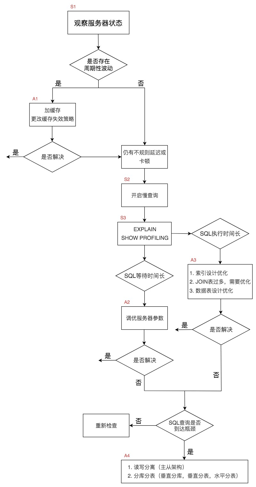
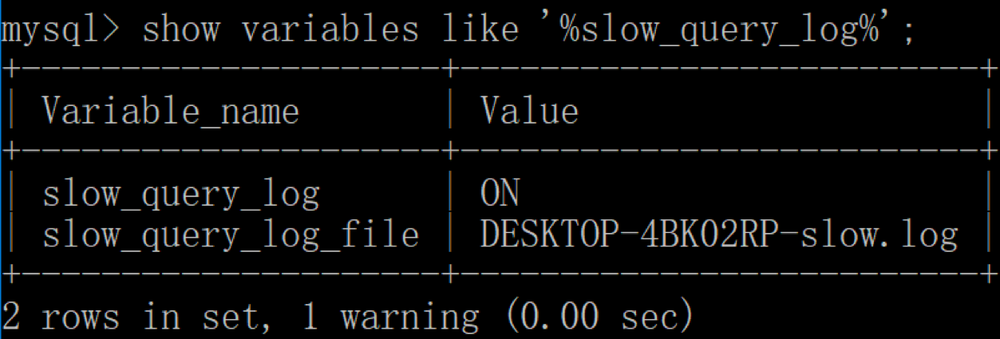
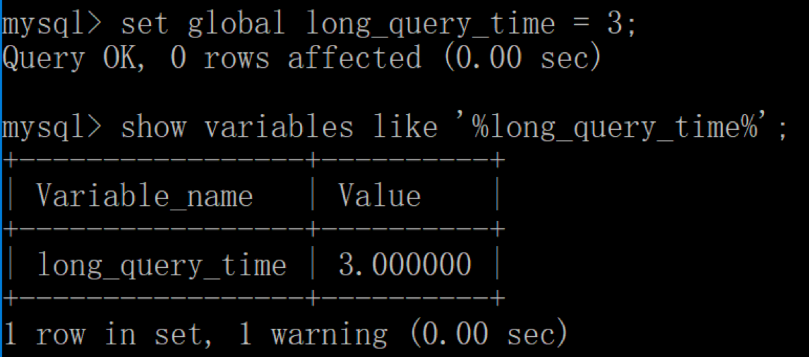
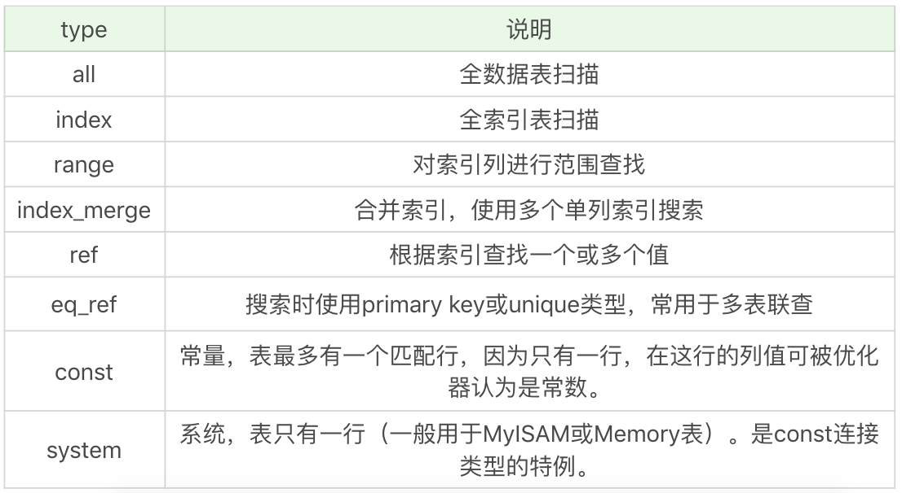
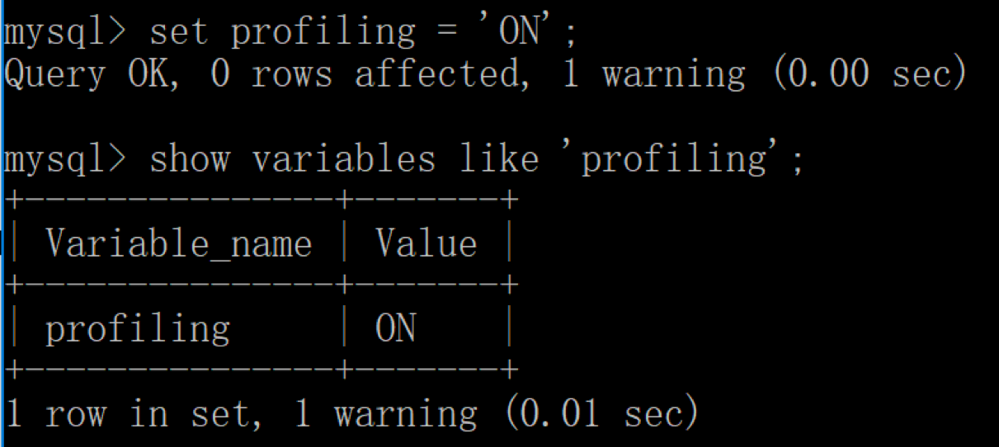
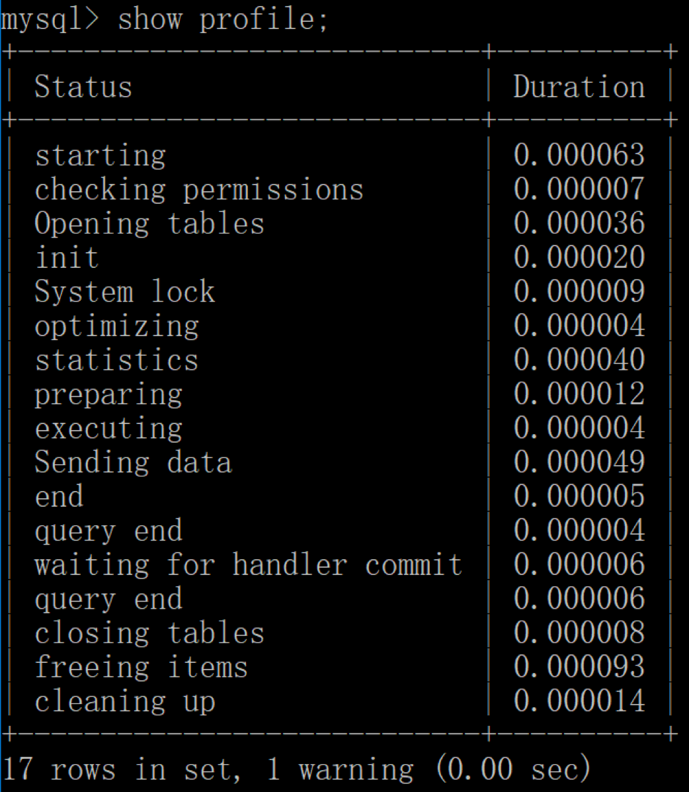
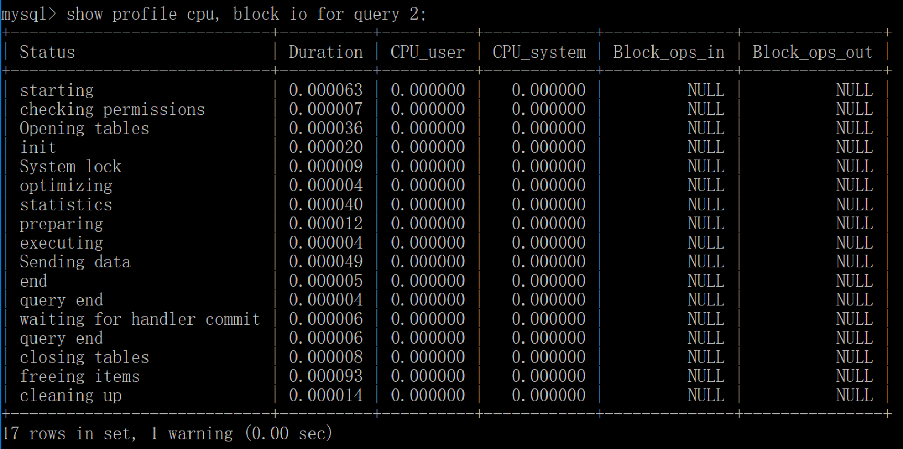

---
date: "2019-06-23"
---  
      
# 33丨如何使用性能分析工具定位SQL执行慢的原因？
在上一篇文章中，我们了解了查询优化器，知道在查询优化器中会经历逻辑查询优化和物理查询优化。需要注意的是，查询优化器只能在已经确定的情况下（SQL语句、索引设计、缓冲池大小、查询优化器参数等已知的情况）决定最优的查询执行计划。

但实际上SQL执行起来可能还是很慢，那么到底从哪里定位SQL查询慢的问题呢？是索引设计的问题？服务器参数配置的问题？还是需要增加缓存的问题呢？今天我们就从性能分析来入手，定位导致SQL执行慢的原因。

今天的内容主要包括以下几个部分：

1.  数据库服务器的优化分析的步骤是怎样的？中间有哪些需要注意的地方？
2.  如何使用慢查询日志查找执行慢的SQL语句？
3.  如何使用EXPLAIN查看SQL执行计划？
4.  如何使用SHOW PROFILING分析SQL执行步骤中的每一步的执行时间？

## 数据库服务器的优化步骤

当我们遇到数据库调优问题的时候，该如何思考呢？我把思考的流程整理成了下面这张图。

整个流程划分成了观察（Show status）和行动（Action）两个部分。字母S的部分代表观察（会使用相应的分析工具），字母A代表的部分是行动（对应分析可以采取的行动）。  
  
我们可以通过观察了解数据库整体的运行状态，通过性能分析工具可以让我们了解执行慢的SQL都有哪些，查看具体的SQL执行计划，甚至是SQL执行中的每一步的成本代价，这样才能定位问题所在，找到了问题，再采取相应的行动。

<!-- [[[read_end]]] -->

我来详细解释一下这张图。

首先在S1部分，我们需要观察服务器的状态是否存在周期性的波动。如果存在周期性波动，有可能是周期性节点的原因，比如双十一、促销活动等。这样的话，我们可以通过A1这一步骤解决，也就是加缓存，或者更改缓存失效策略。

如果缓存策略没有解决，或者不是周期性波动的原因，我们就需要进一步分析查询延迟和卡顿的原因。接下来进入S2这一步，我们需要开启慢查询。慢查询可以帮我们定位执行慢的SQL语句。我们可以通过设置`long_query_time`参数定义“慢”的阈值，如果SQL执行时间超过了`long_query_time`，则会认为是慢查询。当收集上来这些慢查询之后，我们就可以通过分析工具对慢查询日志进行分析。

在S3这一步骤中，我们就知道了执行慢的SQL语句，这样就可以针对性地用EXPLAIN查看对应SQL语句的执行计划，或者使用SHOW PROFILE查看SQL中每一个步骤的时间成本。这样我们就可以了解SQL查询慢是因为执行时间长，还是等待时间长。

如果是SQL等待时间长，我们进入A2步骤。在这一步骤中，我们可以调优服务器的参数，比如适当增加数据库缓冲池等。如果是SQL执行时间长，就进入A3步骤，这一步中我们需要考虑是索引设计的问题？还是查询关联的数据表过多？还是因为数据表的字段设计问题导致了这一现象。然后在这些维度上进行对应的调整。

如果A2和A3都不能解决问题，我们需要考虑数据库自身的SQL查询性能是否已经达到了瓶颈，如果确认没有达到性能瓶颈，就需要重新检查，重复以上的步骤。如果已经达到了性能瓶颈，进入A4阶段，需要考虑增加服务器，采用读写分离的架构，或者考虑对数据库分库分表，比如垂直分库、垂直分表和水平分表等。

以上就是数据库调优的流程思路。当我们发现执行SQL时存在不规则延迟或卡顿的时候，就可以采用分析工具帮我们定位有问题的SQL，这三种分析工具你可以理解是SQL调优的三个步骤：慢查询、EXPLAIN和SHOW PROFILE。

## 使用慢查询定位执行慢的SQL

慢查询可以帮我们找到执行慢的SQL，在使用前，我们需要先看下慢查询是否已经开启，使用下面这条命令即可：

```
    mysql > show variables like '%slow_query_log';
    

```

  
我们能看到`slow_query_log=OFF`，也就是说慢查询日志此时是关上的。我们可以把慢查询日志打开，注意设置变量值的时候需要使用global，否则会报错：

```
    mysql > set global slow_query_log='ON';
    

```

然后我们再来查看下慢查询日志是否开启，以及慢查询日志文件的位置：

  
你能看到这时慢查询分析已经开启，同时文件保存在DESKTOP-4BK02RP-slow文件中。

接下来我们来看下慢查询的时间阈值设置，使用如下命令：

```
    mysql > show variables like '%long_query_time%';
    

```


这里如果我们想把时间缩短，比如设置为3秒，可以这样设置：

```
    mysql > set global long_query_time = 3;
    

```

  
我们可以使用MySQL自带的mysqldumpslow工具统计慢查询日志（这个工具是个Perl脚本，你需要先安装好Perl）。

mysqldumpslow命令的具体参数如下：

* \-s：采用order排序的方式，排序方式可以有以下几种。分别是c（访问次数）、t（查询时间）、l（锁定时间）、r（返回记录）、ac（平均查询次数）、al（平均锁定时间）、ar（平均返回记录数）和at（平均查询时间）。其中at为默认排序方式。
* \-t：返回前N条数据 。
* \-g：后面可以是正则表达式，对大小写不敏感。

比如我们想要按照查询时间排序，查看前两条SQL语句，这样写即可：

```
    perl mysqldumpslow.pl -s t -t 2 "C:\ProgramData\MySQL\MySQL Server 8.0\Data\DESKTOP-4BK02RP-slow.log"
    

```

  
你能看到开启了慢查询日志，并设置了相应的慢查询时间阈值之后，只要查询时间大于这个阈值的SQL语句都会保存在慢查询日志中，然后我们就可以通过mysqldumpslow工具提取想要查找的SQL语句了。

## 如何使用EXPLAIN查看执行计划

定位了查询慢的SQL之后，我们就可以使用EXPLAIN工具做针对性的分析，比如我们想要了解product\_comment和user表进行联查的时候所采用的的执行计划，可以使用下面这条语句：

```
    EXPLAIN SELECT comment_id, product_id, comment_text, product_comment.user_id, user_name FROM product_comment JOIN user on product_comment.user_id = user.user_id 
    

```

  
EXPLAIN可以帮助我们了解数据表的读取顺序、SELECT子句的类型、数据表的访问类型、可使用的索引、实际使用的索引、使用的索引长度、上一个表的连接匹配条件、被优化器查询的行的数量以及额外的信息（比如是否使用了外部排序，是否使用了临时表等）等。

SQL执行的顺序是根据id从大到小执行的，也就是id越大越先执行，当id相同时，从上到下执行。

数据表的访问类型所对应的type列是我们比较关注的信息。type可能有以下几种情况：

  
在这些情况里，all是最坏的情况，因为采用了全表扫描的方式。index和all差不多，只不过index对索引表进行全扫描，这样做的好处是不再需要对数据进行排序，但是开销依然很大。如果我们在Extral列中看到Using index，说明采用了索引覆盖，也就是索引可以覆盖所需的SELECT字段，就不需要进行回表，这样就减少了数据查找的开销。

比如我们对product\_comment数据表进行查询，设计了联合索引`composite_index (user_id, comment_text)`，然后对数据表中的`comment_id`、`comment_text`、`user_id`这三个字段进行查询，最后用EXPLAIN看下执行计划：

```
    EXPLAIN SELECT comment_id, comment_text, user_id FROM product_comment 
    

```

  
你能看到这里的访问方式采用了index的方式，key列采用了联合索引，进行扫描。Extral列为Using index，告诉我们索引可以覆盖SELECT中的字段，也就不需要回表查询了。

range表示采用了索引范围扫描，这里不进行举例，从这一级别开始，索引的作用会越来越明显，因此我们需要尽量让SQL查询可以使用到range这一级别及以上的type访问方式。

index\_merge说明查询同时使用了两个或以上的索引，最后取了交集或者并集。比如想要对`comment_id=500000` 或者`user_id=500000`的数据进行查询，数据表中comment\_id为主键，user\_id是普通索引，我们可以查看下执行计划：

```
    EXPLAIN SELECT comment_id, product_id, comment_text, user_id FROM product_comment WHERE comment_id = 500000 OR user_id = 500000
    

```

  
你能看到这里同时使用到了两个索引，分别是主键和user\_id，采用的数据表访问类型是index\_merge，通过union的方式对两个索引检索的数据进行合并。

ref类型表示采用了非唯一索引，或者是唯一索引的非唯一性前缀。比如我们想要对`user_id=500000`的评论进行查询，使用EXPLAIN查看执行计划：

```
    EXPLAIN SELECT comment_id, comment_text, user_id FROM product_comment WHERE user_id = 500000 
    

```

  
这里user\_id为普通索引（因为user\_id在商品评论表中可能是重复的），因此采用的访问类型是ref，同时在ref列中显示const，表示连接匹配条件是常量，用于索引列的查找。

eq\_ref类型是使用主键或唯一索引时产生的访问方式，通常使用在多表联查中。假设我们对`product_comment`表和user表进行联查，关联条件是两张表的user\_id相等，使用EXPLAIN进行执行计划查看：

```
    EXPLAIN SELECT * FROM product_comment JOIN user WHERE product_comment.user_id = user.user_id 
    

```

  
const类型表示我们使用了主键或者唯一索引（所有的部分）与常量值进行比较，比如我们想要查看`comment_id=500000`，查看执行计划：

```
    EXPLAIN SELECT comment_id, comment_text, user_id FROM product_comment WHERE comment_id = 500000 
    

```

  
需要说明的是const类型和eq\_ref都使用了主键或唯一索引，不过这两个类型有所区别，const是与常量进行比较，查询效率会更快，而eq\_ref通常用于多表联查中。

system类型一般用于MyISAM或Memory表，属于const类型的特例，当表只有一行时连接类型为system（我在GitHub上上传了test\_myisam数据表，该数据表只有一行记录，下载地址：<https://github.com/cystanford/SQL_MyISAM>）。我们查看下执行计划：

```
    EXPLAIN SELECT * FROM test_myisam
    

```

  
你能看到除了all类型外，其他类型都可以使用到索引，但是不同的连接方式的效率也会有所不同，效率从低到高依次为all \< index \< range \< index\_merge \< ref \< eq\_ref \< const/system。我们在查看执行计划的时候，通常希望执行计划至少可以使用到range级别以上的连接方式，如果只使用到了all或者index连接方式，我们可以从SQL语句和索引设计的角度上进行改进。

## 使用SHOW PROFILE查看SQL的具体执行成本

SHOW PROFILE相比EXPLAIN能看到更进一步的执行解析，包括SQL都做了什么、所花费的时间等。默认情况下，profiling是关闭的，我们可以在会话级别开启这个功能。

```
    mysql > show variables like 'profiling';
    

```

  
通过设置`profiling='ON'`来开启show profile：

```
    mysql > set profiling = 'ON';
    

```

  
我们可以看下当前会话都有哪些profiles，使用下面这条命令：

```
    mysql > show profiles;
    

```

  
你能看到当前会话一共有2个查询，如果我们想要查看上一个查询的开销，可以使用：

```
    mysql > show profile;
    

```

  
我们也可以查看指定的Query ID的开销，比如`show profile for query 2`查询结果是一样的。在SHOW PROFILE中我们可以查看不同部分的开销，比如cpu、block.io等：

  
通过上面的结果，我们可以弄清楚每一步骤的耗时，以及在不同部分，比如CPU、block.io 的执行时间，这样我们就可以判断出来SQL到底慢在哪里。

不过SHOW PROFILE命令将被弃用，我们可以从information\_schema中的profiling数据表进行查看。

## 总结

我今天梳理了SQL优化的思路，从步骤上看，我们需要先进行观察和分析，分析工具的使用在日常工作中还是很重要的。今天只介绍了常用的三种分析工具，实际上可以使用的分析工具还有很多。

我在这里总结一下今天文章里提到的三种分析工具。我们可以通过慢查询日志定位执行慢的SQL，然后通过EXPLAIN分析该SQL语句是否使用到了索引，以及具体的数据表访问方式是怎样的。我们也可以使用SHOW PROFILE进一步了解SQL每一步的执行时间，包括I/O和CPU等资源的使用情况。


今天我介绍了EXPLAIN和SHOW PROFILE这两个工具，你还使用过哪些分析工具呢？

另外我们在进行数据表连接的时候，会有多种访问类型，你可以讲一下ref、eq\_ref和 const 这三种类型的区别吗？查询效率有何不同？

欢迎你在评论区写下你的思考，也欢迎把这篇文章分享给你的朋友或者同事，一起交流进步。