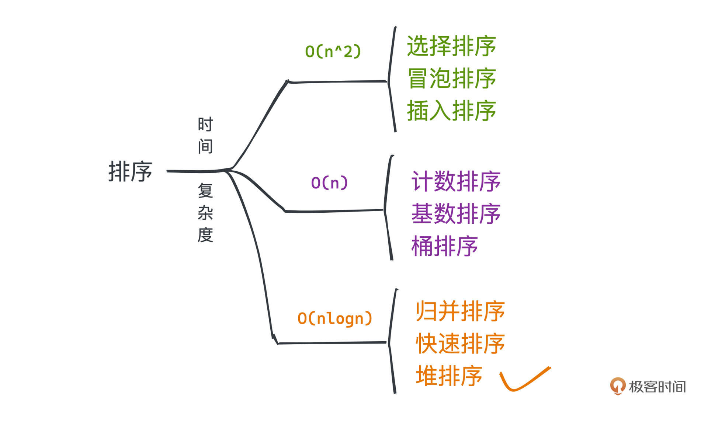
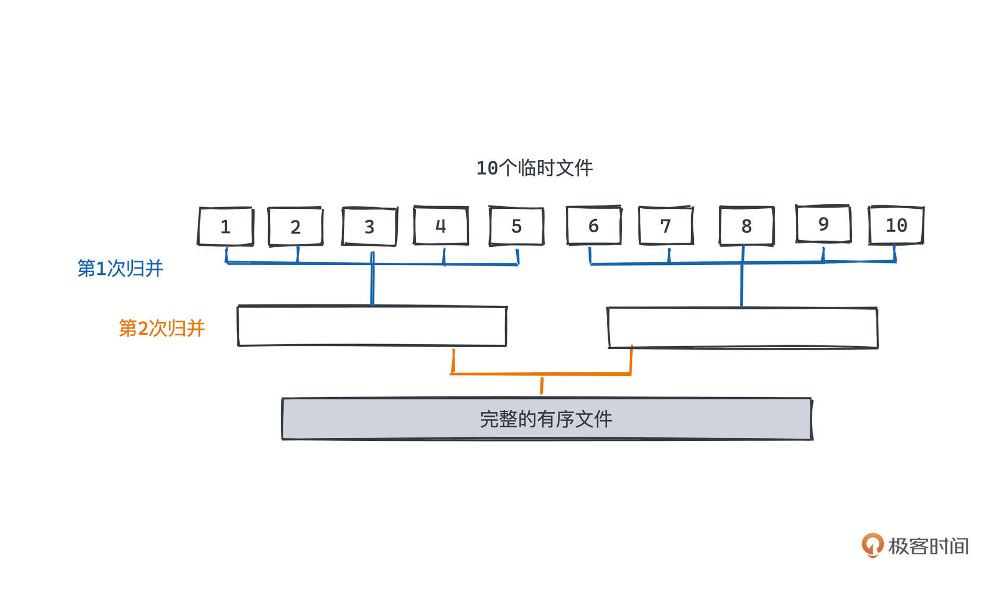
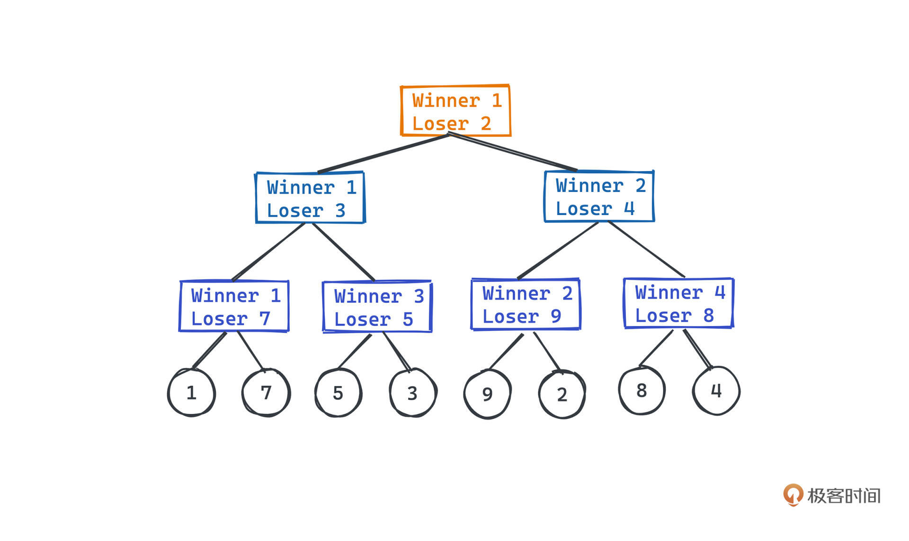
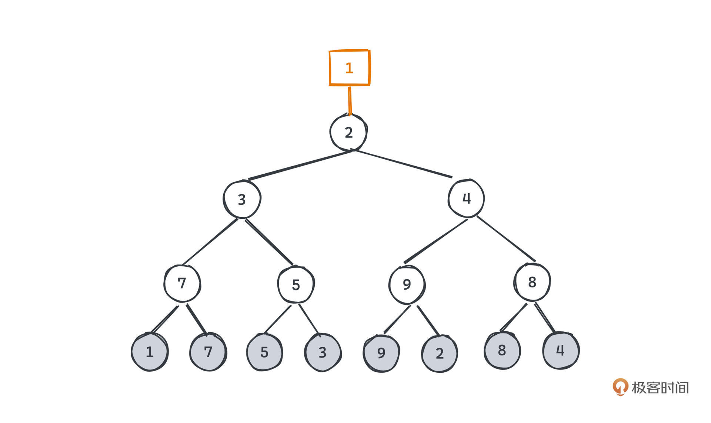
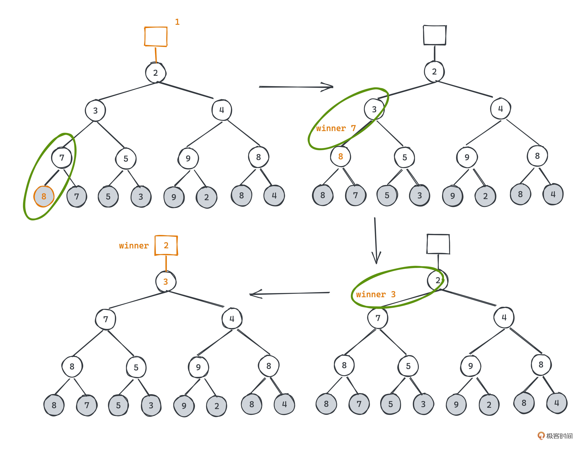

---
date: "2019-06-23"
---  
      
# 08｜外部排序：如何为TB级数据排序？
你好，我是微扰君。

之前已经学习了常用数据结构的工业级实现（包括动态数组、双向链表、双端队列、栈、哈希表、红黑树、堆），从今天开始，我们来讲讲一些经典的算法思想在工程实践中的应用。

那讲哪些算法呢？我们都知道算法是一个很大的命题，也有很多分类的方式，比如就有人总结过非常经典的五类常用算法：贪婪算法、动态规划算法、分治算法、回溯算法以及分支限界算法。力扣上的每一道算法题也有相应标签，你感兴趣的话可以到题库看一下。

不过有些算法可能只会在特定的场景下被特定的中间件所使用，比如布隆过滤器、前缀树等等，我们在后面的章节结合实际的系统或中间件来讲解；有一些算法思想应用更为广泛，我们会在这个部分学习，所以基础算法篇主要包括了贪心、分治、二分的算法思想，也会涵盖排序、搜索、字符串匹配这些更为常见的应用场景。

今天就让我们从经典的排序问题开始讲起吧。

### 排序

排序，应该是我们学习算法和数据结构时最早就会学习到的几个算法问题，按时间复杂度这个标准大体可以分为O\(n\^2\)、 O\(nlogn\) 、O\(n\) 三大类。



O\(n\^2\)的选择排序、冒泡排序、插入排序，这些常用的算法相信你应该非常熟练了；几种O\(n\)的算法在工程中其实也都有实际应用，你也可以自己在网上搜索资料了解学习，最好再找几道相关算法题做一做加深印象。

<!-- [[[read_end]]] -->

O\(nlogn\) 的三个常见算法从概念上看也不难理解，但细节实现起来还是有一些复杂度，需要花点时间刻意练习，是面试中相对重要的算法考点。

其中归并排序和快速排序的常用写法都可以采用递归的方式实现，背后是分治的算法思想，也就是分而治之，把大问题递归拆小然后递归得出结果。

而堆排序的思路和实现，在上一讲优先队列中我们详细讲过，相信你现在应该很容易用Java的PriorityQueue实现堆排序，主要思路其实就是建立一个堆，借助堆动态调整的能力，只需要将所有待排序元素依次入队，再依次出队直到堆元素全部出队为止；比如在小顶堆中，每次出队的都是当前最小的元素。

但只是能写出这样的排序代码，往往并不足以让你解决真实世界的工程问题。

### 举个例子

比如有这样一个基于真实场景的经典面试题：假设现在有1TB的任意文本，请问如何能将其中出现的单词按照字母序排列，得到一个新的文本？

这个问题，你可以回答好吗？

你也许会觉得很简单呀。我们就直接用堆排序，建立一个小顶堆，然后遍历整个文本进行分词，将每个单词都依次push进堆，最后再逐一出队输出到一个文本，最后就可以得到一个按字典序升序排列的文本了。

这当然是一个正确的思路，**但是，你忽略了一个至关重要的问题，就是我们的内存可能没有这么大**！

这也是面试官考察这个问题的核心知识点，1TB的数据量级，意味着绝对不可能一次性将所有的数据都放入到内存中。而大部分单纯考察算法的面试题，其实都是在一个比较理想的环境下的，比如和排序相关的问题，绝大部分题目肯定会给你一个数组去存放需要排序的元素，隐含了内存可以一次性将所有数据读入的条件。

但在实际工作中，我们经常会遇到内存中放不下所有数据的排序场景。

早期可能因为内存的容量确实很小，而现在更多是因为我们需要存储的数据越来越大了，甚至不只是内存放不下，单机的硬盘可能也不够了，需要考虑分布式环境下的排序问题，比如在一个分布式数据库中进行超大表的`order by`操作，这往往需要花费几分钟甚至几小时的运算才能完成。

好言归正传，我们就借助这道经典面试题一起来看看如何解决大量数据的排序问题。

## TB级数据排序

这个经典的算法问题我们一般称之为外部排序，这里的“外”指的其实就是外部存储的意思。

读写较慢的外存，相比快速但昂贵的内存而言，有着更低廉的成本，通常是硬盘，它可以存放更大的数据。**当我们不能直接在内存中进行排序，而需要借助外存去处理极大量数据的排序时，就需要使用外部排序算法了**。

如果遇到这样的面试题，首先可以来向面试官确认一下已有的硬件环境，比如面试官可能会告诉你，你现在有1GB的内存可用。那么我们知道整个1TB的文件，至少要读1024次才能遍历一遍，所以直接在内存里排序显然是不现实的。

但是文件其实是可以一部分一部分读的，如果内存中一次放不下全部的数据，也许我们可以**将文件分成若干段，分别读入内存中，并采用常见的内排序算法（比如堆排序），对这段可以在内存中存储的段落进行排序**；得到若干个有序的文件段后，最后通过一些合并的方式，得到整体有序的文件。

当然在这个过程里会有大量的中间结果，比如那些有序的文件片段，这些我们都需要借助外存存储，这个思路就是最常见的一种外部排序的方式。

其实你会发现我们刚刚描述的想法和归并排序如出一辙，归并排序也是常用的外排实现方式，只不过我们在学习它的时候，一般都是针对数组，也就是在内存中排序的场景。

### 外部排序

好我们用严谨的语言来重新描述一下基于归并思想的外排过程，整体分为两个阶段：

* 部分排序阶段

我们根据内存大小，将待排序的文件拆成多个部分，使得每个部分都是足以存入内存中的。然后选择合适的内排序算法，将多个文件部分排序，并输出到容量可以更大的外存临时文件中，每个临时文件都是有序排列的，我们将其称之为一个“顺段”。

* 归并阶段

我们对前面的多个“顺段”进行合并，思想和归并排序其实是一样的。以2路归并为例，每次都将两个连续的顺段合并成一个更大的顺段。

因为内存限制，每次可能只能读入两个顺段的部分内容，所以我们需要**一部分一部分读入，在内存里将可以确定顺序的部分排列，并输出到外存里的文件中**，不断重复这个过程，直至两个顺段被完整遍历。这样经过多层的归并之后，最终会得到一个完整的顺序文件。

举一个简化的例子，配合示意图理解。


假设现在有含有1000个记录的文件，而内存最多只能读取100个记录。那么我们要做的第一步就是先把1000个记录拆成十个文件，每个文件有100个记录，读入后在内存中排序得到10个有序的临时文件，并输出到外存也就是硬盘中。

然后我们进行多次归并操作，每次都把相邻的文件合并。在这个例子中可以看到只需要进行4轮归并，就得到了一个最终有序的文件。

### 运行时间

那整个过程里，运行时间主要和哪些因素有关呢？

在第一个阶段部分排序中，由于内存可以装下每个顺段的所有元素，所以几种主流的O\(nlogn\)的算法都是可以的，其中快速排序在大部分场景下是最快的，因此我们可以首选快速排序。

比较复杂的是归并阶段。因为内存不足以装下所有需要排序的元素，所以O\(nlogn\)的堆排和快排都已经没办法被应用在外排的场景中了，但基于分治思想的归并排序却依然可以很好地发挥作用。

而且相比很多其他排序方式比如选择排序、冒泡排序，归并排序O\(nlogn\)的复杂度已经是理论上相当好的复杂度了。当然在一些特定场景下我们也可以用一些线性排序算法比如桶排序来解决外部排序问题，感兴趣的同学可以自己搜索了解一下。

但是和内排中的归并排序不同，**外部排序场景下，我们还有个非常大的时间消耗就是IO，也就是输入输出**。

相比内存中的读写操作，在磁盘中的读写是一个慢得多的过程，两者之间可能有千倍以上的时间开销差距。所以考虑外排效率时，非常重要的一点就是我们要尽量减少从磁盘中读取数据的耗时，而这主要关系要访问多少次外存。

那我们在外存中需要读取多少次数据呢？从图中其实可以看出来，每一层我们读取外存的数据总量其实是一样的，本质上就是将所有的数据都遍历一遍。


而内存大小是一样的，所以每一层中读取外存的次数也就是一样的，那么显然关系我们读取次数的多少主要就取决于所需归并的层数了。因此，**我们要做的事情就是让归并的层数越低越好**。

怎么样做到这件事呢？答案很简单也很直观，就是增加更多的归并路数或者降低初始的顺段数量。

### 如何降低归并层数

我们先算出归并层数，以2路归并为例，每次合并两个连续的顺段，如果上一层有n个顺段，到下一层就会有n/2个顺段，每一层的顺段都会减少一半，直至只剩一个顺段，也就是需要的排序结果。因而，假设初始一共有n个顺段，那么我们大致需要log2n层。

同样的道理，如果进行k路归并，每一层的顺段数量都会变成上一层的1/k，所以就大概只需要logk\(n\)层即可完成整个归并。比如一个5路归并的例子。



所以，为了增加归并路数，也就是尽量增加k。

另外为了降低初始n个顺段的数量，我们会做的事情也很简单，就是在第一次进行逐段内排序的时候尽可能多地将数据读入内存中并进行内排。

但是增加k的大小，其实也会导致每次归并的时候合并的成本变大，**一个显著的问题就是在k路归并中，我们需要从k个元素中选择出最小的元素，代价比2路归并的更高**。如果用最暴力的方式，遍历k个元素，每次选择最小的元素的过程将产生O\(k\)的时间复杂度，这一定程度上会抵消前面通过增加k减少磁盘IO所带来的时间提升。

但是我们仔细想想这个问题，选择k个元素中的最小元素，显然有优于暴力遍历O\(k\)复杂度的算法。比如，上一讲介绍的堆就可以解决这个问题。

而败者树，则是解决从k个元素中选取最小元素并可以动态更新的另一种方法，也是更广泛运用于多路归并中的算法，我们来学习一下它的思路。

## 败者树

败者树也被称为，淘汰赛树，也就是Tournament Tree，思想来自体育比赛。

我们知道在淘汰赛中，每一场比赛都有两个参与者，其中胜者可以晋级下一轮。整体可以画成一颗树的形状，如果看过足球比赛，相信你对这个图一点也不陌生。



败者树算法就是基于这一思想实现的，我们用叶子节点存储所有待比较的元素，**对叶子结点两两比赛，在它们共同的父节点中存储失败者；然后对获胜者节点再两两比较，得到更上一层的败者，取出胜者继续往上比较**，这个过程和归并的思路其实也是比较相似的；这样一层一层往上比较，最后就可以得到一颗锦标赛状的树。

因为除了叶子结点外的每一层的父节点存储的都是其子节点中的失败者，所以我们称其为败者树。根节点我们会稍微做一点特别的处理，除了在根结点存储失败者，同时，我们在根节点之上会悬挂上整棵树的最终获胜者。

我们可以给刚刚的例子画出对应的败者树，大概就是下面这个图的样子。其中根节点上的方框存储的就是整个树的胜者，也就是1，它一定是所有元素中的最小值，和锦标赛的冠军是一个意思。



至于为什么在节点中存储的是失败者，而不是获胜者呢？就留给你做课后思考题啦。事实上，在父节点中存储获胜者的树也是存在的，和你想的一样，我们也称之为胜者树。

和堆一样，我们也会需要对败者树进行类似于出队的操作；在上面的例子中，就是我们需要将1从败者树中取出，寻找下一个最小的元素。

这里有两种情况，一种是我们取出1之后，用一个新的元素替代1，另一种就是取出1之后不再添加新的元素，分别对应某一路元素被取出之后仍有元素未取完，和该路元素已经全部取出的情况。在这两种情况中，我们其实都只需要对整个树重新比赛一次即可，只是在第二种情况里，我们会用一个无限大的数字替换1，因为无限大的数字一定不会在这次重赛中胜出。

我们用一个具体的例子来讲解一下这个过程，假设取出1之后，我们用8来替换1原来的位置。  
  
由于每个父节点存储的都是两个子节点中的失败者，所以我们只要用更新的值和父节点的值比较，也就是和之前两个子节点中的失败者比较。

因为原来的获胜者已经被取走了，这里的父节点现在存储的其实就是这颗子树中原来的亚军，**如果我们要看这次新来的选手能否能成为新的冠军，只需要和原来的亚军进行一次比较即可**；当然这次比较结束后，两者中的胜者还需要到更上一层继续比较。

这个过程和运动员从市队、省队一路选拔到国家队参加奥运会的过程也是颇为神似的，希望这个例子能帮助你更好地理解败者树的工作机制。

整个过程写成伪代码如下：

```
    // 定义节点的value为具体的值；index为每一路数据的索引
    // 用index.next可以取到每一路某个元素的后继元素。
    
    function merge(L1, …, Ln)
        buildTree(heads of L1, …, Ln)
        while tree has elements
            winner := tree.winner
            output winner.value
            new := winner.index.next
            replayGames(winner, new) // Replacement selection
    
    function replayGames(node, new)
        loser, winner := playGame(node, new) // 比较新节点和老节点的大小
        node.value := loser.value // 当前节点记录为比较中失败的节点
        node.index := loser.index
        if node != root
            replayGames(node.parent, winner) // 胜者跟父节点继续比较
     
    function buildTree(elements)
        nextLayer := new Array()
        while elements not empty // 自下而上而上建树
            el1 := elements.take()
            el2 := elements.take()
            loser, winner := playGame(el1, el2) // 两两比较
            parent := new Node(el1, el2, loser) 
            nextLayer.add(parent) // 将获胜者放入上一层 继续
        if nextLayer.size == 1 // 只有根节点 直接返回即可
            return nextLayer 
        else
            return buildTree(nextLayer)
    

```

### 时间复杂度

最后我们来分析一下败者树的整体时间复杂度，我们假设一共有k个节点。首先，初始化的过程需要花费 O\(k\) 的时间，因为对于k个子节点，一共只需要进行k-1场比赛即可完成淘汰赛。

然后在归并排序的每一次合并中，只需要进行replay操作，从新元素到根路径上逐一重赛。在每一层中，只需要进行一次比较。由于树是平衡的，从叶子结点到根路径仅包含 O\(logk\) 元素（这里高度的计算和之前讲解堆的推导是差不多的，你可以复习之前的章节）。所以，总的时间复杂度为 O\(klog k\) 。

现在有了败者树的加持，多路归并排序就可以比较高效地解决外部排序的问题了。对于1TB任意文本的排序问题，大致思路就是：

1.  先用内排序算法，尽可能多的加载源文件，将其变成n个有序顺段。
2.  在内存有限的前提下每k个文件为一组，**每次流式地从各个文件中读取一个单词，借助败者树选出字典序最低的一个，输出到文件中**，这样就可以将k个顺段合并到一个顺段中了；反复执行这样的操作，直至所有顺段被归并到同一个顺段。

这里稍微补充一下，看起来我们每次从文件中只读取了一个单词，但操作系统在读文件的时候是会按页为单位读取并缓存下来的，所以某一次磁盘访问之后的若干次访问，其实都会直接命中cache，也就是说，并不是每次从败者树中取出元素时都会真的产生磁盘IO，请不用担心。

当然在工业级实现中肯定还是有很多优化空间的。比如待合并的文件比较大的时候，我们可以利用二分搜索对文件进行分段，并行地合并，相关研究也比较多，感兴趣你可以自行搜索了解。

## 总结

随着互联网的发展，数据量一直在稳步的提升，许多算法问题都不能只简单地考虑内存中可以存储，甚至单机磁盘可以存储的情况了。相信我们今天学习的外排算法思想，一定会给你一些解决此类问题的启发，希望你可以举一反三在实际生产中也能将算法更好地运用在有各种限制的真实环境中。

借鉴内排中归并排序的想法，我们可以实现一个多路归并的外排算法，解决内存空间不足的问题。但也因为涉及外部存储，需要重点考虑IO的成本。通过尽可能多地利用内存中的排序，得到尽量少的初始顺段，以及选择合适的多路归并参数，我们就可以做到外存访问次数尽量少了。

多路归并，可以通过堆或者败者树实现，这里我也给你贴一道力扣上的[算法题](https://leetcode-cn.com/problems/merge-k-sorted-lists)供你练习。

### 课后作业

最后留两个思考题。

1.  既然，我们已经有了堆，为什么还要用败者树这样的数据结构呢？还有前面提到的胜者树，它不是一个更直观的表示方式吗？所以相比堆和胜者树，败者树在解决求多个元素中最小元素的问题时，又有什么样的优势呢？
2.  除了基于O\(n\*logn\)的归并排序的思想，有没有可能基于线性排列的几种算法来实现外部排序呢？

欢迎你留言与我讨论。如果有收获也欢迎你转发给身边的朋友，邀他一起学习。我们下节课见～