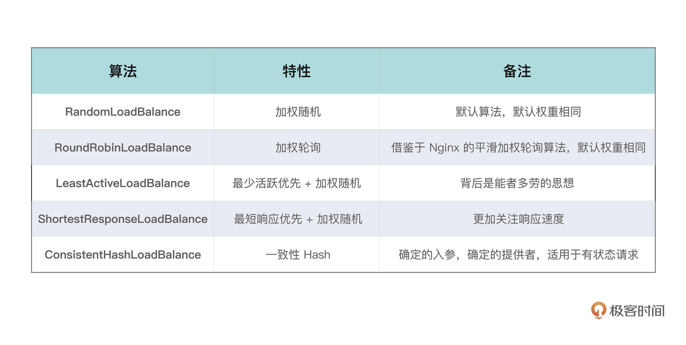
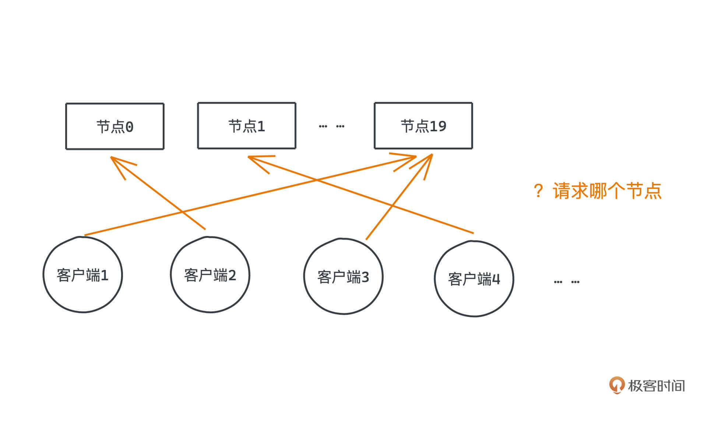
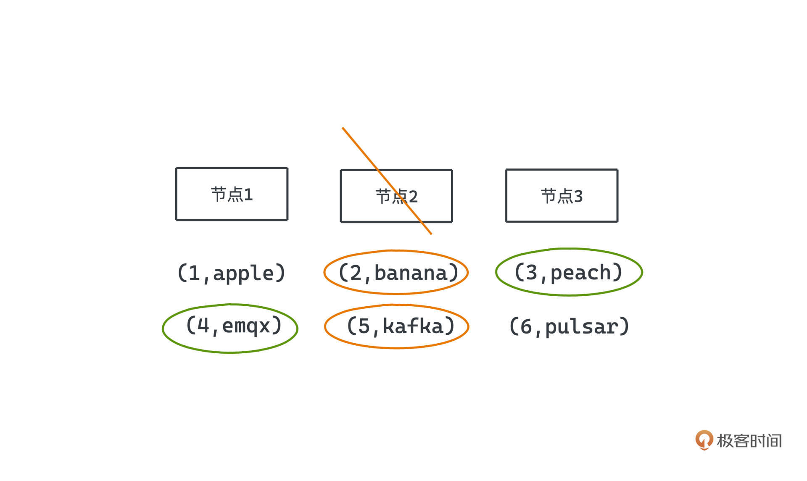
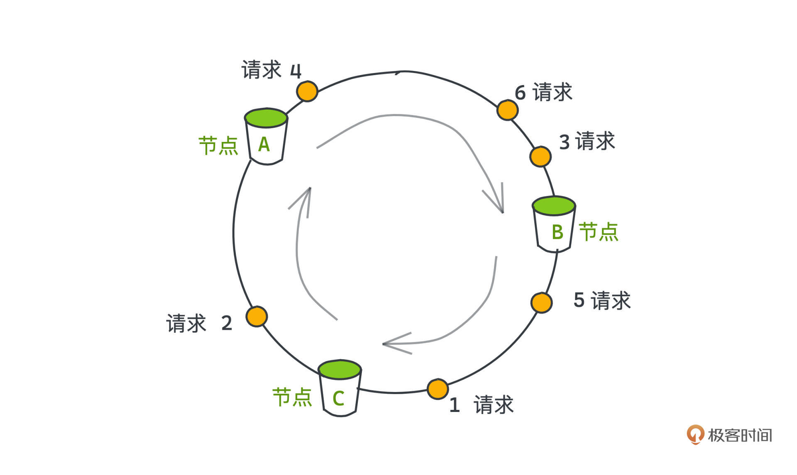
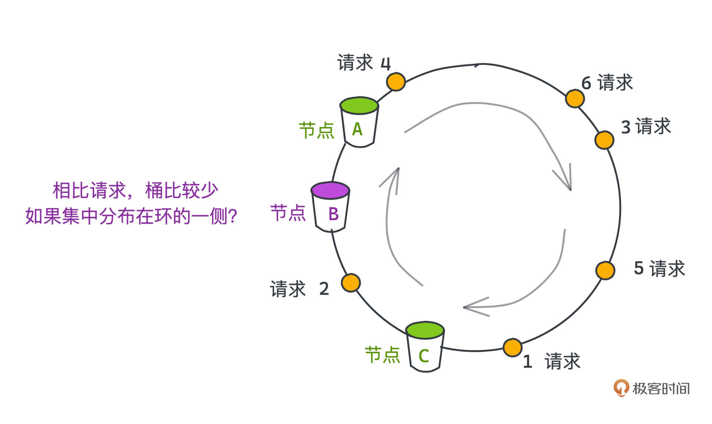
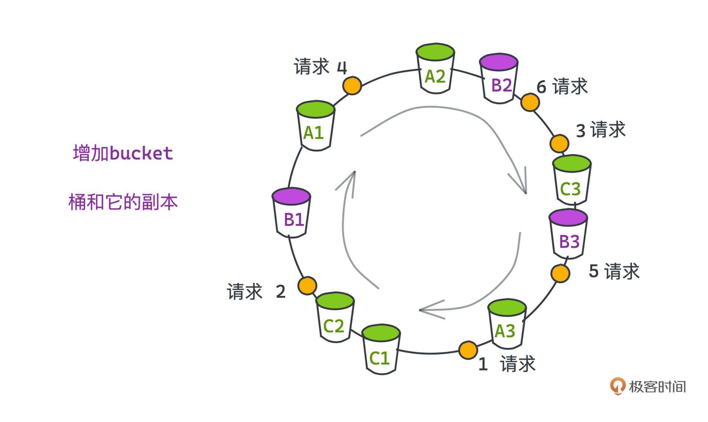

---
date: "2019-06-23"
---  
      
# 25｜一致性哈希：如何在集群上合理分配流量？
你好，我是微扰君。

上一讲我们学习了在分布式系统中，生成全局唯一ID的两种方式，既可以通过引入独立组件远程调用申请ID，也可以通过约定的方式让各个节点独立生成唯一ID。

那对于有多个节点的服务，其他服务或者客户端在访问这个服务的时候，具体应该访问哪一个节点呢？

## 负载均衡问题

大部分情况下，我们都希望集群在分配流量时，能够比较均衡或者按照某种预期的权重比例，这样每个机器都可以得到比较充分的使用，也不容易出现单点服务过载的情况，能够发挥集群的最大价值。

如何分配流量的问题，也通常被称为负载均衡问题，根据不同的业务需要，解决的方式也很多。

比如最直接的，我们可以引入一个中间的负载均衡层，集中记录收到的请求序号；然后按照Round-Robin的轮询方式，轮流将外界的请求转发给内部的服务集群，或者直接用随机转发的方式也可以。当然你也可以引入权重，让这两种算法对流量的分配不是均匀的，而是按照一定比重分配在不同的机器上。这两种算法也被称为**加权轮询和加权随机**。

其实，不止可以通过引入中间层实现，如果整个系统完全可信、可控，你也可以让客户端自己按照随机或轮询的策略，直接调用需要负载均衡的服务，同样可以达到负载均衡的效果。

<!-- [[[read_end]]] -->

除了加权轮询、加权随机，负载均衡算法还有许多。这里我们可以看下 [Dubbo 官方中文文档](https://dubbo.apache.org/zh/docs/advanced/loadbalance)中的列出的算法，Dubbo作为一款知名的RPC服务框架，是典型的分布式应用，自然需要支持集群负载均衡，以保证请求可以正确地发送到Dubbo实例上。

一共支持了5种负载均衡算法，提供的都是客户端负载均衡。这里就不一一讲解了，第三、第四种主要是通过在客户端记录服务集群中不同实例的请求响应情况，以此为依据来判断哪台服务器更适合访问。



**这些策略比较简单，但都有比较大的共性问题，无法应对带有状态的请求或服务**。这时候就需要我们的一致性哈希算法登场了。

## 有状态的请求

先来了解一下，什么样的请求或者服务是带有状态的呢？

比如一个分布式KV缓存系统，为了提高整个系统的容量，我们往往会把数据水平切分到不同的节点来存储，当然为了提供更好的系统可用性，在部分不同节点上存储时，我们会让数据产生一定的冗余。**对于这样的系统，某个key应该到哪个或者哪些节点上获得，应该是确定的，不是说任意访问一个节点都可以得到缓存结果的。这样的服务，我们就可以认为是有状态的**。

再比如，假设某个请求，需要在某个节点上进行一系列连续操作才能完成，也就是构成了一个流程，或者想进行某个操作，会受到在被请求的节点之前请求的影响，在这种的情况下，请求也是有状态的。

在本地，服务器一定会存储和这次请求相关的上下文，这样下次同一个客户端或者会话内发生的请求，就仍然需要打到这台特定的服务器上，才能保证整个服务正常的工作。

这两个例子可能还是有点抽象不太好理解，我们看一个工作中实际的例子。

之前我维护过一个长连接网关，一般主要就是用来做消息推送。某个设备连接到我们的服务器上时，服务器就会去存储里，拉取该设备需要收到的消息进行推送。一个类似场景就是QQ登陆时会去服务端拉取消息。所以拉取消息的请求就是一个有状态的请求。

由于需要推送的消息比较多，服务器会以流的形式推送，也会需要随时保留服务器推送消息的位置。一个比较合理的设计就是，

* **当连接失败，客户端准备重连的时候，一定需要连接到之前连过的服务器**，因为只有这台服务器才保留了之前推送消息的位置，可以从之前断连的位置继续推送消息；
* 如果连接到其他没有保留这样上下文信息的服务器中，唯一能做的就是直接再去存储里拉一下要推送的全部消息，但是这样肯定就包含了之前已推送到一半的消息了。

这个时候我们可以想一想，**如果负载均衡采用的是随机或者轮询策略，客户端下次请求的时候，大概率就不会再打到上一次请求的节点了**，所以，面对许多有状态的服务和请求，这是有很大问题的。那我们如何解决这种情况下的负载均衡呢？

### 方案一

可能你首先想到的方案是，我们直接在负载均衡服务器上记录一下，每个会话或者客户端上次请求到的服务器是哪一台不就好了，这样如果我们发现这个客户端之前已经有访问记录，那下次还继续打到上一次的机器，不是就可以了？

这个思路当然是理论可行的，但这会对负载均衡系统本身带来巨大的开销。

还记得我们为什么要引入复杂的分布式系统吗？就是因为请求和访问数量太高了，而在负载均衡系统里，**如果记录每个请求或者参数对应应该访问哪个机器，这就在负载均衡层引入了状态，本身就是另一个需要负载均衡的应用了**。所以即使得以实现，付出的性能开销和代价也是不可接受的。

那怎么做呢？重新思考一下本质想要的目标，我们无非就是希望某些访问的参数或者客户端，在请求的时候，都能指向指定的机器，并且也能起到均衡的效果，那说到这里，不知道你有没有想到我们之前讲过的哈希表也就是散列表呢？我们来看看是否可行。

### 方案二哈希算法

假设一个集群有20个可以对外服务的节点，有很多的客户端同时在请求这些服务，我们希望每次从同一个客户端访问的请求，下次再请求集群的时候，也能打到和这次一样的节点上。**这不就类似散列表的需求嘛：对任意key映射到一段连续数组空间，且同一个key每次映射都会映射到数组的同一个位置**。

我们就还是用长连网关举例子。

在业务场景中，每个不同的客户端都会有不同的client-ID作为唯一客户端标识，有没有想到上一节课学的UUID，其实差不多就是这样的东西。在有很多同时请求的客户端时，我们可以认为，正在请求的所有客户端ID，在整个UUID的空间里是均匀分布的。

把集群里的20个节点连续标号为0～19，想要让每个节点接受差不多的流量，并保证每个相同的客户端在不同的时候都会请求到同一个节点，我们就只需要把clientID哈希到空间为20以内的数字，根据这个数字请求对应标号的节点就可以了。最简单的做法就是进行取MOD运算。



这样的话，无论采用客户端的负载均衡算法，还是添加一层负载均衡层，我们都只需要告知客户端或者负载均衡服务，现在可用的服务器是哪些，再根据计算而非存储的方式分配流量，既避免了状态的产生，又能完美地解决负载均衡问题。

但是，分布式系统当然没有这么简单了。一旦引入了分布式，我们首先没有办法保证所有节点都能一直正常工作，其次也要考虑可能会经常扩容的情况。还记得哈希表怎么处理扩容的吗，需要申请两倍的空间，然后把原始数据全部重新哈希再次分配。但是如果在分布式的环境中用这个方案，会带来很大的麻烦。

## 节点数量变化问题

我们来看一看，对于负载均衡背后的系统来说，节点数量变化会导致什么样的问题呢？

用一个简化的分布式缓存系统来举例，一共有3个节点，每个节点存储一系列 \(key, value\) 对，假设我们一开始存储了6个KV pair，由于key分布均匀，取MOD的哈希算法也均匀，它们被均匀地分配在了三个节点上。



此时，如果2节点突然异常需要下线，整个系统只剩1、3两个节点，我们就需要和JDK的HashMap一样，做重哈希的工作，这次就需要对所有的key进行MOD2而不是MOD3的操作了。

你会发现，除了需要把2节点的数据搬移到1、3节点上，**为了满足MOD2的条件，还需要移动1和3中本来正常存储可以对外提供服务的两个KV对**，也就是\(4,emqx\)和\(3,peach\)。

更重要的是，分布式应用，数据存储量比单机更大，节点之间的数据拷贝复制需要经过不可靠的网络，不止时延会高，也可能会需要更多次的重传，因此这样大量不必要数据的搬迁，我们是一定要想办法避免的。

而且工业的分布式缓存系统，其实一般不会真的进行数据的搬移，因为需要一直对外提供服务，这个时候一旦大量的请求和存储数据节点失配，会导致同一时间大部分缓存值失效，转而请求源数据，这就会导致被缓存的服务比如数据库，请求激增，出现宕机等情况。这也被称为缓存雪崩。

所以理论上来说，如果某些节点挂了，我们应该尽量保持其他节点上的数据不要移动，这样就不会出现大量缓存数据失效的情况了。有没有办法做到呢？

## 一致性哈希

一致性哈希就很好地解决了这个问题。

最常见的一致性哈希算法同样会采用哈希的思想，但是会把请求，按照标识，比如请求的某些参数、客户端ID、会话ID等等，映射到一个很大的数字空间里，比如2\^32次方，让它们自然溢出，2\^32 在这样的空间里就会被表示为0，于是整个空间可以看成一个首尾相接的数字环，我们称为项（item）。

而一个个节点，也会按照标识，比如机器IP或者编号等等，映射到这个环上，我们称为桶（bucket）。整个环看起来就像这样：



这里的A、B、C节点就是三个桶，在负载均衡场景下也就是服务器；而1、2、3、4、5、6则是项，可以是一个个不同标识的请求。

看这个环的图，我们如何决定哪个请求应该被分配到哪个服务器上呢？

现在就很简单了，找到每个请求在环上的位置之后，按照某个方向，比如数字增大的方向，找到和当前请求最近的桶，桶所对应的值就是我们一次性哈希的位置，在负载均衡下也就是对应的服务器了。

有可能你有疑问了，这样的策略可以保证负载真的是均衡的吗？ 假设出现这个情况，A、B、C三个桶集中分布在环的一侧，而请求在环上相对均匀分布，因为我们是按照某个方向寻找最近的，就发现绝大部分请求都被分配到了C节点上，而A节点一个请求都没有。



一致性哈希的作者当然想到了这个问题，解决办法也非常巧妙。既然负载均衡的节点不是那么多，容易出现分配不均匀的情况，我们给这些bucket增加一些副本不就好了，数量比较多的话会更均匀。

一种简单好用的策略就是在某个bucket用于哈希的标识之后，拼接上一些字母或者数字，把它们也映射到环上，当作自己的副本，只要item在环上顺次找到了副本中的一个，也都认为指向的是对应的bucket。



这样，桶和副本在环上就不太容易出现集中在一侧的情况了。而且在业务中，请求数量比较大，在用于Hash的key或者ID生成合理的前提下，分布应该天然就是比较均匀的。

### 实现

现在有了思路，动手实现是非常简单的。我之前换工作准备从前端转基础架构的时候，写了一个玩具的分布式缓存，就用到了一致性哈希。这里我简单说明一下相关的代码逻辑，里面耦合了部分和存储相关的逻辑。如果感兴趣，你也可以直接到我的[GitHub](https://github.com/wfnuser/burrow)上了解这个项目，能很好地帮助你练习LRU。

```
        package consistent
    	
    	import (
    		"hash/crc32"
    		"sort"
    	)
    	
    	// 哈希环 用于存放节点和副本以及需要存储的key
    	type HashRing struct {
    		nodes      map[uint32]string
    		replicates int
    		keys       []uint32
    	}
    	
    	// 初始化哈希环 需要传入创建的副本数量
    	func New(replicates int) *HashRing {
    		hashRing := &HashRing{
    			replicates: replicates,
    			nodes:      make(map[uint32]string),
    		}
    	
    		return hashRing
    	}
    	
    	// 在哈希环上添加节点 需要传入节点名称
        // 根据副本数，在节点名称后添加数字后缀后进行哈希计算，并放置节点
    	func (hashRing *HashRing) Add(key string) {
    		for i := 0; i < hashRing.replicates; i++ {
    			hash := crc32.ChecksumIEEE([]byte(key + "-" + string(i)))
    			hashRing.keys = append(hashRing.keys, hash)
    			hashRing.nodes[hash] = key
    		}
            // 为了方便查找节点；我们需要将环上节点进行排序
    		sort.Slice(hashRing.keys, func(i, j int) bool { return hashRing.keys[i] < hashRing.keys[j] })
    	}
    	
    	// 基于key在环上二分查找最近的节点
    	func (hashRing *HashRing) Get(key string) string {
    		hash := crc32.ChecksumIEEE([]byte(key))
    		idx := sort.Search(len(hashRing.keys), func(i int) bool { return hashRing.keys[i] >= hash })
    		if idx == len(hashRing.keys) {
    			idx = 0
    		}
    	
    		return hashRing.nodes[hashRing.keys[idx]]
    	}
    

```

可以看到，利用Golang内置的数据结构和方法，代码不超过50行，就非常好地解决了这个问题。而且在工作中我也实际用到过这个算法，很值得你手写练习一下。

## 总结

我们今天学习了负载均衡的问题和常用的策略。

对于有多个节点的服务，其他服务或者客户端在访问这个服务的时候，我们希望能够比较均衡地分配流量，发挥集群的最大价值，也不容易出现单点服务过载。最直接的思路就是轮询和随机分配。

但在请求和服务有状态的时候，简单基于轮询和随机的策略就失效了，这个时候我们就需要想办法把有状态的请求稳定的指向同一台机器，保证上下文的连续性，当然，同时也需要能起到均衡的效果。

这个时候，我们可以采用一致性哈希算法，利用请求标识，比如请求的参数或者客户端ID等等，把请求稳定的分配到同一台节点，保持上下文的连续性；而相比于直接进行哈希的方式，把请求和节点都映射到同一个哈希环，并顺次寻找最近的节点，可以让我们尽可能少的减少不必要的重哈希，只是把失效节点所负责的请求，较为平均地分配到其他节点之上。

### 课后作业

实现一致性哈希的代码并不困难，你可以自己动手实践一下，有什么问题，欢迎你在评论区留言和我一起讨论。

如果你觉得这篇文章对你有帮助的话，也欢迎转发给你的朋友一起学习。我们下节课见～