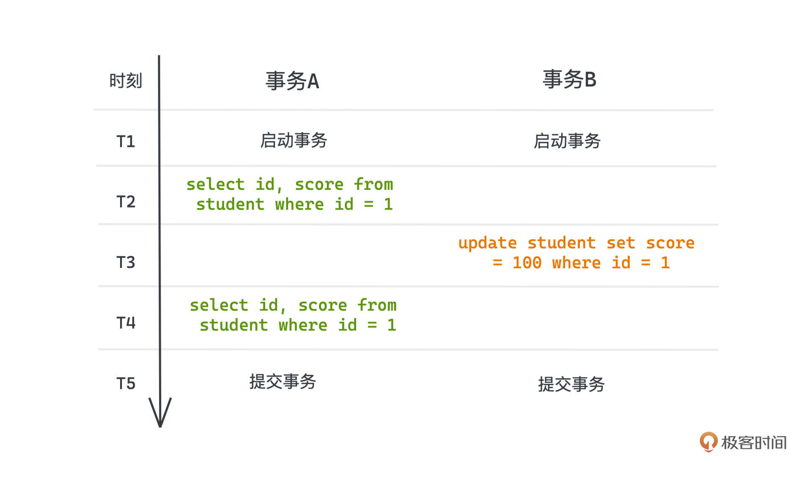
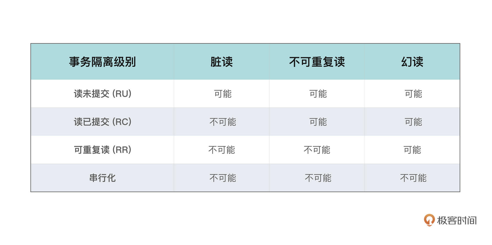
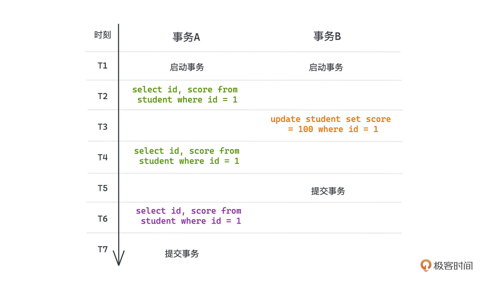
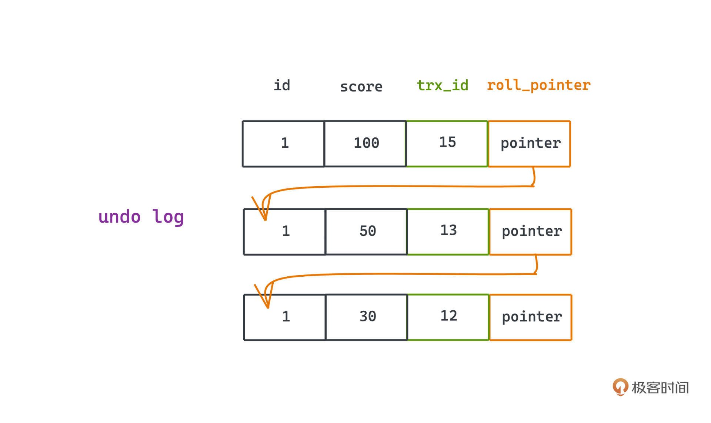
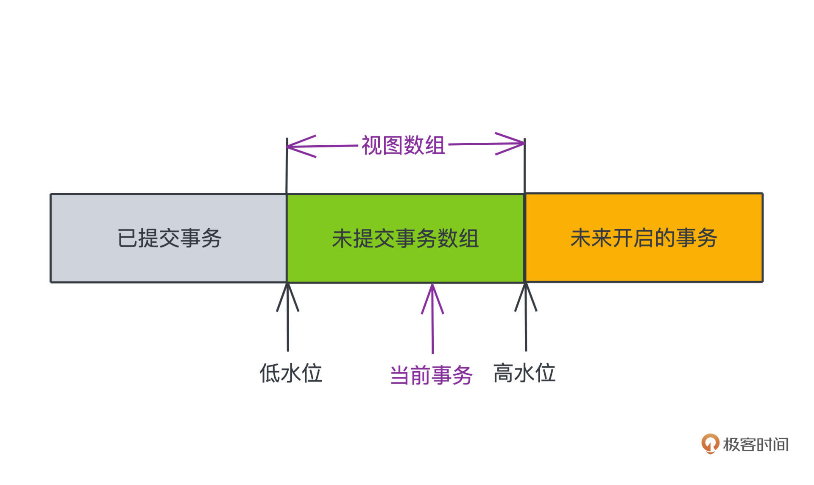
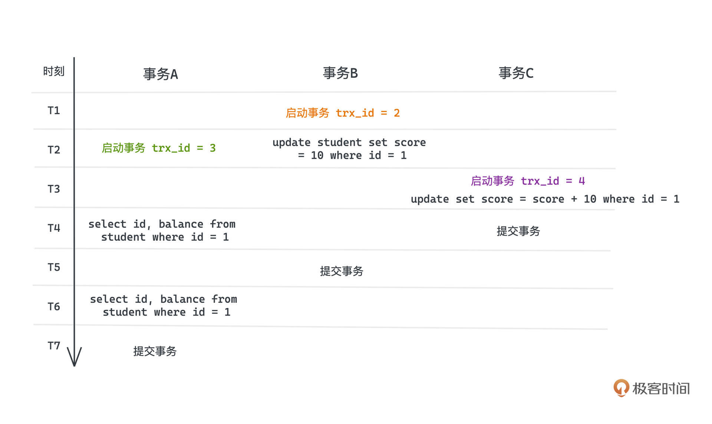

---
date: "2019-06-23"
---  
      
# 28｜MVCC：如何突破数据库并发读写性能瓶颈？
你好，我是微扰君。

过去两讲，我们学习了数据库中查询优化的一个重要手段——索引，通过空间换时间的思想，从数据结构查询本身的时间复杂度和IO开销两个角度，去提高查询的速度。除此之外，查询能做的优化其实还有很多，比如同样的语句在采用不同查询计划的情况下，查询效率可能也是差距很大的。

今天我们就从业务开发非常常见的一个角度，并发，来聊一聊数据库可能的性能优化。首先来看并发场景下，我们在数据库中会碰到什么样的问题。

## 为什么需要事务

我们知道，主流的关系型数据库都能做到在高并发的场景下支持事务，比如MySQL的InnoDB引擎就支持事务，从而取代了并不支持事务的MyISAM引擎。但为了保证事务性，其实需要付出一定的性能代价。那事务是什么，我们来简单复习一下。

简单来说，**事务就是指一系列操作，这些操作要么全部执行成功并提交，要么有一个失败然后全部回滚像什么都没发生一样**，绝对不会存在中间有一部分操作得以执行，一部分没有执行。

为什么数据库中需要事务呢，一个非常经典的例子就是银行转账，比如说我们需要从A账户给B账户转200元。整个过程要分为两个步骤，分别是：对A的账户余额减去200、对B的账户余额加上200，如果这两个操作一个成功一个失败，显然会导致业务数据完整性出现问题。

<!-- [[[read_end]]] -->

**为了保证数据完整性，我们就需要让事务支持原子性**。这也是我们通常说的事务需要支持的ACID（原子性、一致性、隔离性和持久性）的特性之一，相信大部分研发同学都听说过，网上对这些性质的讨论有很多，这里就不逐一展开了，我们接下来重点讨论隔离性。

## 隔离性

数据库通常是并发访问的，也就是说我们很可能会同时执行多个事务，而一个事务又会包含多个读写操作，当两个事务同时进行，并对数据库中同一条数据进行了读写，会发生什么呢？如果有冲突了要怎么办呢？

在很多业务场景中，我们都碰到过这种情况，也非常常见。看学生数据表的例子，我们会反复修正学生最近考试的成绩。假设id=1的学生，成绩一开始是50，现在有两个事务A、B，分别执行语句：



我们先花一分钟思考一下，在熟悉的数据库中，事务A在T2和T4两次查询的结果是多少呢？

其实在不同的事务隔离等级下，我们会有不同的结果。比如有一种可能性是，T2事务A查询的结果是50，T4查询的结果是100，这样的查询结果在很多业务场景下是会产生问题的，我们一般称为脏读问题，也就是在事务开始时，读到了尚未提交的其他并发事务对数据的修改值。

**为什么我们称为脏值，主要因为这个值是可能会回滚的**，比如如果B事务失败了，100这个值并没有真的被写入成功，会被撤销掉，但是我们竟然在A事务里看到了，这种情况我们称为脏，很好理解。

除脏读，数据库中常见的“有问题的”查询结果还有2种情况：不可重复读、幻读。

* 不可重复读，是指在事务的过程中对同一个数据，读到了两次不同的值，即使别的事务在当前事务的生命周期里对该数据做了修改。
* 幻读，在事务的过程里读取符合某个查询条件的数据，第一次没有读到某个记录，而第二次读竟然读到了这个记录，像发生了幻觉一样，这也是它被称为幻读的原因。

因为存在这三种问题，脏读、不可重复读、幻读，业务很可能会产生错误，所以我们就需要**根据不同的业务场景，提供不同的事务隔离等级，你可以理解成某个事务对其他事务修改数据结果的可见性情况**。

## 事务隔离等级

SQL标准定义了四种不同的事务隔离等级的，相信你也一定有所听闻，按照隔离级别由弱到强，分为：读未提交、读已提交、可重复读和串行化。



许多数据库是允许我们设置事务隔离级别的。比如在采用InnoDB为引擎的MySQL中，默认采用的就是可重复读的事务隔离级别。

在这个隔离级别下，可以从表格里看出来，不会出现脏读和不可重复读的情况，幻读可能发生。不过在InnoDB中，幻读这个情况有点特殊，不一定会发生，我们稍后讲MVCC机制的时候再聊。

现在既然有不同的隔离等级，我们当然要想办法实现它们。

### 如何实现不同的隔离等级

首先看两个极端情况：串行化、读未提交。

**最高等级的串行化，比较好理解，既然问题来自于事务的并发，我们就让它们不要并发**，如果涉及同一表的读写，我们就加锁，读的时候用共享锁，写的时候用排他锁。这样，幻读问题自然也不复存在了，但这样完全的串行执行，让我们失去了并发的优势，性能不太好，其实不是很常见。

**那最低等级的读未提交，也很好懂，它是性能最好的，策略就是不做任何处理。事务中所有的写都立刻作用到表中，并且对所有其他正在执行中的事务可见**，自然会产生脏读问题。在前面学生成绩的例子里，T4时刻A事务读到id=1的学生的分数就已经被更新成了100，即使B事务的修改尚未提交。这种事务的隔离等级，在我们的实际开发中也是非常少见的。

中间的两个等级，读已提交、可重复读，同时兼顾了性能和隔离性，也是许多主流数据库的首选之一，Oracle的默认隔离等级就是读已提交。

对于读已提交而言，主要要避免的就是读到尚未提交的数据，也就是脏值。我们把例子修改一下看看在这个等级下会发生什么，A事务一共会进行3次读数据：



在读提交的隔离等级下，T2还是读到50，这次在T4的时候我们不再会读到脏值100，但在T5事务B已经提交的时候，T6再去读同一个记录，会读到事务B提交之后更新的值100。这个时候，在同一个事务里，两次读到的数据就出现了不一致的情况，也就是仍然会出现不可重复读，但已经不会出现脏读的情况了。

读提交如何实现呢？

一种比较悲观的方式还是通过加锁，每次读数据的时候，对该行加共享锁，读完立刻释放，每次写数据的时候对该行加排他锁，直到事务提交才释放。

比如在上面的例子中，T4的读会被阻塞，直到T5完成之后才会读取，此时如果事务B回滚了，我们在T4进行的记录读到的就仍然是50，如果事务B成功提交，则读到的值是100。虽然与T2读到的内容不同，但至少读到的数据不再是脏的了，它满足了读已提交的语意约束。

当然也有比较乐观的方式，也就和接下来要讲的MVCC相关了。所以接下来我们一起来看看InnoDB是如何利用MVCC机制，来实现数据库的可重复读的隔离等级。

## 利用MVCC实现可重复读

MVCC，全称 Multi-Version Concurrency Control，多版本并发控制，最大的作用是帮助我们实现可重复读的同时，避免了读的时候加锁，只有在写的时候才进行加锁，从而提高了系统的性能。核心是通过引入版本或者视图来实现的，这是一个非常巧妙的设计，在业务开发中很有用的，希望你可以好好体会。

我们首先要看几个基本概念：事务ID、隐藏列、undo log、快照读、当前读。

* 事务ID

**我们想要维护不同事务之间的可见性，首先当然要给事务一个标识，也就是事务ID**，它是一个自增的序列号，每个事务开始前就会申请一个这样的ID，更大的事务ID一定更晚开始，但不一定更晚结束。

那有了事务ID，在InnoDB中就是trx\_id，我们就可以开始为数据维护不同的版本了。

* 隐藏列

想要维护不同的版本，数据表的每一行中除了我们定义的列之外，还有需要至少包括trx\_id、roll\_pointer，也就是隐藏列。

**每一行数据中的trx\_id，代表该行数据是在哪个trx\_id中被修改的**，这样在每个事务中看访问到表中的数据时，我们就可以对比是在当前事务之前的事务里被修改的，还是在之后的事务里被修改的。

但只有这个信息是没有用的，毕竟如果我们想要让并发时，一些尚未结束的事务的修改，对当前事务不可见，还得知道在此之前这个数据是什么样的吧？**这就是roll\_pointer的作用了，它指向的更早之前的数据记录，也就是一个指针，指向更早的记录值**。

记录值具体是怎么维护的呢？就要提到 undo log 了。

* undo Log

undo log，也就是回滚日志，不知道你有没有一点耳熟，还记得我们之前提到的 redo log 吗？和 redo log 的预写（用来在宕机未持久化的时候恢复数据的机制）正好相反，undo log 记录了事务开始前的状态，用于事务失败时回滚。不过undo log和 redo log 可以说是一体两面了，都用于处理事务相关的问题。

除了用于恢复事务，undo log 的另一大作用就是用于实现MVCC，**我们的 roll\_pointer 指向的其实就是undo log的记录**。



你可以看到，由于 roll\_pointer 的存在，整个数据库中的每行数据，背后都可能有不止一条数据，每个transaction的修改都会在表中留下痕迹，而它们**通过 roll\_pointer 形成了一个类似于单向链表的数据结构，我们称为版本链**。所以每次新插入一条数据，除了插入数据本身和申请事务ID，我们也要记得把pointer指向此前数据的undo\_log。

MVCC 就是在这样的版本链上，通过事务ID和链上不同版本的对比，找到一个合适的可见版本的。快照读就是MVCC发挥作用的方式。

* 快照读和当前读

**在 select 数据的时候，我们会按照一定的规则，而不一定会读出表中最新的数据，有可能从版本链中选择一个合适的版本读出来，就像一个快照一样，我们称为快照读**。

在 InnoDB 中，默认的、可重复读的事务隔离等级下，使用的select都是快照读：

```
    select * from student where id < 10
    

```

而当前读，读的就是记录的最新值，在InnoDB下我们会进行显示的加锁操作，比如`for update` ：

```
    select * from student where id < 10 for update
    

```

所以如果本质上严格遵循MVCC的要求，幻读是不会发生的，但是InnoDB里的读分为快照度和当前读两种。如果你对MySQL中的 `for update` 原语有印象就会知道，在select的时候如果没有加 `for update` 的话，就不会发生幻读的现象，反之则会有幻读的现象。

## 读视图

现在在可重复读的隔离性下，MVCC是如何工作的呢？

核心的可见性保证来自于读视图的建立，本质就是每个事务开始前，会记录下当前仍在活跃也就是开始但未提交的所有事务，保存在一个数组中，我们称为视图数组，然后会根据这个数组，基于一定的规则判断应该读取每个数据的哪个快照。

来配合这张示意图看规则是什么：



首先，我们会记录视图数组中最小的事务ID和最大的事务ID+1，分别称为低水位和高水位。

这两个ID其实就可以从当前执行的事务的视角，将所有的事务分为三个部分，小于低水位的部分一定是当前事务开始前就提交了的部分，大于等于高水位的则一定是还未提交的事务，我们一定不可见。

处于中间的部分就要分类讨论了：

* 如果在视图数组中，说明当前事务开始时，这些事务仍在活跃，所以应该是不可见的；
* 如果不在数组中，说明在仍活跃着的事务范围内，但其中有一些事务虽然不是开始最早的，但是结束的却比活跃数组中的事务早，以至于当前事务开始时，这些事务已经结束，所以也应该是不可见的。

简单总结一下，如果我们记录低水位为low\_id，高水位为high\_id，活跃事务数组为trx\_list。可见的trx\_id就需要满足 trx\_id \< low\_id 或者 trx\_id \< high\_id 且 \!trx\_list.contains\(trx\_id\) 的条件，也就是**要么比低水位更早，要么比高水位的id小但是不能出现在活跃事物数组中**。

那读视图的规则其实就是根据可见性的约束，在查询数据的时候从版本链从最新往前遍历，直至找到第一个可见的版本返回。

这么说可能还是比较抽象，我们还是用学生成绩的例子，分析一下事务A这次的执行情况，假设在A之前id=1的记录隐藏列中的事务ID为1，且已经提交。



在事务A启动的时候，由于晚于事务B、早于事务C，申请到的trx\_id=3，而视图数组里活跃的事务只有trx\_id=2的事务B，也就是长这样 `[trx_id=2]` 。

看T4时，事务A的访问情况：

* trx\_id=4的事务C，其实无论有没有提交，由于trx\_id大于视图数组中的高水位，所以对我们来说是不可见的，这就避免了脏读。
* 对于事务B，不管是在T6的时候事务B已经提交，还是T4的时候事务B没有提交，由于其存在于视图数组中，也就是事务A开始时已经在活跃的事务，所以也是不可见的。

所以，T6的时候，事务A访问的值和T4也是一样的，这样也就保证了可重复读的语意。

相信现在你应该理解了，本质上就是要通过多版本的快照读，在实现隔离性的同时，帮助我们避免读的时候加锁的操作。

## 总结

数据库的事务和其对应的隔离等级，是目前主流数据库的基本性质，我们在工作中用到的机会相当多。首先我们要理解清楚事务的基本概念，包括不同隔离等级下出现的幻读、脏读等等的问题，才能帮助你正确地使用数据库，在合适的时候选择加锁保证业务的正确性。

MVCC的多版本控制策略也是今天的重点学习内容，相比于悲观的加锁实现隔离性的方式，MVCC基于undo\_log和版本链的乐观控制并发的方式，可以为我们提供更好的性能，本质是通过快照读，完全不加锁而满足隔离性。

MVCC可见性的判断规则，也不要死记硬背，你可以借助最后的例子仔细琢磨，多问自己几个问题检验一下，比如在T1和T2之间假设还有一个事务D，也对数据进行了修改，并在事务A开始之前就结束了，会对事务A的读操作产生什么样的影响呢？事务B和事务C又会发生什么样的情况呢？它们两个都会修改成功吗？如果你想清楚了这些问题，相信很快就能理解MVCC的工作机制。

### 思考题

今天简单介绍了RR隔离等级基于乐观的MVCC的实现，那RC隔离等级是否也可以通过MVCC来实现提高性能呢？我们说MVCC相比于加锁的方式提高了性能，但是在所有的场景下都如此吗？

欢迎在留言区写下你的思考，如果觉得有帮助的话，也可以把这篇文章转发给你的朋友一起学习，我们下节课见～