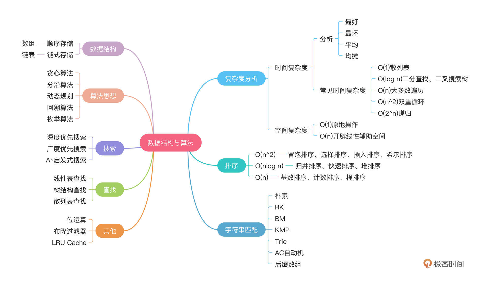
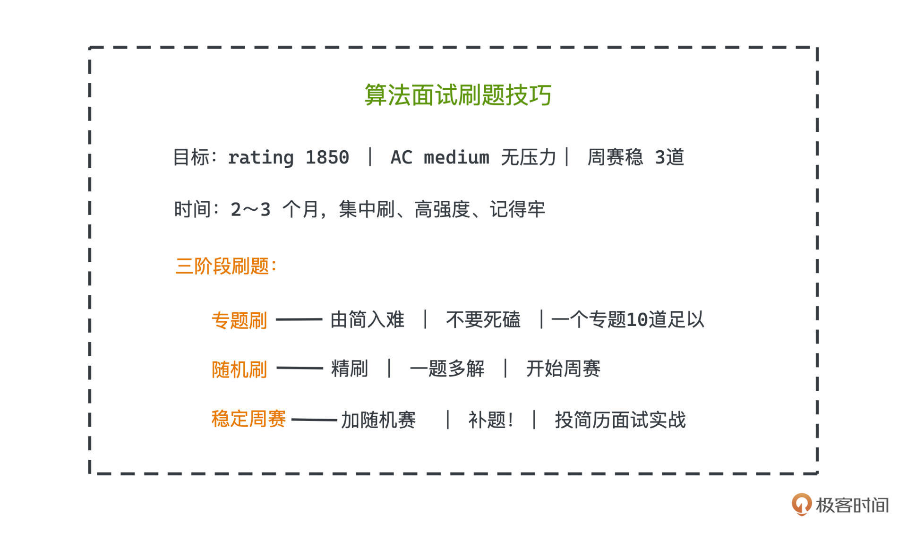
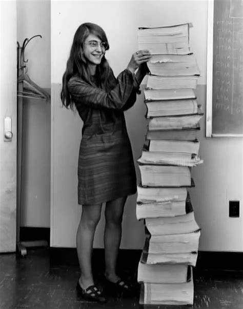
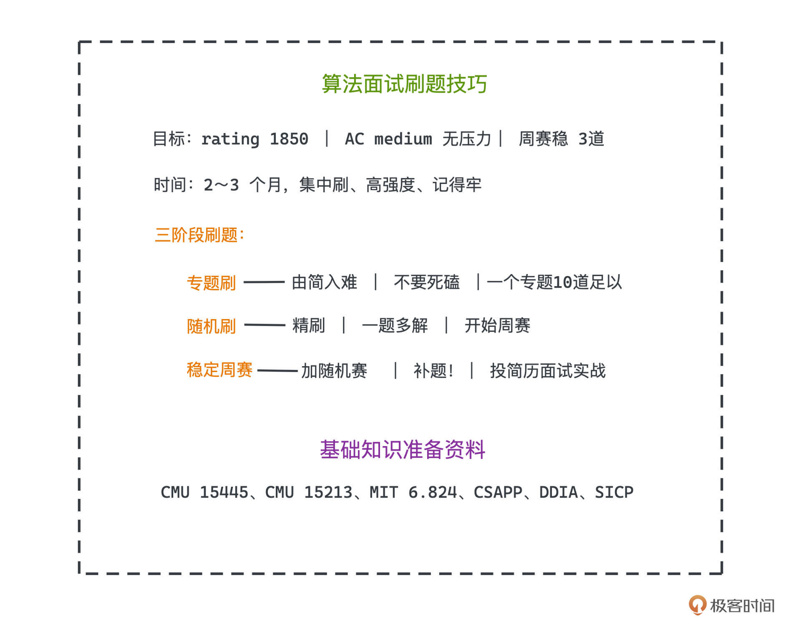

---
date: "2019-06-23"
---  
      
# 特别策划｜面试：BAT面试三关准备方法大揭秘
你好，我是微扰君。

春节将近，从今天起我们就不学习新算法了，轻松一点来聊一聊大厂算法面试该怎么准备更高效。

毕竟来极客时间学习，很多同学可能都有一个相同目的，想要通过自我提升拿到大厂Offer，想要进大厂，首先我们一定要过的就是算法面试。算法面试怎么过呢？来得最快、效果也相当不错的方法当然就是刷题了。

因为我自己本科也不是计算机科班出身，第一份工作是做前端，但工作内容并没有给到很好的技术基础，对我后期的技术成长不是特别有利，加上自己又比较想去做一些偏基础架构的工作，我下定决心准备尽早跳槽到偏基础设施的岗位了。今天就来和你一起分享一下我的一些面试心得。

对于工作经验比较浅的同学，**大厂面试核心考察的就是你的潜力，主要就三关：算法、计算机基础知识、领域知识**，领域知识这块通常会和项目经验一起考察。

这里项目经历、领域知识和计算机基础知识，都需要较长时间的积累，我们短期能操作且一定能有效提升的就是算法面试。

我2020年筹备跳槽，1月份春节的时候就开始疯狂刷题，差不多两个月做了400道题，提交最多的一次是就出现在大年初一那天，我从早上做题做到晚上，差不多AC了37道题。因为算法面试关，技巧都是辅助的，核心就是得下定决心坚持刷，如果你真的能像我当时这样刷题，想过大厂的面试关还是比较容易的。

<!-- [[[read_end]]] -->

不过刷题当然也是有窍门的，今天也整理了我自己的算法面试筹备经验，希望能对你有启发。

## 面试如何刷算法题

既然目的非常清晰，就是为了过算法面试关。首先要搞清楚大厂面试大概的能力要求是什么样的。

我自己的经验是，**如果你打力扣的周赛，rating差不多能到1850分，大厂面试就比较稳了**。基本面试三家，就能拿到两家的offer，另一个没有拿到的，可能也不是因为算法被刷，有可能是经历被卡或者是八股文被卡。

另一个等价的标准，力扣题目是分难度的easy、medium、hard，**如果你做medium没有什么压力的话，或者周赛能稳定输出3道题，基本上就是可以过面试了**。

目标理解清楚，再就要考虑投入时间了。我个人比较建议用2～3个月的时间集中高强度地刷算法题，因为这段时间其实就相当于在边刷边复习，密集地学习和复习知识，会让你对知识掌握地更牢固，也不太容易忘。在这两三个月中做250\~400道题，就可以基本达到目标了。

刷题也是有方法的，我自己总结自己的刷题过程，大概分为三个阶段，按照这个方法刷题准备的同学面试结果往往也都还不错。

### 第一阶段：分专题刷

刚开始比较建议先按专题刷，有一本很好的入门书是《剑指offer》，很多人应该都听过，它有题目、题解和对应知识点，书里也把题目分了类。你一开始做题的时候可能很多题目都没思路，甚至题目都要读半天。当然面试的时候，如果是这个表现那肯定是过不了的，但是也不要气馁，这说明自己提升的空间很大。

**一开始刷题千万不要死磕，一个专题只需要刷10道左右就可以了**。拿到题目，不会做可以直接去看答案，差不多看两三道题，你就对题目有基本思路了。10道做完，基本上再看力扣medium的题，虽然不一定正确，起码是有思路能上手写一写了。

到这个程度，我们就可以开始第二阶段的训练了。

### 第二阶段：随机精刷

现在你就可以力扣随机刷题了，不过这个阶段不建议先看答案，一定要先自己多去思考。因为很多题目比如说medium，它比简单题难的地方就在于有不止一个知识点，每道题也有可能有不同的做法，**我们需要把不同的做法和不同的知识点都掌握到位，找经典的题目认真研究精刷**。

另外这个阶段就可以开始打周赛了，帮助你检验自己学习的程度。周赛题，除了第一道是easy的，后面两道一般是medium，也会考察不止一个知识点。我们可以按照一定的策略去刷，先易后难，先做排序、字符串、搜索之类的简单题，之后再挑战比较进阶的比如DP、并查集等专题，或者做一些比较综合的题目。因为困难一些的题目，往往涉及不只一个知识点，通常也能有效复习到前面的题。

学到这里差不多两个月也过去了，第三个月可以进入最后一个阶段。

### 第三阶段

现在估计你也形成打周赛的习惯了，可以再加一些随机赛锻炼一下自己的临场发挥。力扣上有功能叫随机面试（当然也是要开会员的，能花小钱解决问题的，我们可以花钱解决），可以很好地模拟实际面试的过程，有时间限制所以会有压力。

这个阶段如果有题目做不出来，**一定要记得补题，把这道题高质量的题解看明白**，然后自己再把答案再写一遍，定期复习查漏补缺。

最后还有一个我自己准备面试的小trick，当然也不见得每个人都认可，你可以去试一试。因为我自己是从前端转基础架构，对整个行情不是特别了解，所以前期我有投一些公司，其实我也不太可能会去，投了一下就是想去体验真正面试的过程。收获也确实很多。

这就是我刷题的三个阶段，你可以参考。刷题其实最重要的是坚持，如果觉得自己执行力不够强，我也有两个方法，一是可以加一些社群大家互相帮助互相监督，二自然就是花钱了，极客时间算法训练营也不错，会有人专门监督你按进度学。

最基础、提升也最快的算法关解决，另外两个部分基础知识、项目经历同样也是需要准备起来的。

## 转岗如何准备基础知识

第一大问题是基础知识如何补充。

如果你不是科班出身，针对八股文的面试关有两种办法，一种就是你去看面经，找一些类似《Java面试指南》这些比较浅显易懂的内容，因为看完之后很快就可以背出来，如果面试官问的不深，你是真的可以答出来的。运气好，自然就过了。

但是很显然这种快餐式的学习并不系统也不够深入，面试官如果多追问几个问题，很容易判断出来你是背的，还是真正对计算机基础知识、中间件、原理有自己的理解。

所以**如果你时间还比较充分，也对技术感兴趣，可以先从计算机基础知识补起，毕竟源码都是在建立在这些基础上的**，比如为什么Kafka读写比较快，这个问题肯定要对计算机体系结构和磁盘的工作原理有一定了解，才能回答得出来。

因为我当时主要想要做分布式存储，对数据库比较感兴趣，整理了一些底层的学习资料也分享给你。

* CMU 15445，讲数据库非常好的一门课，里面讲了很多经典的paper。帮助你非常系统地梳理数据库发展的历史，而且内容很新。
* CMU 15213，可以打好计算机体系结构和操作系统的知识基础。CSAPP是这门课的指定教材。
* MIT 6.824，课程会带着你一起阅读许多经典的分布式领域的论文，了解大规模互联网应用会遇到哪些问题。
* DDIA，被国外很多同学称为系统设计的圣经，同样是能带你系统了解许多基础数据系统设计精髓的经典书籍。
* SICP，能很好的帮助你了解编程语言底层原理。

这些课程能给到你非常扎实的基础知识积累了，面试是绰绰有余。

当然在学习的时候，**要有意识地深入思考和总结，虽然看起来一开始要投入更多时间，但长期看这一定是一条捷径**。

比如，有的同学学快速排序，可能过一道题，背一背代码，一个小时就掌握了，但这个知识的深度是经不起工作考验的，比如为什么复杂度是O\(n\*logn\)呢？快速选择法是什么你又知道吗？如果不知道的话，你可以去搜索了解一下哈，这里就不展开讲了。从我的经验来看，可以说只背题的人走的才是歪路。因为我不是科班出身，这一点之前没有深刻意识到，也确实走了弯路。

## 没有项目经历怎么办

项目经历是很多小厂同学头疼的事，毕竟平时的业务一般都在做增删改查。我当时是想转后端架构，但是自己工作是前端，项目上肯定是没有有优势了。怎么办？

**第一个方法就是自己写一些面试项目**。我当时写了一个玩具级别的工具类项目，做分布式的缓存，实现了一致性哈希、LRU缓存的功能。虽然是玩具级，但是在没有什么工作内容可以讲的时候，贴一个这样的项目，面试官会觉得我比较努力，另一方面项目里的一些东西，我可以跟面试官聊一聊，展示我对缓存设计的思考和想法。

当然现在这种项目也很多，但是有总比没有强。网上一搜比如手把手教你实现一个RPC框架，你完全可以按照教程来一遍。虽然在开源社区里，这种项目是垃圾项目，但起码是自己动手做过的，面试官看到一般还是会对你比较认可。当然如果你工作中有相关项目肯定是更好了。

**另一个方法就是可以参加知名的开源项目**，从熟悉的工作入手，尝试做一些issue，一旦你提交了PR，开源社区里会有很多人来给你一些帮助，只要你虚心请教，一定要看提交的规范文档，不要问一些愚蠢的问题（什么叫愚蠢的问题，谷歌上一搜就能搜到答案的问题就是这一类），很多好的开源项目社区，其实是很乐于帮助你的，你甚至可以得到免费的指点。

## 大厂和算法

可能有同学一直很困惑，为什么大厂要考算法？很多人都会觉得算法在工作中并没有很多用武之地。实际不是的。

第一台计算机差不多应该是上个世纪40年代发明的，是相当伟大的发明了，把物理学上的很多知识运用到生活中解放生产力，当时主要被用来做科学运算、密码破译，然后六七十年代人们开始用计算机做一些伟大的事情，比如登月，探索星空探索宇宙。

这个时候最早期的一批程序员就出现了。他们用计算机处理了很多登月上的难题，比如说着陆、碰撞检测、导航系统设计等等，但是我们都知道那个时候的计算机性能其实很差，登月的阿波罗计划有一张非常有名的照片，一名女程序员和一摞齐人高的纸，那一摞纸就是阿波罗计划里面用到的源代码。

当时的计算机，内存就只有几KB，在这种硬件条件下就需要极致压榨系统的性能，数组能少开就少开，能原地做的算法就一定要原地做，空间复杂度可能比时间复杂度更重要，总的来说，怎么样写性能好就怎样写。所以程序员们的算法要求就特别高。

当然他们当时没有那么多复杂的依赖，也没有那么多抽象，很多问题都是通过比较暴力的方式，先把问题解决，也不会去管设计模式、让代码有多么的可读。但他们那时候发明的很多算法，包括早期的计算机网络、最短路算法等等，到现在都非常有用。

那现在算法要求比较高的程序员们在什么地方呢？**其实也是在需要更加注重性能的地方，以前是因为资源很有限，现在是因为并发量很大**。

一些互联网大厂，虽然现在红利已经不在了，但是毕竟积累的存量用户足够多，服务器每天都是在面对海量的请求，而且计算机毕竟受摩尔定律的约束，你肯定希望在有限的内存里让它跑得更好。就比如，基础的PyTorch或者中间件Kafka都是需要压榨性能的，要么是因为IO的要求特别高，要么是因为它本身要做的计算就非常复杂，对于很复杂的计算来说，即使现在的内存和硬件资源也不是很充足，我们需要让它跑得尽量快。

在这些底层的东西里我们肯定也是需要用到算法的，在大厂里相关的岗位就是基础架构的开发，做数据库或者RPC服务框架之类。

当然我们更多的程序员是做普通的业务开发，日常练习算法除了能让思维更清晰敏捷、考虑问题更加全面之外，更重要的是，我们最终还是要依赖这些中间件的，一旦中间件出现问题就需要自己去定位去判断，这个时候就需要阅读相应源码，如果对源码里的算法不是很熟悉，你可能就会觉得源码这东西也太难啃了吧。

还有比如要做架构的选型，肯定是不能只是去看网上的文章别人怎么说，得自己更深入地去看、去使用这个中间件它到底快在什么地方，比如用消息队列，你是用Kafka、RocketMQ还是Pulsar？它们之间到底有什么区别？比如现在很多人就觉得Pulsar比Kafka性能更好，为什么呢？有些是架构上的变化，也有很多是算法上的变化。

## 总结

如果你真的想在程序员这条路上走得更远，还是要想办法让自己在编程中找到自己的乐趣，无论是看业务发展突飞猛进，还是从技术实现自我的提升，找到自己的成就感。

我个人更喜欢在技术上做出成绩，所以如果你也是这样，可以研究偏中间件的系统、研究底层的算法、研究一些背后的机制，这些东西才是有技术价值也有技术乐趣的。当然这些背后我们一定要有好的计算机基础知识，也需要有好的算法和数据结构的基础知识。

### 聊一聊

今天就不设置课后作业了，欢迎你在留言区分享自己之前面试的有趣故事，我们一起聊一聊。

如果觉得这篇文章对你的面试准备有帮助的话，也欢迎转发给你的朋友。我们下节课见～