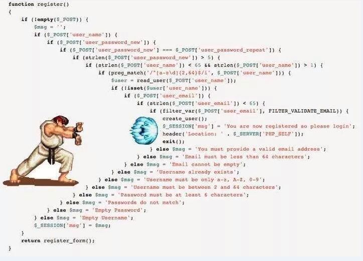

---
date: "2019-06-23"
---  
      
# 07 | 滥用控制语句：出现控制结构，多半是错误的提示
你好，我是郑晔。

在前面几讲，我们已经讲了不少的坏味道，比如长函数、大类等。对于有一定从业经验的程序员来说，即便不能对这些坏味道有一个很清楚的个人认知，但至少一说出来，通常都知道是怎么回事。

但这节课我要讲的坏味道对于很多人来说，可能就有点挑战了。这并不是说内容有多难，相反，大部分人对这些内容简直太熟悉了。所以，当我把它们以坏味道的方式呈现出来时，这会极大地挑战很多人的认知。

这个坏味道就是滥用控制语句，也就是你熟悉的 if、for 等等，这个坏味道非常典型，但很多人每天都用它们，却对问题毫无感知。今天我们就先从一个你容易接受的坏味道开始，说一说使用控制语句时，问题到底出在哪。

## 嵌套的代码

我给你看一张让我印象极其深刻的图，看了之后你就知道我要讲的这个坏味道是什么了。



相信不少同学在网上见过这张图，是的，我们接下来就来讨论**嵌套的代码**。

考虑到篇幅，我就不用这么震撼的代码做案例了，我们还是从规模小一点的代码开始讨论：

```
    public void distributeEpubs(final long bookId) {
      List<Epub> epubs = this.getEpubsByBookId(bookId);
      for (Epub epub : epubs) {
        if (epub.isValid()) {
          boolean registered = this.registerIsbn(epub);
          if (registered) {
            this.sendEpub(epub);
          }
        }                                            
      }
    }
    

```

这是一段做 EPUB分发的代码，EPUB 是一种电子书格式。在这里，我们根据作品 ID 找到要分发的 EPUB，然后检查 EPUB 的有效性。对于有效的 EPUB，我们要为它注册 ISBN 信息，注册成功之后，将这个 EPUB 发送出去。

<!-- [[[read_end]]] -->

代码逻辑并不是特别复杂，只不过，在这段代码中，我们看到了多层的缩进，for 循环一层，里面有两个 if ，又多加了两层。即便不是特别复杂的代码，也有这么多的缩进，可想而知，如果逻辑再复杂一点，缩进会成什么样子。

这段代码之所以会写成这个样子，其实就是我在讲“[长函数](https://time.geekbang.org/column/article/327424)”那节课里所说的：“**平铺直叙地写代码**”。这段代码的作者只是按照需求一步一步地把代码实现出来了。从实现功能的角度来说，这段代码肯定没错，但问题在于，在把功能实现之后，他停了下来，而没有把代码重新整理一下。那我们就来替这段代码作者将它整理成应有的样子。

既然我们不喜欢缩进特别多的代码，那我们就要消除缩进。具体到这段代码，一个着手点是 for 循环，因为通常来说，for 循环处理的是一个集合，而循环里面处理的是这个集合中的一个元素。所以，我们可以把循环中的内容提取成一个函数，让这个函数只处理一个元素，就像下面这样：

```
    public void distributeEpubs(final long bookId) {
      List<Epub> epubs = this.getEpubsByBookId(bookId);
      for (Epub epub : epubs) {
        this.distributeEpub(epub)；
      }
    }
    
    
    private void distributeEpub(final Epub epub) {
      if (epub.isValid()) {
        boolean registered = this.registerIsbn(epub);
        if (registered) {
          this.sendEpub(epub);
        }
      }
    }
    

```

这里我们已经有了一次拆分，分解出来 distributeEpub 函数每次只处理一个元素。拆分出来的两个函数在缩进的问题上，就改善了一点。

第一个函数 distributeEpubs 只有一层缩进，这是一个正常函数应有的样子，不过，第二个函数 distributeEpub 则还有多层缩进，我们可以继续处理一下。

## if 和 else

在 distributeEpub 里，造成缩进的原因是 if 语句。通常来说，if 语句造成的缩进，很多时候都是在检查某个先决条件，只有条件通过时，才继续执行后续的代码。这样的代码可以使用卫语句（guard clause）来解决，也就是设置单独的检查条件，不满足这个检查条件时，立刻从函数中返回。

这是一种典型的重构手法：**以卫语句取代嵌套的条件表达式（Replace Nested Conditional with Guard Clauses）**。

我们来看看改进后的 distributeEpub 函数：

```
    private void distributeEpub(final Epub epub) {
      if (!epub.isValid()) {
        return;
      }
      
      boolean registered = this.registerIsbn(epub);
      if (!registered) {
        return;
      }
      
      this.sendEpub(epub);
    }
    

```

改造后的 distributeEpub 就没有了嵌套，也就没有那么多层的缩进了。你可能已经发现了，经过我们改造之后，代码里只有一层的缩进**。**当代码里只有一层缩进时，代码的复杂度就大大降低了，理解成本和出现问题之后定位的成本也随之大幅度降低。

**函数至多有一层缩进**，这是“对象健身操（《[ThoughtWorks文集](https://www.infoq.cn/minibook/thoughtworks-anthology)》书里的一篇）”里的一个规则。前面讲“[大类](https://time.geekbang.org/column/article/327483)”的时候，我曾经提到过“对象健身操”这篇文章，其中给出了九条编程规则，下面我们再来讲其中的一条：**不要使用 else 关键字**。

没错，**else 也是一种坏味道，这是挑战很多程序员认知的**。在大多数人印象中，if 和 else 是亲如一家的整体，它们几乎是比翼齐飞的。那么，else 可以不写吗？可以。我们来看看下面的代码：

```
    public double getEpubPrice(final boolean highQuality, final int chapterSequence) {
      double price = 0;
      if (highQuality && chapterSequence > START_CHARGING_SEQUENCE) {
        price = 4.99;
      } else if (sequenceNumber > START_CHARGING_SEQUENCE
            && sequenceNumber <= FURTHER_CHARGING_SEQUENCE) {
        price = 1.99;
      } else if (sequenceNumber > FURTHER_CHARGING_SEQUENCE) {
        price = 2.99;
      } else {
        price = 0.99;
      }
      
      return price;
    }
    

```

这是一个根据 EPUB 信息进行定价的函数，它的定价逻辑正如代码中所示。

* 如果是高品质书，而且要是章节序号超过起始付费章节，就定价4.99；
* 对一般的书而言，超过起始付费章节，就定价 1.99；超过进一步付费章节，就定价 2.99。
* 缺省情况下，定价 0.99。

就这段代码而言，如果想不使用 else，一个简单的处理手法就是让每个逻辑提前返回，这和我们前面提到的卫语句的解决方案如出一辙：

```
    public double getEpubPrice(final boolean highQuality, final int chapterSequence) {
      if (highQuality && chapterSequence > START_CHARGING_SEQUENCE) {
        return 4.99;
      } 
      
      if (sequenceNumber > START_CHARGING_SEQUENCE
            && sequenceNumber <= FURTHER_CHARGING_SEQUENCE) {
        return 1.99;
      } 
    
    
      if (sequenceNumber > FURTHER_CHARGING_SEQUENCE) {
        return 2.99;
      } 
    
    
      return 0.99;
    

```

对于这种逻辑上还比较简单的代码，这么改造还是比较容易的，而对于一些更为复杂的代码，也许就要用到多态来改进代码了。不过在实际项目中，大部分代码逻辑都是逐渐变得复杂的，所以，最好在它还比较简单时，就把坏味道消灭掉。这才是最理想的做法。

无论是嵌套的代码，还是 else 语句，我们之所以要把它们视为坏味道，本质上都在追求简单，因为一段代码的分支过多，其复杂度就会大幅度增加。我们一直在说，人脑能够理解的复杂度是有限的，分支过多的代码一定是会超过这个理解范围。

在软件开发中，有一个衡量代码复杂度常用的标准，叫做[圈复杂度](https://en.wikipedia.org/wiki/Cyclomatic_complexity)（Cyclomatic complexity，简称 CC），圈复杂度越高，代码越复杂，理解和维护的成本就越高。在圈复杂度的判定中，循环和选择语句占有重要的地位。圈复杂度可以使用工具来检查，比如，在 Java 世界中，有很多可以检查圈复杂度的工具，我们之前提到过的 Checkstyle 就可以做[圈复杂度的检查](https://checkstyle.sourceforge.io/config_metrics.html#CyclomaticComplexity)，你可以限制最大的圈复杂度，当圈复杂度大于某个值的时候，就会报错。

只要我们能够消除嵌套，消除 else，代码的圈复杂度就不会很高，理解和维护的成本自然也就会随之降低。

## 重复的 Switch

通过前面内容的介绍，你会发现，循环和选择语句这些你最熟悉的东西，其实都是坏味道出现的高风险地带，必须小心翼翼地使用它们。接下来，还有一个你从编程之初就熟悉的东西，也是另一个坏味道的高风险地带。我们来看两段代码：

```
    public double getBookPrice(final User user, final Book book) {
      double price = book.getPrice();
      switch (user.getLevel()) {
        case UserLevel.SILVER:
          return price * 0.9;
        case UserLevel.GOLD: 
          return price * 0.8;
        case UserLevel.PLATINUM:
          return price * 0.75;
        default:
          return price;
      }
    }
    
    
    public double getEpubPrice(final User user, final Epub epub) {
      double price = epub.getPrice();
      switch (user.getLevel()) {
        case UserLevel.SILVER:
          return price * 0.95;
        case UserLevel.GOLD: 
          return price * 0.85;
        case UserLevel.PLATINUM:
          return price * 0.8;
        default:
          return price;
      }
    }
    

```

这两段代码，分别计算了用户在网站上购买作品在线阅读所支付的价格，以及购买 EPUB 格式电子书所支付的价格。其中，用户实际支付的价格会根据用户在系统中的用户级别有所差异，级别越高，折扣就越高。

显然，这两个函数里出现了类似的代码，其中最类似的部分就是 switch，都是根据用户级别进行判断。事实上，这并不是仅有的根据用户级别进行判断的代码，各种需要区分用户级别的场景中都有类似的代码，而这也是一种典型的坏味道：**重复的switch（Repeated Switch）**。

之所以会出现重复的 switch，通常都是缺少了一个模型。所以，应对这种坏味道，重构的手法是：**以多态取代条件表达式（Relace Conditional with Polymorphism）**。具体到这里的代码，我们可以引入一个 UserLevel 的模型，将 switch 消除掉：

```
    interface UserLevel {
      double getBookPrice(Book book);
      double getEpubPrice(Epub epub);
    }
    
    
    class RegularUserLevel implements UserLevel {
      public double getBookPrice(final Book book) {
        return book.getPrice();
      }
      
      public double getEpubPrice(final Epub epub) {
        return epub.getPrice();
    }
    
    
    class GoldUserLevel implements UserLevel {
      public double getBookPrice(final Book book) {
        return book.getPrice() * 0.8;
      }
      
      public double getEpubPrice(final Epub epub) {
        return epub.getPrice() * 0.85;
      }
    }
    
    
    class SilverUserLevel implements UserLevel {
      public double getBookPrice(final Book book) {
        return book.getPrice() * 0.9;
      }
      
      public double getEpubPrice(final Epub epub) {
        return epub.getPrice() * 0.85;
      }
    }
    
    
    class PlatinumUserLevel implements UserLevel {
      public double getBookPrice(final Book book) {
        return book.getPrice() * 0.75;
      }
      
      public double getEpubPrice(final Epub epub) {
        return epub.getPrice() * 0.8; 
    

```

有了这个基础，前面的代码就可以把 switch 去掉了：

```
    public double getBookPrice(final User user, final Book book) {
      UserLevel level = user.getUserLevel()
      return level.getBookPrice(book);
    }
    
    
    public double getEpubPrice(final User user, final Epub epub) {
      UserLevel level = user.getUserLevel()
      return level.getEpubPrice(epub);
    }
    

```

我在《软件设计之美》讲[开放封闭原则](https://time.geekbang.org/column/article/261238)的时候，用的例子和这段代码是类似的，里面也有调整的过程，你有兴趣的话，不妨去看一下。只不过，在那个例子里面，我们看到的是一连串的“ if..else”。我们都知道，switch 其实就是一堆“ if..else” 的简化写法，二者是等价的，所以，这个重构手法，以多态取代的是条件表达式，而不仅仅是取代 switch。

其实，关于控制语句还有一个坏味道，那就是循环语句。没错，循环本身就是一个坏味道，但讲解它还需要一些知识的铺垫，所以，我会把它放到后面第13节，讲“落后的代码风格”时再来讲解。这里，你只要知道循环语句也是一个坏味道就够了。

## 总结时刻

今天我们讲了程序员们最熟悉的控制语句：选择语句和循环语句。遗憾的是，这些语句今天都成了坏味道的高发地带，以各种形态呈现在我们面前：

* 嵌套的代码；
* else 语句；
* 重复的 switch；
* 循环语句。

嵌套的代码也好，else 语句也罢，二者真正的问题在于，它们会使代码变得复杂，超出人脑所能理解的范畴。我们可以通过提取单个元素操作，降低循环语句的复杂度，而用卫语句来简化条件表达式的编写，降低选择语句的复杂度。一个衡量代码复杂度的标准是圈复杂度，我们可以通过工具检查一段代码的圈复杂度。

重复的 switch 本质上是缺少了一个模型，可以使用多态取代条件表达式，引入缺少的模型，消除重复的 switch。

如果今天的内容你只能记住一件事，那请记住：**循环和选择语句，可能都是坏味道。**


## 思考题

今天讨论的坏味道挑战了很多人习以为常的编码方式，我想请你谈谈你和这些语句的故事，是不舍也好，是纠结也罢，欢迎在留言区分享你的看法。

如果这节课的内容确实颠覆了你的认知，也欢迎你把它分享出去，让更多人知道。

感谢阅读，我们下一讲再见！

参考资料：[开放封闭原则：不改代码怎么写新功能？](https://time.geekbang.org/column/article/261238)