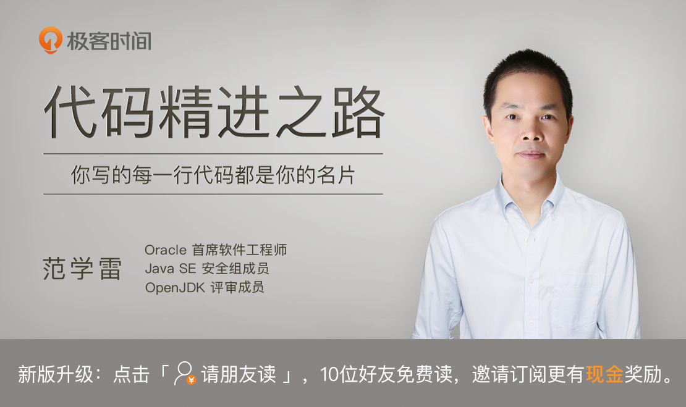

---
date: "2019-06-23"
---  
      
# 开篇词 | 你写的每一行代码，都是你的名片
你好，我是范学雷，现在是Oracle的主任工程师，也是OpenJDK和Java安全的评审成员。很高兴和你一起聊聊怎么写好代码这个话题。

我第一次接触计算机，是在1994年。那时候，我还是大学一年级的一枚青瓜。当时的计算机发展，正处于青涩的少年阶段。“互联网”也还是一个非常生僻的名词。当时，我们用的计算机是“286”，操作系统是DOS，编程语言还是Fortran和C语言，Java语言还没有正式诞生。每次上课，都要随身携带容量为360KB的5.25英寸软盘。娇气的软盘啊，可是不好伺候，动不动就损坏。那时候最渴望的事情，就是能有一张存储容量高达1.44MB的高密度3.5英寸软盘。

计算机启蒙课给我印象最深的是什么呢？不是怎么写程序，而是不停地折腾软盘，一直重复“修复、备份”这个过程。也许是因为软盘的拷贝和修复太无聊，我一直对计算机以及编程没有特别大的兴趣。

但大学最后一年，两件小事让我改变了对计算机和编程的态度，给我带来了巨大的影响。

第一件事是，我一个同学编写的五子棋人机对弈程序，当时打遍全班无敌手。厉害吧！用现在的话说，就是“怎么可以这么炸”！这可不是使蛮力，用穷举法就可以搞定的，到底是怎么做到的？这引起了我对计算机程序的强烈兴趣。

<!-- [[[read_end]]] -->

第二件事是，我另一个同学的毕业论文选择了密码学作为研究方向。这个同学有一个优点，不管什么事情，都特别喜欢分享。用东北话说，就是爱嘚瑟，逢人便絮叨。最后差不多全班都知道了密码学的一些基本概念，了解了与之相关的好多传奇故事。密码学这种超神秘、超有趣、超复杂的存在，简直吊足了我的胃口。

**我们的每一次经历，都塑造着我们自己。**写人机对弈程序的同学，第一次面试就找好了工作，进了最好的公司。研究密码学的同学，是中国商业密码产业化最早的参与者之一。而我自己呢，在他们的影响下，也找到了计算机的乐趣，享受着解决复杂问题带来的喜悦。

编程和密码学这两个东西合在一起，就是我现在每天工作的主要内容。具体来说就是两件事：**写代码和看代码**。

写代码这件事，就我自己的经历来说，有点像过山车。

我刚开始学习编程时，写几十行代码都觉得痛苦、费劲，不知道从哪儿下手。这种状况一直持续了很多年，直到1998年我参加工作，编写程序成了我的职业。职业也就意味着，编码有了具体的目标，代码有了具体的质量要求。

我是幸运的。目标，有人掰碎了、揉烂了给我讲；质量，有人睁大了眼睛盯着看，也有人不顾情面地给我指出各种问题。有了目标就有了思路，有了要求就有了动力。如果再有人不离不弃地帮助，每一个度日如年的煎熬，最终都会变成“士别三日”的惊喜。慢慢地，我就可以写几百行、几千行、几万行甚至十几万行的代码了。而且越写越快，越写越好。

大概到了2000年的时候，代码设计对我来说可能依然很费时间，但是只要写起代码来，一天数千行也是很常见的。一天洋洋洒洒写数千行代码，暗暗觉得自己挺牛，挺了不起的。

“**无知要比知识更容易产生自信**”。幸运的是，这种盲目的自信没有持续太久，我很快就见识到了更宽阔的世界。2004年，我加入了Java安全组，真正地见识到了，优秀的设计和优秀的代码，是怎么一步一个脚印地出炉的，了解到代码背后的各种综合考量和艰难取舍。慢慢地，我自己也完成了从“代码数量优先”到“代码质量优先”的思路转变**。**

如果回头看十多年前编写的代码，就像是看筛子一样，到处都是清清楚楚的破洞。也许，这是每个程序员都要经历的过程吧。

**我们总是先要解决掉数量问题，然后才能解决掉质量问题。**

这个过程，还真的有点“看山是山，看山不是山，看山还是山”的味道。

看代码这件事，对我来说，其实是一个收获大于付出的过程。

OpenJDK的代码必须通过评审才可以提交。OpenJDK社区有非常广泛的代码贡献群体，有些是还没有毕业的年轻学生，也有些资深的业界老专家。新手当然有新手的困惑，而老辣的程序员，也会犯简单的错误。

一个代码评审者的主要工作，不是批准或者拒绝提交的代码，而是提出合理的建议，帮助代码提交者规避这些失误或者错误，编写出更优秀的代码。

看代码看得多了，对代码就有更多的了解。 比如，**什么样的代码更容易出问题？ 什么样的代码会招惹麻烦？ 什么样的代码出力不讨好？ 什么样的代码小问题闯大祸？**

同时，也对程序员有了更多的了解。 比如，**为什么我们不愿意写注释呢？ 为什么代码写完就不愿意修改了呢？为什么我们不愿意做测试呢？ 为什么我们向往自由而不愿意遵守规范呢？**

每一行代码，都体现着程序员的修为，思考问题的深度，甚至是处理问题的习惯和态度。**代码，是我们交流的语言和处世的名片。**

这些问题，思考总结下来，就是代码评审的经历馈赠给我的礼物，而且是天大的礼物。

现在我把这份礼物沉淀下来，就是我们这个专栏的主要内容。我想通过这样一个专栏，让你拥有和我一样的收获。

回顾我这二十多年的程序员经历，我觉得自己是非常幸运的。现在，我们常常调侃“35岁码农大龄恐惧症”。幸运的是，当这种病毒一般的焦虑开始流传开来的时候，我早已经过了35岁，已经来不及担心了。

这种焦虑之所以广泛流传，背后传达的一个本质问题就是：**作为一名软件工程师，我们该怎么快速成长，并且保持长久的竞争力？**

解决这个问题的终极方法，只有一个，那就是**持续地交付优秀的结果**。宜早不宜迟。

作为解决现实问题的软件工程师，不管资历深、资历浅，我们都需要编写优秀的代码，并且是越来越优秀的代码，因为这是我们生存的基本依靠。作为活在现实世界的技术工程师，我们需要保持长久的竞争力，甚至是越来越强的竞争力，因为这是改善我们生存质量的最好方式。

在这个专栏里，我会带着你开始一段代码精进的旅程。和你一起来看一看、摸一摸那些年别人踩过的坑，来聊一聊、试一试我们的代码可以写得有多棒，享受这个打怪升级的过程。

那么现在，给你一个机会，你敢不敢吐槽一下你见过的或者写过的，最“差劲儿”的代码？或者，你愿不愿意秀秀你自己最中意的代码？

也欢迎你在留言区写下自己的编程故事，等到专栏结束后，我们再回过头来，看看你走出了怎样的成长轨迹。

> 我渴望做那些伟大而高贵的任务，但是，我首要的责任和快乐却是去完成那些卑微的任务，把它们也当作伟大而且高贵的一样。世界在前行，不只是那些英雄们的力量在推动，也同样包括那些来自每个诚实的工作者微小推动的积累。—— 海伦•凯勒

