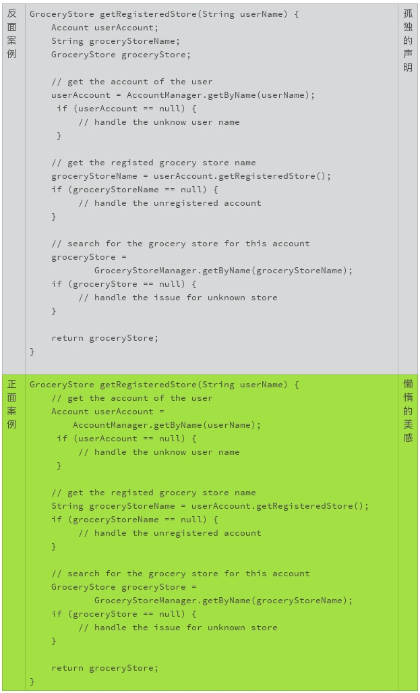
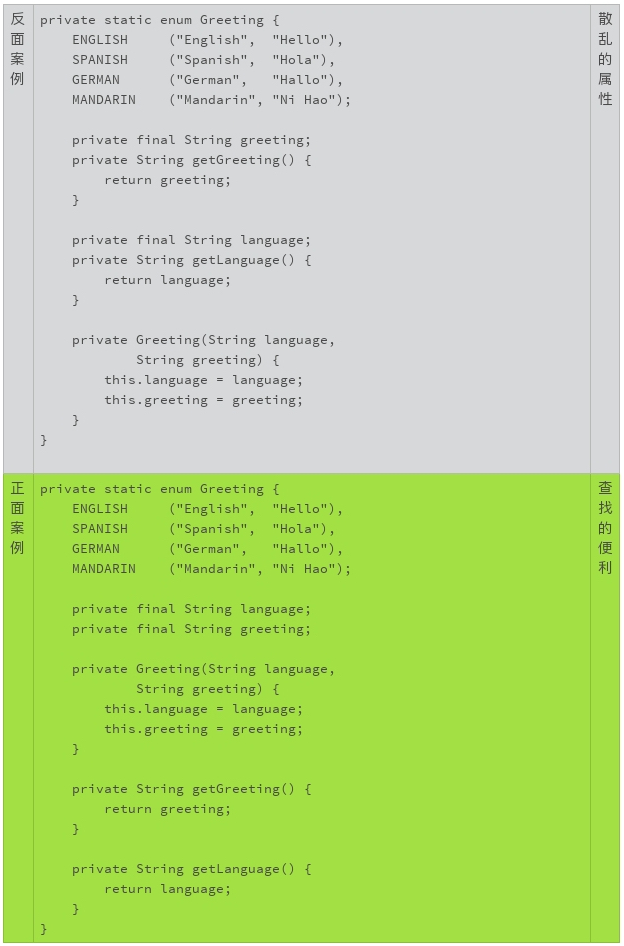
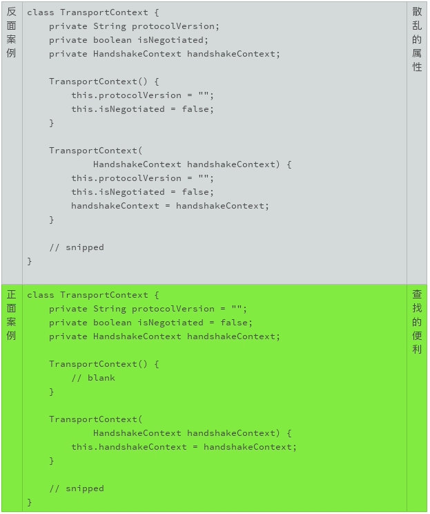
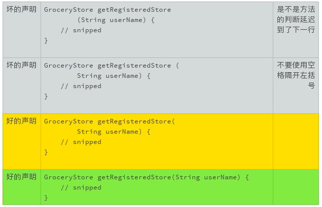
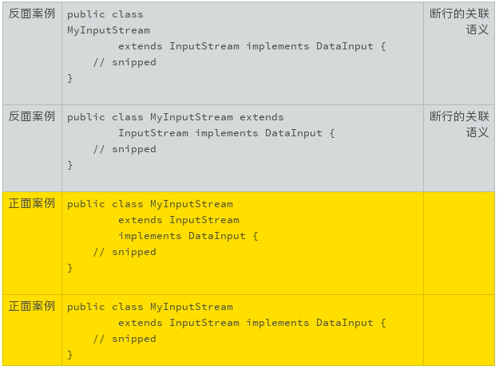

---
date: "2019-06-23"
---  
      
# 08 | 写好声明的“八项纪律”
我们在前面讨论了该怎么取一个好名字。在编程语言里，我们使用标识符来表示不同的逻辑和对象。声明就是用来定义这些标识符的。标识符声明的地方，就是取名字和第一次使用名字的地方。这一次，我们聊一聊该怎么声明一个标识符。

“声明”是我们和标识符初次见面的地方，第一印象就显得特别重要。如果我们忘记了，回头能够清晰地找到它，也很重要。如果我们印象模糊了，回头能够重新认识它，对于我们阅读程序也有很大的帮助。

一个标识符，不仅仅只是一个名字。 像人分男女、高矮胖瘦一样，标识符也可以有附加信息，用来增强人们对它的认识。

一个声明，一般至少包含两个部分，一个是标识符的名字，一个是标识符的类型。 比如：

```
    int size;
    

```

有的声明，还有修饰和限定部分，比如Java的访问控制修饰符（private，public等）：

```
    private int size;
    

```

或者C语言的存储类别限定符（auto，extern等）：

```
    auto int size;
    

```

写声明很简单，但写好声明也并非易事。我们以Java语言为例来讨论声明的编码风格。在Java语言里，声明可以用来定义类、方法、类变量、局部变量和常量。不同声明的语法有着巨大的差别，但是也有很多共通的地方，你可以把这些思路用在自己熟悉的语言上。

<!-- [[[read_end]]] -->

接下来，我会带你一起来学写好声明的“八项纪律”。

## 取一个好名字

既然是标识符，就涉及到取名字的问题。我们前面已经讨论过“怎么取好名字”这个话题了，你可以复习一下。

## 一行一个声明

我们在前面讨论过“一行一个行为”的代码整理规则。这一规则，同样适用于标识符的声明。不推荐在同一行里声明多个变量，即使这一行很短。

  
这样可以很方便地变更和维护代码。 比如，下面的两个代码变更，第二种格式更容易发现大意的错误。

```
    - int size;
    + int size, length;
    

```

```
      int size;
    + int length;
    

```

下面这个代码变更例子，也是同理。

```
    - int size, length;
    + int size;    // size of the list
    + int length; 
    

```

```
    - int size;
    + int size;    // size of the list
      int length;   
    

```

另外，不要在同一行声明不同类型的标识符。

  
需要注意的是，表示数组的中括号“\[\]”是类型的一部分，而不是标识符的一部分。无论是Java语言，还是在C语言的代码中，我都建议把数组符号放在类型该在的地方。


## 局部变量需要时再声明

标识符的声明应该和它的使用尽可能地靠近，特别是局部变量的标识符声明。这样在视觉上，标识符的定义和使用，可以方便我们阅读和记忆。

比如，在下面的例子中，GroceryStore的声明就太早了。如果代码再长一些，等我们读到代码的末尾时，前面声明的变量很可能都忘记了，如果还要返回来查看这个具体的声明，那就太麻烦了。



## 类属性要集中声明

同样是为了阅读和记忆，类变量的声明则要集中。因为类变量无论是私密变量，还是公开变量，在类的方法实现中，随时都可以调用。我们需要把这些变量放在一起，以便于修改和查找。

在下面的例子中，变量的声明散乱在类的代码块里。如果我们想要新加一个方法，或者调整方法声明的顺序，代码马上就会变得混乱不堪。



## 声明时就初始化

除非变量的初始值依赖于更多的条件，或者涉及到一定的计算，否则，声明时就应该完成初始化。声明时初始化，可以防止初始化的遗漏或者不必要的代码重复。

在下面的例子中，你可以设想一下，如果变量\_isNegotiated\_是后来加入的属性，哪一种编码方式更容易变更、更容易维护？



## 尾随的花括号

一般来说，类声明和方法声明后，要使用花括号把实现的代码包括进来。花括号的使用语法很随意。我不建议代码中混杂地使用不同的格式。我只推荐一种方法：

1.  左括号不要单独成行，要紧随在语句尾部，以一个空格隔开；

2.  右括号单独一行。


## 靠紧的小括号

小括号的使用语法也可以很随意。小括号一般用来识别一个标识符是不是方法标识符，所以建议小括号要紧靠着标识符，中间不要有空格。



## 搜索优化的换行

搜索优化是我们编写代码时要考虑的一个因素。搜索优化既包括针对搜索引擎的优化（SEO），也包括针对编辑器（vi, Netbeans）以及系统工具（grep）的搜索优化。

常见的搜索模式有：

* “public class”

* “abstract class”

* “class TheClassName”

* “extends TheClassName”

* “implements TheInterfaceName”

* “theMethodName\(”

这些常用的搜索模式给了我们一个很好的启示：语义相关的词语，常见的搜索模式，要尽量放在同一行。



## 小结

我们讲完了写好声明的八项原则，虽然相对来说比较细致，但基本的大原则主要有两个：

* 取好名字

* 容易识别

掌握住这两条大原则，你会慢慢积累更多的最佳实践案例和纪律细节，让自己的代码声明越来越好读、越来越好用。

## 一起来动手

所以为了让你更好地实践，我找了一段Java代码。你来试试看，怎么把这段代码改得更漂亮？欢迎你把优化的代码公布在讨论区，我们一起来看看这段代码都有哪些可以改进的地方。

```
    import java.util.ArrayList;
    import java.util.HashMap;
    import java.util.List;
    import java.util.Map;
    
    class Solution {
        /**
         * Return a list of the words in words that match the given pattern.
         *
         * A word matches the pattern if there exists a permutation of
         * letters p so that after replacing every letter x in the pattern
         * with p(x), we get the desired word.
         *
         * Example:
         *     Input: words = ["abc","deq","mee","aqq","dkd","ccc"],
         *            pattern = "abb"
         *     Output: ["mee","aqq"]
         *
         *     Explanation: "mee" matches the pattern because there is
         *         a permutation {a -> m, b -> e, ...}.
         *
         *        "ccc" does not match the pattern because
         *        {a -> c, b -> c, ...} is not a permutation, since a
         *        and b map to the same letter.
         */
        public List<String> findAndReplacePattern(String[] words, String pattern) {
            List<String> ans = new ArrayList();
            for (String word: words)
                if (match(word, pattern))
                    ans.add(word);
            return ans;
        }
    
        public boolean match(String word, String pattern) {
            Map<Character, Character> M = new HashMap();
            for (int i = 0; i < word.length(); ++i) {
                char w = word.charAt(i);
                char p = pattern.charAt(i);
                if (!M.containsKey(w)) M.put(w, p);
                if (M.get(w) != p) return false;
            }
            boolean[] seen = new boolean[26];
            for (char p: M.values()) {
                if (seen[p - 'a']) return false;
                seen[p - 'a'] = true;
            }
            return true;
        }
    }
    

```

备注：代码选自<https://leetcode.com/problems/find-and-replace-pattern/>

欢迎你把这篇文章分享给你的朋友或者同事，一起来探讨吧！