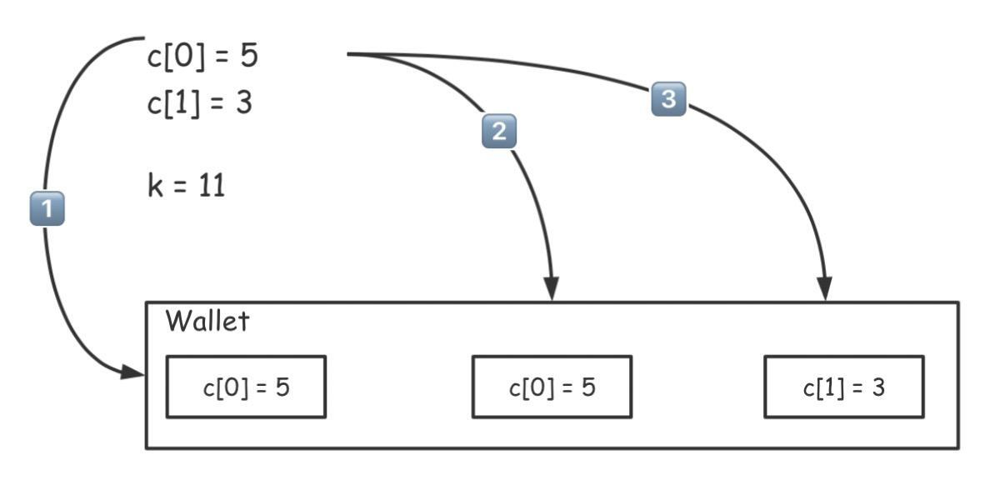
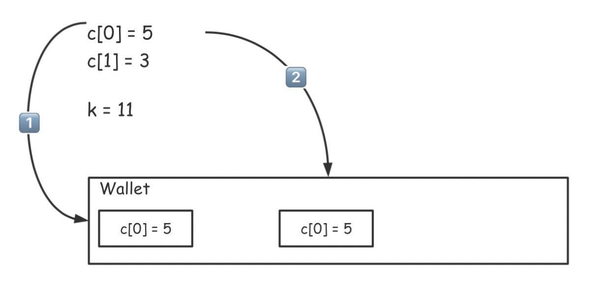
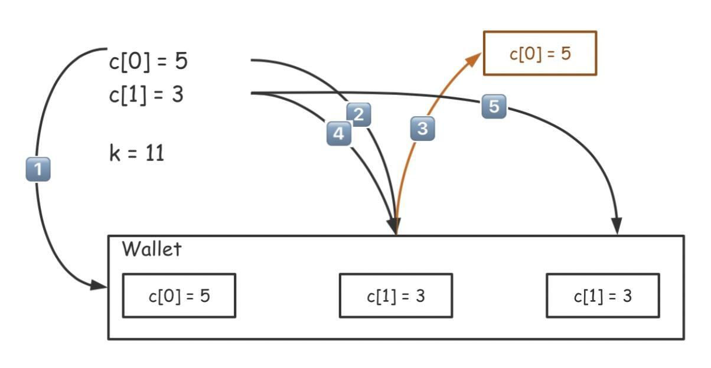
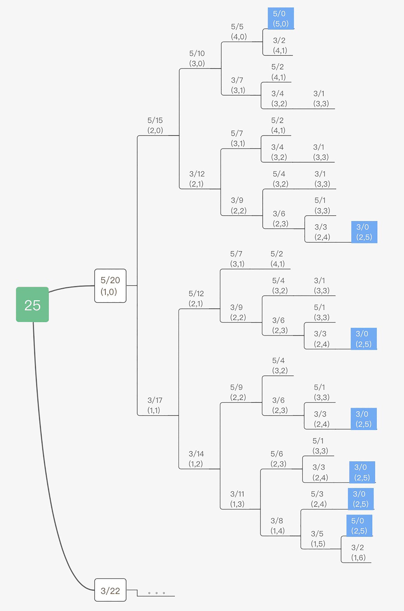
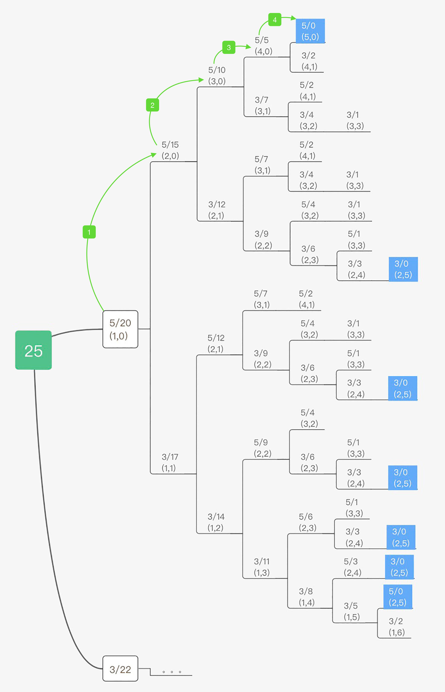
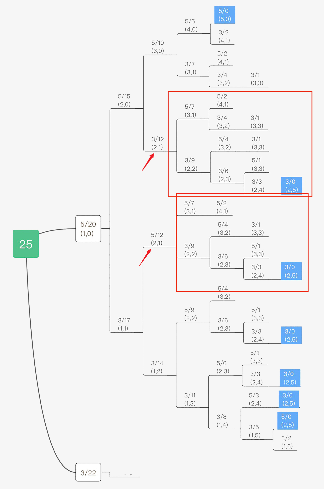
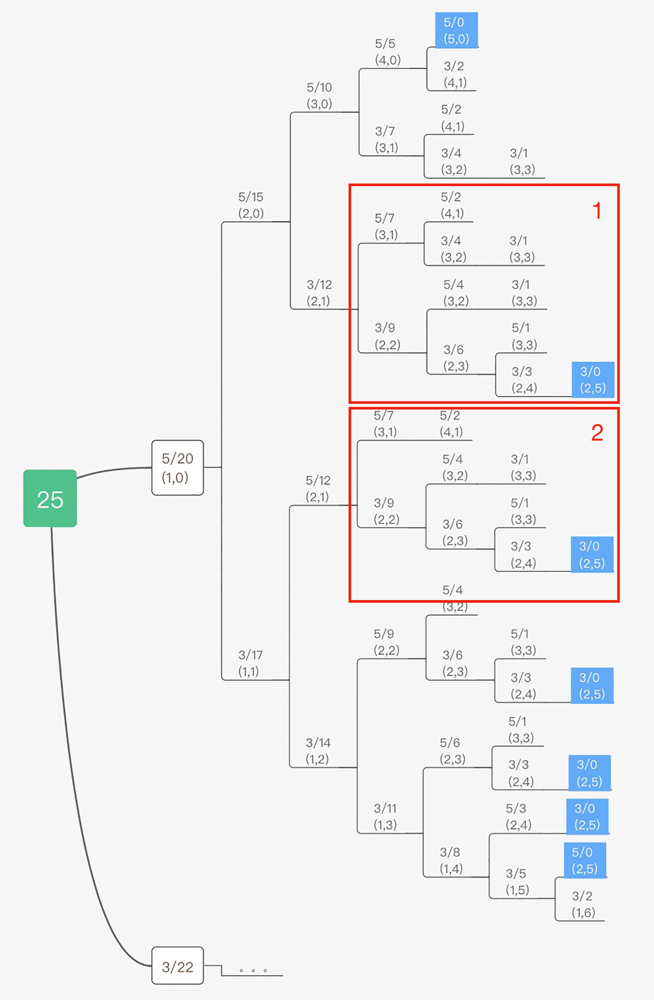
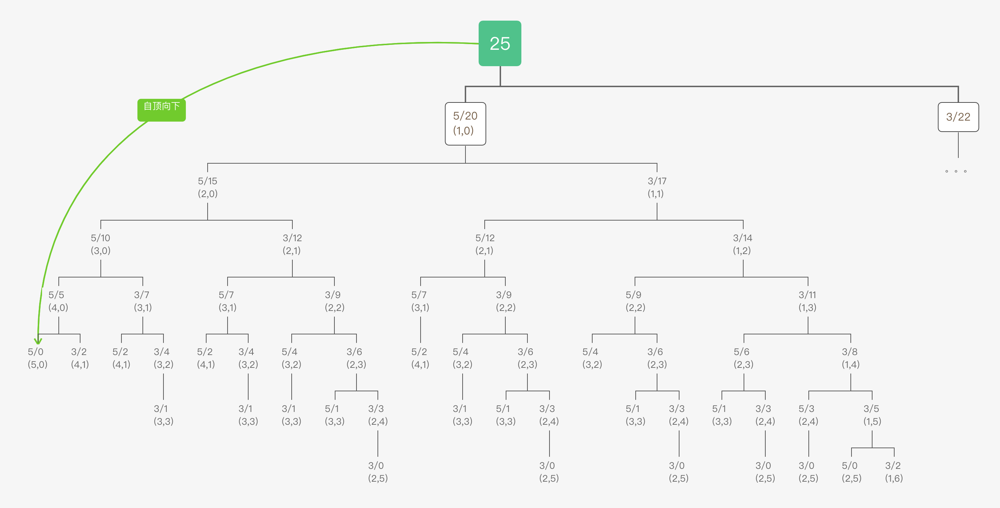
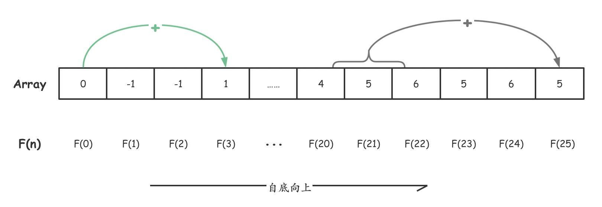

---
date: "2019-06-23"
---  
      
# 15｜课程回顾与总结（上）
你好，我是卢誉声。

当你看到这里的时候，说明你已基本学习完了我们的整个专栏。在经过一系列的课程之后，你应该已经对最难技术面试问题——动态规划，有了较为全面的认识，并且知道该如何去解决一些经典的问题和这些问题的变种。

话说回来，无论你是按部就班学习完整个专栏，还是有所挑选地进行阅读，我都建议你认真读完本节课和下节课的内容。就如标题所写，这两节课主要是对整个专栏的内容进行回顾与总结，会涵盖有关动态规划的重要内容。

如果你认真学完了本专栏的所有内容，掌握了动态规划的基本概念，能够熟练解决动态规划的经典问题，你仍然可以通过这两节课来进行查漏补缺；而如果你在之前的课程中还是有所疑惑，那么你还可以利用总结中的梳理来掌握动态规划最核心的知识点和内容，再回去认真学习相关内容，我相信你会有更多收获。

好了，现在就让我们开始吧。

## 从贪心算法到动态规划

### 1\. 贪心算法

在详细讲解动态规划之前，我们势必要从贪心算法说起。

无论是使用动态规划还是其它的任何算法，核心目的就是求出问题的最优解，只不过具体的思路和方法技巧会有所区别。在解决任何最优解问题的时候我们基本都绕不开一组概念，就是**局部最优解**和**整体最优解**。

* 局部最优解：针对一定条件或环境下的一个问题或目标，是部分解决该问题决策中的最优决策，也就是一个问题的解在一定范围或区域内最优，或者说解决问题或达成目标的手段在一定范围或限制内最优；
* 整体最优解：针对一定条件或环境下的一个问题或目标，是所有解决该问题决策中的最优决策。

<!-- [[[read_end]]] -->

也就是说，整体最优解一定是一个局部最优解，而局部最优解则不一定是整体最优解。同时，由于局部最优解追加了一些限定的条件，可以降低解决整个问题消耗的空间和时间上的资源。而我们熟知的**贪心算法**就是一种经典的求解“局部最优解”的算法。

现在，我们回顾一下之前所学的硬币找零问题。

问题：给定 n 种不同面值的硬币，分别记为 c\[0\], c\[1\], c\[2\], … c\[n\]，同时还有一个总金额 k，编写一个函数计算出**最少**需要几枚硬币凑出这个金额k？每种硬币的个数不限，且如果没有任何一种硬币组合能组成总金额时，返回 \-1。

```
    示例：
    
    输入：c[0]=1, c[1]=2, c[2]=5, k=12
    输出：3 
    解释：12 = 5 + 5 + 2
    

```

在这个问题中，有一个显而易见的思路，硬币中大面值的数量越多，那么最后所需的硬币肯定数量越少。因此，我们应该从面值最大的硬币开始尝试，尽量多地使用面值更大的硬币。只有当面值更大的硬币无法凑出所需总额时，我们才使用面值更小的硬币。下面是一个例子：



我们从 c\[0\]=5, c\[1\]=3 且 k=13 的情况下寻求最少硬币数。按照“贪心原则”，我们先挑选面值最大的，即为 5 的硬币放入钱包。接着，还有 8 元待解（即13-5 = 8）。这时，我们再次“贪心”，放入 5 元面值的硬币。这个时候我们就只剩下 3 元了，我们再放入 3 就可以凑足 13 元了。而且这肯定是面值最少的解法。

但是这种贪心是无法解决所有问题的，比如假设我们现在需要在 c\[0\]=5, c\[1\]=3 且 k=11 的情况下寻求最少硬币数。如果按照同样的原则，选择了两枚 5 元硬币后就只剩下 1 元了，如下图所示：



如果这样，岂不就没有解了！

但是这个问题其实是有解决方案的，之所以会出问题是因为我们“太贪心”了，因此我们需要通过引入“回溯”的方法来解决这个问题。

如果我们把第 2 步放入的 5 元硬币取出，放入面值为 3 元的硬币试试看。这时，你就会发现，我们还剩 3 元零钱待找。这个时候如果再放入 3 元硬币，那么问题是不是就迎刃而解了？



所以，纯粹的贪心算法是一种通过**既定贪心策略**寻找局部最优解的方法。虽然贪心方法是一种简单直接、易于理解的方法，但贪心本身其实只能得到局部条件下的最优解，如果想要找到真正的最优解——整体最优解，我们势必要加入**回溯**和**递归**的过程。具体的解题代码可以参见[第1课](https://time.geekbang.org/column/article/285230)，这里就不再赘述了。

但是，如果我们仔细一想就会发现，如果使用了回溯和递归，这个问题本质上就会变成一个**枚举**的问题，我们就是枚举出所有的可能解，然后从中选择一个满足要求的最优解。

比如我们看一下 c\[0\]=5, c\[1\]=3 且 k=25 这种情况，整个求解过程我们可以画成下面这棵树。



比如，我们先尝试放入 5 元的硬币，这个时候余额就剩下了 20 元。然后再放入 5 元，变成 15 元……以此类推，如果我们使用递归算法把所有叶子节点全部计算出来，也就求得了这个问题的所有解。然后再从这些解中求出最小的硬币数量即可。

我们可以想象到，如果要求解整棵树，需要的**时间复杂度则非常高**，假设一共有 C 种面值，综合为 K，那么最坏情况下的时间复杂度就是 **CK**，这种指数级别的时间复杂度在处理实际问题的时候肯定是会出问题的！

所以我们需要想方设法优化整个求解过程，减少求解的时间复杂度。我们的基本思路是如何减少这颗树的分支数量。如果分支数量减少了，递归效率也就高了。这就是所谓的**剪枝优化**。

贪心就是我们的一种剪枝优化思路，比如假设我们遵从优先使用最大面值的原则，那么这个问题的求解路径就会变成如下图所示：



这样我们通过四步就得到了最优解！

但是我们也能看到，贪心算法**只能解决特定条件下的剪枝问题。**针对一些情况，贪心可能并不能起到剪枝的作用。比如如果 c\[0\]=5, c\[1\]=3 且 k=12，这种情况下显而易见只能使用 4 枚 3 元硬币，如果我们继续采用贪心的思路，完全无法起到任何剪枝的作用，我们只能在尝试完最大的路径之后，不得不去使用最小的路径，这样时间复杂度无法有任何降低。

### 2\. 重叠子问题与备忘录

因此，为了解决普遍情况下的剪枝问题，我们必须采用另外的思路来进行优化。这个思路就是**备忘录**，后来我还常用**状态存储**来指代备忘录。

我们可以仔细分析一下上面的求解图和求解路径，你会发现在余额相同的情况下，后面的搜索路径是完全一致的！



比如，我们看到图中圈出来的两个部分，因为余额都是 12 元，所有后续的求解路径和结果是完全相同的。既然余额确定的时候后续的求解路径和结果是完全相同的，那么最优解也是确定的。

所以我们可以将一个大问题划分成多个子问题。比如可以把求解 12 元的硬币数量理解成求解 25 元的硬币数量的一个子问题。在求解 25 元硬币过程中，会有很多种情况都要求解 12 元硬币的最优解。

这里我们就可以提出一个概念——**重叠子问题**。所谓重叠子问题，就是在大问题的求解过程中会重复求解的小问题。既然重叠子问题是在求解过程中会重复计算的，那么我们是否可以**消除这些重复计算的过程**呢？显然，这些就是我们可以优化的出发点，然后再通过这个思路进行优化。这个时候我们就可以采用备忘录的方法来进行优化。

首先，我们需要明确一下求解硬币问题时的子问题，假定求解硬币问题的函数是 F\(x\)，表示拼凑 x 元硬币所需的最少硬币数量。这样我们现在要求解的问题是 F\(25\)，然后 F\(25\) 中包含了需要重复求解的子问题 F\(12\)。子问题的定义如下所示：

\$\$F\(x\)=\\left\\\{\\begin\{array\}\{c\}  
min\(f\(x-c\)+1\), x>0,f\(x-c\)\\ne-1,c\\in C\\\\\\  
0,x=0\\\\\\  
\-1,x\<0  
\\end\{array\}\\right.\$\$

明确了需要求解的问题和子问题后，我们就可以根据参数来缓存重叠子问题的解。这是什么意思呢？

我们可以创建一个数组 memo，使用 memo\[i\] 存储子问题 F\(i\) 的解。然后我们自顶向下求解。以上图为例，首先求解 F\(25\)，然后求解 F\(15\) 和 F\(17\)。在子问题 F\(15\) 中再求解子问题 F\(12\) 和 F\(10\)，在子问题 F\(17\) 中求解子问题 F\(14\) 和 F\(12\)。

每次计算完一个子问题后，就将 F\(i\) 存储在 memo 数组的第 i 个位置，在计算子问题 F\(i\) 之前，检查一下备忘录，如果备忘录中有结果，就直接返回；否则就重新计算这个子问题。如下图所示：



我们可以看到，在红色线框 1 这一步，由于我们已经计算了 F\(12\) 的解。因此，在红色线框 2 这一步，再计算 F\(12\) 解的时候就可以使用在红色线框 1 中缓存下来的计算结果，而不需要再次重复计算了。具体代码可以看[第3课](https://time.geekbang.org/column/article/287199)中使用备忘录实现的硬币找零问题的代码。这样一来我们就通过备忘录解决了计算重叠子问题的重复计算问题，极大提升了计算的速度。

### 3\. 迭代与动态规划

当我们使用自顶向下的方法求解的时候，我们需要采取的方法就是**递归**。众所周知，递归是一种比较直观的方法，比如在硬币找零问题中，由于我们子问题的定义形式就是递归函数，因此如果采用递归实现与问题定义对照的时候会非常容易理解。比如硬币找零的递归求解过程如下图所示：



但是，递归也存在着自身的问题。第一个问题就是**性能**，每次递归必定会产生函数调用，而如果我们学过函数调用的实现方式，就会知道大部分现代语言的函数调用是基于栈的，基于栈的函数调用肯定会产生额外的时间开销和空间开销，因此在复杂问题中，由于递归树的分支众多，而且递归的调用层次非常深，会带来的额外消耗其实是需要我们考量的。

第二个问题就是**调试**问题，复杂问题的递归代码一旦出错其实是很难调试的，这个只要有编程经验的人应该都会知道这一点。

为了避免这些问题，我们就可以考虑从求解顺序上来解决这个问题。在自顶向下的方法中，我们是将大问题不断拆解成多个小问题，然后再对各个小问题依次求解。那么如果我们可以预知在处理每个大问题之前，必须要求解哪些小问题，我们是不是就可以先求解所有的小问题的解，然后再求解大问题的解。如下图所示：


于是，我们思索一下这个过程，在问题具备什么性质的前提下，我们可以这样**自底向上**求解呢？

其实很简单，如果子问题之间的**依赖关系是单向的**，也就是如果子问题 A 直接或者间接依赖于子问题 B 的时候，子问题 B 不会直接或间接依赖于子问题 A，而且每一个子问题的参数的顺序是可以通过既定规则定义的，那么我们就可以直接自底向上进行求解。

比如对于硬币找零问题，F\(25\) 由 F\(20\) 和 F\(22\) 的最优解组成，那么 F\(22\) 和 F\(20\) 不会依赖于 F\(25\)（这个问题里是显而易见的），那么这种情况我们就可以先计算 F\(20\) 和 F\(22\)，然后再计算 F\(25\)。

只不过由于我们是通过备忘录来存储计算结果，因此在计算 F\(25\) 之前需要先计算完 F\(0\) 到 F\(24\)，然后才能计算 F\(25\)。这是因为，虽然我们求解的是 F\(25\)，但是在求解 F\(25\) 之前，其实我们并不知道 F\(25\) 依赖于哪些子问题。但是我们可以知道的是，F\(25\) 依赖的子问题肯定在 F\(0\) 到 F\(24\) 之中，因此可以直接先求解 F\(0\) 到 F\(24\)，最后求解 F\(25\)。如下图所示：



这个时候我们就会发现，这个数组其实就是我们的备忘录数组，我们只需要按照备忘录数组的顺序依次求解每个子问题，而且每个子问题依赖的子问题肯定会在遇到这个子问题之前求解完毕。

现在，之前的递归问题被我们转换成了一个迭代的问题，现在我们只需要通过循环求解 F\(0\) 到 F\(25\) 即可。具体可以参见[第4课](https://time.geekbang.org/column/article/287406)的相关代码。

我们看看从一开始分析问题到现在，我们干了哪些事情：

* 定义问题模型；
* 分析依赖关系；
* 定义备忘录结构；
* 定义计算顺序；
* 编写代码。

而这几步其实就是我们通过**动态规划**方法来求解的过程。没错，这种通过循环实现的自下向上的求解过程就是所谓的动态规划。

在这种解题思路中，如果面值的数量是 C，需要求解的金额是 K，那么我们的计算复杂度就是O\(C \* K\)，K 是因为我们需要从 F\(0\) 求解到 F\(K\)，C 是因为在每次求解的时候我们都需要求解C 种面值产生的子问题，并求出最大值。除此之外不会有任何的性能开销。

这样一来，我们就成功地将指数级别的时间复杂度，降低成了多项式级的时间复杂度。这个就是动态规划带来的性能提升，秒啊！

## 动态规划详解

在掌握了如何使用标准的动态规划来解决硬币找零问题后，我们有必要来详细分析一下动态规划的一些特性，也就是可以通过动态规划求解的问题具备哪些特征。接着看看解决动态规划面试问题的通用框架。

### 1\. 动态规划问题特征

首先，标准的动态规划问题一般包含下面三个特征，分别是：

* 重叠子问题：在穷举的过程中（比如通过递归），存在重复计算的现象；
* 无后效性：子问题之间的依赖是单向性的，某阶段状态一旦确定，就不受后续决策的影响；
* 最优子结构：子问题之间必须相互独立，或者说后续的计算可以通过前面的状态推导出来。

首先看一下**重叠子问题**。在硬币找零问题的递归求解过程中，我们发现一个子问题可能会被同时求解很多遍，这种会被重复计算的子问题就是重叠子问题。如果一个问题可以被分解成子问题，但是没有会重复计算的子问题，那么也就没有必要使用动态规划了。

然后看一下**无后效性**。我们在解决硬币问题时看到了我们之所以能够使用循环来求解目标问题，就是因为子问题之间的依赖是单向的，也就是如果子问题 A 被求解后，在求解后续的子问题的时候永远不会影响子问题 A 的解。换言之，如果子问题A直接或者间接依赖于子问题 B 的时候，子问题 B 不会直接或间接依赖于子问题 A。这样一来，我们根据备忘录的定义顺序依次计算完整个备忘录后，就可以确保能够计算出正确的最优解。

最后需要讨论一下**最优子结构**。

动态规划首要解决的是“最”优解问题（最大值和最小值），即从很多解决问题的方案中找到最优的那一个。而求最优解问题的核心其实就是穷举，把一个大问题分解成多个子问题，然后递归地找到每个子问题的最优解。最后，通过算法将每个子问题的最优解进行组合，得出原问题的答案。

因此，我们要求的原问题的最优解，是由它的各个子问题的最优解决定的。而动态规划能否成功实施，就取决于我们能否将子问题的答案，通过某种方法进行组合，进而得到原问题的答案。

那么，我们再思考一个问题，即对于每个子问题，它拥有最优解的条件又是什么呢？这就要继续考察子问题是否具有无后效性，即子问题与子问题之间没有前后依赖关系，它们是相互独立的。

综上所述，所谓最优子结构，就是指原问题中各个子问题是否存在最优解，而子问题是否存在最优解的关键是它们之间相互独立。通过子问题求得最终答案的过程，我们用状态转移方程来进行描述。

所以说，无论是重叠子问题、无后效性还是最优子结构都是某些问题的一些特定性质，并不是动态规划专有的特征。其实，很多问题可能具备了其中的某些特征，但是如果不同时具备其它特征的时候，我们就不把它们归为动态规划求解的范畴。

在我们求解动态规划之前，总会优先判定原问题是否符合动态规划三大特征，这么做是有必要的，特别是确定原问题是否存在最优子结构。这是因为，动态规划解法总是从初始化状态向更复杂的子问题进行推导的，而最优子结构正是证明这种推导关系的重要证据。明确最优子结构后，无论是重叠子问题还是无后效性看起来都迎刃而解了。

因此寻找最优子结构的过程，就是证明状态转移方程正确性的过程。只要写出状态转移方程，我们实现求解的目标就完成了一大半。接着我们就可以分析一下重叠子问题，并且判定计算方向，确定子问题求解是无后效性的。

重新整理了动态规划的问题特征后，我们接着复习一下动态规划的解题框架。

### 2\. 动态规划解题框架

动态规划的解题步骤是非常套路化的，虽然每一步可能都需要依靠经验和灵感，但是步骤本身是固定的。下面我们再来看一下动态规划的解题步骤，巩固已经学习的知识。

根据之前学习的动态规划的知识，我们知道动态规划的关键在于写出状态转移方程，只要我们能够写出状态转移方程，编写代码就不是什么难事了。当然编写代码的时候一些技巧还是要依靠练习来积累的。但是，只要写出状态转移方程了，动态规划的 80\% 的解题工作也就完成了。

为了写出状态转移方程，这里我以硬币找零问题作为例子，我们需要确定以下几点：

* 初始化状态：由于动态规划是根据已经计算好的子问题推广到更大问题上去的，因此我们需要一个“原点”作为计算的开端。在硬币找零问题中，这个初始化状态是 memo\[0\]=0；
* 状态参数：找出子问题与原问题之间会发生变化的变量。在硬币找零问题中，这个状态只有一个，就是剩余的目标兑换金额 k；
* 状态存储：因为状态参数只有一个参数k，因此我们需要一个备忘录 memo\[k+1\]，其中 memo\[k\]表示兑换k元所需的最小硬币数；
* 决策与状态转移：改变状态，让状态不断逼近初始化状态的行为。在硬币找零问题中，挑一枚硬币，用来凑零钱，就会改变状态。

最后，我们需要实现决策。在硬币找零问题中，决策是指挑出需要硬币最少的那个结果。接着就是状态转移方程：

\$\$DP\(n\)=\\left\\\{\\begin\{array\}\{c\}  
0,n=0\\\\\\  
\-1,n\<0\\\\\\  
min\(DP\(n\), 1+DP\(n-c\)\), c \\in values  
\\end\{array\}\\right.\$\$

基本上，通过这几步模板化的神操作，我们就能写出状态转移方程了。这几个特定步骤就是解题的经验，对于大部分的问题基本都是有效的。剩下的就是需要多看几类经典的动态规划问题并且尝试解决这些问题了，通过练习积累每一步的解题经验，以做到熟能生巧。

到这，总结与回顾还未结束，下节课我们就会具体总结几类经典的动态规划问题了。