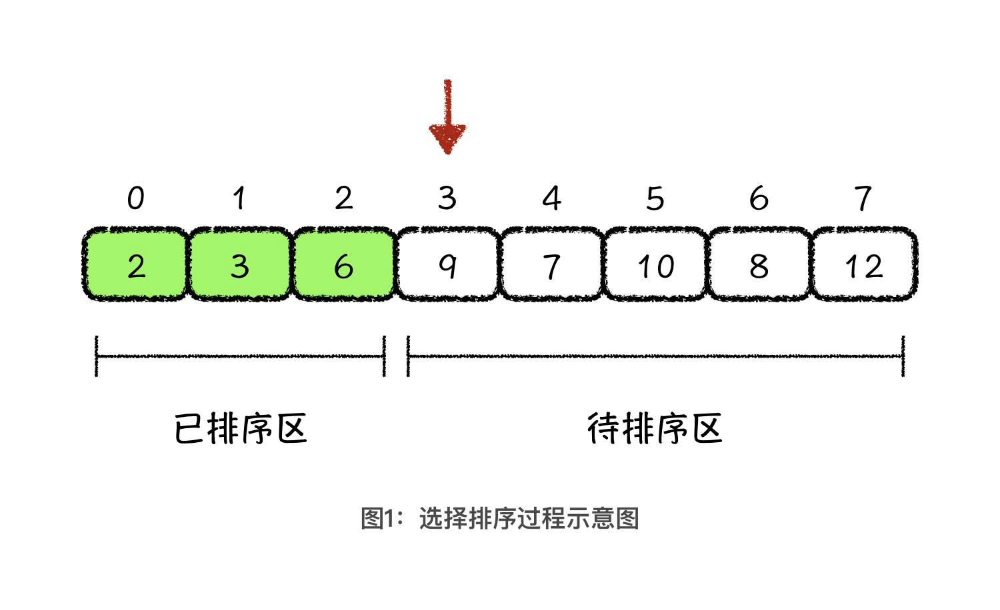
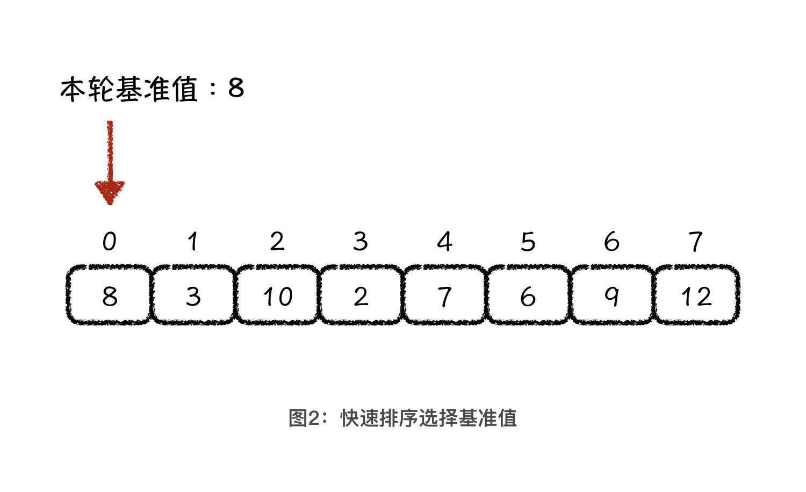
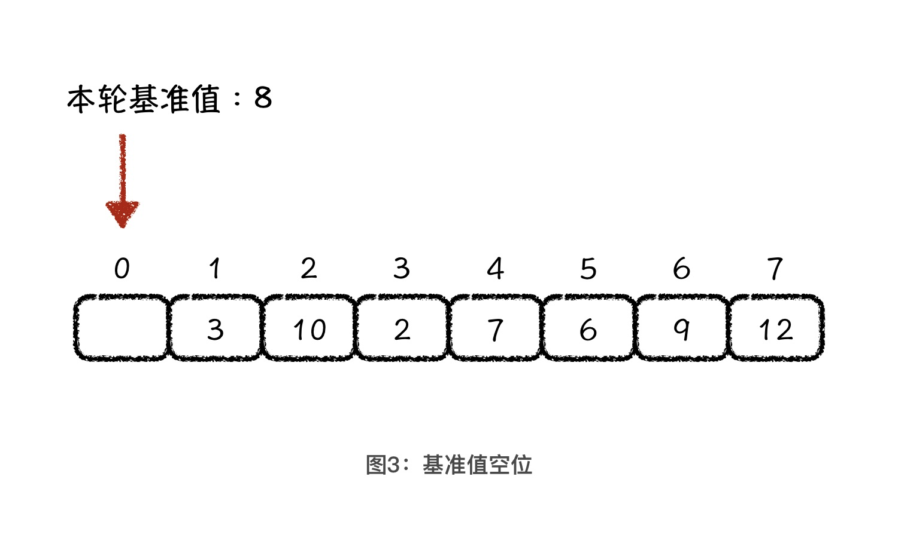
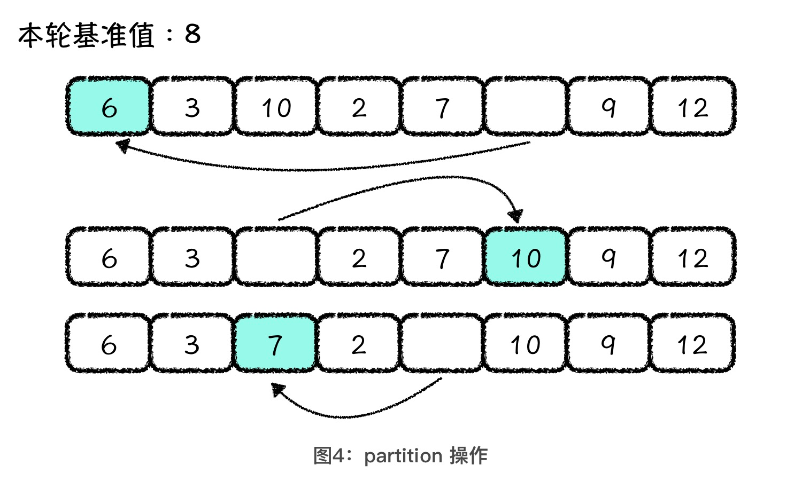
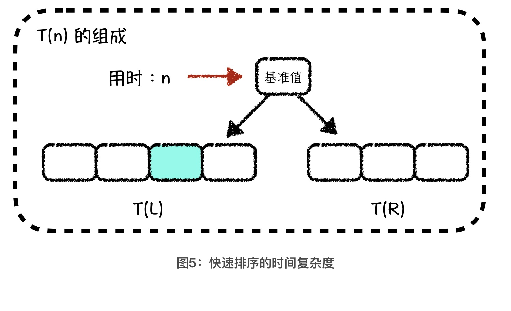
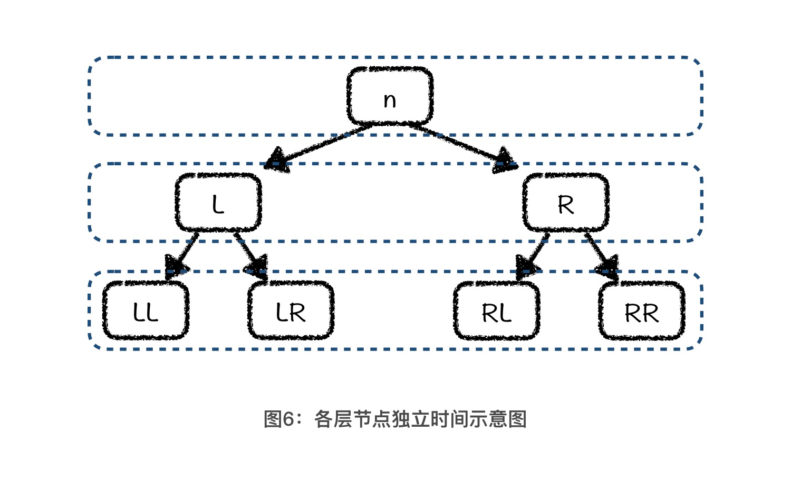

---
date: "2019-06-23"
---  
      
# 01 | 理解快排：打通算法学习的任督二脉
你好，我是胡光。今天是第一节课，我们来聊聊快速排序。

排序算法在工作中最常用，也是学习很多其他算法的前置知识，例如在运用二分查找算法之前，我们通常需要保证数据是有序的，如果数据无序，我们还要对数据进行排序。在程序员的面试中，排序算法也经常会配合其他算法进行综合考察，比如经典的 2-sum 问题，就需要在一组无序数字中，找到两个数字相加之和等于目标值，其中一种做法就是先对数据进行排序，然后采用头尾指针扫描法来解决。所以，想要学好数据结构与算法，掌握排序算法是第一步。

今天，我就给你出一道和排序算法有关的题目：假设给你一组无序的数字，让你找到其中排名第 k 位的数字。你会怎么做？

这道题最简单的解决办法，就是利用选择排序算法，对这组数字进行排序。选择排序的过程如下图所示：

具体来说就是，用选择排序算法将数组中的元素，分成已排序区与待排序区。然后，每一轮从待排序区中选择一个最小值元素，放到已排序区的末尾，也就是待排序区的头部。这样，每一次的选择操作，都会使已排序区的长度增加一位，那经过 n-1 轮选择操作以后，整个数组就是一个有序数组了。

因此，如果我们想找到排名第 k 位的元素，只需要做 \$k\$ 次选择操作就可以了。这种做法的时间复杂度是 \$O\(k\*n\) \$，当 k 值接近 \$n / 2\$ 的时候，时间复杂度就是 \$O\(n\^2/2\) \$。

为了更快地解决今天的这个问题，今天我会给你讲一种经典的排序算法，**快速排序**（Quicksort）算法。

快速排序是一种优秀的排序算法。这一点毫无疑问，可并不代表这种排序算法就是无敌的，它也有自己的问题。所以在工程实现中，我们往往使用的都是混合排序算法，例如 C++ STL 的 sort，使用的就是“**快速排序+插入排序+堆排序**”的方式。因此，面对算法学习，永远不要功利心太重，因为你永远不会知道，你抛弃掉的是什么样的伟大思想。

除了快速排序算法以外，下节课我还会给你讲一种由快速排序算法所延伸出来的，叫做**快速选择**（Quick Selection）的算法。快速选择算法将是解决我们今天这个问题的终极利器。

在这里，我希望你能记住一点，从今天开始，我们所讲的所有问题，都不止一种解决方案。就像今天这个问题，虽说快速选择算法是我们最后要讲的方法，可实际上，学习了快速排序以后，你也可以既快又好地解决这个问题，只不过使用快速选择会比快速排序更好而已。

## 理解快速排序算法的核心思想

基础的快速排序算法思想很简单，核心就是一句话：**找到基准值的位置**。

具体的过程其实和把大象装进冰箱这个问题一样，都可以分成三步：第一步，选择一个值作为基准值；第二步，找到基准值的位置，并将小于基准值的元素放在基准值的前面，大于基准值的元素放在基准值的后面；第三步，对基准值的左右两侧递归地进行这个过程。这么说还是很抽象，下面我一步一步来给你讲解。

第一步，**选择一个值作为基准值**。最简单的选择方法，一定是选择待排序区间的头部元素作为基准值。如下图所示，我们选择 8 作为本轮排序的基准值。

确定了本轮操作的基准值以后，快速排序的第二步，就是**将小于基准值的元素放在基准值的前面，将大于基准值的元素放在基准值的后面**。这一步通常被叫做 **partition** 操作，中文直译过来就是分割操作，也就是用基准值将原数组分割成前后两部分。

理解了 partition 操作的目的以后，我们再来讨论它具体是怎么做的。partition 操作简单来说，**就是空出一个位置，反复地前后调换元素**。这该怎么理解呢？首先，你要理解一点，当我们选择了基准值以后，原先基准值的位置就相当于被空出来了，也就是说数组的第一位是空着的。

如果第一位是空的，那剩下的事儿就好办了。我们借助这个空位，将后面小于基准值的元素放到前面的空位上，这样后面就空出一位了。然后，我们再将前面大于基准值的元素放到后面这个空位上。就这样交替进行，直到空位前面的值都小于基准值，空位后面的值都大于基准值为止。过程如下图所示：

**快速排序的第三步，是对基准值的左右两侧，递归地进行第一步和第二步**。也就是说，我们要分别对 6、3、7、2 和 10、9、12 这两部分，再做选择基准值、找基准值位置和递归这三步。由于每次 partition 操作中，我们都会确定一个值，也就是基准值的正确位置，所以，经过有限次递归操作以后，整个数组也就变成了一个有序数组。

当然，像上面这样的描述是不严谨的，但它确实是正确的。而且严谨的证明过程太过复杂，我就不详细来说了，如果你还记得数学归纳法和递归程序之间的关系，可以试着用它来证明快速排序算法的正确性。

## 分析快速排序的时间复杂度

看完了快速排序的算法过程，我们再来分析一下快速排序的时间复杂度。我会借助二叉树的结构，来帮助你理解和分析快速排序算法的时间复杂度。

在讲快速排序算法过程的时候，我们说其中最关键的步骤是理解 parition 操作。因此，分析快速排序的时间复杂度，我们也要先来分析 partition 操作这一步的时间复杂度。

在partition 操作的过程中，头指针会循环扫描到基准值最后放置的位置，尾指针也会扫描到最后基准值放置的位置。这样，头尾指针扫描加在一起，其实相当于扫描了整个待排序数组的区域。因此，我们就能得出单次 partition 操作的时间复杂度为 O\(n\)。也就是说，当前数组区间中有 10 个元素时，我们大概操作10 次就能找到**基准值的位置**了。清楚了单次操作的时间复杂度以后，我们就能知道总体的时间复杂度了。

首先，我们要确定总体时间复杂度的公式。我们用 `T(n)`表示对 `n`个元素的数组进行快速排序所用的时间，那么 T\(n\)中应该包括了单次的 partition 操作用时，以及 parition 操作以后，我们对左右两个子数组分别做快速排序所用的时间，也就是 `T(n) = n + T(L) + T(R)`。其中 `n`是单次 partition 操作的用时，`T(L)`和 `T(R)`分别是对左右区间进行快速排序的用时，`L` 和 `R`分别代表左区间和右区间中元素的数量。

接着，我们借助二叉树的结构来求一下T\(n\) 。首先，我们可以将基准值看成是由 n 个元素组成的二叉树的根节点，那么partition 操作就是找到这个根节点的正确位置，总用时就是 n。如果我们将这个用时 n 当做二叉树根节点的独立用时，那么左子树根节点的独立用时就是 L，右子树根节点的独立用时就是 R。这样，我们就得到了这个二叉树第二层上所有节点的独立用时：L + R = n \- 1。我们可以将这个值大致看成是 n。依照此方法，你会得到接下来各层二叉树节点的独立用时，关系如图所示：

其中，每个节点上的数值代表了这个节点的独立用时。 n = L + R + 1，L = LL + LR + 1， R = RL + RR + 1。这也就意味着，第一层上节点的独立用时总和是 n，第二层上节点的独立用时总和是 L + R = n \- 1，第三层上节点的独立用时总和是 LL + LR + RL + RR = n \- 3。

其实，如果n足够大，那每一层上的所有节点的独立用时总和，我们都可以让其约等于 n。那快速排序的总用时，就可以约等于 n 乘上树的层数，也就是树的高度。因此，这棵树的高度越低，快速排序的效率越好，而树的高度越高，快速排序的效率也就越差。这样一来，我们就让树高这个直观的量和快速排序的效率有了概念上的关联。因此，我们只需要分析树高，就能分析清楚快速排序的执行效率了。

那针对有n个节点的二叉树（每个节点代表一个基准值，n 个节点就代表确定了 n 个基准值的位置），我们该怎么确定树高的范围呢？稍微一分析，你会发现，树高最低是 \$\\log\_\{2\}\{\(n+1\)\}\$ ，也就是每个节点的左右两棵子树，所包含节点数量都差不多。这就意味着，我们每次选择基准值的时候，都要尽可能选择处在待排序数组中间的数字。也只有这样，快速排序算法才会达到最好的时间复杂度，也就是 \$O\(nlog\_\{2\}\{n\}\)\$。

结合二叉树的结构，我们分析了快速排序的最好时间复杂度。而快速排序的最坏时间复杂度是O\(n\^2\) ，这又是怎么得到呢？ 你可以参考我的这种方法自己做下分析。从中你就能体会到：**数据结构的价值，在于其思维逻辑结构层面的价值。**

总的来说，上面关于时间复杂度的分析，虽然不是一个严谨的时间复杂度分析过程，可却是一个有效且正确的分析方法。所以，如果你之后有遇到相关算法，完全可以直接应用这样的方法去加深理解。

那现在，你再想想课程一开始给你出的那道题，是不是很容易就能解出来了？过程很简单，我就不细说了，不过，你可以想想使用快速排序解决这个问题的时间复杂度是什么样的。

## 课程小结

今天，我们讲了快速排序的核心的思想，也结合二叉树的结构一起分析了快排的时间复杂度。在这里，我希望你记住两件事情。

第一，**理解partition 操作，是理解快速排序算法的关键**。如果你还没搞懂partition 操作的话，我建议你多花些时间把它搞清楚，这绝对是值得的。

第二，**想要理解快排的时间复杂度，最有效的途径就是掌握二叉树分析法**。其实这种分析方法，不仅可以用于分析我们今天所讲的快速排序算法，后面，当我们讲到归并排序算法的时候也能用得上。甚至可以说，掌握这种思维方式，是打通你算法与数据结构任督二脉的必经之路。

## 课后练习

最后，我教你一招儿快速检验学习成果的方法，你可以试着把快速排序算法是什么，它的核心思想等等，用最简洁的语言讲给你身边不会快速排序的人听，只要他能听懂，遇到简述快速排序算法的面试题，你就不会有任何问题了。

好了，今天就到这里了，你理解快排了吗？那你的朋友们理解快排吗？如果它对你有帮助，欢迎你把今天的内容，分享给你的朋友们。我是胡光，我们下节课见！

* * *

[课后参考代码](https://github.com/alicia-ying/wang.git)