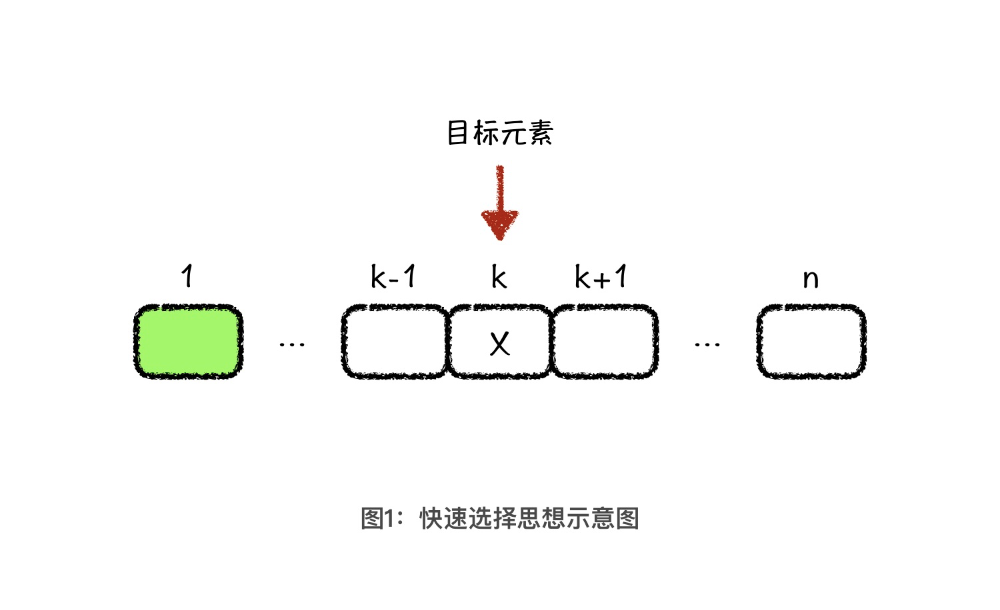
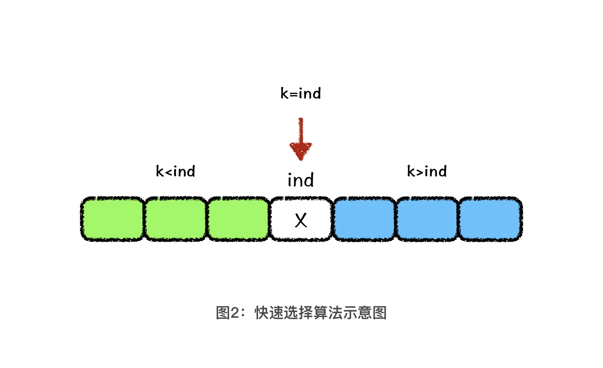
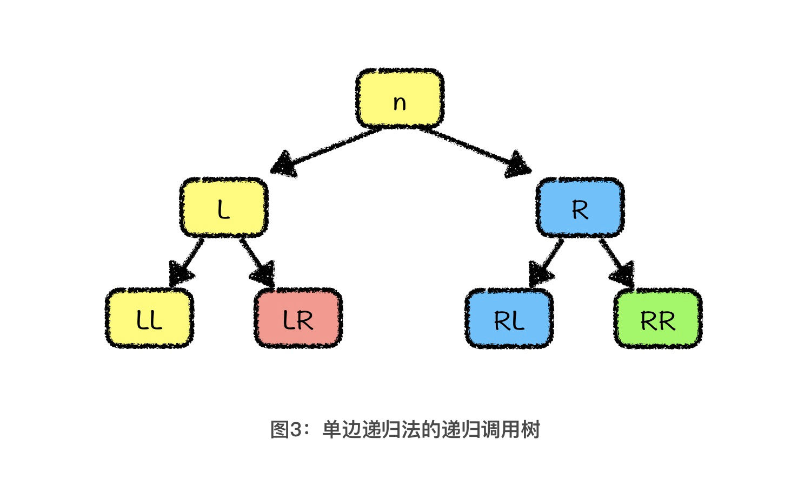
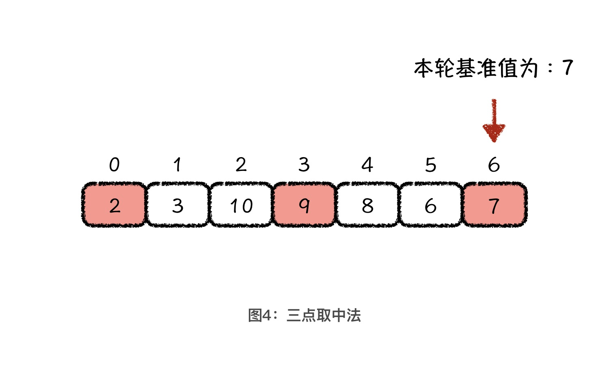
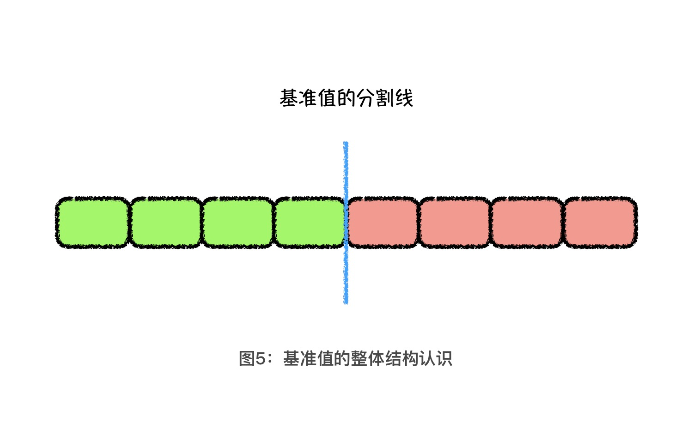
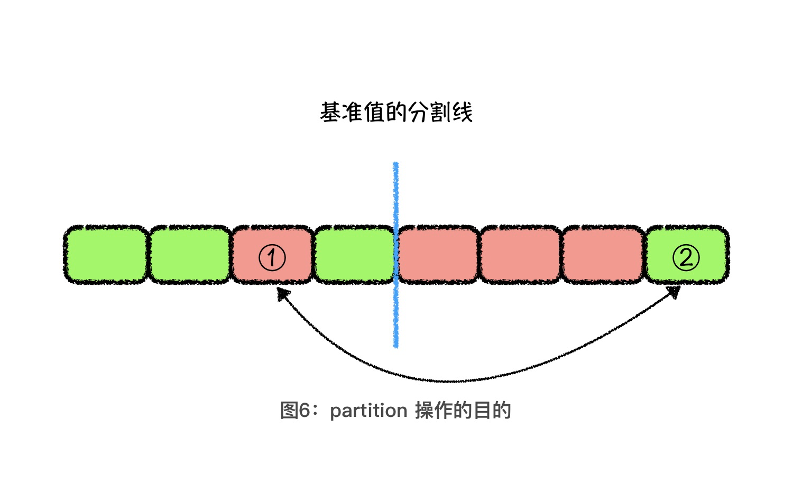

---
date: "2019-06-23"
---  
      
# 02 | 快排优化：举一反三，轻松面对快排面试题
你好，我是胡光，欢迎回来。今天我们来聊聊快排算法的升级。

我们知道，用快速排序算法在一堆无序的数字中查找第k位元素，需要先对原数字序列快速排序以后，才能输出第k位元素。这样整体的时间复杂度，如果控制得好的话，可以达到 \$O\(nlogn\)\$，但是这个方法存在2个问题。

首先，我们是想求排名第 k 位的元素，又不是真的想对整体序列进行排序。如果对全部数学序列进行快排，我们实际上**做了大量的无用操作，这会导致算法效率很低**。其次，快速排序算法的时间复杂度不稳定，很有可能退化到最坏的时间复杂度\$O\(n\^2\)\$。

那有没有不需要排序，且效率更高的做法呢？或者，就算依然要使用快速排序算法，我们要如何才能让它的时间复杂度大概率稳定在\$O\(nlogn\)\$呢？

今天，我们就带着这两个问题，来继续查找第k位的元素。

针对第一个问题，我们可以使用快速选择算法解决。快速选择算法是基于快速排序算法的一种拓展算法，它可以在不对数据整体进行排序的前提下，快速找到排名第 k 位的元素，而且时间复杂度还能优化到 \$O\(n\)\$。而对于第二个问题，我会给你讲几种快速排序中的优化方法。这些优化方法，会使你应对快速排序相关的面试题的时候，更加游刃有余。

## 理解快速选择算法的核心原理

首先，我们来看快速选择算法。快速选择算法的基本思想是，当我们需要快速找到一个元素 X，并且使得小于 X 的元素数量是 k-1 个时，那 X 就是我们要查找的排名第 k 位的元素了。



这也就意味着，我们没必要对原数组进行整体排序，只需要找到满足上面我们所说条件的元素 \$X\$ 即可。这一点你有没有觉得很熟悉？没错，这和 partition 过程很像。partition 过程就是在每一轮排序中找到一个基准值元素的正确位置 ind ，并且它最厉害的地方在于，它会用基准值将数组分成前后两部分，小于等于基准值的元素在前面，大于等于基准值的元素在后面。

那我们是不是可以用 partition 过程实现快速选择呢？接下来，让我们先来分析一轮 partition 过后，基准值元素的排名 ind 与 k 之间的关系。我把可能出现的三种情况都列了出来：

* 如果 ind 正好等于 k，那说明**当前的基准值，就是我们要找的排名第 k 位的元素**；
* 如果 ind 大于 k，说明排名第 k 位的元素在基准值的前面。接下来，我们要解决的问题就是，**在基准值的前面查找排名第 k 位的元素**；
* 如果 ind 小于 k ，就说明排名第 k 位的元素在基准值的后面，并且，当前包括基准值在内的 ind 个元素，都是小于基准值的元素。那么，问题就转化成了，**在基准值的后面查找排名第 k - ind 位的元素**。

这么说你可能还不是特别理解，下面，我们再结合下面的示意图理解一下。假设本轮基准值为 X，绿色区域中的值均小于 X，蓝色区域中的值都大于 X，基准值的位置是 ind。当 k \< ind 时，下一轮我们就在绿色区域中继续查找，当 k > ind 时，下一轮我们就在蓝色区域中继续查找。这个过程，其实有点儿类似于二分查找的思想。



也就是说，经过一轮 partition 操作以后，我们总能将**在当前数组中查找排名第 k 位元素**的问题，转化成递归子问题。也就是**在基准值的前面查找排名第 k 位的元素，**或者**在基准值的后面查找排名第 k \- ind 位的元素**。

那快速选择算法的时间复杂度究竟是多少呢？分析起来很简单，你可以自己试试。为了便于你验证自己的分析结果，先给你个结论：**快速选择算法的时间复杂度，最好情况是 \$O\(n\)\$ ，最坏情况是 \$O\(n\^2\) \$，平均情况是 \$O\(n\)\$** 。并且，为了让快速选择算法能够发挥得更稳定，我们需要在选择基准值的时候做一些优化。具体优化方法，你可以参考快排优化中的基准值选择优化，我们马上就会讲到了。

## 三种快排优化

以前我在做面试官的时候，当问到面试者会不会快速排序，他们都会回答：会。但如果我让他们说一下快速排序的内容，80\% 的面试者都只能说出快速排序的基础知识，也就是我们上节课讲过的内容，只有 20\% 的人能说出快排的优化内容。当然了，能说出这20\%内容的人面试分数就会相对更高。

那么为了让你对快排的理解更加深刻，也在面试的时候能多一些“谈资”，我会给你讲三个比较常见的快排优化，分别是**单边递归优化、基准值选取优化**和**partition 操作优化**。

### 优化一：单边递归优化

第一个优化被形象地称为：单边递归优化。这是什么意思呢？

我们知道，在快排函数的实现过程中，当本层完成了 partition 操作以后，剩余的工作就是等待着左边和右边的排序完成。代码如下所示：

```
    quick_sort(arr, l, x - 1); // 对左半边排序
    quick_sort(arr, x + 1 , r); // 对右半边排序
    

```

这段代码就分别对基准值的左右两边进行了排序的递归调用。从程序的运行时间来考虑的话，我们每次函数调用，都会消耗掉一部分运行时间。那只要我们可以**减少函数调用的次数**，其实就可以加快一点程序运行的速度。

因此，单边递归优化的方式，就是当本层完成了 partition 操作以后，让本层继续完成基准值左边的 partition 操作，而基准值右边的排序工作交给下一层递归函数去处理。



经过单边递归优化后生成的递归树如上图所示，为了方便你理解，我把在同一个函数调用内的操作用同样的颜色表示。一共用了黄色、红色、蓝色、绿色这4种颜色，也就是说我们实际调用了4次函数。而如果不采用单边递归法，实际发生的函数调用次数就是图中二叉树的节点个数，也就是7次。可见，我们采用了单边递归法以后，函数实际调用次数减少了一半。

下面是一段单边递归法的代码：

```
    void quick_sort(int *arr, int l, int r) {
        while (l < r) {
            // 进行一轮 partition 操作
            // 获得基准值的位置
            int ind = partition(arr, l, r);
            // 右侧正常调用递归函数 
            quick_sort(arr, ind + 1, r);
            // 用本层处理左侧的排序
            r = ind - 1;
        }
        return ;
    }
    

```

从代码中可知，l 和 r 是数组中待排序的区间范围，ind 是本轮 partition 操作后基准值的位置。当找到基准值的位置以后，对于右侧从 ind + 1 到 r 位置，我们就正常调用递归函数。然后，我们通过将 r 设置为 ind \- 1，直接利用本层 while 循环逻辑，继续对左侧进行 partition 等相关排序操作。

### 优化二：基准值选取优化

说完了单边递归，我们接着来说**快排中对于基准值选取的优化**。我们知道，如果基准值选取不合理的话，快速排序的时间复杂度有可能达到 \$O\(n\^2\)\$ 这个量级，也就是退化成和选择排序、插入排序等算法一样的时间复杂度。只有当基准值每次都能将排序区间中的数据平分时，时间复杂度才是最好情况下的 \$O\(nlogn\)\$。

当然，我们没有办法在一个无序数组中，用 \$O\(1\)\$的时间复杂度找到一个可以将数组平分的基准值。退而求其次，我们能不能尽可能地找到一个可以大概率将数组平分的数字呢？这就是接下来我要给你讲的，关于基准值选取的一个优化策略，三点取中法。



所谓**三点取中法**，就是每一轮取排序区间的头、尾和中间元素这三个值，然后把它们排序以后的中间值作为本轮的基准值。当然，你也可以根据自己的理解，调整要选取的这三个值的位置。我们就以上图为例，假设本轮的三个值分别为2、9、7，中间值是7，所以，本轮的基准值就是 7。

在实际应用中，由于基准值选择不合理而陷入最差情况的概率，我们利用三点取中法就已经可以大幅度降低了。而且，这种方法实现起来也比较简单，所以 C++ STL 中的 sort 实现，其实就是采用的这种基准值选择优化策略。

### 优化三：partition 操作优化

前面我们讲的两种优化方法，分别是从**递归代码结构**和**基准值选取**这两方面对快速排序做了优化。下面，我再给你讲一种对 partition 代码实现过程进行优化的方法。这种优化方法很容易被我们忽略。那它到底是怎么优化的呢？

在说它之前，我们先来回顾一下 partition 的实现过程：先从后向前找个小于基准值的数字放到前面，再从前向后找个大于基准值的数字放到后面，直到首尾指针相遇为止。其实，想要比较容易地理解这个过程，我们可以假设基准值的位置是数组中间的一条分割线，小于基准值的都是绿色元素，大于基准值的都是红色元素。如下图所示：



这个时候，你可以想一想，在什么情况下，我们才需要将基准值后面的元素调换到前面？一定是因为这个分割线后面有绿色的元素。而且，基准值的客观位置不变，红色与绿色元素数量是确定的，所以存在多少个绿色元素在基准值位置的后面，就一定存在多少个红色元素在基准值位置的前面。



那 partition 操作的目的，就是要把基准值位置后面的绿色元素调整到前面，将基准值位置前面的红色元素调整到后面。也就是交换上图中 1、2 号元素的位置。既然需要调换的红色与绿色元素的数量相同，我们就可以让头指针向后查找红色元素，尾指针向前查找绿色元素，然后交换头尾指针所指向的元素，重复这个过程，直到头尾指针交错后停止。这就是对partition 操作进行的优化。

## 课程小结

这节课，我们讲了快速选择算法，和针对快速排序算法的三种优化。这里，我希望你能记住4件事情：

1.  快速选择算法可以用来快速查找一个序列中排名第 k 位的元素；
2.  单边递归法可以使快排过程中的递归调用次数减少一半，并且，这种优化方法也可以使用在所有和快速排序类似的程序结构中；
3.  三点取中法能帮助我们选出更加合理的基准值，保证快速排序的运行效率；
4.  优化 partition 的操作，通过减少程序实现中的比较操作，来提高程序的运行效率。

其中，关于快速排序的三种优化方法中，第二种优化，是为了使快速排序的时间复杂度尽量稳定在 \$O\(nlogn\)\$ 而提出来的，而第一种和第三种优化，没有对时间复杂度做优化，而是对程序的实际运行时间做了优化。对于实际工作而言，往往第一种和第三种优化，对我们的启发会更大一些。毕竟，公司内部的一个成型的技术或者产品中，能让你优化时间复杂度的部分可太少了。大多数时候我们能做的，就是切实可行地让系统运行得更快一些。

另外，我还要补充一点。在使用快速选择算法求解排名第 k 位的元素的过程中，其实当我们通过快速选择算法求得了第 k 位的元素值之后，再加上第 k 位元素值之前的元素，其实就找到了前 k 位的元素值。换句话说，快速选择算法不仅可以用于求解第 k 位的元素，也可以用于求解前 k 小或者前 k 大元素等问题，也就是所谓的 Top-K 问题。

如果你要参加面试，Top-K 问题也是经常被问到的一类问题。之后遇到具体问题的时候，我会详细来讲。

## 课后练习

1.  请你参考partition 方法的优化代码，想想为什么这样的 partition 实现方法会比我们上节课实现的 parition 方法更优化。这里我给你个提示，这个新的 partition 实现方法，比旧的 partition 方法做了更少的比较操作，那具体少了多少呢？请你分析以后，把思考结果留在评论区中吧！

2.  你知道快速选择算法的时间复杂度是怎么得到的吗？你可以借助上节课我们讲的二叉树的方法来试着分析一下。

好了，今天就到这里了。如果你的朋友也正在为快排优化的问题而头疼，那就快把这篇文章分享给他吧！我是胡光，我们下节课见！

* * *

[课后参考代码](https://github.com/alicia-ying/wang.git)