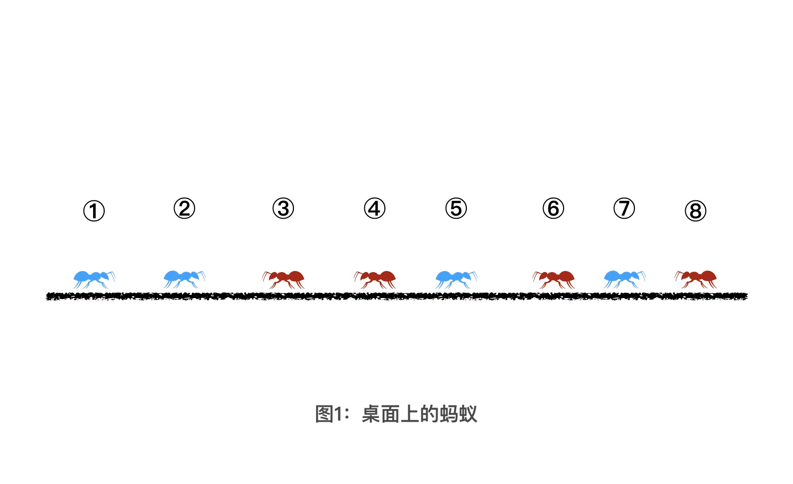
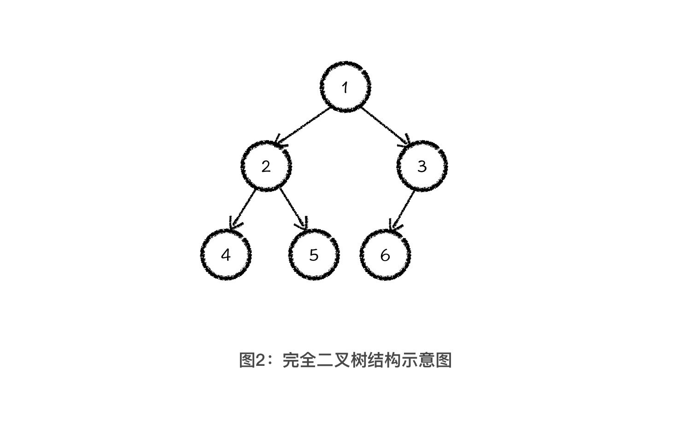
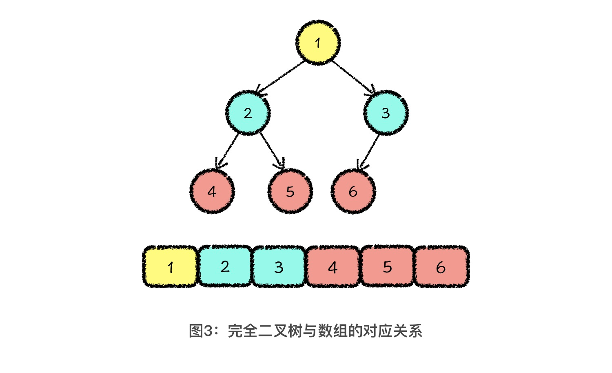
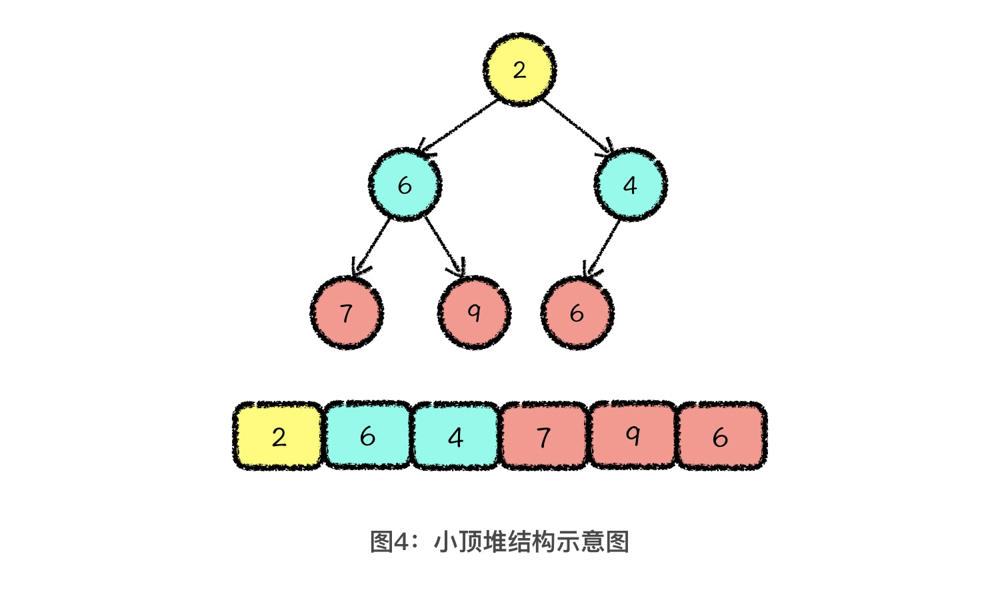
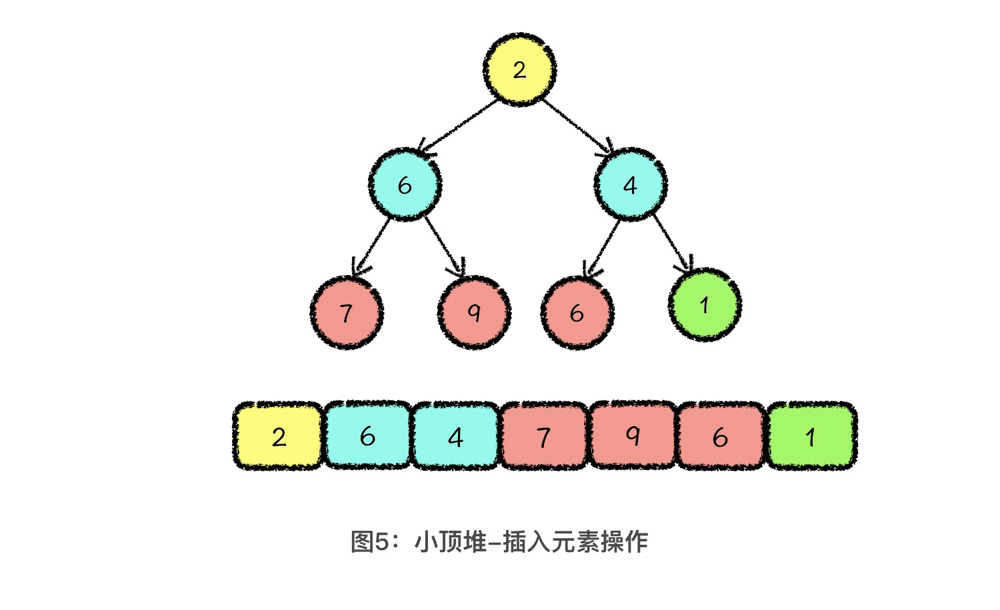
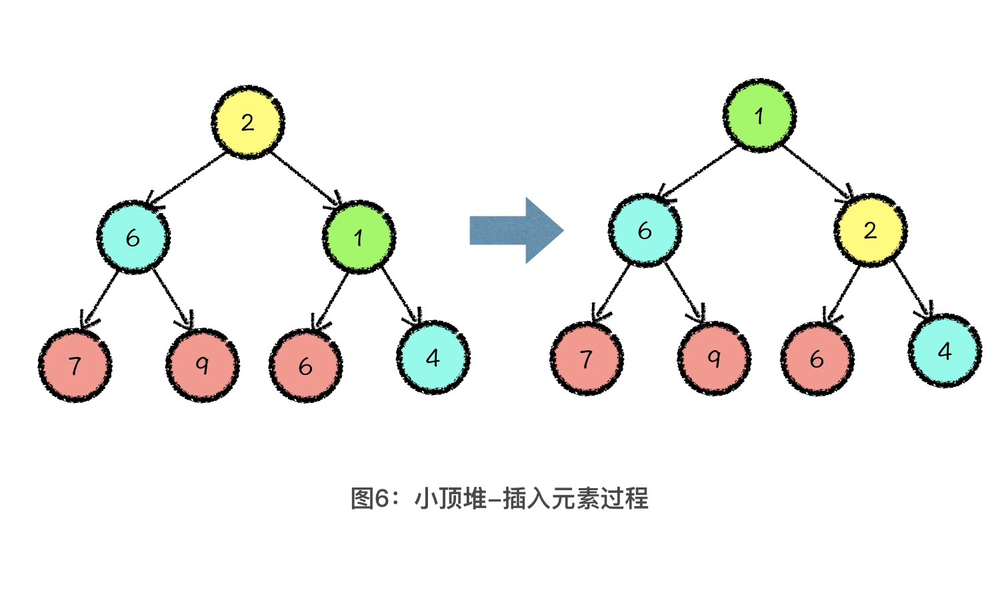
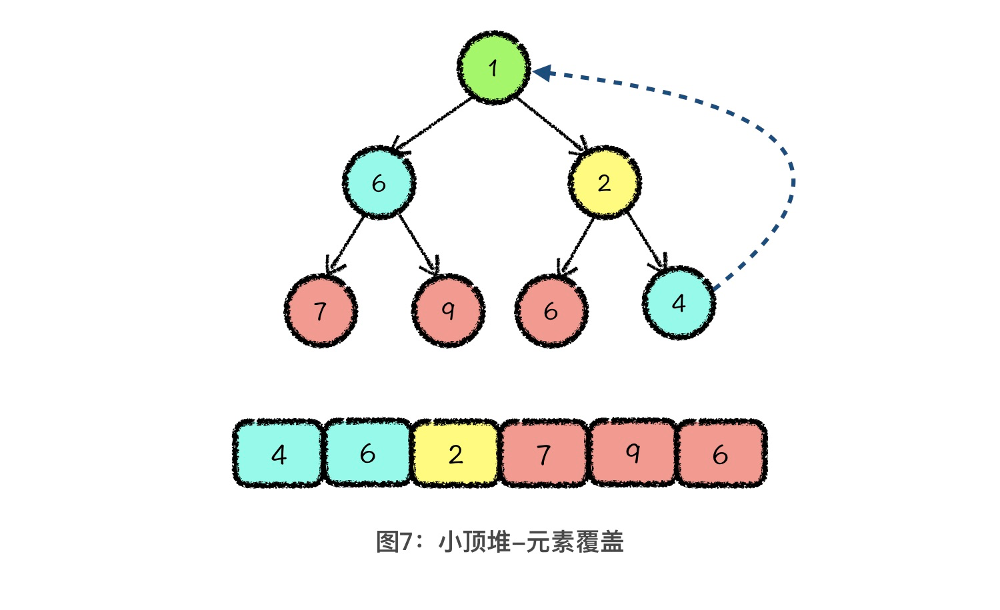
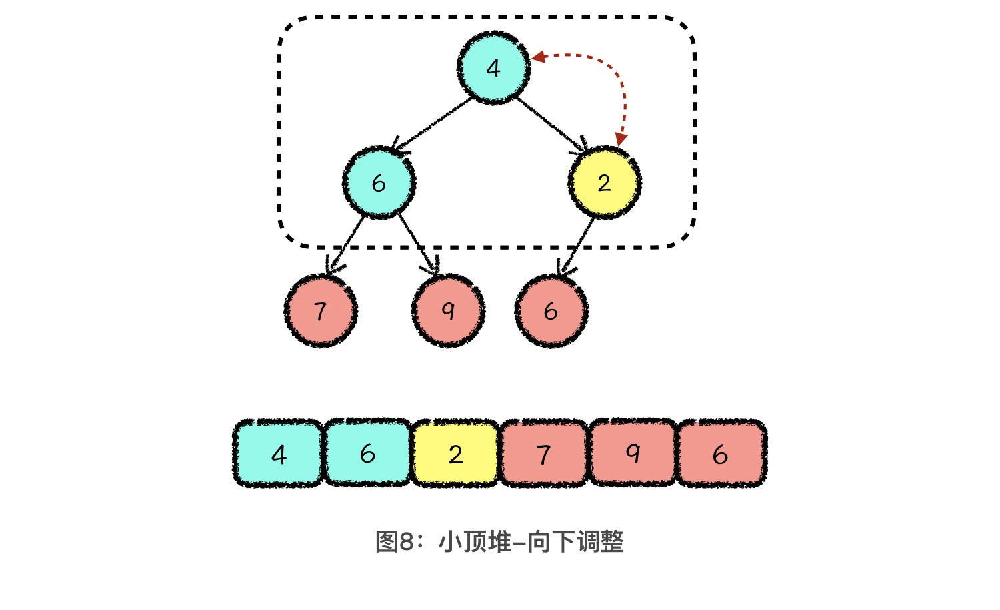
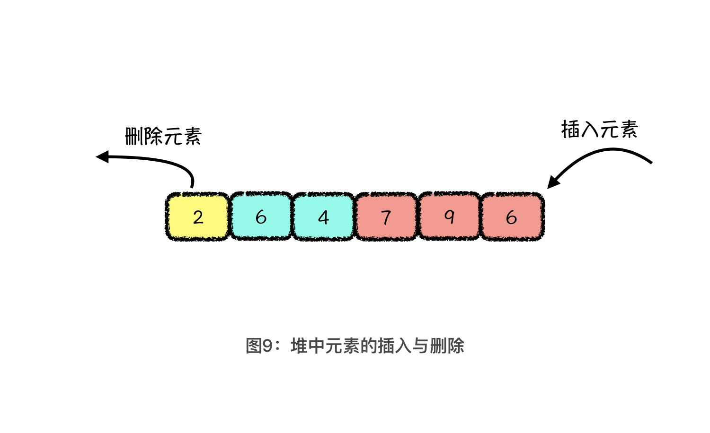

---
date: "2019-06-23"
---  
      
# 03 | 二叉堆：动态维护集合最值的利器
你好，我是胡光，欢迎回来。今天，我们开始学习**堆排序**（Heapsort）。

堆排序是利用堆这种数据结构完成的排序。所以，在了解堆排序之前，我们需要先了解“堆（Heap）”这种数据结构。可以说，在维护集合最值的操作上，堆是一种简单、易懂、且非常高效的数据结构。

那我们先来看一个比较经典的堆问题：蚂蚁问题。

假设现在有一个水平面，上面有8只蚂蚁排成一排。方便起见，我们给所有的蚂蚁从左到右依次编号，编号为 1 到 8。从0秒开始，红色蚂蚁向左爬，蓝色蚂蚁向右爬，爬行的速度都是1m/s。如果有 2 只蚂蚁迎面碰到以后，这 2 只蚂蚁不会做任何的感情交流，而会立刻掉头向相反方向继续爬行。而爬行到桌子边沿的蚂蚁，会从桌子上掉下去。问：有哪些蚂蚁会从左边掉下去，又有哪些蚂蚁会从右边掉下去？

如果你是第一次看到这个问题，肯定会有点儿懵，不知道从何下手解决。不过没关系，我会先一点一点地帮你补足堆相关的基础知识，然后咱们再一起解决这个问题。那我们就先从最基础的二叉堆开始讲起吧！

## 理解完全二叉树基础

既然要讲堆这种结构，就离不开一种特殊的二叉树，也就是完全二叉树（Complete Binary Tree）。因为堆就是一种具有特殊性质的完全二叉树。什么是完全二叉树呢？完全二叉树是由满二叉树去掉最后一层右侧的若干节点而形成的二叉树结构。这么说你可能没概念，你可以直接看我在下面中给出的示例，它就是一个包含 6 个节点的完全二叉树。

完全二叉树有一个很优秀的性质，**就是可以被存储在一片连续的数组空间中**。这怎么理解呢？还是看上面这个示意图，如果我们对它的每个节点进行编号，采用从上到下、从左到右的顺序依次标上 1 到 6。那么你仔细观察其中父节点编号与子节点编号之间的关系就会发现，如果父节点编号是 i，其左孩子的编号就是2 \* i，右孩子的编号就是2 \* i + 1。例如，我们以3号节点作为父节点，其左孩子的编号就是 2 \* 3 = 6 号，如果有右孩子，那它右孩子的编号就一定是 2 \* 3 + 1 = 7。

我们再继续深入思考，在一棵有 n 个节点的完全二叉树中，节点编号应该为 1 到 n。这样，我们就可以使用数组的 1 到 n 位对应于这 n 个节点。由于完全二叉树父节点与子节点编号之间的特殊计算关系，因此只要我们知道父节点编号，就可以通过计算得到子节点编号。

这就意味着，即使我们将完全二叉树的所有数据，存储在一个连续的数组空间中，也不会破坏其特殊的树形结构信息。也就是说，一棵完全二叉树可以对应到一段连续的数组空间，而根据数组空间的内容，我们也可以唯一地还原成一棵完全二叉树。

如图所示，这就是完全二叉树与数组的对应关系。

实际上，在计算机中，我们会把数组作为完全二叉树的实际存储结构，而完全二叉树，则是我们重新看待这段数组信息的思维逻辑结构。因此，数据结构最大的价值，就是对我们思维逻辑结构的改造。

## 堆结构的定义

有了完全二叉树这种思维逻辑结构的加持以后，接下来你就可以很轻松地掌握堆这种结构了。堆可以分为两类，小顶堆和大顶堆。

如果在一棵完全二叉树中，每个父节点的值都要小于其两个子节点的值，我们就管这种结构叫做小顶堆。相对应地，大顶堆就是每个父节点的值要大于其两个子节点的值。今天呢，咱们主要拿小顶堆做说明，因为小顶堆学会了，大顶堆自然不在话下。下图就是一个小顶堆的示意图。

根据小顶堆的性质定义，我们可以轻松得知，小顶堆中的最小值一定放在了根节点，也就是存储在数组中的第一个位置。如果我们将数组中的所有元素看成一个集合的话，那小顶堆的作用就非常明显了，就是维护这个集合中的最小值。

为了让你更好地学习堆这种数据结构，我要和你分享一个学习数据结构的公式：数据结构=结构定义+结构操作。结构定义和结构操作是组成数据结构最重要的两个部分，也是你之后在学任何一种数据结构时的重点内容。结构定义就是定义一种性质，结构操作就是维护这种性质。

那现在我们已经知道了堆这种结构的结构定义，下面，我们再来看看堆这种结构支持的两种最基本的结构操作：**插入新元素**和**删除最值元素**。那在详细讲解堆的两种基本结构操作之前，我希望你先牢牢记住一点：**堆的实际存储结构是数组，**这个数组**是一段从下标 1 开始的连续存储空间**。记住这一点之后，我们再接着往下看。

## 堆的插入操作

首先，我们来讲堆的插入操作。如图所示，假设我们想要在堆中放入一个新的元素 1，那么我们可以将这个新的元素，放置到整个数组的最后一位。对应到完全二叉树的思维逻辑结构中，就是向树中的最后一层添加了一个新的叶节点。

这一步的操作叫做**元素放置**。你会看到这么做之后，数组的结构就不满足小顶堆的性质了。所以下一步，我们要调整数组的结构，让它依然满足堆的性质。

由于堆的性质定义中，只规定了父节点与子节点之间的大小关系，所以，我们的调整操作只需要维护父子节点之间的大小关系即可。也就是说，新插入的元素 1，只需要和其父节点进行比较。

结合上面的示意图，我来说一下具体的操作。由于 1 比 4 小，所以我们把1 交换到 4 的位置，然后让1再继续向上跟当前的父节点比较。因为1比 2 小，所以再让它们交换。这一步叫做**向上调整**，它的原理就是在当前元素值小于其父节点值的时候，交换子节点与父节点值的位置，就这样一直向上调整，直到当前节点大于父节点的值或者调整到了堆顶。

这样一来，经过**元素放置** 以及 2 次 **向上调整** 以后，堆中就增加了一个新元素，还依然满足堆的性质定义。这样，我们就完成了向堆中插入元素的操作。具体过程如图所示：

## 堆的删除最值操作

看完了堆的插入操作以后，下面我们再来看看堆的删除操作。

首先，我们要知道，堆的删除操作是有局限性的，这怎么理解呢？我们可以从删除操作的定义入手。堆的删除操作也叫做**删除最值元素**，对小顶堆进行删除操作就是删除最小的元素，其实就是删除数组中第一位的元素。

那为了保证删除最值元素以后，整个堆结构的存储还是从数组的第 1 位开始的，所以我们第一步要做的就是**元素覆盖**，也就是用堆的最后一位元素，覆盖掉堆顶元素。

这里呢，我们就接着前面插入元素后的结果，来继续删除元素。从上图中你可以看到，我们使用数组中的最后一个元素 4，覆盖了堆顶元素 1。接下来，我们就需要通过适当调整，让它重新满足堆的性质。调整的方法其实也很简单，就是从堆顶位置开始，每次从当前元素所在三元组中找到一个最小值，与当前元素交换。交换后，让当前位置的元素继续和下面两个元素比较，如果这个三元组中依然有最小值，那我们就继续**向下调整**，直到当前元素是三元组中的最小值为止。操作过程非常简单，你看下面的示意图就可以理解了。

于是，针对这个小顶堆，我们通过 1 次 **元素覆盖** 和 1次 **向下调整**，就完成了删除最值元素的操作。到这里，我们就学完了二叉堆最基础，也是最重要的两个操作：插入和删除。是不是很简单？

## 拓展内容：优先队列

讲完了堆这种数据结构以后，我还想给你讲讲**优先队列**（Priority Queue\)。

首先，我们先来回想一下堆实际的存储结构和结构操作。之前我们说过，它其实就是一个数组，在插入元素时，从数组的末尾放入元素，而删除元素时，是从数组的头部移出元素。

如果你学习过队列这种结构，肯定能想到，堆的特点其实和队列类似。队列结构就是从尾部入元素，从头部出元素。而且堆这种结构，每次从头部移出的都是当前堆中的最值元素。所以，如果我们把堆的存储结构看成是一个队列的话，那堆就是一种可以灵活控制元素出队优先级的数据结构，我们管这种结构就叫做优先队列。

可能你会好奇，优先队列好像就是堆的别名啊？其实不然。你可以把优先队列当成是一种概念，那它的定义就是一种可以实现根据优先级出队的结构。而堆只是实现优先队列的其中一种方式，当然也是最普遍的方式。所以，在之后的课程中，我们所说的优先队列将特指用堆实现的优先队列。

关于优先队列的实现，我在这节课的最后用 C 语言实现了一下，你可以参考一下我的代码。

到这里，我们就讲完了和堆有关的基础知识。那现在，你能解出课程一开始的蚂蚁问题了吗？我给你一个提示，想要解决这个问题，一种最容易想到的方法就是模拟蚂蚁们的行进过程。你可以想想怎么利用堆来模拟这个过程。至于具体怎么解决，我会在下节课告诉你。

## 课程小结

今天，我们学习了堆这种数据结构的性质及相关操作。

首先，堆是一种特殊的完全二叉树，它可以分为两类，分别是大顶堆和小顶堆。在小顶堆中，每个父节点的值都要小于其两个子节点的值，大顶堆则相反。

其次，堆有两种基本的结构操作，插入操作和删除最值操作。在插入操作中，我们是将新元素放到整个堆结构的末尾，然后对新插入的元素执行向上调整的操作，一直调整到满足堆的结构性质为止。而在删除操作中，我们是将堆顶元素弹出以后，再将堆的尾部元素移动到堆顶，对其执行向下调整的操作，一直调整到满足堆的结构性质为止。

此外，我们还知道了，堆是实现优先队列的其中一种方式，优先队列每次出队的元素，都是队列中优先级最大的值。

最后，我希望你要牢牢记住一句话：堆是用来维护集合最值的高效数据结构。在后续的文章中，我还会帮你深入理解这一句话，让你能够活学活用堆这种数据结构。

## 课后练习

在你的生活中，有哪些场景下的问题可以抽象成维护集合最值的问题？欢迎把你的答案写在留言区。

好了，今天就到这里。我是胡光，我们下节课见。

* * *

[课后参考代码](https://github.com/alicia-ying/jikeshijian.git)