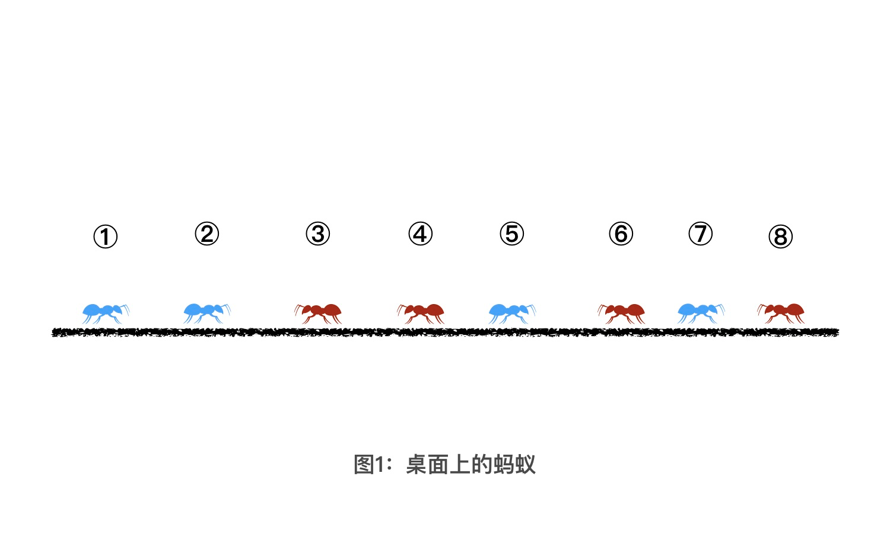

---
date: "2019-06-23"
---  
      
# 04 | 堆排序：体会线性建堆法的威力
你好，我是胡光，欢迎回来。

上节课，我们讲了堆这种维护集合中最值的高效数据结构，也留下了一道经典的算法题，蚂蚁问题。这节课，我们一起来看看怎么利用堆来解决它。

我们先回顾一下上节课的问题。

假设现在有一个水平面，上面有8只蚂蚁排成一排，我把这张示意图放在了文稿中。方便起见，我们给所有的蚂蚁从左到右依次编号，编号为 1 到 8。从0秒开始，红色蚂蚁向左爬，蓝色蚂蚁向右爬，爬行的速度都是1m/s。如果有 2 只蚂蚁迎面碰到以后，这 2 只蚂蚁不会做任何的感情交流，而是会立刻掉头向相反方向继续爬行。而爬行到桌子边沿的蚂蚁，会从桌子上掉下去。问：有哪些蚂蚁会从左边掉下去，又有哪些蚂蚁会从右边掉下去？

## 怎么解决蚂蚁问题？

要搞定蚂蚁问题，首先你需要把自己带入到问题场景中，只有充分理解了问题场景，才能更好地解决这个问题。下图是一个蚂蚁问题的具体场景：

从图中我们可以看出，2、3 号蚂蚁会相撞，5、6 号蚂蚁会相撞，7、8号蚂蚁也会相撞。因为相撞以后的两只蚂蚁的方向会改变，所以 2、3 号蚂蚁相撞以后，2 号蚂蚁会向着 1 号蚂蚁所在的方向行进，3号蚂蚁会向着4号蚂蚁所在的方向行进。这样，在之后的某个时刻，1、2 号蚂蚁，3、4 号蚂蚁就会相撞。

那要想知道最终有哪些蚂蚁会分别从左、右两边掉下去，一种最基本的解法，就是根据时间顺序来模拟蚂蚁们的相撞过程。具体怎么做呢？下面，我们先模拟分析一下这4只蚂蚁的相撞过程。

如图所示，一共有4只蚂蚁，我们从1到4给它们编号。最开始，它们之间的距离分别是3米、1米 和 6米。其中，2号和3号离得最近，并且方向相对。因为蚂蚁的移动速度是1m/s，所以2号和3号会在 0.5s 的时刻相撞，然后它们会向相反方向爬去。

这个时候，1号和2号方向相对、3号和4号方向相对，并且1号和2号距离最近。所以下一次最先相撞的，应该是在1、2号蚂蚁.通过计算我们能知道，它们会在 2s 的时刻相撞。相撞之后，2、3号蚂蚁同向而行，3、4号蚂蚁相向而行。

由此我们能得出一个结论，想要模拟蚂蚁相撞的过程，我们就要找到当前时刻距离最近的两只相向而行的蚂蚁。请你注意这句话：**我们要找到当前时刻距离最近的两只相向而行的蚂蚁**。那在一堆距离数据中，每次找到一个最小的距离，这不就是小顶堆的经典应用场景吗？因此，解决这个问题的关键，就是使用小顶堆来存储当前桌面上所有相向而行的蚂蚁之间的距离。

### 1\. 用小顶堆解决蚂蚁问题

确定了使用小顶堆以后，我们又要面临一个新问题，那就是相向而行的蚂蚁之间的距离会随着时间而变化。就像两只蚂蚁一开始的相对距离是6米，下一秒就可能会变成5米。而我们现阶段所掌握的堆结构，并不支持存储动态更新的数据。这该怎么办呢？

其实解决起来也很简单，只要我们存储在堆中的是两只蚂蚁在固定时刻的相对距离，比如 0 时刻，我们就可以不用更新堆中的数据。

需要注意的是，两只蚂蚁在时刻 0 时的相对距离，不是指时刻 0 时这两只蚂蚁的真实距离，而是逻辑距离。这两个距离有什么不同呢？我们还是通过一个具体的例子来理解。

如上图所示，在 0s 的时候，3、4号蚂蚁是同向而行的，距离是6米。在 0.5s 的时候3号蚂蚁发生了转向，这个时候3、4号蚂蚁开始了相向而行。此时，3、4号蚂蚁之间的实际距离是6米，也就意味着，它俩会在 3.5s 的时候相遇。

这个时候，我们从逻辑上面让两只蚂蚁退回去，它们会以每秒钟 2 米的速度远离对方。也就是说，在 0s 的时候，逻辑上这两只蚂蚁的距离应该是 7m，所以我们存储到堆中的数据应该是逻辑上的 7m，而不是 3、4 号蚂蚁在 0s 时候的实际距离 6 米。

理解这一步的重点，在于理解堆中的数据是不可以动态更新的，所以我们要将两只蚂蚁在0时刻的逻辑距离存储到堆中。当然你也可以直接将两只蚂蚁相遇的绝对时间存储在堆中，作为堆中元素排序的依据，然后按照蚂蚁相遇的绝对时间，来模拟蚂蚁们的相撞顺序。这样，我们就能得到蚂蚁们全部相撞后的爬行顺序了。

到这里，我们就讲完了如何用模拟的方法来解决蚂蚁问题。其实解决的核心就在于用堆来维护蚂蚁之间相撞的顺序。

### 2\. 蚂蚁问题最快的解法

实际上，除了使用小顶堆，蚂蚁问题还有一种更简单的解决方式，那思路是什么呢？其实一句话就能说明白：**一只向右走的蚂蚁和一只向左走的蚂蚁碰撞之后，会变成一只向左走、一只向右走。也就是说，碰撞并不会改变桌面上向左和向右的蚂蚁总数**。

而且通过前面的分析，你也会发现，无论怎么碰撞，蚂蚁之间的相对顺序是不会改变的（不管怎么碰撞，蚂蚁的顺序不会改变）。最后，只有向左走的蚂蚁，才有可能从左边的桌子边掉下去，向右走的蚂蚁会从右边的桌子边掉下去。所以在图1中，一开始有4只蚂蚁是向左走的，也就意味着，最后1、2、3、4这四只蚂蚁会从左侧桌子掉下去，剩余的蚂蚁会从右侧桌子掉下去。

怎么样，上面这种方法，是不是比用小顶堆模拟的方式更容易理解和实现呢？你可能要问了，那我们为什么还要学习小顶堆这种更麻烦的解决方案呢？这就好比，你现在的目标是要画一个圆，我可以选择给你一个印章，你只需要用印章往纸上盖一下，就会得到一个圆。可如果将来，你面对的任务是画一个正方形，又该怎么办呢？因此，你真正需要的是一支笔，而不是一个固定形状的印章，而小顶堆就是这支笔。今天呢，我们就是在锻炼这支笔的使用方式。我也希望，今后如果碰到画正方形或者三角形之类的问题，你能想起来使用这支笔。

## 堆排序

搞定了蚂蚁问题以后，我想再和你说说，由堆衍生出来的一种排序算法，堆排序。

那堆排序怎么理解呢？我们还是先看一个例子。假设我们要对一个数组从小到大进行排序，首先我们可以将原数组中的数据建立成一个大顶堆。这样，最大的元素就会在数组的首位，大顶堆的存储结构如上图。正常情况下，从堆中删除一个元素，是直接将堆顶元素弹出，然后将堆中最后一位的元素放到堆顶，再做向下调整的。这样的话，原来堆中的末尾元素位置就空了出来。

现在，由于要对原数组进行排序，因此我们可以把弹出的堆顶元素与堆中的末尾元素进行位置交换，再向下做调整。也就是将图中的元素9和4做调换，再对4做向下调整。经过一轮这样的操作，我们就可以将一个堆顶的最大值放到正确的排序位置上。我在下图中给出了三轮操作以后，数组中元素的排序情况：

如图所示，经过三轮弹出大顶堆顶元素的操作以后，原数组中最大的三个值就被放置到了最后三位。当大顶堆中元素弹空时，也就完成了对原数组排序的过程。

好了，那我们来总结一下堆排序的流程：

1.  在原数组上建立堆结构
2.  将堆顶元素与堆末元素进行调换，再对堆顶元素进行向下调整
3.  经过 n 轮操作以后，数组中的元素就有序了

通过我前面的解释，相信你应该已经理解第2、3步了，它们操作起来非常简单，我就不再细说了。而对于第 1 步，如果想在一个数组上建立一个堆结构，我们要怎么做呢？

一种最直接的方式，就是我们先将原数组分成两部分，前半部分是堆，后半部分是数组中的元素。然后通过堆的向上调整策略，我们依次将后面的元素插入到前面的堆结构中。下图展示的就是用这种尾插法建堆的前三轮数组中的元素情况：

这种建堆的方法比较直观，所以建堆的时间复杂度我们很容易就可以计算出来，就是 O\(nlogn\)。到这里，我们就算是掌握堆排序的整个流程了。

## 堆排序优化：线性建堆法

其实，对于堆排序中建堆的这个流程，我们还可以再优化，优化的方法叫做线性建堆法。线性建堆法就是将原数组分成两半部分，前半部分是数组部分，后半部分是已经建好的堆，然后采用向下调整的方式，从后向前依次将数组中的元素调整到堆中。如下图所示：

因为在上图这个数组中，处在堆中最下一层的 8、9、7这 三个节点，已经无法向下调整了，所以我们在初始化的时候，就直接把它们三个当成是已经调整好的堆结构就好了。之后，我们从元素4开始，向前依次将4、6、2三个元素进行向下调整，插入到他们下面的堆结构中。具体的过程，你直接参考正常的堆结构向下调整过程就可以理解了，我就不细说了。

事实上，这种所谓的线性建堆法，用的就是向下调整策略。而之前我们学习的尾插法，用的是向上调整。两者好像没有太大的区别。那怎么能说线性建堆法比尾插法要优化呢？下面，我们来简单分析一下它们的时间复杂度，你就能明白了。

首先，假设堆中的节点数量是 n，那么树高就是 \$log\_\{2\}\{n\}\$。其中，根节点可能需要向下调整 \$log\_\{2\}\{n\}\$次。根节点下面的2个子节点，可能需要向下调整 \$log\_\{2\}\{n\} \- 1 \$次，第三层的4 个子节点，可能需要调整\$ log\_\{2\}\{n\} \- 2 \$次。也就是说，有 \$2\^i \$个节点，可能需要向下调整 \$log\_\{2\}\{n\} \- i \$次。最后，我们算出所有节点需要调整的总次数，就能得到如下式子：

\$\$  
\\begin\{array\}\{c\}  
\\operatorname\{sum\}=1 \\times \\log \_\{2\} n+2 \\times\\left\(\\log \_\{2\} n-1\\right\)+4 \\times\\left\(\\log \_\{2\} n-2\\right\) \\ldots \\\\\\  
2 \\operatorname\{sum\}=2 \\times \\log \_\{2\} n+4 \\times\\left\(\\log \_\{2\} n-1\\right\)+8 \\times\\left\(\\log \_\{2\} n-2\\right\) \\ldots \\\\\\  
2 \\operatorname\{sum\}-\\text \{sum\}=2+4+8+\\ldots+\\left\(2\^\{\\log \_\{2\} n\}=n\\right\)-\\log \_\{2\} n \\\\\\  
\\approx 2 n  
\\end\{array\}  
\$\$

因此，线性建堆法之所以称为线性，是因为时间复杂度真的为 O\(n\)。总之，线性建堆法的思想很好理解，因为在二叉树中，每向下一层节点数量就会翻一倍。所以在线性建堆法中，如果某一层包含的节点数量越多，那这一层中每个节点的调整次数就越少。这样，我们就能尽可能保证整体效率的最优。用一句话总结就是“让少数人多动，多数人少动”。

## 课程小结

今天，我们用两种方法解决了蚂蚁问题。

第一种是利用小顶堆结构，来维护最近相撞的两只蚂蚁的距离，模拟出蚂蚁的相撞过程，确定最终的蚂蚁排序。第二种方法类似脑筋急转弯比较取巧，你只需了解就可以了。

除此以外，我们还学习了堆排序算法以及一种更高效的建堆方式线性建堆法。线性建堆法思想简单来说，就是利用向下调整策略，当节点越多的时候，我们的调整次数就越少。因此，它的时间复杂度是 O\(n\)。

最后，我希望你通过今天的学习，能够记住用堆解决蚂蚁问题的过程，以及推导线性建堆法的时间复杂度的过程。这会对你之后的学习和工作，非常有帮助。

## 课后练习

因为蚂蚁问题是一个锻炼思维方式的好题目。所以，我希望你能深入去想一想，如果蚂蚁问题不是发生在桌面上，而是在一个圆环上的话。那经过 n 秒以后，你能输出每个蚂蚁的位置吗？欢迎在留言区把你的思考和具体做法写下来，我们一起讨论。

如果你身边的朋友也被类似的问题“难住”过，那就快把这节课分享给他吧！今天就到这里，我是胡光，我们下节课见！

* * *

[课后参考代码](https://github.com/alicia-ying/jikeshijian.git)