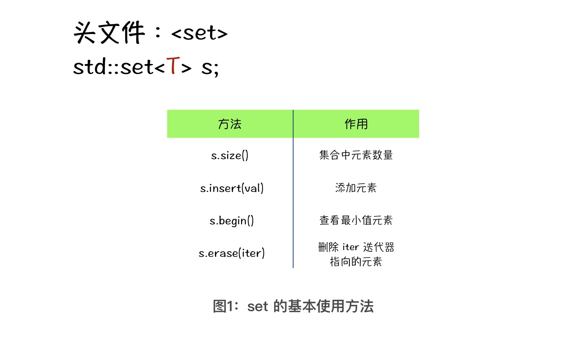
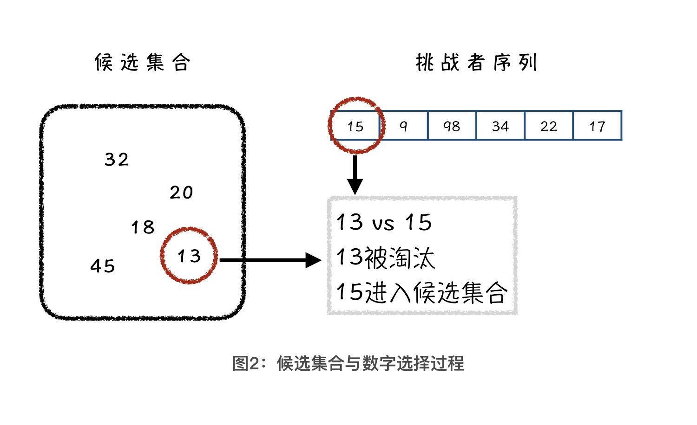
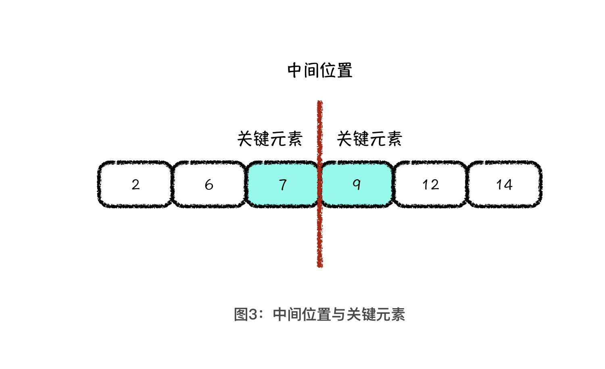
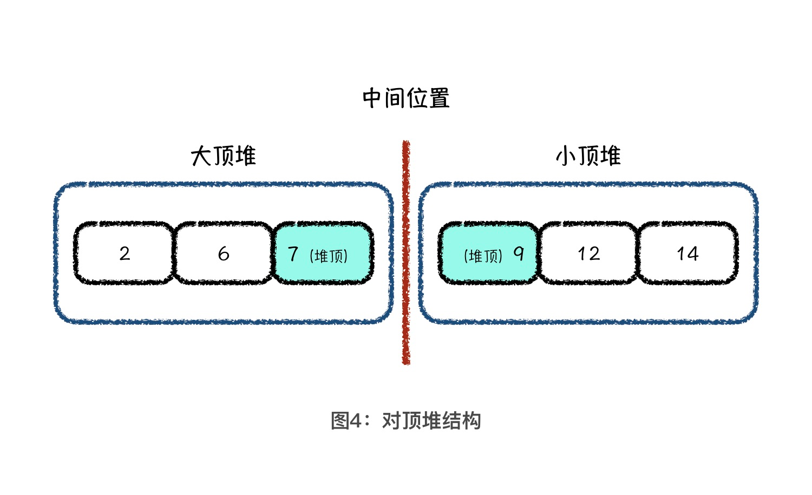

---
date: "2019-06-23"
---  
      
# 05 | 堆排序面试题：如何维护Top-K元素和中位数？
你好，我是胡光，欢迎回来。

前两节课呢，我们认识了堆这种数据结构，并且学习了堆排序这种基于堆的排序算法。而实际上，用堆来做排序只是堆众多应用方式的其中一种。

对于堆这种数据结构而言，还有哪些其他的应用方式呢？以及，想要对堆结构的使用达到融会贯通的程度，我们需要掌握哪些关键点呢？今天，我将通过2道与堆相关的经典的面试题，来帮助你加强对堆结构应用场景的理解。

## 使用 STL-set 模拟堆

在讲和堆有关的面试题之前呢，我想先用 C++ 作为目标语言，跟你讲讲我最喜欢使用的堆技巧。如果你对 C++ 不了解也不用担心，我接下来要讲的编程技巧属于思想层面的技巧，听懂了思想，再在你所使用的语言中，找到对应性质的工具就可以了。

在C++ 的标准库中，其实已经给我们提供了一套面向过程的堆的相关操作。其中包括了：创建一个堆、向堆中插入或者删除最值元素等堆结构的基本操作。不过，在一门面向对象的语言中，使用一套面向过程的标准库方法，着实有点儿奇怪。另外，就我个人的使用习惯来说，真的有点儿用不惯标准库提供的这套现成方法。

正所谓：虽然开局不容易，生活还是得继续。现有的标准库用不习惯的话，我们可以找一些替代工具，用来替代堆结构所带来的效果。找替代工具的思路很简单，能够实现如下2种操作的工具，就可以被当成堆的替代品：

1.  可以动态地添加元素
2.  能够查看及删除极值元素

如果你熟悉C++，你可能会想到priority\_queue这种容器，它本质上就是一个大顶堆，也就是一个现成的优先队列。可是，这工具的名字太长了，对于新手来说，使用起来不太友好。所以今天，我给你推荐另外一个结构，就是 C++ STL 中的 set ：**有序集合模板类**。我在下图中列了一些 set 的方法，你可以看看。



如图所示，std::set s; 就能定义一个存储T 类型元素的有序集合对象。set 一共有四个方法，包括查看元素数量、插入元素、删除元素以及查看最小值元素。利用这四个方法，我们就可以模拟小顶堆的行为模式。我在下面给出了一段使用 set 的参考代码，你可以先看一看。

```
    /**************************************************************
    	> File Name: set.cpp
    	> Author: huguang
    	> Mail: hug@haizeix.com
    	> Created Time: 日  5/ 3 19:40:32 2020
     **************************************************************/
    
    #include <iostream>
    #include <set>
    using namespace std;
    
    int main() {
        // 定义存储整型元素的有序集合
        // 依次插入 5、9、3、3 四个元素
        // 输出集合元素数量，输出 3
        set<int> s;
        s.insert(5);
        s.insert(9);
        s.insert(3);
        s.insert(3);
        cout << s.size() << endl;    
    
        // 打印最小值元素，输出 3
        // 然后删除最小值元素
        // 再打印最小值元素，输出 5
        cout << *(s.begin()) << endl;
        s.erase(s.begin());
        cout << *(s.begin()) << endl;
        return 0;
    }
    

```

我在这段代码中，演示了 set 的基本操作，模拟了一个堆结构插入和删除的基本过程。其中，有一点需要你特别注意：当我们向集合中插入了 5、9、3、3 这4个元素的时候，输出集合中只会显示 3 个而不是4个元素。之所以不是 4 个，就是因为C++ 中的 set 对值相同的元素只会保留一个。也就是说，**集合中的元素具有唯一性**。当然了，想要记录相同值的元素，也有相应的编码小技巧，这个我们后面遇到的时候再具体说。

实际上，C++ set 的底层数据结构是红黑树，本质上也是一种基于二叉树的有序数据结构。等学完了红黑树的知识，你再回来看 set 的内容一定会有新的理解和体会。

至此，我们就掌握了使用 STL 中的 set 模拟小顶堆的基本技巧。在遇到实际问题时，如果我们需要的是大顶堆，可以通过**重载比较运算符**或者**编写用于比较大小的仿函数**来实现。

不过，这两种技巧都是与 C++ 语言特性相关的方法，那在这节课里，我会尽量绕过这两种技巧，脱离对某种特定语言特性的依赖，来给你讲一种更偏向于思维的堆处理技巧。

## 小顶堆：维护 Top-K 元素

知道了怎么用 set 模拟小顶堆之后，我们来看第一道与堆有关的面试题：维护 Top-K 元素。

题目是这样的：假设，我们想在大量的数据，如100 亿个整型数据中，找到值最大的 K 个元素，K 小于 10000。你会怎么做呢？

一种最直接的方法，就是对 100 亿个元素从大到小排序，然后输出前 K 个元素值。可是，无论我们掌握的是快速排序算法还是堆排序算法，在排序的时候，都需要将全部的元素读入到内存中。也就是说，100亿个整型元素大约需要占用 40GB 的内存空间，这听起来就不像是普通民用电脑能干的事情，（一般的民用电脑内存比这个小，比如我写文章用的电脑内存是 32GB）。其实，想对这么大的数据进行排序，不是没有可能，我们可以使用**归并排序**算法。很可惜，此时的我们还没有掌握这种技术。

那另外一种朴素的想法，就是进行 **K 轮查找**。具体来说就是，我们每次找到一个最大值，然后将其从所有数字中删除。这种做法的时间复杂度是 O\(KN\)，K 是要查找的次数，N 是所有数字的总数量。这种做法好像也不太优美，那具体怎么做呢？别着急，我们先来看个例子。

假设，学校现在要选出 3 个围棋水平最高的人代表学校去比赛，已知校队中已经有了 3 个围棋选手，但你也想要代表学校去比赛的话，应该怎么做？很简单，你和校队中的任何一个人比一场，只要赢了他，你就能进入校队了。为了能顺利进入校队，你一定会优先选择现有校队中能力最弱的人，如果比赛赢了他，你进入校队，他则被踢出校队。如果全校的人都像你一样，挑战一遍现有校队中的人，那校队中最终剩下的 3 个人，一定是全校最强的 3 个人。

事实上，在全校同学中找出3个最强的人，和我们今天要解决的在100亿个元素中找出K 个最大值，本质上它们都是一个问题。解决过程可以总结为3步：首先，我们需要维护一个**候选集合**，就类似于上面例子中的校队。然后，我们每次读入一个新数字，如果这个新数字大于候选集合中 K 个元素的最小值，我们就把这个新数字加入到候选集合中，把候选集合中的最小值删除。最后，候选集合中的 K 个数字就是我们要求的 K 个最大值了。



那在这个过程中，我们该如何维护候选集合中的最小值呢？这时候，小顶堆就要起作用了，也就是将候选集合维护成一个小顶堆。

通过这道题目我想让你清楚一点：**在用堆解决一个实际问题的时候，我们的思考方式不是拼命地去想用堆如何解决这个问题，而是当我们发现在设计算法的过程中，需要动态地查询和删除集合中最大值或最小值时，再用堆来维护**。

那延伸来说，在解决实际问题时，我们一定是通过某些性质来反推我们需要的数据结构。因此**准确理解各种数据结构的性质，才是将理论应用到实践的要点**。

## 对顶堆：维护中位数

通过 Top-K 的题目我们明确了一点：当算法过程中需要维护集合最值的时候，我们就可以拿出堆这种数据结构了。因此，设计一套合理的算法过程，是我们应用数据结构的前提条件。

接下来，我们再来看另一道经典的与堆相关的面试题：维护中位数。题目也很简单，就是让我们实现一种新的数据结构，来支持插入元素以及查询当前所有元素的中位数。

所谓中位数，就是在集合中所有元素排序以后，处于中间位置的元素。如果元素数量是偶数个，中位数则是中间两个数字的平均值。

在没有任何思路的情况下，我们先假设一个具体的小例子，来理解一下这种数据结构的性质。

```
    插入：7 1 6
    查询中位数
    插入：9 8 7 8 12
    查询中位数
    

```

那在第一次查询的时候，集合中有 3 个元素：1、6、7，所以中位数是 6。之后，由于集合中又插入了 5 个元素，此时集合中的元素是：1、6、7、7、8、8、9、12，又由于元素总数是偶数，因此中位数等于中间两个数字的平均值，也就是 \(7+8\)/2 = 7.5。

从这个小例子中你会发现，这种数据结构的难点就在于其中位数所在的中间位置，是会随着插入元素而变化的。所以，如果我们能够维护这个中间位置，就能完成新数据结构的设计了。但具体该怎么做呢？

我们以一组元素，2、6、7、9、12、14为例。把它们从中间位置切开，我们就将所有元素分成了左右两部分，而且左边集合的元素值小于右边集合的元素值。



图中，有两个元素 7 和 9 被标成蓝色，它们被称为关键元素。那什么是关键元素呢？就是如果我们能够定位这两个元素，就能定位中间位置求出中位数。并且，这两个关键元素有个非常重要的性质，7 是左半边所有元素中的最大值，9 是右半边所有元素中的最小值。也就是说，如果将左右两边看成是两个集合，那我们既需要维护左边集合的最大值，也需要维护右边集合的最小值。

当插入新元素的时候，通过与中间的两个关键元素比较，我们就可以知道应该向左边集合插入，还是右边集合插入。当左右两边集合元素数量相差 2 时，说明中间位置发生了移动，如果是左边集合比右边集合元素多2个，说明中间位置向左发生了移动，我们维护的位置向右移动了，所以我们将左边集合的最大值插入到右边集合中即可，反之亦然。如图所示，我们管这种结构叫做对顶堆，是不是很形象？



## 课程小结

通过今天这节课，我希望你牢牢记住一件事：在解决实际问题的时候，不是我们先知道了要使用堆，而是在我们设计算法流程时，需要动态查询、插入和删除集合的最值元素，而这种功能需求恰好符合堆的性质，从而确定了要使用堆结构。

因此，只有从问题性质出发选择合适的算法数据结构，才能彻底增强你解决实际问题的能力。届时，你所思考的将不再是使用某一个数据结构解决问题，而是真正学会使用某一类数据结构解决问题。

好了，今天就到这里了，道阻且长，行则将至，我是胡光，我们下期见。

* * *

[课后参考代码](https://github.com/alicia-ying/jikeshijian.git)