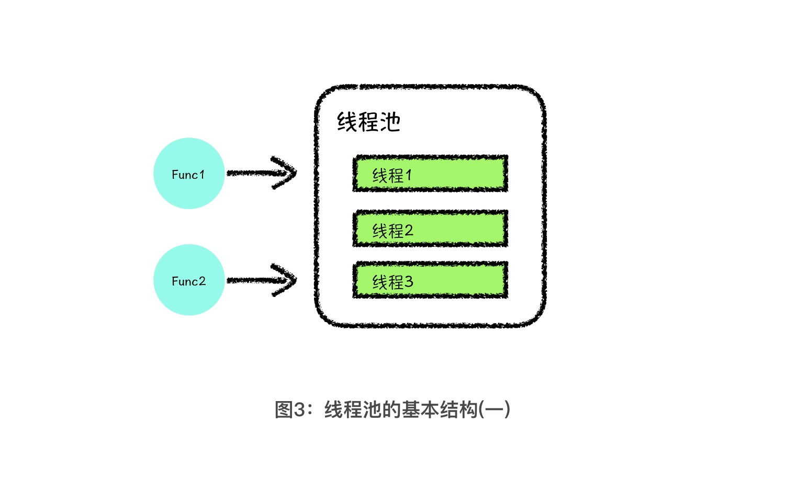

---
date: "2019-06-23"
---  
      
# 06 | 线程池基础：如何用线程池设计出更“优美”的代码？
你好，我是胡光，欢迎回来。

在之前的课程中，我们学习了二叉堆这种数据结构。基于完全二叉树的二叉堆从逻辑上我们可以看成是一个优先队列。之所以叫优先队列，是因为其对外的行为表现像极了一个队列：头部出队、尾部入队，而且，每次出队的时候，都是将优先级最高的任务弹出队列。

完成了基础学习以后，这节课开始，我们来聊聊线程池。线程池的内容比较多，我会分成三节课来讲，今天我们先来说说线程池的基础，后两节课再动手来封装一个**线程池**（Thread Pool）。

考虑到学习这门课的同学所用的编程语言不太一样，众口真的难调，所以我会选择用 C/C++ 语言作为讲解的示例语言，争取做到只要你有一定面向对象基础就能看懂。不过在讲解过程中，我也会尽量避免讲解与语言特性相关的知识点，更多地，我会跟你讨论线程池中所反映出来的，与编程范式相关的思维模式，还有优先队列在线程池中的应用。

## 理解线程和进程的基础概念

要想封装一个**线程池**，首先你得了解什么是**线程**（Thread），以及与线程相关的另一个概念**进程**（Process）。如果你之前对进程和线程有一点了解，也可以借着这个机会进行复习巩固。

学术一点儿来说，**线程是操作系统进行运算调度的基本单元，进程是操作系统进行资源分配的最基本单元**。这怎么理解呢？下面，我就模拟程序的运行过程，来带你理解这两个概念。

### 如何理解进程？

当你写完了一段程序以后，通过编译链接你会得到一个可执行文件，通过运行这个可执行文件会出现一个运行效果。其实，这个可执行程序每次运行的时候，操作系统都会创建一个新的进程，这个新创建的进程就是这个可执行文件在内存中的副本。说白了，如果你“手抖”运行了 6 次可执行程序，操作系统就会创建 6 个进程。虽然这6个进程都由一个可执行文件运行得到，但它们本质上是独立的，各自都有独立的数据存储空间。

具体我们来看一个例子。假设，进程 1、2、3 对应了同一个可执行文件的运行结果，并且均包含一个变量 a。但是， 3 个进程中的 a 变量并不相同，它们都存储在内存不同的地方，所以这 3 个进程之间的运行，并不会受到对方的影响，每个进程都有一片自己独立存储数据的空间，因此，进程是操作系统分配资源的最基本单元。


在这个例子中，资源就是数据存储所用的内存空间。其实操作系统中的资源形式还有很多，比如，一个内存空间是资源，一个文件描述符是资源，一个网络端口是资源，一个 CPU 也是资源。操作系统会按照需要，把相应的资源分配给每一个进程。

### 如何理解线程？

理解了进程的概念以后，接下来让我们再来看线程。刚才说了，线程就是操作系统进行计算调度的基本单元。说到计算调度，我们就必须要说说 **CPU 时间片**。什么是CPU 时间片呢？我想先问你一个问题：当只有1个 CPU 可以提供计算能力的时候，你该如何同时运行100个程序呢？先别急着回答，我们先来看一个相似的生活场景。

你知道，在生意火爆的饭店后厨中，厨师是按照什么顺序做菜的吗？假设现在饭店大堂来了三桌客人，如果要按顺序给每一桌提供饭菜，第三桌的客人肯定早就走了。因为在第三桌客人看来，我们三桌同时来的，怎么第一桌的客人吃完饭了，我们的菜还没上来？

为了让三桌的客人都满意，一般厨师会先给第一桌做一道菜，再给第二桌上一道菜，然后再给第三桌上一道菜。在这种上菜策略下，这三桌客人的感受就是，仿佛厨房有三位厨师在同时为三桌客人做菜，实际上做菜的师傅只有一位。这就是我们接下来要讲的**分时系统**。

CPU 在给程序提供计算能力的时候，不是等到第一个程序执行完了，才执行第二个程序，而是先给第一个程序提供一小段时间的计算能力，再给第二个程序提供一小段时间的计算能力。如果我们站在 100 个程序一端，就会感觉 CPU 同时在运行着 100 个程序，而实际上 CPU 在同一时间只为 1 个程序服务。因此，分时系统就是指多个程序依据时间来共享硬件或者软件资源。

那么 CPU 为程序提供服务的一小段时间，其实就是一个**时间片**。更准确点来说，CPU 在一个时间片里运行的不是程序而是线程。这该怎么理解呢？我们接着来看一个例子。比如说，下图就是 3 个线程占用 CPU 时间片的情况。


你会看到，图中有T1、T2、T3 这 3 个线程，它们依次占用 CPU 的每一个时间片。这样，一个时间片就唯一对应到了一个线程，CPU 到了新的时间片就会切换去执行新的线程。这样，你应该就能理解，线程是操作系统进行计算调度的基本单元。

同样地，你也可以认为一个线程只对应一组CPU 的时间片，也就相当于只对应一部分计算资源。又因为，进程是操作系统进行资源分配的基本单元，所以，线程资源会被分配到各个进程中。

结合上图，我们可以看到 T1、T2 线程在进程1中，T3 线程在进程 2 中。也就是说，单纯从时间片的占用角度来说，进程 1 比进程 2 的运行速度快了 1 倍。如果CPU 在 1 个时间片内可以进行 10000 次运算，那么在经过6次时间片之后，进程 1 运算了 40000 次，而进程 2 才运算 20000 次。所以，掌握设计多线程程序的技巧，可以让你在不改变程序算法的情况下，让程序的运行速度更快，是不是想想都刺激！

### 工作中常见的爆栈和线程有什么关系？

理解了线程和进程的基本概念以后，你可能还有一个疑问：我在编程工作中，好像并没用过线程啊？其实你很可能用过，只是你不知道。

如果你学过 C 语言，一定记得在 C 语言中，变量有局部变量和全局变量之分吧。其实一般的局部变量，是存储在当前线程所对应的存储区中的，我们称这个存储区为栈区。在我的 Mac 系统中，操作系统给进程分配一个线程时，这个线程所对应的默认栈区大小是8M。也就是说，这个栈区可以存储 200 万个整型数据。

那当递归深度过深发生爆栈情况时，爆的就是这个线程栈。这也就是为什么，我们不建议在函数内部申请过大的数组空间。因为过大的数组空间，很有可能把这个只有8M大小的栈区挤爆。

总的来说，一个线程其实不仅仅代表了一份计算资源，还绑定了一个存储局部变量的存储区。所以，之前我们所写的 C/C++ 程序，实际上是单线程的程序。当我们的程序想要申请更多的线程资源的时候，可以像申请更多的内存空间一样，使用系统中提供的方法进行申请，例如， Unix 系统中的 pthread\_create 方法就是用来申请一个新的线程。

## 如何利用线程池优化代码设计？

明白了多线程的好处以后，你是不是已经开始摩拳擦掌，想要直接利用相关函数方法开发多线程程序了。先别急，我们先来看看下面这个多线程的程序，你能看出它有什么问题吗？

```
    #include <stdio.h>
    #include <stdlib.h>
    #include <pthread.h>
    
    void *func1(void *data) {
        printf("hello geek\n");
        return NULL;
    }
    
    void *func2(void *data) {
        printf("hello world\n");
        return NULL;
    }
    
    int main() {
        pthread_t t1, t2;
        pthread_create(&t1, NULL, func1, NULL);
        pthread_create(&t2, NULL, func2, NULL);
        pthread_join(t1, NULL);
        pthread_join(t2, NULL);
        return 0;
    }
    

```

代码中，第 17、18 行创建了两个线程，这两个线程分别以 func1 和 func2 函数作为线程的入口函数。代码的第 19、20 行，是在等待两个线程执行结束。如果运行这个程序，你会在屏幕上看到两段信息，分别是“hello geek”和“hello world”。这段多线程的程序在功能上没什么问题，但在代码设计上却不够优美。

在代码设计中，像这样零散地去申请线程，根本无法精确地控制我们申请到的线程的数量。要知道，线程也是会占用存储空间的。而无法控制线程数量，就意味着无法控制进程所占用的存储空间。

要想解决这个问题，我们就需要用到线程池。一开始，如果我们把进程所需要的线程资源申请好，全部存储在一个空间中，我们就会得到一个装着很多线程的池子，它就叫做线程池。当有计算任务的时候，我们只需要将计算任务投入到池子中，这个池子中就会有一个线程执行这个计算任务。

接下来，我就以装有3个线程的线程池为例，来和你讲讲线程池的基本结构。



上图的线程池中装着3个线程，Func1 和 Func2 代表了两个待处理的计算任务。我们把它们投入到线程池中以后，会由线程池安排相关的线程进行具体的执行。但是就这个结构图而言，如果同时来了100个任务，而线程池中只有3个线程，我们又该怎么办呢？

其实，要解决这个问题很简单，只需要我们给线程池里增加一个内部的队列结构就行了。这样一来，等到任务来了以后，它会先进入任务队列，然后线程池中的工作线程，会从这个任务队列中依次获取需要计算的任务进行执行操作。这样，原本的线程池结构就需要修改成如下的样子。有了这个任务队列，整个线程池的工作逻辑就能变得更加灵活。


但是有了这个任务队列之后，又会产生一个新的问题：工作线程到这个任务队列中取任务的顺序，是应该按照任务在队列中的先后顺序依次取出，还是应该按照任务的优先级从高到低依次执行呢？答案是都可以。我们还是应该看应用场景的具体需求再决定，所以，线程池中的任务队列应该是可配置的。如果应用场景中，要求我们按照任务在队列中的顺序依次取出，我们配置成普通队列即可；如果要求任务是按照优先级从高到低依次进行执行的，那我们就需要将任务队列配置成优先队列。

以上，就是线程池的基本结构和作用。

## 课程小结

通过今天的课程，我希望你能够深刻地理解一件事儿：**线程是操作系统进行计算调度的最基本单元，进程是操作系统进行资源分配的最基本单元。**

由此，我们引出了线程池的概念，它的作用，其实是为了更精准地控制程序中的线程数量，而且为了能让有限的线程处理更多的任务，我们可以在线程池中增加一个任务队列。这个任务队列是一个灵活的结构，它能根据问题场景不同，配置成普通队列或者是优先队列。当然，你也可以根据实际开发过程中的需求，将任务队列设计成其他的线性结构。

## 课后练习

最后，我想给你留一道思考题，你能利用线程池设计一个可以计算 1 亿以内素数个数的程序吗？

欢迎在留言区分享你的答案，也希望你能把这节课的内容转发出去。那今天就到这里了，我是胡光，我们下节课见！