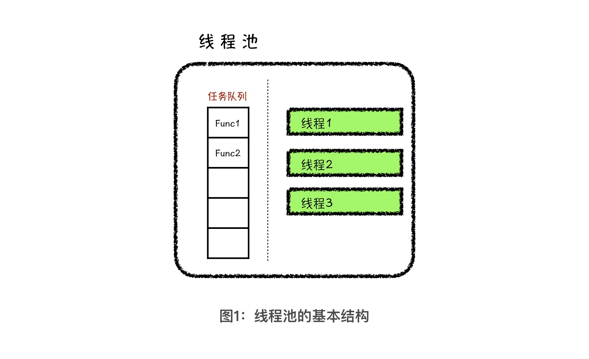

---
date: "2019-06-23"
---  
      
# 07 | 封装线程池（上）：初探泛型编程
你好，我是胡光，欢迎回来。

上节课，我们学习了线程池的基本作用和结构。线程池就是管理着线程资源的池子，内部除了管理着若干线程以外，还需要用一个任务队列来缓存要执行的计算任务。而这个任务队列，根据线程池的应用场景不同，可以配置成不同特性的队列。

今天，我们就动手来封装一个线程池类。在封装的过程中，我会用 C++ 语言作为基础。如果你对C++不是很熟也没关系，你可以重点学习我今天讲的封装思想，然后，在你会的语言中根据其语言特性找到相应的实现方式，尝试自己封装一个线程池。

下面，让我们开始今天的课程吧。

## 初探泛型编程

在正式封装一个线程池类之前，我们先来学习一个基础的编程概念**泛型编程**，它是一种编程范式。那说到编程范式，你可能有点儿懵，其实，编程范式就是设计程序的方法和模式。下面我就说几个你比较熟悉的编程范式，通过它们来帮助你认识泛型编程。

第一种是面向过程。这种编程范式想必你不会陌生，一般来说，我们在刚开始学习程序时接触的第一个编程范式，就是面向过程。**所谓面向过程，就是在进行程序设计的时候，我们要重点思考怎么将处理步骤封装成函数过程，以此来达到代码复用的目的，从而降低程序设计过程中可能存在的 Bug。** 这该怎么理解呢？

举个例子，在没有过程性封装的情况下，如果我们写了10 处逻辑过程相同的代码，我们必须要保证这 10 个地方的实现都没有问题，否则，只要我们有 1 处写错了，整个程序就会存在 Bug。那如果我们能将逻辑过程相同的代码封装成函数过程，只需要保证这个函数过程实现的没问题，就能保证程序中同样逻辑的10 个调用处都没问题了。

第二，是面向对象。如果你学过 C++、C# 或者 Java 肯定也很熟悉它，面向对象正是这些语言所提倡的编程范式。但你是否注意到了，面向对象的程序设计方法，首先是将一组数据的描述封装成类，然后再由类实例化出具体程序中所使用的对象。这样，类的概念就像是类型，对象的概念就像是变量。

也就是说，在这个过程中，我们实际封装的是一个类。那为什么它不叫做面向类的程序设计方法，而叫做面向对象的程序设计方法呢？

我们从问题抽象的过程来看，要想将一个具体的问题场景转换成计算机程序，我们第一步要做的就是抽象，所以面向对象第一步上来，就要分析问题场景中都有哪些对象，然后再将这些对象归类设计出上层的类，继而设计出类之间的父子关系，以及相关的接口形式。这就是面向对象的含义：**一切从分析对象开始**。

其实，面向过程和面向对象这两种程序设计方法是有共通之处的，我们来总结一下：**面向过程是将重复的代码逻辑抽象成函数过程，面向对象是将问题场景中具有相同性质的对象抽象成类**。抽象的好处是，它可以应用到很多具体的场景中。比如，我们用面向过程的思想抽象出一个加法过程函数，就可以算任意两个数字之间的加法。再比如，抽象出来的狗类，通过实例化可以代表任意样子的狗。

得出这样的共性之后，我们接着来看泛型编程。所谓泛型编程，就是从具体的实现过程中抽象出类型。为了帮助你理解泛型编程的思维，我们可以先讨论一个小问题：如何实现一个加法函数？

第一直觉，你可能会像下面这个代码一样，实现一个传入两个整型的加法函数。

```
    int add(int a, int b) {
        return a + b;
    }
    
    

```

但是，这个函数还不是纯粹的加法函数。真正的加法过程，应该是只要两个数据支持相加操作，就可以传入 add 函数进行计算，并得到结果。

由此可见，在函数实现的过程中，只要固定了类型，功能就会变得局限。因此，泛型编程要抽象化出来的就是代码逻辑中的类型。这该怎么理解呢？我们来看一下泛型编程中加法函数长什么样。下面，我给出了一段用 C++ 的模板实现的加法函数。

```
    template<typename T, typename U>
    auto add(const T &a, const U &b) -> decltype(a + b) {
        return a + b;
    }
    

```

这个函数考虑到了所有加法情况。如果你也学过一点儿 C++，你可能会问了，加法函数一定要这样实现么？这好像有点儿麻烦啊。我可以告诉，在C++中加法函数一定要这样实现，否则在一些情况下，这个加法函数很有可能不好使了。例如，如果 a、b 的类型都是 T，那在a、b 类型不同的时候我们就无法调用这个模板方法。再比如，如果我们不使用 decltype和返回值后置的语法结构，就无法准确描述 a + b 表达式的返回值类型。

其实说了这么多，我就是想跟你说明一点，泛型编程是一种比较难掌握的编程范式，需要你对语言本身很了解，并且熟练掌握面向过程和面向对象。

那你可能会问了，花这么大力气，掌握这么麻烦的编程范式有什么好处？其实，**所有编程范式的好处都在于提高开发效率**。利用泛型编程实现 1 种函数，就相当于实现了 10种甚至是20几种函数。这种开发方式形象一点儿说，就是利用编译器帮你写代码，是不是很酷？而且这也是我们今天封装线程池需要用到的。接下来，我们正式开始封装一个线程池。

## 封装：计算任务类

在封装之前，我们先来回顾一下上节课讲的线程池结构。



在线程池的结构中，**最基本也是最重要的不是线程，也不是任务队列，而是任务队列中的任务**。因此，我们重点要考虑怎么封装计算任务的基本组成部分。一个计算任务可以看成是，由某个函数入口加上具体的传入参数组成的一个可以延时执行的方法。

这个概念有点难理解，我们先来解释什么是延时执行。通常情况下，当我们调用 add\(3, 4\) 函数方法的时候，这个函数会立刻执行。这很好理解。可是在线程池中，我们需要将 add 函数和3、4两个参数打包成一个计算任务放到任务队列中，等线程池中的线程从任务队列中取出这个计算任务以后再执行。那从打包放入函数任务，再到执行函数任务，这中间存在的时间间隔就是我们说的延时执行。

下面是我用 C++ 实现的一个 Task 类，这个类的作用，就是将函数和函数调用时所需的参数打包成一个任务对象，后续我们会将这个任务对象放到任务队列中。

```
    #include <iostream>
    #include <cstdio>
    #include <cstdlib>
    #include <queue>
    #include <stack>
    #include <algorithm>
    #include <string>
    #include <map>
    #include <set>
    #include <vector>
    using namespace std;
    
    class Task {
    public :
        template<typename Func_T, typename ...ARGS>
        Task(Func_T f, ARGS ...args) {
            this->func = bind(f, forward<ARGS>(args)...);
        }
        void run() {
            this->func();
            return ;
        }
        function<void()> func;
    };
    
    void func(int a, int b) {
        cout << a << "+" << b << "=" << a + b << endl;
        return ;
    }
    
    int main() {
        Task t1(func, 3, 4), t2(func, 5, 6);
        t2.run();
        t1.run();
        return 0;
    }
    
    

```

代码中的 Task 类，就是我封装的计算任务类。将这个类实例化成对象的时候，我们需要传入函数，以及函数调用时的参数，Task 类会将函数与参数打包成一个函数对象，存储在 func 成员属性中。同时 Task 类提供了一个 run 方法，这个方法就是延时执行计算任务的方法。

Task 类的代码看不懂没关系，你重点关注主函数中的逻辑就行了。在主函数中，我们封装了两个计算任务，t1 和 t2，然后我们先调用了 t2 的 run 方法，再调用 t1 的 run 方法。这样结果就是先输出 “5+6=11”，后输出“3+4=7”。至此，我们就完成了计算任务类的封装。

## 线程池的初始化方法

封装好了计算任务类以后，接下来，我们就开始设计和封装线程池类。我们知道线程池的核心作用，就是准确地控制线程的数量，所以，线程池类的构造函数的作用就是新建相应数量的线程。代码如下所示：

```
    #include <iostream>
    #include <cstdio>
    #include <cstdlib>
    #include <queue>
    #include <stack>
    #include <algorithm>
    #include <string>
    #include <map>
    #include <set>
    #include <vector>
    #include <thread>
    using namespace std;
    
    class ThreadPool {
    public :
        ThreadPool(size_t n) {
            for (int i = 0; i < n; i++) {
                threads.push_back(
                    new thread(
                        &ThreadPool::thread_worker, 
                        this
                    )
                );
            }
            return ;
        }
        void thread_worker() {
            cout << "waiting for task" << endl;
            return ;
        }
        ~ThreadPool() {
            for (int i = 0; i < threads.size(); i++) {
                threads[i]->join();
                delete threads[i];
            }
            return ;
        }
    private:
        vector<thread *> threads;
    };
    
    int main() {
        ThreadPool tp(5);
        return 0;
    }
    

```

如代码所示，我们完成了一个线程池类 ThreadPool 的大框架。在主函数中，我们定义了一个包含5个工作线程的线程池。其中， thread\_worker 成员方法，就是工作线程的入口函数方法，也是我们后续要去实现的重点方法。

然后，我们又定义了线程池类的构造函数与析构函数，它们一个负责在线程池中新建 n 个线程，一个负责销毁 n 个线程。因为代码逻辑非常清晰，所以这里我带你简单梳理一下。在构造函数中，我们通过 new 新建了 n 个线程，并且保存到 threads 动态数组中。在析构函数中，我们通过调用 join 方法等待线程执行结束，然后调用 delete 方法释放线程所占用空间。

到这里，我们就已经准备好了线程池的周边工具 Task 类，与线程池主体部分的设计与封装。下堂课我们会围绕着线程的入口函数 thread\_worker 进行线程池功能的进一步完善。

## 课程小结

最后呢，我带你做一下课程小结。

今天，我们重点讨论了泛型编程，以及怎么利用泛型编程封装线程池。

泛型编程的思想，就是将类型从具体的实现过程中抽象出来。相比于面向对象和面向过程，泛型编程是最难掌握，也是威力最强大的一种编程范式。比如，C++中 STL 的实现其实就是泛型编程的典范之作。

因为泛型编程能够很好提高开发效率，所以在封装线程池的过程中，我们会用泛型编程的思想来封装计算任务 Task 类，以及线程池类的大体框架等等。

总之，通过今天课程，我希望你能明白一件事儿：工欲善其事，必先利其器。我们在封装线程池之前，首先将计算任务抽象出来，封装成相关的 Task 类，这其实是在为我们封装线程池做准备工作。

## 课后练习

最后，你能参考我们封装计算任务类的思路，使用你最熟悉的编程语言，来实现一个基础的线程池吗？请把你的实现代码写在留言区，我们一起讨论。

好了，今天就到这里了。我是胡光，下节课我会和你继续完成线程池的封装，你可要准备好啦！下节课见！