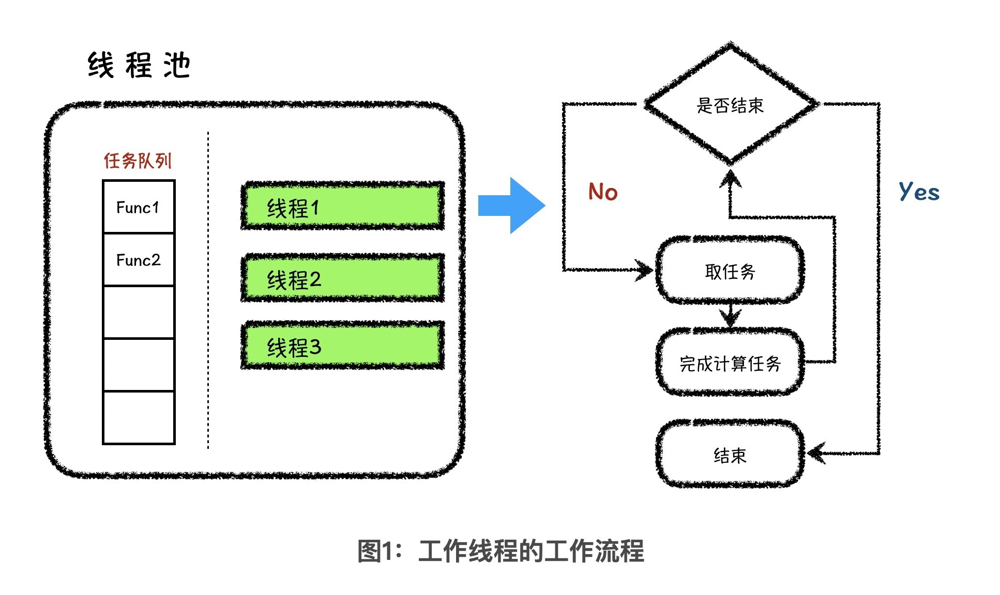
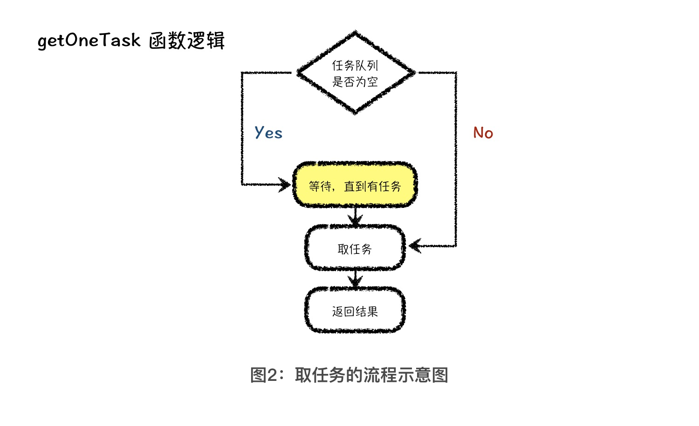
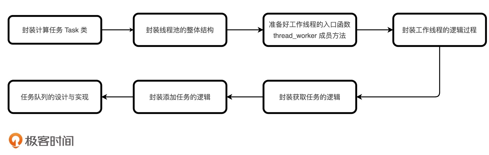

---
date: "2019-06-23"
---  
      
# 08 | 封装线程池（下）：从0到1，体验程序设计全过程
你好，我是胡光，欢迎回来。

上节课，我们完成了线程池封装的基础准备工作，包括封装计算任务 Task 类，封装线程池的整体结构，准备好工作线程的入口函数 thread\_worker 成员方法。今天，我们继续来完成线程池的封装，包括封装工作线程的逻辑过程，封装工作线程的取任务过程，封装向线程池中添加任务的过程，以及任务队列的设计与实现。

## 实现工作线程

要实现工作线程，首先我们要知道它的工作逻辑。下面，我用一张图把这个逻辑表示了出来。



从图中你可以看到，工作线程入口函数 thread\_worker 函数的工作逻辑非常简单，就是在取任务和执行任务之间做循环，直到整个线程池停止工作、被销毁为止。如果要实现成代码，就是下面这个样子：

```
    class ThreadPool {
    public :
        ThreadPool(size_t n) {
            is_running = true;
            for (int i = 0; i < n; i++) {
                threads.push_back(
                    new thread(
                        &ThreadPool::thread_worker, 
                        this
                    )
                );
            }
        }
        void thread_worker() {
            while (is_running) {
                Task *t = this->getOneTask();
                if (t == nullptr) break;
                t->run();
            }
            return ;
        }
        Task *getOneTask() {
            // to do something
            return nullptr;
        }
        ~ThreadPool() {
            is_running = false;
            for (int i = 0; i < threads.size(); i++) {
                threads[i]->join();
                delete threads[i];
            }
            return ;
        }
    private:
        vector<thread *> threads;
        bool is_running;
    };
    
    

```

这段代码比较长，你重点关注 thread\_worker 成员方法的实现过程就可以了。

其中， is\_running 代表线程池是否还在继续运行。在 thread\_pool 的构造函数中，is\_running 被设置为 true，表示线程池处于工作状态。在 thread\_pool 的析构函数中，is\_running 被设置为 false，表示线程池即将被销毁要停止工作了。

thread\_worker 的代码逻辑主要就是一个循环，循环体干的事情就是获取任务、执行任务。不过，在执行任务之前还要有一个判断，来判断获取到的任务是否为空。为什么要进行这个判断呢？我会在讲getOneTask 函数的时候来解释。

## 实现获取任务的逻辑

接着，我们要实现获取任务的逻辑，具体来说就是实现 getOneTask 函数的逻辑。其实这个逻辑比较清楚，就是每次从任务队列中取一个任务返回给调用者。所以，在完善 getOneTask 逻辑之前，我们要先给线程池类添加一个任务队列。为了方便，我们暂时选择 C++ 中的队列 queue 作为任务队列的基础结构。接下来，我们先看看 getOneTask 方法的流程。



从图中，我们可以看到，在取任务的逻辑中，我们需要先判断任务队列是否为空。如果是空的，取任务的方法会等待在原地，直到任务队列中有任务，再取出任务向下执行。那该如何等到任务队列中有任务呢？这一步非常复杂，而且也不是我们课程的讲解重点，所以，我们不做重点讲解，如果你有兴趣深入了解，可以去检索这些关键词：多线程同步方法、条件变量、互斥锁、信号量和无锁化编程。

下面，我们就来实现一个简单的 getOneTask 方法：

```
    Task *getOneTask() {
    //进入临界区时加锁
        unique_lock<mutex> lock(m_mutex);
    //等待任务
        while (is_running && tasks.empty()) m_cond.wait(lock);
    //取任务
        Task *t = nullptr;
        if (is_running) {
            t = tasks.front();
            tasks.pop();
        }
        return t;
    }
    

```

首先，我们要设置进入临界区时的加锁动作，这是保证多线程环境下资源访问安全性的最基本做法。接下来，我们就要访问这个临界资源。

我们在函数的第3行实现了等待的逻辑。这里我们用到了条件量，用以等待队列中被放入任务，或者线程池停止工作。所以，我们需要在代码的另外两个地方加上条件量的通知动作，一个是在放入任务以后，发送一个条件量的通知，代表队列中被放入了任务。另一个，就是在线程池的析构函数中，我们需要加上条件量的通知操作，代表线程池要停止工作被销毁了。

然后，函数的第 4 行到第 8 行就是取任务的逻辑：如果线程池要停止工作了，代表取到任务的 t 变量会指向空地址，否则就指向其取出来的任务。

接下来，我们在析构函数中加上条件量的通知操作。代码如下：

```
    ~ThreadPool() {
        do {
    //条件量的通知
            is_running = false;
            unique_lock<mutex> lock(m_mutex);
            m_cond.notify_all();
        } while (0);
        for (int i = 0; i < threads.size(); i++) {
            threads[i]->join();
            delete threads[i];
        }
        return ;
    }
    
    

```

代码中的第 2 行到第 6 行，就是条件量的通知操作。在通知之前，我们需要先将 is\_running 设置为false，然后再发送条件量的通知，这样才能使各个工作线程，在等待状态中退出。

不过，代码中为什么要用 do while 循环将这一段代码逻辑包含起来呢？这主要是为了将 lock 做成局部变量，出了作用域以后，互斥锁就会被自动释放，而不释放互斥锁的话，其他工作线程就没有办法正常停止工作。至此，我们就算是完成了线程池中工作线程获取任务的逻辑。

## 添加任务的逻辑

有获取，就需要有添加。添加任务的逻辑也比较简单和直白，用到的就是 addOneTask 函数方法。对于addOneTask 函数来说，传入参数应该是一个计算任务对象的地址，然后我们需要将这个对象存储到任务队列中，由于任务队列属于多线程均可访问的临界资源，因此在访问之前我们必须做同步加锁。具体的代码如下所示：

```
    void addOneTask(Task *t) {
        unique_lock<mutex> lock(m_mutex);
        tasks.push(t);
        m_cond.notify_one();
        return ;
    }
    

```

代码的逻辑其实很简单，就是三步，首先是给临界区加锁，然后将计算任务放到计算队列中，最后是通知正在等待的工作线程，告诉它们来活儿了。

那到这里，我们就算是完成了整个线程池基本的框架以及基本功能。当然，如果你对于线程池有其他的功能想法，可以在此基础上继续设计实现。

## 可配置任务队列的设计与实现

最后，我们要把任务队列设计成可以配置的。这里，我们需要用到上节课提到的泛型编程思想，也就是将队列的类型从具体实现中抽象出来。

在实现获取任务逻辑的时候，队列的类型都是固定的 C++ STL 中的 queue 队列类型，抽象出来以后就变成 QueueType 类型。而这个QueueType 类型只需要支持四个方法，分别是push（入队）、pop（出队）、empty（判空）以及front（查看队首元素）。

按照这个设计，我们第一步要将线程池类先改成模板类，模板中的参数就是任务队列的类型，如下所示：

```
    template<typename QueueType = queue<Task *>>
    class ThreadPool {
    private:
        QueueType tasks;
    };
    

```

这里，我给出了简化过后的代码，它只列出了和队列相关的声明部分。我们可以看到，任务队列 tasks 的类型从之前的 queue\<Task \*> ，抽象成了 QueueType 模板参数类型。并且 QueueType 模板参数的默认值就是 queue\<Task \*> 类型。当我们想要将任务队列换成其他种类的队列时，只需要修改这个 QueueType 模板参数的值即可。

为了让你更直观地看到效果，我将前面学习的优先队列实现出来，代码如下：

```
    template<
        typename T, 
        typename Array=vector<T>, 
        typename compare_T=less<T>
    >
    class HeapQueue {
    public :
        HeapQueue() { elements.clear(); }
        bool empty() { return elements.size() == 0; }
        T front() { return elements[0]; }
        // 入队，并向上调整
        void push(const T &val) {
            elements.push_back(val);
            up_update();
            return ;
        }
        // 出队，弹出堆顶元素
        void pop() {
            if (empty()) return ;
            int ind = 0, n = elements.size();
            swap(elements[n - 1], elements[0]);
            elements.pop_back();
            down_update();
            return ;
        }
    
    private:
        Array elements;
        compare_T compare;
        // 向上调整
        void up_update() {
            int ind = elements.size();
            while (ind > 1 && 
                   compare(elements[ind / 2 - 1], elements[ind - 1])) {
                swap(elements[ind / 2 - 1], elements[ind - 1]);
                ind /= 2;
            }
            return ;
        }
        // 向下调整
        void down_update() {
            int ind = 0, n = elements.size();
            while (ind * 2 + 1 < n) {
                int tind = ind;
                if (compare(elements[tind], elements[ind * 2 + 1])) {
                    tind = ind * 2 + 1;
                }
                if (ind * 2 + 2 < n &&
                    compare(elements[tind], elements[ind * 2 + 2])) {
                    tind = ind * 2 + 2;
                }
                if (ind == tind) break;
                swap(elements[ind], elements[tind]);
                ind = tind;
            }
            return ;
        }
    };
    

```

你可以看到，在优先队列的实现中，我们抽象出了三种类型。第一种是优先队列中存储的元素类型 T， 第二种是用于存储堆结构的底层数据结构，默认是动态数组 vector。最后一种是用于 T 类型数据之间优先级的比较方法，默认情况是 less 方法，也就是小于号比较。

由于我们需要把这个队列结构嵌入到线程池中使用，因此，我们必须要实现上面提到的四个方法：push（入队）、pop（出队）、empty（判空）以及 front（查看队首元素）。在 push 和 pop 过程中，我们分别使用了堆结构的向上调整和向下调整操作，这两个过程也是我们之前所掌握的基础操作，具体实现在代码中的 up\_update 与 down\_update 函数中。因为其他的逻辑都比较简单，你直接参考我给出的具体代码就能理解了。

这样，我们就给线程池开发出了另外一种性质的任务队列，就是支持按照优先级弹出的任务队列。

## 课程小结

今天，我带你完成了线程池的初步封装。这一份线程池代码中还有很多不够优美的地方，如果你精力比较充沛，可以试着改进一下这个线程池的功能设计与封装形式。如果你之前没有接触过这类项目，那现有的代码以及封装逻辑也足够你学习了。



通过从0到1封装一个线程池，我希望带你体会一个完整的程序设计过程。从中你会发现，一开始设计框架结构的时候，我们根本用不到什么算法以及数据结构的知识，只有当我们逐渐完善框架的过程中，才能显现出算法及数据结构的作用。这也就是当你单纯地学习算法数据结构时感到困惑的本质原因，因为算法数据结构的确是程序设计的灵魂，而当你想把这份灵魂思想用在项目开发过程中的时候，还需要外在骨架与血肉的支撑。

总之，算法是工程开发的核心，虽然算法不是万能的，但没有算法是万万不能的。并且随着工程开发的深入，我们对算法的依赖程度只会越来越强。这也就是为什么计算机科学中，将算法称为**程序的灵魂**。因此，对于想成为卓越工程师的你来说，算法思维是必须要具备的。

## 课后练习

最后，你可以尝试着把今天学到的线程池的封装思想，使用你最熟悉的语言实现出来写在留言区。

好了，今天就到这里了。怎么封装线程池你学会了吗？那不妨也把这节课分享给你的朋友吧。我是胡光，我们下节课见！

* * *

[课程参考代码](https://github.com/alicia-ying/jikeshijian.git)