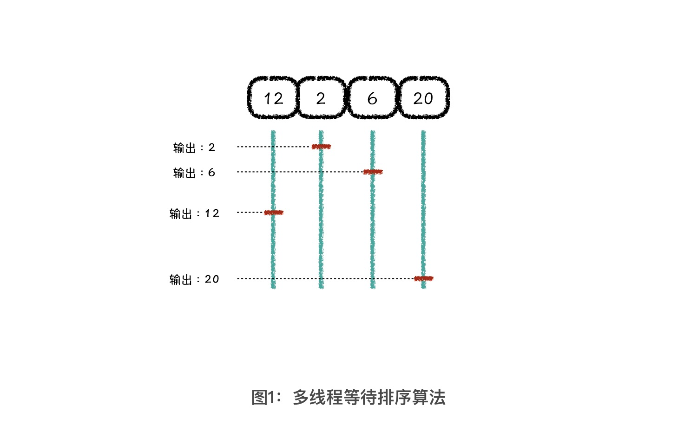
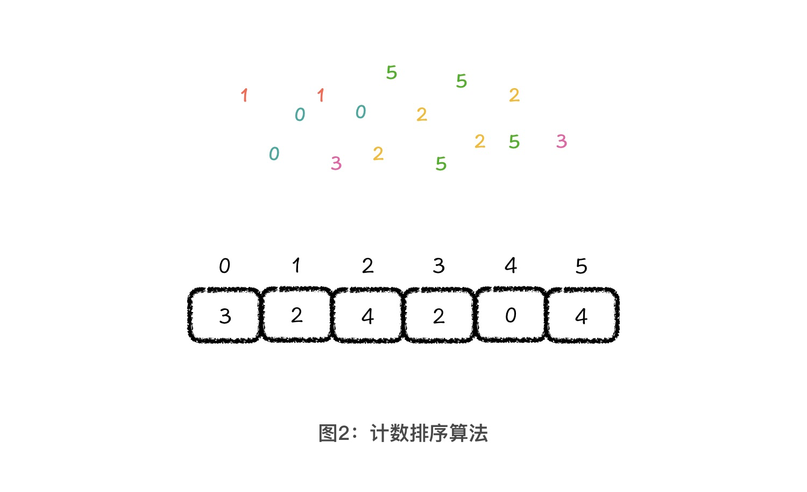
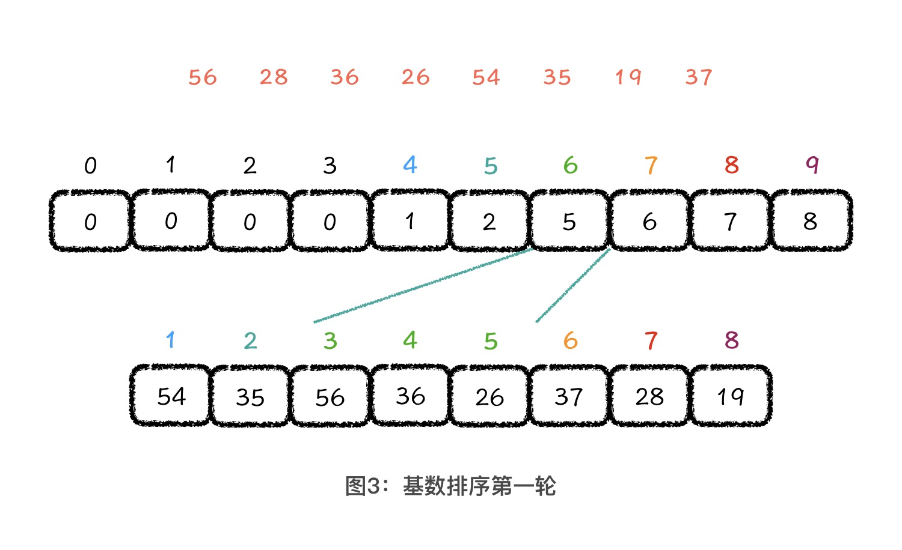
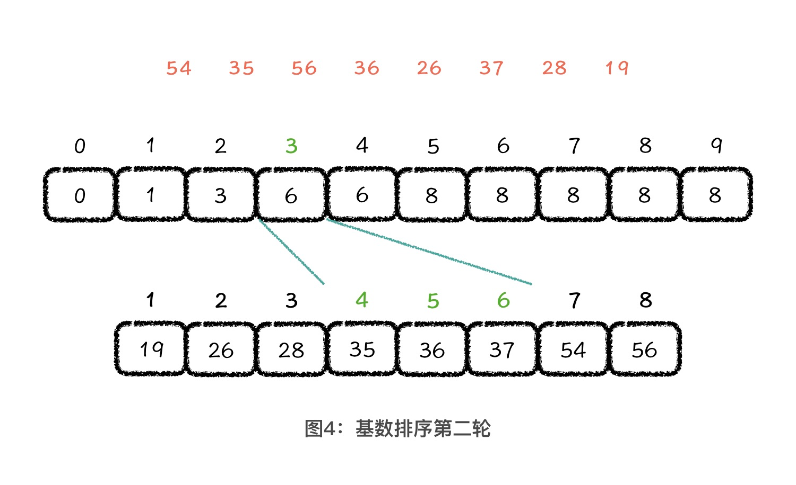

---
date: "2019-06-23"
---  
      
# 11 | 算法思维：融汇贯通，教你3个有趣的排序算法
你好，我是胡光，欢迎回来。

我们前面学了这么多的排序算法，你都掌握了吗？这里，我带你总结一下。这一模块我们主要学习了三大种排序算法：

**1\. 快速排序及快速排序的优化思想；  
2\. 堆结构及堆排序算法，此外，我们还使用优先队列封装了一个线程池工具；  
3\. 归并排序算法，以及用多路归并排序解决大数据排序问题。**

总的来说，它们的目的都是对数据排序。乍一看这是一个具体的问题，那我们一般认为只要是具体问题，就应该有一个具体的解决方案，可我们为什么花了好几节课去解决这个问题呢？或者说，我们为什么要学习这些不同种类的排序算法呢？

其实，这就问到了算法学习的核心。我们学习排序算法，一是为解决不同场景下的排序问题做知识储备，二是为了学习不同算法的不同思维方式以及相关的延伸应用。从中我们可以体会到不同算法思维的闪光点，这也是我认为的算法学习的捷径。

所以今天，我还想给你再讲几种有趣的排序算法，让你从不同的角度认识排序问题，深入体会算法思维。

## 理解多线程等待排序算法

还记得吗？在堆排序那节课中，我们封装了一个线程池工具。虽然说它是工具，可我们一直没有使用过这个工具。今天我们就用它来实现一个叫做多线程等待排序的算法。

所谓多线程等待排序算法，是个有点搞笑的排序算法。在实际工作中，我们并不会用到它，可它的算法思想非常值得我们仔细品味。

它的算法思想很简单，就是当我们要对 n 个整数排序的时候，就启动 n 个线程，让每个线程拿到一个数字，然后按照数字大小，让相应的线程依照数字大小决定睡眠时间，最后再输出这个线程负责的数字。

比如说，如果我们要对 4 个数字 12、2、6 和 20 排序的话，就启动 4 个线程。这4个线程分别是在2秒的时候输出2，在6 秒的时候输出 6，在12 秒的时候输出 12 以及在20 秒的时候输出 20。数据输出的时间顺序，就是我们要的数字排序顺序。

听完这个算法的过程以后，想必不用我强调，你也知道这个排序算法很难应用到实际场景中。其实，我讲它的目的，就是单纯希望能够帮助你体会不同算法思维的闪光点。毕竟，**接口的调用千篇一律，有趣的算法万里挑一**。

## 理解计数排序算法

多线程等待排序算法是利用**程序系统的特性**完成排序任务的一种算法，那接下来，我还想给你讲一种根据数据特性排序的计数排序算法。

首先，我们来解决一个问题：如果要对全国 14 亿人按照年龄排序的话，你会怎么做？根据之前所学的知识，你可能会采用快速排序或者归并排序，又或是堆排序来完成任务。这些排序的时间复杂度的最好情况都是 O\(nlogn\)，在 n 等于 14 的时候，logn 大约等于 30 多。这种效率等价于对全体数据扫描30多遍。

其实，从工程实现的角度来说，这种效率是完全可以接受的，毕竟对全国人民进行排序，等待个 30 秒左右也不算长。可对于我们学习算法来说，即使应用不到真正的工程中，我们也要知道这个算法的优化方向。

再仔细看一遍问题我们会发现，年龄数据有一个很强的特点：一般都在3位数以内。由于规定“建国以后不许成精”，因此我们也收集不到4 位数的年龄情况，并且我们假设年龄数据都是整数。根据年龄数据的这种特点，我们就可以采用计数排序算法来排序。

最简单的计数排序思想是，我们利用数组这种存储结构，记录每种数字出现的次数，最后根据统计得到的信息进行相应的输出。大体流程如下图：

比如说，在面对一组无序的整数的时候，假设数据的范围在 0-5 之内，对于计数排序来说，只需要开一个大小为5的数组空间，数组的第 i 位统计的就是数字 i 出现的次数。结合上图的例子，我们可以统计得到 0 出现了 3 次，1 出现了 2 次，依次类推。这样，在输出的时候，我们只需要先输出 3 个 0，再输出 2 个 1，按照这个过程依次处理每一个数字的输出即可。

其中，统计每种数字出现的次数，需要 O\(n\) 的时间复杂度。也就是说，我们对原序列扫描一遍就能完成统计过程。输出的时间复杂度也是 O\(n + m\) 的，m 是数据范围，n 是元素数量，在 m 远远小于 n 的排序问题场景中，我们把这个输出的时间复杂当成 O\(n\)，所以计数排序算法的整体时间复杂度是 O\(n\) 的。这简直快到飞起。

理解了计数排序算法，我们再回到对 14 亿人按照年龄排序的场景中。这个时候，我们只需要按照计数排序算法的思想，开一个 200 位的数组，然后将每个人根据其年龄放入数组对应的位置中。所谓“放入数组对应的位置中”，就不像是上面统计每种数字个数的操作那么简单了。想要完成这个操作，你可以去学习一些链表相关的操作，例如：链表节点的头插法、开辟一个链表数组等知识。这里我就不细讲了。

总的来说，如果数据具备这种数据范围小，可以有序地映射成数组整型下标的排序问题，采用计数排序算法，是一种既简单又高效的做法。

## 理解基数排序算法

不同的算法思维就像通往殿堂的一级级台阶，大部分人都想要一步踩在最后一级台阶上，不想为前面的台阶浪费时间和体力，可哪有什么捷径可走呢，我们只能慢慢来。就像我最后想给你讲的基数排序算法，如果你单纯来学这个算法思想可能会比较难，可基于计数排序的算法思想来理解就会简单很多。

刚刚计数排序的思想中，待排序的数值，由于范围比较小，所以可以和数组下标一一对应起来。那如果数据范围很大，根本没有办法和数组下标一一对应的时候，我们还能利用计数排序的思想来做吗？

首先，我们假设所有数字的位数都是一样的，如果出现位数比较少的数字，我们就在这个数字前面补 0。例如，我们假设所有数字都是 3 位数字，当有一个数字是 53 的时候，我们可以认为这个数字可以表示成 053。

当我们对这样一组数字完成排序以后，数字开头是 0 的数字肯定会排在开头是 1 的数字前面，开头是 1 的数字肯定排在开头是 2 的数字前面，依次类推。也就是说，对于相同位数的数字，我们是可以逐位进行比较的。

因此，基数排序的核心思想就是进行多轮操作，每轮以数字的其中一位作为排序的依据，当处理完数字的全部位置以后，整个序列就变得有序了。这么说还是太抽象了，下面我就通过具体的例子，给你讲一讲基数排序的整体过程。

首先，假设有8个两位数待排序，分别是：56、28、36、26、54、35、19、37。如下图所示，我们先按照最低位将每个数字排序放好。

我们按照计数排序的思想，统计每一个位上每种数字出现的个数，然后做前缀和累加。所谓前缀和累加，就是求当前位置之前的所有元素的和值。为什么要预处理前缀和呢？我们先往下看。

根据前面的数据，我们可以统计得到，末尾为数字4的有 1 个数字，数字 5 的有 1 个数字，数字6是3个数字，依次类推。这样，在我们最后求得的前缀和数组中，位置 5 的记录值就是 2，这意味着末尾小于等于 5 的数一共有 2 个，分别是 54 和 35；位置 6 的记录值是 5，这意味着末尾小于等于 6 的数一共有 5 个，分别是 54、35、56、36、26。

现在你明白前缀和的作用了吧？前缀和就代表，每一种数字最后放置的位置。

这样一来，所有个位上为 6 的数字，会被放到第 3 位到第 5 位。而且，所有个位上为 6 的数字，要保持其原来的相对顺序进行放置，也就是要按照 56、36、26 的顺序依次放置。

经过第一轮按照个位数排序的处理，我们得到了一个新序列：54、35、56、36、26、37、28、19。接下来，我们再使用相同的原理，对这些数字按照十位进行排序。

如图所示，我们还是分成两步来做，第一步是统计每一种数字出现的个数，以及求个数的前缀和。第二步，就是对每个数的十位数字，将原序列中的每个数字，放置到结果数组中，并且保持相同数字的相对位置不变。例如，其中十位数字是 3 的 3 个数字分别是35、36、37，只要我们保持三者在原序列中的相对位置不变，就能保证三者之间的顺序。因为，在第一轮按照个位数字排序的过程中，35一定排在 36 前面，36也一定排在 37 前面，所以第二轮只需要保持十位上相同数字相对位置不变，即可将十位相同的数字，按照个位数字的大小顺序放置。

如果数字的位数更多，比如还有三位数字的话，我们只要再按照相同的步骤，进行第三轮处理就行了。

最后，我们来总结一下基数排序。**基数排序是从数据的低位到高位进行多轮处理，每一轮以其中一位做为排序的基准，在排序过程中，保证对应位置相同值元素的相对位置保持不变。我们管这种能够保证相同值元素相对位置的排序算法，叫做稳定排序。基数排序和归并排序就属于稳定排序，而之前我们学习的快速排序、堆排序都属于非稳定排序。**

## 课程小结

今天，我们学习了三种有趣的排序算法，分别是多线程等待排序、计数排序与基数排序。学习这些排序算法的目的不是为了解决排序问题，而是学习这些排序算法中所映射出来的思维方式。

比如，多线程排序算法的设计，就是一种用来搞笑的算法。从某种程度上来说，如果你能理解这种幽默，那么程序设计对于你来说才是有意思的！

再比如，利用数据特点设计的基数排序算法也给了我们启发，在不同问题场景中，数据特点可能不同，那么适用的算法可能也会不同，这也是为什么我们要学习大量算法思维的原因，因为工作中，你会遇到的问题场景中的数据特点是不确定的。

最后就是基数排序，它是计数排序的基础思想再次升华以后得到的算法思想。所以，很多你看似无用的算法思维，很有可能是高阶算法的基础算法思维，因此在锻炼算法思维的时候，一定不要“挑食”。

掌握算法思维，是一个循序渐进的过程，我们只有掌握了大量的简单的、基础的算法思维，才能更轻松地掌握那些复杂的算法思维。

## 课后练习

对于多线程等待排序与计数排序的算法过程，你能试着自己来实现吗？

如果你也觉得我今天讲的这几种算法很有趣，那就快把这节课分享出去吧。好了，今天就到这里了，我是胡光，我们下节课见。

* * *

[课程参考代码](https://github.com/alicia-ying/jikeshijian.git)