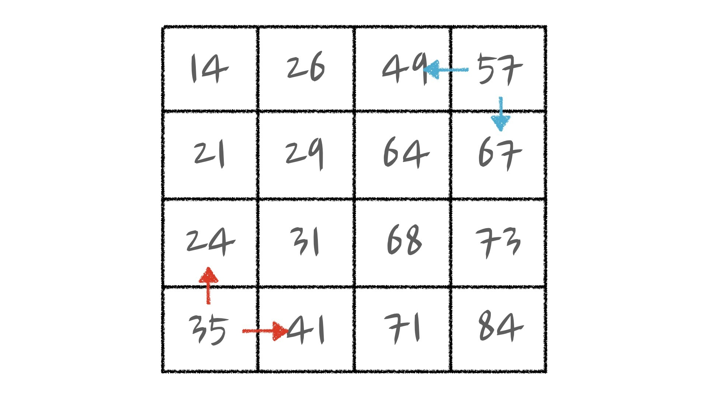
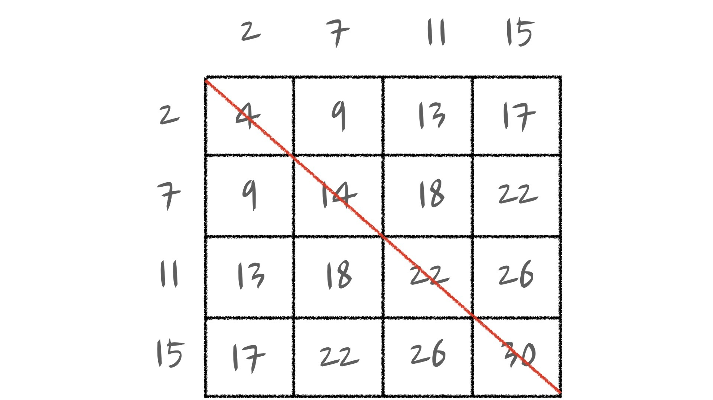
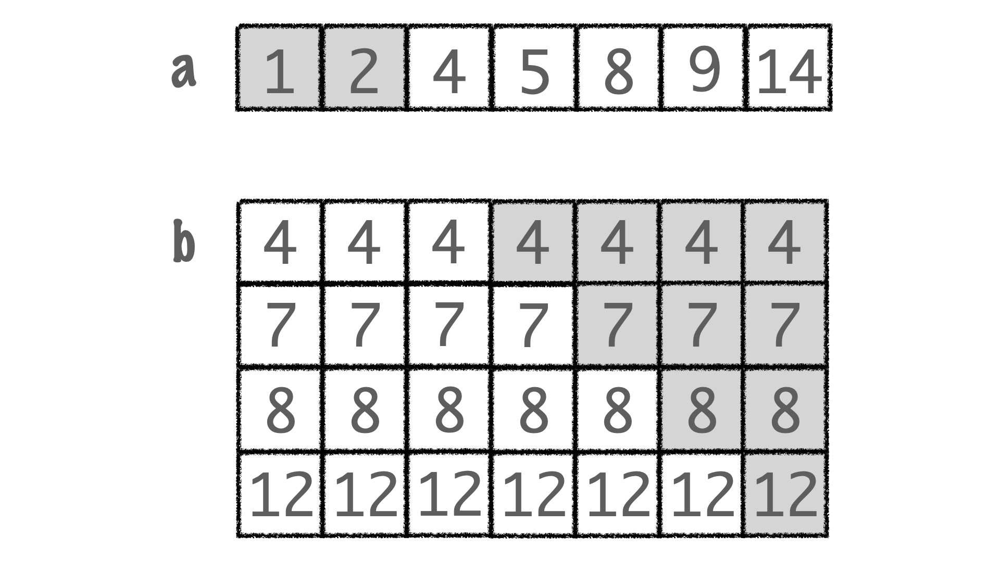

---
date: "2019-06-23"
---  
      
# 12 | 面试实战：经典排序算法面试题详解
你好，我是胡光，欢迎回来。

这个模块，我们主要讲了快速排序、堆排序、归并排序，以及几个有趣排序算法的原理。我相信，你也已经理解排序算法在整个计算机算法大厦中基础且重要的地位了。在我们实际编写程序的过程中，排序算法的应用无处不在。比如说，排序计数可以利用有限的空间消耗，来统计序列中每个词出现的次数。再比如说，处理大数据时的 map-reduce也频繁用到了排序算法。这都说明充分利用数据的有序性质，能让我们要做的事儿变得更简单。

不仅如此，排序算法的原理和应用也经常作为考点，出现在基础算法面试中。所以今天，我们就来看几道经典排序面试题，让你从真正的算法面试题中积累经验。

## 磨刀不误砍柴工：C++中sort的用法

我们现在使用的主流编程语言中，大部分都已经把时间复杂度稳定在\$O\(n \\times log\_2n\)\$的排序算法实现好了，所以我们在实际编程中不必自己去实现各类排序算法。C++ STL中的sort就是这样一个成熟的模块。因此，在讲具体的面试题之前，我想先给你讲讲它的用法。

sort 函数是 C++ STL 的 algorithm 库中对线性序列的排序方法，sort 函数的作用是对一个序列进行本地升序排序。也就是说，我们只需要调用一下 sort 函数就可以完成升序排序。代码例子如下：

```
    // example 1
    #include <algorithm>
    
    int main() {
      	int a[100] = {11, 77, 45, 62, 35, 37, 11, 11, 52, 13};
    		std::sort(a, a + 10);
    		// a = {11, 11, 11, 13, 35, 37, 45, 52, 62, 77}
      	return 0;
    }
    

```

但是你看到这段代码以后，可能就会有疑问了，调用sort 函数的时候，我们为什么要用sort\(a, a + 10\) 呢？它到底是什么意思呢？

要弄明白这个问题，我们首先要理解a的概念。数组a变量实际上就是这个数组在内存空间中的首地址，因此，例子中的整数型数组 a+10 指的就是，从a 地址出发向后跨了十个整数型变量的地址。那sort 函数的参数就非常好理解了，其中，第一个参数是序列中我们想要排序的首位置，第二个参数就是末位置。这里你要注意，末位置是不参与排序的。

明白了这一点之后，如果我想让你对数组中第2个数到第7个数进行排序，是不是就很简单了呢？没错，我们只需要把sort 函数后面的参数设置成a+1和a+8就行了。

```
    // example 2
    #include <algorithm>
    
    int main() {
      	int a[100] = {11, 77, 45, 62, 35, 37, 11, 11, 52, 13};
    		std::sort(a + 1, a + 8);
    		// a == {11, 11, 11, 35, 37, 45, 62, 77, 52, 13}
      	return 0;
    }
    

```

### 动态数组 vector 的排序

除了数组以外，sort同样可以对序列容器进行排序，比如说 C++ STL 的 vector。不过，我们使用 sort 对 vector 排序的时候，需要借助到容器的迭代器。迭代器是 C++ 中模拟指针的方式，它的使用方式和指针类似，就是在C++ 中通过重载运算符封装的指针对象，它本质上还是一个对象，只是表现得像个指针，所以同样也支持指针的间接引用运算符和取值运算符。因此，vector 迭代器的使用方式和数组类似，我们可以直接把前面两个例子中的a换成vector。

我们再将 example-1 中的代码更改为 vector 的写法：

```
    // example 3
    #include <algorithm>
    #include <iostream>
    #include <vector>
    
    int main() {
        int a[100] = {11, 77, 45, 62, 35, 37, 11, 11, 52, 13};
        std::vector<int> b(a, a + 10);
        for (int i = 0; i < 10; i += 1) {
            std::cout << b[i] << " ";
        }
        std::cout << std::endl;
        
        // b.begin()指向的是b的首位置，b.end()指向的是b的末位置
        std::sort(b.begin(), b.end()); 
        for (int i = 0; i < 10; i += 1) {
            std::cout << b[i] << " ";
        }
      	// 11 11 11 13 35 37 45 52 62 77
        std::cout << std::endl;
    }
    

```

我们再将 example-2 中的代码更改为 vector 的写法：

```
    // example 4
    #include <algorithm>
    #include <iostream>
    #include <vector>
    
    int main() {
        int a[100] = {11, 77, 45, 62, 35, 37, 11, 11, 52, 13};
        std::vector<int> b(a, a + 10);
        
        //定义int容器的迭代器，并初始化到b的首位置
        std::vector<int>::iterator iter = b.begin(); 
        for (int i = 0; i < 10; i += 1) {
            std::cout << b[i] << " ";
        }
        std::cout << std::endl;
        std::sort(iter + 1, iter + 8);
      	
        // 使用迭代器遍历容器的方法
        for (iter = b.begin(); iter != b.end(); iter++) {
            std::cout << *iter << " ";
        }
      	
        // 11 11 11 35 37 45 62 77 52 13
        std::cout << std::endl;
    }
    

```

我刚才说的呀，就是 sort 的基本用法了。但细心的你肯定也发现了，我前面讲的所有排序方法都是对序列升序排序，那如果我们想对序列降序排序，甚至是想要实现更加复杂的排序又该怎么办呢？

### 排序规则的指定：sort 隐藏的第三个参数

接下来，为了解决这个问题，我会给你讲sort 隐藏的第三个参数，比较规则函数。我们还是先看一个例子，代码如下：

```
    // example 5
    #include <algorithm>
    #include <iostream>
    #include <vector>
    
    bool comp(int a, int b) {
        return a > b;
    }
    
    int main() {
        int a[100] = {11, 77, 45, 62, 35, 37, 11, 11, 52, 13};
        std::vector<int> b(a, a + 10);
        std::vector<int>::iterator iter = b.begin();
        for (int i = 0; i < 10; i += 1) {
            std::cout << b[i] << " ";
        }
        std::cout << std::endl;
        std::sort(b.begin(), b.end(), comp);
        for (iter = b.begin(); iter != b.end(); iter++) {
            std::cout << *iter << " ";
        }
        
      	// 77 62 52 45 37 35 13 11 11 11
        std::cout << std::endl;
    }
    

```

可以看到，通过给 sort 函数传入一个比较大小的函数comp，我们就把前后两项的大小关系颠倒了，从而实现了降序排序。

所以，comp函数其实就是定义一种排序的规则，来比较它所接受的两个参数 a 和 b。最开始的时候， a 在原序列中排在 b 的前面，如果 a 与 b 的顺序不需要交换，函数就返回 true，如果需要交换就返回 false。

利用 **comp** 函数的这个性质， 我们就可以实现对复杂结构的排序，比如结构体、pair等等，我就不再多说了，你可以自己试试。

## 经典面试题详解

我相信，你现在已经知道怎样在C++中使用排序，来方便地实现一个有序的序列了。那接下来，我们就说说怎么利用排序以及有序序列的性质，来解决相关的面试题了。

不过啊，我想先和你聊聊我对面试的看法。我一直强调，在算法面试中题目的答案不是最重要的，理解面试官真正想要考察什么才重要。我认为面试题其实仅仅只是一种手段，面试官想要通过它来考察你内在的思维方式，看你是不是能把学过的算法灵活地提取成一种思维，应用在编程还有其他问题里。也就是说，**面试考察的是思维能力，而不是记忆力**。

所以在接下来讲解面试题的过程中，我会重点来讲怎么利用有序序列的特性来解决每一个相关的问题。

### 1\. 2-sum问题

首先，我们来看2-sum问题。这道题是LeetCode题库中的第一题，如果你刷过题就肯定见过它。我们先来看一下这道题目：

> 给定一个整数数组nums和一个目标值target，请你在该数组中找出和为目标值的那两个整数，并返回它们的数组下标。你可以假设每种输入只会对应一个答案。但是，数组中同一个元素不能使用两遍。  
>    
> 示例：  
> 给定 nums = \[2, 7, 11, 15\], target = 9  
> 因为 nums\[0\] + nums\[1\] = 2 + 7 = 9  
> 所以返回 \[0, 1\]

在解决这道题之前，我们还得先来讲一个新的概念——杨氏矩阵。杨氏矩阵的性质是，它的每一行都是从左到右递增的，而每一列都是从上到下递增的。


那知道杨氏矩阵有什么用呢？我们来看一道经典的习题：给定一个杨氏矩阵和一个整数 x，问整数 x 是否在杨氏矩阵中。

它的解法是，我们从右上角开始查找，对于矩阵中的当前元素 a。如果 x\<a，那 x 不可能在 a 所在的那一列。如果 x>a，那 x 不可能在 a 所在的那一行。当然相对称地，从左下角开始查找原则也是一样的。



你可以看到，在最差情况下，我们也只需要从一个角落走到另一个角落。假设矩阵的长度为 N，宽度为 M，那我们只需要进行 N+M 次比较，就可以找到目标值。可是杨氏矩阵问题跟 2-sum 问题又有什么关联呢？我们先接着往下看。

2-sum问题有一个非常经典的解法，就是给数组 a 排序，然后在数组的头部设置一个指针 p\_head ，在数组的尾部设置一个指针p\_tail 。如果两个指针所指位置的元素和大于目标值target ，那 p\_tail向前挪动一步。如果二者相加的和小于目标值target，那p\_head向后挪一步，直到找到等于目标值为止。这个做法我们叫它双指针法。

那我们为什么要这么做呢？其实对于2-sum问题来说，我们最直观的做法，就是先把这个数组中的所有元素两两加和，然后从这些结果中寻找目标值。因此，我们所需要的是一种高效的查找方式，而有序序列的查找方式就比直接枚举高效多了。

我们可以想象一个表格，将排好序的序列分别放在表格的首行和首列，表格中其他位置是对应首行、首列相加的和。这里，我们以2-sum问题中的数字为例。



你发现了吗？我们刚好构造了一个杨氏矩阵出来，这个矩阵中除红线所画过的对角线之外都是我们的搜索空间。而右上角或左下角的位置，也刚好就是 p\_head和 p\_tail 位置相加的和，所以两个指针的每一次移动，我们都可以看作是杨氏矩阵中的一个比较和移动的操作。那么实际上这道题的双指针做法，就可以看作是在生成的杨氏矩阵中查找目标值的位置并返回。

因为杨氏矩阵是数组元素两两之间计算得到的二维表格。所以，虽然双指针解法是在一维数组上操作的，但实际上它是一种二维思维。这类面试题实际上是在考察我们，优化这类求和查找的思路，让它变得更方便。因此，一个优秀的面试过程，往往考查的不是题目的答案，而是本质的思维方式。这也是为什么，有的时候我们虽然回答出了某些题目的正确答案，但面试官依然不满意。

### 2\. 存在重复元素

2sum问题就讲完了，我们接着来看第二道题。

> 给定一个整数数组和一个整数 k，判断数组中是否存在两个不同的索引 i 和 j，使得 nums \[i\] = nums \[j\]，并且 i \- j 的 绝对值 至多为 k。  
>    
> 示例 1:  
> 输入: nums = \[1,2,3,1\], k = 3  
> 输出: true  
>    
> 示例 2:  
> 输入: nums = \[1,0,1,1\], k = 1  
> 输出: true  
>    
> 示例 3:  
> 输入: nums = \[1,2,3,1,2,3\], k = 2  
> 输出: false

这道题中，首先让我们寻找的是数组中是否存在重复元素。很显然，我们通过排序或哈希计数的方式，都可以直接判断出数组中是否存在重复元素。由于，题目中同时要求重复元素索引之差的绝对值至多为k，因此，我们只需要判断数组中，两个距离最近的重复元素，是不是小于或者等于 k 就可以了。

知道了这些，我们再分别说说通过排序或哈希计数怎么解决这个问题

首先是**排序法**。我们知道，有序数组中重复元素的位置都是相邻的，所以我们只需要修改排序条件，让重复元素的索引是升序排列的即可。也就是说，我们只需要判断相邻的重复元素的索引之差是否小于等于 k 。

其次是哈希计数法。我们需要记录**每一个元素最后出现的位置**。哈希表中记录的索引值，就是在这个元素之前，离它最近的重复元素的索引值。这样一来，我们把它们之间的差和k比较就行了。

我们来做个总结，这类查找重复元素的题目，通常考查的是我们算法思维的广度，一道题目也会有很多种解法，解决方法的不同也反映了每个人思维方式的不同。因此，能够清楚每种解法的优劣性才是我们学习的重点。

### 3\. 两个数组的交集

现在，找出存在重复元素的问题就解决了。我们再来看第三道题，求两个数组的交集 。题目是这样的：

> 给定两个数组，请你编写一个函数来计算它们的交集。  
>    
> 示例 1：  
> 输入：nums1 = \[1,2,2,1\], nums2 = \[2,2\]  
> 输出：\[2,2\]  
>    
> 示例 2：  
> 输入：nums1 = \[4,9,5\], nums2 = \[9,4,9,8,4\]  
> 输出：\[4,9\]

这个问题，我们同样可以利用有序序列的特性来尝试解决。具体怎么做呢？

假设，我们要在一个升序的序列中查找一个元素。对于某一个位置 x 来说，如果我们要查找的目标元素比它大，那目标元素必然不会存在于 x 的左边，这是二分法能够成立的条件。

求交集的问题，我们可以以在一个升序数组a 中查找另外一个数组 b 中包含的所有元素为例，如果我们按照升序顺序依次查找 b 中的每一个元素，每进行到下一次枚举的时候，新枚举到的元素也不可能存在于之前已经枚举过的地方。因此每一步都在缩小我们需要查找的边界。



这样一来，这个问题其实也可以用双指针法来解决，具体解法是，我们先对数组 nums1 和 nums2 排序，然后分别在 nums1 和 nums2 的首部设置两个指针 p\_nums1 和 p\_nums2 。

* 如果 nums1\[p\_nums1\]>nums2\[p\_nums2\] ，就说明 nums1\[p\_nums1\] 一定不在 p\_nums2 及之前，那 p\_nums2 就后移一步
* 如果 nums1\[p\_nums1\]\<nums2\[p\_nums2\] ，就说明 nums1\[p\_nums1\] 一定不在 nums2 中，所以 p\_nums1 后移一步
* 如 nums1\[p\_nums1\]=nums2\[p\_nums2\] ，就说明我们找到交集了，两个指针都后移一步就行了

在整个查找过程中，由于两个数组都只遍历了一次，因此我们查找所用的时间复杂度是线性变化的。如果 nums1 的长度是N， nums2 的长度是M，那这个方法的时间消耗为\$O\(M\\times log\_2M+N \\times log\_2N+N+M\)\$。

### 4\. 合并两个有序的数组

好了，第三道题也解决了，我们来看最后一道题，怎么合并两个有序数组。

> 给你两个有序整数数组 nums1 和 nums2，请你将 nums2 合并到 nums1 中，使 nums1 成为一个有序数组。这里我要说明一点：初始化 nums1 和 nums2 的元素数量分别为 m 和 n 。你可以假设 nums1 有足够的空间（空间大小大于或等于 m + n）来保存 nums2 中的元素。  
>    
> 示例：  
> 输入：  
> nums1 = \[1,2,3,0,0,0\], m = 3  
> nums2 = \[2,5,6\], n = 3  
> 输出：\[1, 2, 2, 3, 5, 6\]

显而易见，这道题就是拆分了归并排序中的一个过程。我相信，在掌握了归并排序算法之后，你肯定能很快知道这道题的解法。

不过我们还看到，题面中还有一个条件，就是要在 nums1 中做原地合并，并且 nums1 中也预留了用来合并的足够空间。有了这个条件，这道题就和常规的归并排序有些不一样了。在原地合并的过程中，我们需要注意，不要覆盖掉 nums1 中已有的元素，破坏原数组。

具体怎么做呢？我们注意到， nums1 中预留的空间都集中在它的尾部，所以我们可以考虑优先把尾部的空位填满。这样一来，剩余头部位置就相当于是给剩余元素留出来的空位。因此，在这种情况下，我们就不需要担心原来 nums 中的元素会被覆盖掉。

## 课程小结

这节课，我们在实战中综合运用了学过的排序算法。通过这四道经典的排序面试题，我希望你能够充分意识到，利用有序序列可以简化我们所遇到的问题，比如，在求2-sum问题以及求两个数组的交集问题中，我们就是利用有序序列中最大值、最小值的边界，简化了问题的求解步骤，省去了很多不必要的工作。而在存在重复元素问题中，我们又利用了排序计数的方法，快速找出了问题的答案。

想要从本质上理解排序算法，我们还可以从另一个角度来看。我们都知道一个基础概念熵，它能表示一个体系的混乱程度。那排序算法从本质上来说，可以有效降低问题系统的熵，问题系统的熵越小也就越容易被解决。

总的来说，排序算法是性价比最高的一类算法，它不仅容易掌握，而且能解决的实际编程问题，远比我们目前看到的多。所以，学好排序真的“太划算”啦。

## 课后练习

1.  对于两个数组的交集和杨氏矩阵这两个问题，你有更快的解法吗？
2.  在求两个数组的交集问题中，如果我们加上一些额外条件：

* 给定的数组已经排好序了，你又会怎么优化呢？
* 在nums1 比 nums2 小很多的时候，你觉得还有哪种方法是更优的解？
* 如果数组太大，内存也有限，你不能一次加载所有元素到内存里，这个时候又该怎么办呢？

好了，我今天讲的这几道题，你都理解了吗？如果你的朋友也遇到了类似问题，那就快把这节课转发给他吧！今天就讲到这里了，我是胡光，我们下节课见。