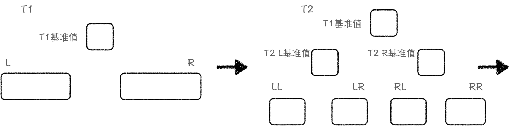
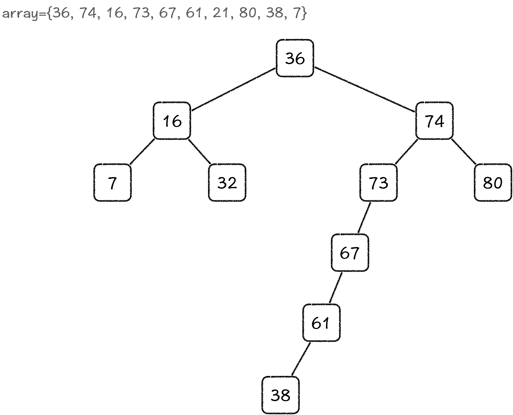
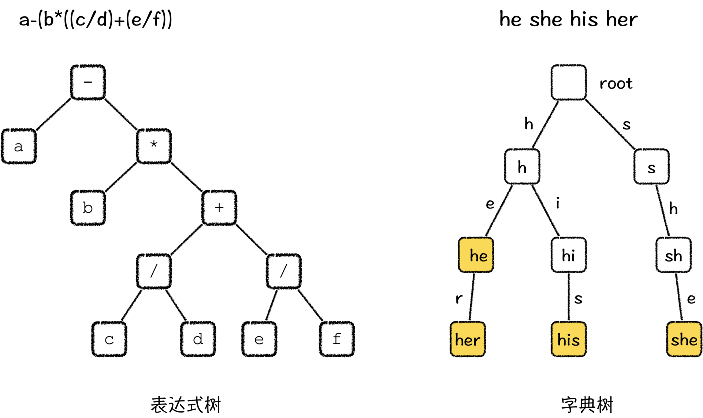
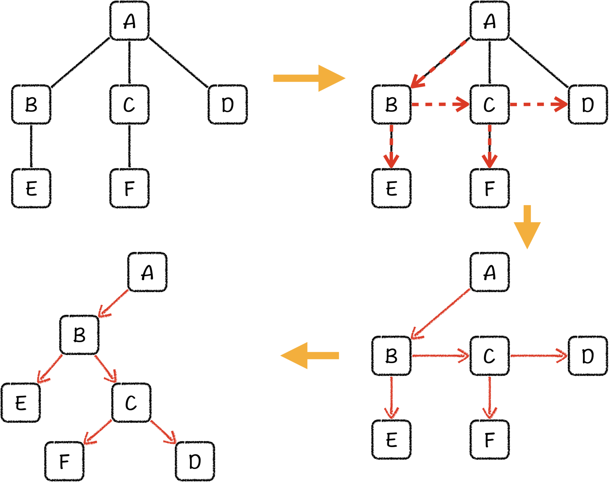

---
date: "2019-06-23"
---  
      
# 13 | 树结构基础：二叉树结构及其基础操作
你好，我是胡光。

在刚刚结束的排序篇，我们讲了各种排序算法以及它们的应用。很重要的一点是，当得到一个有序序列的时候，我们可以轻松利用序列中的元素值作为边界，有效减少查找的次数，方便、高效地实现查找过程。那从这节课开始，我们正式进入查找搜索篇的学习。这一篇，我们会基于排序篇的知识，进一步学习一些和查找、搜索有关的算法与数据结构。

我们先来看今天要解决的问题：现在有一个无序序列，它里面的元素是动态变化的。也就是说我们随时可能会更改序列中的元素，包括增加元素，修改某一个元素的值，或者从中删除一些元素。如果我们想随时查询这个序列中的第k大值，具体该怎么做呢？

这就属于动态查找第k大元素问题，如果我们还用之前学过的排序算法来解决，你会发现虽然只增加了一个更新操作，但原本的排序算法就会变得非常吃力。因为，我们需要不断地让出空位，或者缩减空位，或者交换元素，以保持这个序列的有序性，那每一次更新，我们都可能要付出 \$O\(n\)\$ 的时间代价。

好了，想要解决这个问题，我们的目标已经很明确了，我们要**维护一个有序，并且可以进行高效地更新、查找操作的数据结构**。

## 重识快排：将过程记录下来

如果你现在还没有思路，那我们可以先试着用快速排序来解决这个问题。假设，我们要对一组无序序列，36、74、16、73、67、61、21、80、38、7进行快速排序。第一步，我们会选择一个值作为基准值，第二步，我们再找到基准值的位置，把小于基准值的元素放在基准值的前面，大于基准值的元素放在基准值的后面，第三步，我们会对基准值的左右两侧递归地进行这个过程。



在排序结束之后形成的结构中，每个方框仅代表了一个基准值。最终得到的结果的组织形式其实很像一棵树，具体来说其实是二叉树。



二叉树的结构又是怎么保证高效更新和查找的呢？要想理解二叉树结构是怎样运作的，我们得先知道树结构的基础，以及二叉树的基本操作。接下来，我们就详细来说说。

## 如何理解树以及二叉树？

首先，什么是树结构呢？直观来看，我们前面组织出来的结构，看上去就像是把自然界的一棵树倒了过来，所以树这种数据结构也因此而得名。下面，我们再看树的正式定义：

* 一棵树\$T\$有一个特定的节点，被称为**根节点** _root\(T\)_
* 除根节点之外，其余的节点没切分成 m（\$m\\ge 0\$）个不相交的子集\$T\_1, T\_2, \\cdots, T\_m\$，每一个子集也都是一棵树，这些子集被称作根节点的**子树**

我们该怎么去理解这种定义呢？其实，这个定义里面提到了树的一个关键概念就是**划分子集**。

我们再回顾一下快速排序的例子，在快速排序的每一次迭代过程中，我们都会把小于基准值的元素放在基准值的左边，把大于基准值的元素放在基准值的右边。那以基准值为界，我们就划分出来了两个不相交的子集。以基准值为根节点，左边的子树则是整个集合中小于该基准值的子集，右边的子树就是大于该集合的子集。

所以，构造树结构的过程，可以分成2步。第1步，在集合中找到一个代表性元素，以它为界，使用特定规则把集合划分成若干个不相交的子集。第2步，在每一个子集中，我们使用相同的方式找到一个代表性元素，重复第1步的规则，再把它划分成若干个不相交的子集，直到这个子集不能被划分为止。

因此，树是一种针对集合建模的数据结构。并且，因为树表示了集合的性质，所以树结构有非常好的递推能力，例如，要赋予一棵子树一种性质，我们无需对子树上的每一个节点都操作一遍，而只需对这棵子树的根节点做这种操作就行了。

这就像商场在卖东西的时候，如果推出了活动折扣，那么商场的售货员只需要在活动商品所在的货架上贴上折扣标签就可以了，不需要去修改货架上的每一个商品的价格签，或者仓库中每一个符合条件的商品的价格。而顾客在挑选商品时，售货员也只需要检查这个商品是不是符合活动条件的商品，即可给予对应的折扣价格。

树结构的这种递推性质可以提升很多的效率，所以它能够被广泛应用于计算机科学中，有着举足轻重的地位。比如说，表达式树可以用于求解复杂表达式，也可以用于对复杂表达式求导，而哈夫曼树可以有效利用字符串中字符出现的频次信息完成信息压缩，以及字典树以节点为字符串前缀，以边为字符，可以将多个字符串空间压缩，同时也可以利用前缀索引字符串，甚至计算机中的文件系统也是一种树结构。



搞清楚树的定义之后，二叉树的定义就变得简单了，我们只需要给树增加两个限定条件，它就能变成二叉树。条件一，是二叉树的每一个节点至多有两个子树。条件二，是我们管二叉树的两个子树分别叫做 **左子树** 和 **右子树**。

二叉树是一种优美的树结构，它简化了树的结构，使得很多操作变得非常简单，同时也保持了相对高效率，从而让我们能够很高效地解决很多问题。

在[二叉堆](https://time.geekbang.org/column/article/275747)那节课中，我们学习过满二叉树和完全二叉树两个概念，并且我还提到过，完全二叉树如果用一个一维数组来存储，可以方便地通过数组下标访问每个节点的子节点，还能不耗费多余的存储空间。

同样地，我们也完全可以利用一个空间为\$2\^h\$（h为树高）的一维数组存储一棵二叉树，通常一棵随机二叉树的树高和同样节点数的完全二叉树相差不大，所以它也可以用少量的空间浪费换取方便的存储和高效的访问。

好了，二叉树的基础概念我们已经知道了，接下来，我们就重点讲讲二叉树的基本操作。

## 二叉树的遍历

我们知道，有很多算法是依托于树结构实现的，而这些算法的执行过程中，往往都会出现一个非常基础的遍历操作。树结构的遍历，其实就是把树结构上的节点当作一个站点，再把树结构上的边当作一条路，沿着路线依次访问各个站点，且每个站点只访问一次。

既然每一个站点只访问一次，那从起点（根节点）出发向下行进的过程中，我们就需要尽可能走没有走过的路，最优的方法是先走到最深处的节点，再返回走另一条没有走过的路。实际上，这就是一个递归回溯的过程。在树上，我们从根节点出发，直观来看，我们是尽可能越走越深的，所以这种遍历也被称作**深度优先遍历**。

而一次完整的遍历会根据每个节点的访问顺序，将一棵树表示成为一个序列，这种访问序列中，利用好每一个节点的前一个节点（前驱）或者后一个节点（后继），可以提升很多算法的效率。

二叉树作为一种简单的树结构，它的遍历按照顺序可以划分为三种：

* 前序遍历：对于每一棵子树，依次访问其根节点→左子节点→右子节点
* 中序遍历：对于每一棵子树，依次访问其左子节点→根节点→右子节点
* 后序遍历：对于每一棵子树，依次访问其左子节点→右子节点→根节点


在遍历的过程中，当一个节点以及它所有的孩子都被访问过的时候，我们就需要回溯到之前的状态继续进行。这个过程可以通过递归实现，也可以通过栈来实现。具体过程的话，你可以看看下面的前序遍历代码。

```
    struct tree_node {
        int value;
        tree_node *left_son;
        tree_node *right_son;
    };
    
    void pre_order(TreeNode *cur_node) {
        visit(cur_node);
        pre_order(cur_node->left_son);
        pre_order(cur_node->right_son);
    }
    

```

现在，对于我们用快速排序生成的二叉树，如果我让你对它进行三种遍历，你觉得会发生什么样的事情？

如果你真的动手试过了，就会发现，当我们对那棵树执行了一次中序遍历之后，我们最终得到的元素值的序列，就是一个升序的序列了。这就是二叉树的遍历在特定算法或数据结构中所能发挥的作用。

## 树、森林和二叉树相互转换

既然二叉树如此地简单、便捷，那么就有人提出了，二叉树的这些性质能不能复用到一般树上，甚至是复用到森林中，让一般树和森林的操作也像二叉树一样简洁呢？当然可以。接下来，我们就说说**怎么用二叉树表示树和森林**。

在把一棵树转换成二叉树的过程中，我们需要保证，转换之后再使用二叉树的遍历，不会破坏原来树的层次结构。比如说，我们考虑顺序遍历一棵子树，也就是说，在访问根节点之后，从它的第一个孩子开始，我们依次向下遍历得到遍历序，我们把它转换成二叉树之后再遍历，它的序列也不会改变。

我把一棵树的顺序访问过程，也就是每一个节点的访问顺序画成一个路线图，如下图所示。当我们从B访问到E之后，就没办法继续访问了，只能重新从B出发去访问C。同样地，我们从C访问到F之后，也无路可走，只能从C重新出发去访问D。我们发现，每一个节点除去回溯之外，会进入序列一次，再至多离开两次，这不刚好和二叉树的节点一样吗？我们将这个路线图重新组织起来，就理所当然得到了一棵二叉树。

具体来说，对于每一个节点，**我们将它的第一个子节点当作它的左子节点，将它的所有兄弟节点当作它的右子节点**，就能将一棵树转换成为二叉树了。这种方法被称作**左孩子右兄弟**表示法。



这就是把树结构转换成二叉树的方法，其实把森林转换成二叉树的方法与刚才的方法是一样的。具体来说，我们可以假设森林有一个总体的根，而森林中的所有树都是那个根节点的子树。这样，转换方法就呼之欲出了，我们只需要把其他树按照右兄弟的方式和第一棵子树的根节点组织起来就好了。


好了，上面就是树、森林转换成为二叉树的过程。接下来，我们就可以将二叉树的遍历方式套到树或者森林上，但由于树或者森林的子节点不一定存在对称关系，并且森林是没有根的，所以树和森林的遍历就不存在中序遍历。因此，树和森林的遍历规则只有先序遍历和后序遍历。

对于树来说，先序遍历是先访问根，再依次访问所有孩子，后序遍历是先访问所有孩子，再访问根。对于森林来说，先序遍历是先访问第一棵树的根，再访问第一棵树的所有孩子，再访问其他树。后序遍历是先访问第一棵树的所有孩子，再访问第一棵树的根，再访问其他树。

最后，如果我们想把二叉树转换回树或者森林，也很简单，只需要做逆向操作就行了。如果是按照左孩子右兄弟方法来转换的，最终二叉树的根节点如果存在右孩子，那原本的结构就一定是森林。

好了，二叉树的基础操作我们就讲完了。接下来，我还想和你聊聊二叉树的线索化。

## 二叉树的线索化

我们在存储二叉树的时候，每一个节点都要预先定义出它的左孩子和右孩子，在实际实现中，则是会定义左指针和右指针。这就导致了，我们在定义和实现二叉树的过程中，有一些指针是利用不到的。线索化二叉树，就是把这些指针充分利用起来，让它们在遍历中起到作用的一种方法。那具体怎么实现呢？

刚才我们说了，在遍历二叉树的过程中，当走到尽头的时候，我们就会经历一个回溯的过程，这个过程可以是递归回溯，也可以利用栈来实现回溯。那当我们发现这些节点中有空指针的时候，我们就把它指向到下一个要经过的节点上。这样一来，我们就可以充分利用每个节点上的指针，同时也不会发生引入错误。而且，在遍历的过程中，由于我们已经记录了回溯的位置，这让遍历过程也会变得更加容易。

多出来的这些边，就被称作**线索**，而这个过程就是二叉树的线索化。这样每一个节点都会存在两条出边，每一个节点的边都会指向它的**前驱**或者**后继**，根据遍历顺序的不同，线索化过程也可以分为**前序线索化**、**中序线索化**以及**后序线索化**。


上图是一个二叉树中序线索化的结果。你可以看到，树中只有两个指针是指向空的，分别是最左节点的左线索和最右节点的右线索，每一个节点的左线索指向中序前驱，右线索指向中序后驱。这样，在线索二叉树上的遍历过程中，我们只需要沿着边一直走下去就可以了。

## 课程小结

这节课，我们讲了树这种非常重要的数据结构，也着重讲了一种特殊的树，就是二叉树。树和二叉树的定义很好理解，首先，一棵树有一个特定的根节点，除了根节点以外，树还有很多不相交的子集，它们被叫做根节点的子树。而二叉树的每一个节点至多有两个子树，分别叫做左子树和右子树。

然后，我们重点讲解树的遍历。二叉树有三种遍历形式，分别是前序遍历、中序遍历和后序遍历。在特定的算法或者数据结构中，二叉树的遍历能够快速对数据进行升序或者降序排序。

除此之外，二叉树、树以及森林之间是可以相互转换的，这样二叉树的性质就能复制到树和森林上了。不过，在转换过程中我们要保证，转换后再次进行二叉树遍历的时候，不会破坏树原有的序列结构。

最后，我相信通过这节课的学习，你肯定对树结构有了一个基本的认识。那距离解决我们动态查找第k大数的问题也就更进一步了。在接下来的课程中，我会带着你继续解决这个问题。

## 课后练习

1.  在这节课的最后，我们学习了二叉树的线索化，如果我们在线索二叉树中插入一个节点，那树上的线索应该怎样更新呢？

2.  如果有一棵二叉树\$T\$，它由另一棵二叉树\$T’\$使用_左孩子右兄弟_构造而成。你觉得\$T\$和\$T’\$的遍历序有什么联系吗？

好了，关于树和二叉树的基础知识你都理解了吗？不妨也把这节课转发出去吧！那今天就讲到这里了，我是胡光，我们下节课见。