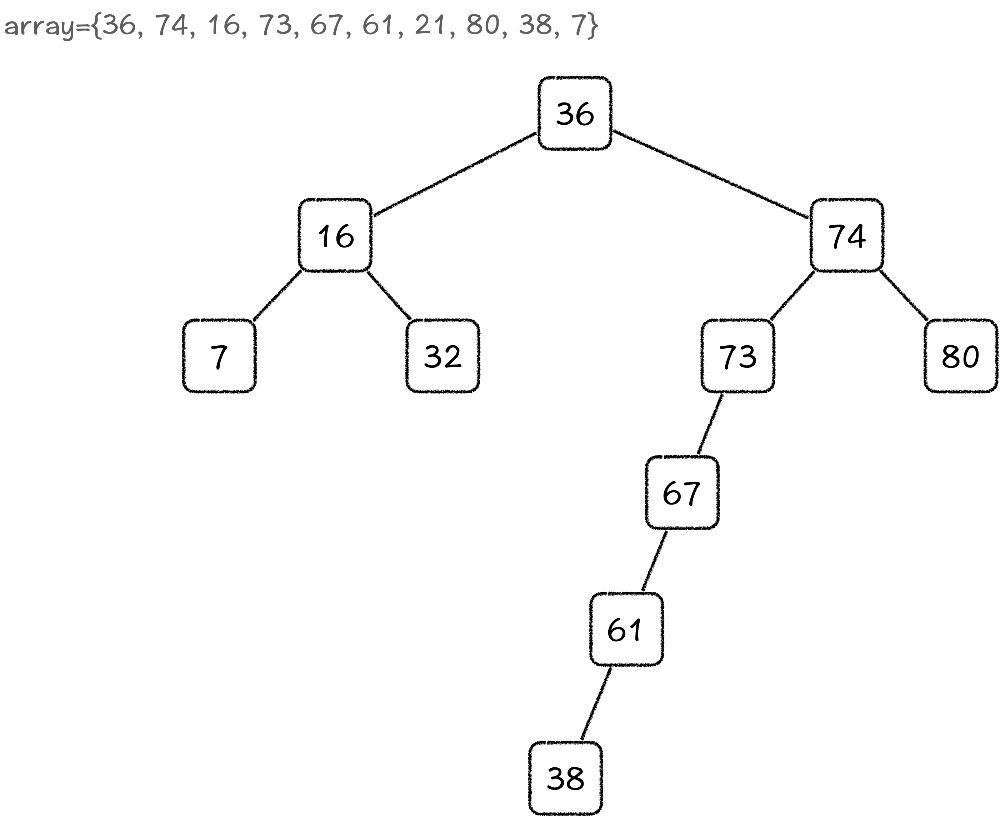
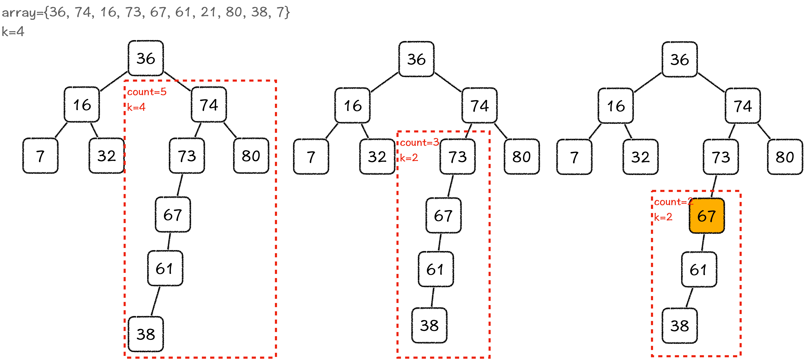
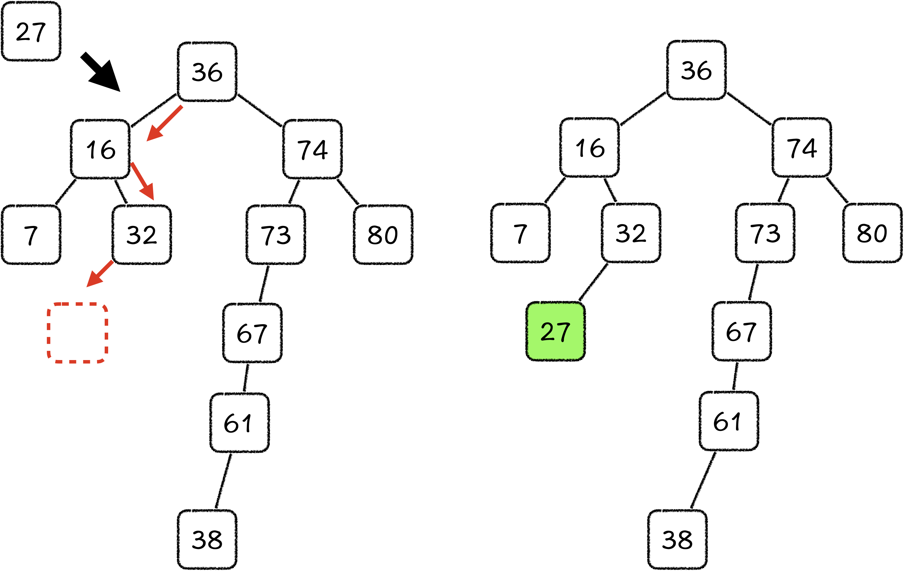
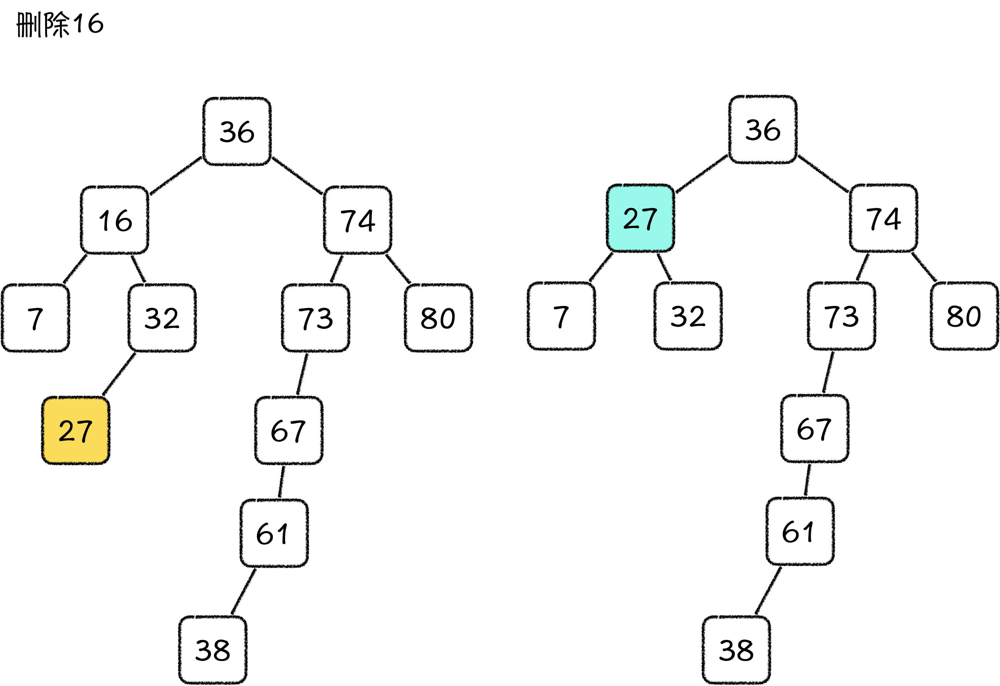

---
date: "2019-06-23"
---  
      
# 14 | 二叉排序树：如何动态查找第k大元素？
你好，我是胡光。

上节课，我们初步认识了树和二叉树的结构。这节课，我们就一起来解决动态查找第k大元素问题。我们想先来回顾一下这个问题：

在一个随时都可能进行增、删、改、查这些更新操作的序列中，我们该怎样快速地查找任意的第k大的元素（每次查询的时候，k都可能发生变化）？

上节课我们说过，想要解决动态查找第k大元素问题，首先需要维护一个动态的有序结构，它可以进行高效地更新和查找。接着，我们通过回顾快速排序，记录它的每一步过程，得到了一个二叉树，它经过中序遍历序列之后，会得到一个升序的序列。

那这棵树就是我们这节课要重点讲解的二叉排序树，也叫做二叉搜索树（Binary Search Tree）。



## 如何用二叉排序树查找第k大元素？

下面，我们来正式认识一下它的性质。在二叉排序树中，**每一个节点的左子节点都比它小，而右子节点都比它大**。

广义上来说，我们也可以以不同的排序规则来定义二叉排序树的结构，但不同规则的内核都是不变的。比如说，你也可以定义左子树是大于根节点的值，右子树是小于根节点的值。这里我就不详细展开了。

那在这样的一个结构上，我们该怎么去寻找任意第k大元素呢？因为只要是基于树的算法，它们的基本思想大部分都是遍历，所以我们就以在这棵树上的中序遍历为出发点考虑这个问题。

我们从根出发，根节点的左子树就相当于序列中比根小的所有数，右子树就相当于比根大的所有数。接下来，我们重点考虑根节点的排名：如果右子树中的节点数是 r，那么根节点的排名就是 r + 1；如果 r + 1 等于 k，那么根节点就是我们要找的元素；如果 r + 1 大于 k，说明排名第 k 大的元素在右子树中，否则排名第 k 大的元素就在左子树中。当问题转换到左子树中，你需要注意的是，在左子树中不再是查找排名第 k 大的元素，而是在左子树中查找排名第 k \- r \- 1大的元素。

比如说，当k=4的时候，右子树的节点数是5，5+1大于4，所以第4大元素一定在右子树中。而当k=6的时候，5+1等于6，所以第5大元素应该就是当前的根节点。怎么样，是不是很好理解？



这样做的具体算法如下：

```
    // cur_node->value：树节点的值域
    // cur_node->count：以该节点为根的子树中的节点数
    int kth_largest_element(TreeNode *cur_node, int k) {
        int right_count = 0;
        if (nullptr != cur_node->rightSon)
            right_count = cur_node->rightSon->count;
        if (right_count + 1 == k) // 需要把子树的根计数进去
            return cur_node->value;
        else if (right_count + 1 > k) {
            return kth_largest_element(
                cur_node->rightSon,
                k
            );
        } else {
            return kth_largest_element(
                cur_node->leftSon,
                k - right_count - 1
            );
        }
    }
    

```

简单来说，这个查找方法的基本思想，其实就是在有序序列中利用有序边界进行查找，同时我们又把它与二叉树的遍历结合了起来。而且，有序边界这个性质能够有效地帮助我们一次性排除掉很多个元素，所以我们只需要少量查找操作就可以得到目标值了。

就算是最坏的情况，也只不过是从树根到叶子最长的一条路（即树高）。而一棵随机序列的二叉搜索树，树高一般都在\$log\_2n\$这个量级，代价也不会很大。

好，现在我们已经解决了动态查找第k大元素的查找问题，但我们的旅途还没有结束，因为有序序列的更新问题还亟待解决。序列的更新有增、删、改、查这四个操作，接下来，我们先来看元素的插入操作。

## 二叉排序树的插入

想要在插入元素之后，仍旧维持序列的有序性，我们就需要**把要插入的元素放到正确的位置上**。也就是说，如果要在序列a中插入x，那我们就需要在序列中找到一个位置i，让\$a\_\{i-1\}\\le x\\le a\_i\$，然后把x插入到位置i上。如果你基础比较好，我相信你一秒就可以回答上来，这个查找过程其实就是二分查找法。

二分查找法简单来说，就是对确定的查找区间n不断二分，每次二分都与要查找的元素x进行比较，每次比较后，我们都能减少一半的查找区间，时间复杂度是 \$\{log\_2\}\{n\}\$ 。

那为什么要使用二分查找法呢？我们说过，如果是在一个一维序列中直接进行这种插入元素的操作，那每一次更新的耗时其实是很大的。但树结构就不一样了，**树是一种非常方便更新的数据结构**。你可以回忆一下我们讲过的二叉堆，它就是在二叉树结构上维护有序序列的结构。我们只要利用少数的元素放置或者元素覆盖，再加上向上或者是向下的调整操作，就能快速地删除或者插入元素了。

这节课，我们就把刚才说的更新过程也移植到二叉排序树上，来看看二叉排序树是怎样更新的。

**第一步，找到正确的插入位置。** 其实就相当于我们要在二叉搜索树中寻找一个特定值，如果寻找不到，则插入这个特定值。现在，相信我不用往下说，你也知道该怎么做了。



示例代码如下：

```
    void insert(TreeNode *cur_node, int value) {
        if (cur_node->value == value) {
            return;
        }
        if (value < cur_node->value) {
            if (nullptr != cur_node->rightSon) {
                insert(cur_node->rightSon, value);
            } else {
                TreeNode *new_node = new(TreeNode);
                new_node->value = value;
                new_node->leftSon = nullptr;
                new_node->rightSon = nullptr;
                cur_node->rightSon = new_node;
            }
        } else {
            if (nullptr != cur_node->leftSon) {
                insert(cur_node->leftSon, value);
            } else {
                TreeNode *new_node = new(TreeNode);
                new_node->value = value;
                new_node->leftSon = nullptr;
                new_node->rightSon = nullptr;
                cur_node->leftSon = new_node;
            }
        }
    }
    

```

不过，在上面的插入算法中，我们讨论的是序列中不存在重复元素的情况，那如果序列中存在了重复元素，我们又应该怎么办呢？其中一种方法是把相等看作大于或看作小于，然后按照规则建立二叉排序树，

## 二叉排序树的删除

接下来，我们再说说二叉排序树中的删除操作。与插入一样，我们还是从有序的一维序列中删除一个元素出发，来推出在删除掉二叉排序树的一个节点的时候，我们应该做什么。

首先，我们需要在一维序列中找到那个要删除的目标元素，如果是按值删除其实还是直接用二分查找法最直接省事，如果是按位置删除，那我们直接下标索引就可以。在删掉了目标元素之后，原有序列中就会出现一个空位，这个时候我们要做的就是将前面的元素集体后移，或者将后面的元素集体前移，以此来维护这个序列。

在二叉排序树中也一样，我们的重点不是找到那个节点的位置，而是删除了那个节点之后，怎么样补上那个节点的空位，让它还是一棵二叉排序树，而不会变成一个森林（即保持树的连通性）。

因此，我们在删除掉一个节点N之后，需要做的是**填补空位**。假设在有序序列中，我们是把空位后面的元素整体前移。那将这个想法复用到树上的时候，我们要寻找、移动的子树是哪一棵呢？

其实就是被删除节点的**中序遍历的后继。**这是为什么呢？首先，被删除节点N的中序后继，一定是在有序序列中比它大的第一个节点，想要顶替被删除节点的位置，它是最合适的。在二叉排序树结构上，被删除节点N的左子树中所有节点，一定小于后继节点succ\(N\)。而在右子树中，除去后继节点本身外，剩余节点一定大于后继节点succ\(N\)，所以将后继节点顶替到这个位置一定是正确的。

那在我们删掉一个节点N的时候，会有3种情况发生。

1.  如果N既没有右子节点，也没有左子节点，那我们直接删除N，释放空间即可。
2.  如果N没有右子节点，但是有左子节点，那么我们将左子节点leftSon\(N\)放到N的位置上，然后删除N，释放空间即可。
3.  如果N有右子节点，那么从它的右子节点rightSon\(N\)出发，一直向左走，直到走不了为止，然后将最终到达的那个节点succ\(N\)放到N的位置，删除掉N，释放空间即可。

你看我这么说，肯定觉得比较麻烦，但它的核心思想其实非常明确，就是**找到当前节点中序遍历的后继，使用后继代替被删除节点的位置**。而且在树上进行这种操作，实际上我们只需要改变指针的指向，所以，二叉排序树的删除操作也非常便捷。



## 二叉排序树优化

二叉排序树是一种非常优秀的索引、排序算法。在一棵给定的二叉排序树上，它的最坏索引次数就是树高。而一个长度为N的序列，在理想情况下，它的二叉排序树树高应当是\$log\_2n\$，可是现实情况下，对于一个随机序列，我们很难构造出来这样一棵最优的二叉树来，一般构造出来的二叉树都是有些退化的，就像我们前面讲的一样。

实际情况下，在一棵随机二叉树上进行索引，平均的时间复杂度是\$\\sqrt n\$，看起来好像也不错。但这就有一种听天由命的感觉了，一旦遇到了极端情况，我们仍然束手无策。

举个例子，如果将元素以升序顺序或者降序顺序插入到二叉排序树中，那我们就会得到一条链。


这样的话，我们每次插入元素的时候，都要索引整棵树，这个退化就让人非常难受了。像完全升序或完全降序这样的极端情况还有很多种，如大小交替插入等。所以我们要控制二叉排序树，使得它能够有一个更加优化的结构。具体怎么做呢？

首先，我们来思考一个问题，一个长度为N的序列会对应多少种二叉排序树？当N=3的时候，如下图，会有5棵二叉树（其中`[2, 1, 3]`和`[3, 1, 2]`的树结构一样，没有列出）。


那么当N足够大的时候，其对应二叉排序树的数量将是爆炸式增长（直观来看，这个数量和排列数相关，即N的阶乘），这个数量级我们完全不能接受。所以我们就要**快速找到长度为N的序列对应的最优二叉排序树**。

知道了目的，那我们就可以形式化地定义这个问题了。假设，有一个长度为N的升序序列，其中的元素为\$\[a\_1, a\_2, \\cdots, a\_i, \\cdots, a\_n\]\$。我们定义：

* \$p\_i\$是搜索的目标值就是\$a\_i\$的概率；
* \$q\_i\$是搜索的目标值在\$a\_i\$和\$a\_\{i+1\}\$之间的概率；
* \$q\_0\$是搜索目标值小于\$a\_1\$的概率；
* \$q\_n\$是搜索的目标值大于\$a\_n\$的概率。

这样一来，\$p\_1+p\_2+\\cdots+p\_n+q\_0+q\_1+\\cdots+q\_n=1\$，搜索过程的**比较次数**的期望值为：

\$\$\\sum\_\{j=1\}\^n\(level\(j\)+1\)+\\sum\_\{k=1\}\^nlevel\(k\)\$\$

我们管这个期望值叫作二叉排序树的**搜索成本**，其中\$level\(j\)\$是节点所在的树层。那我们要解决的问题就是，怎样才能让搜索成本最小。

我们可以先思考一个问题，既然树的子树是可以完美继承树本身的一些性质，这是树的递推性质。那么，一棵最优二叉排序树的子树，是不是也是一棵最优的二叉排序树呢？

一定是的，这个非常容易证明，我们用反证法来证明：假设一棵最优二叉排序树中存在一棵非最优的子树，那当一次查找索引到这棵子树的时候，在这棵子树中的查找过程就不是一个最优过程，也就说说这棵子树的查找期望值就不是最小的，也就不符合最优二叉排序树的性质。所以最优二叉排序树的子树一定也是最优二叉排序树。

这样一来，如果我们把一棵二叉排序树的某一个子树优化成了二叉排序树，就离整棵二叉排序树更近了一步。说到底，这就是在递推地查找存在一个最优子结构的问题，那在递推算法中求解最优化问题的方法，就是动态规划。

我先来简单说说动态规划的解题过程。其实就是4步，分别是：状态定义、状态转移方程、正确性证明，以及程序设计与实现。状态定义就是给问题定义一个带有明确语义信息的数学符号，状态转移方程就是我们从递推过程中，总结出来的公式，而正确性证明，就是利用数学归纳法来证明状态转移方程的重要性，那最后就是程序的设计与实现了。

下面，我就教你怎么用动态规划来设计这个算法。

首先是状态定义。我们单刀直入，直接切入到这个问题的最终目标：定义\$c\(i, j\)\$是子序列\$\[a\_i, a\_\{i+1\}, \\cdots a\_j\]\$对应的最优二叉排序树的搜索成本。

然后，我们把状态转移方程设置成如下的方程：  
\$\$c\(i, j\)=w\(i, j\)+min\_\{i\<k\\le j\}\(c\(i, k-1\)+c\(k, j\)\), \\text\{for i\<j\}\$\$

这个方程的意义是，对于子区间 \[i, j\] 中的数​，我们一定要把它划分成一棵子二叉排序树。假设其中的根节点是\$a\_k\$，而整个序列都是升序的，那子区间 \[i, k \- 1\] 就是左子树，子区间 \[k+1, j\] 就是右子树。

刚才我们已经证明过这个问题的最优子结构的正确性，这里我就不再啰嗦了。那显然，解决这个问题的算法，它的时间复杂度为\$O\(n\^3\)\$，空间复杂度为\$O\(n\^2\)\$，这和前面提到的阶乘的数量级相比，已经减少很多了。

其实我们还可以利用**二叉排序树**中的单调性质，进一步减少这个算法的时间复杂度，你可以自己想想，我就不展开来说了。

## 课程小结

这节课，我们带你认识了二叉排序树，然后学习了二叉排序树的基本操作，还利用二叉排序树的性质解决了动态查找第k大元素的问题，同时，我们还讲了如何找到最优二叉排序树的方法。

二叉排序的性质是每一个节点的左子节点都比它小，而右子节点都比它大。当要查找第k位元素的时候，我们只要把k与右子数节点和左子树节点先后进行比较就可以了。这样，我们就先解决了查找第k位元素的问题。

而对于有序序列的更新问题，我们从有序的一维序列的插入、删除操作出发，推出了二叉排序树的插入和删除操作。在二叉树中插入元素的时候，我们是利用二分查找法，把要插入的元素放到正确的位置上。而进行删除操作的时候，我们要找出被删除节点的中序遍历的后继，使用后继代替被删除节点的位置。

除此之外，我们还讲了二叉排序树的优化。我们可以利用动态规划的方法，快速找到长度为N的序列对应的最优二叉排序树。其实最优二叉排序树问题与信息熵结合，还能推导出另外一种算法， Garsia-Wachs算法，这个算法可以将时间复杂度进一步优化到\$O\(nlogn\)\$。

可是，我们的旅程依旧没有结束，如果我们要保持二叉排序树在更新后依旧保持最优状态，哪怕是依靠\$O\(nlogn\)\$的Garsia-Wachs算法，代价也是非常大的。这该怎么办呢？下节课我会再给你讲一种具有自适应能力的二叉排序树，期待一下吧。

## 课后练习

1.  在二叉排序树中插入元素的时候，如果序列中存在重复的元素，二叉排序树又应该怎么定义呢？那动态查找第k大元素的算法需要有什么改动？

2.  在二叉树中删除元素的时候，我们除了前移后面的元素之外，还可以把前面的元素后移。那你将后继节点替换更改为前驱节点替换，并且实现出这个方法吗？

欢迎在留言区分享你的答案，也希望你能把这节课的内容转发出去。那今天就到这里了，我是胡光，我们下节课见！