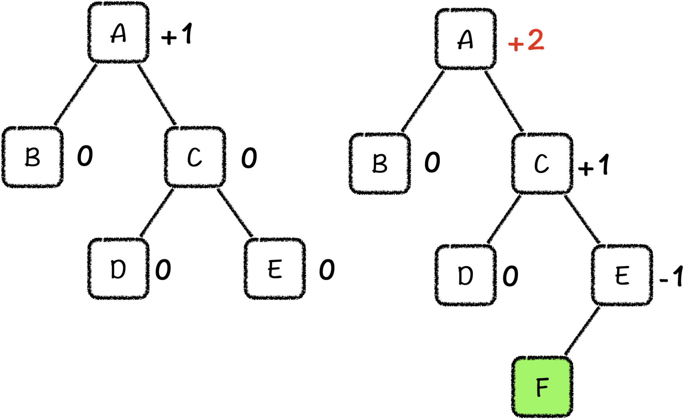
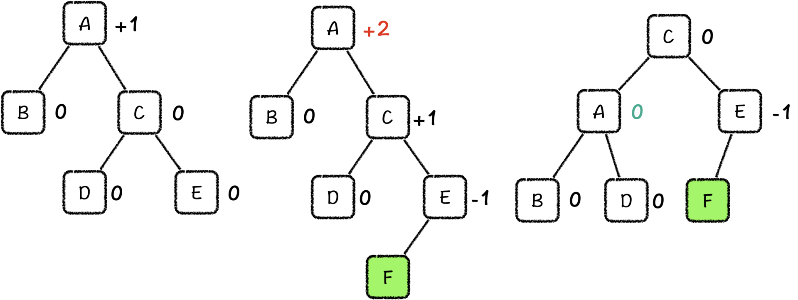
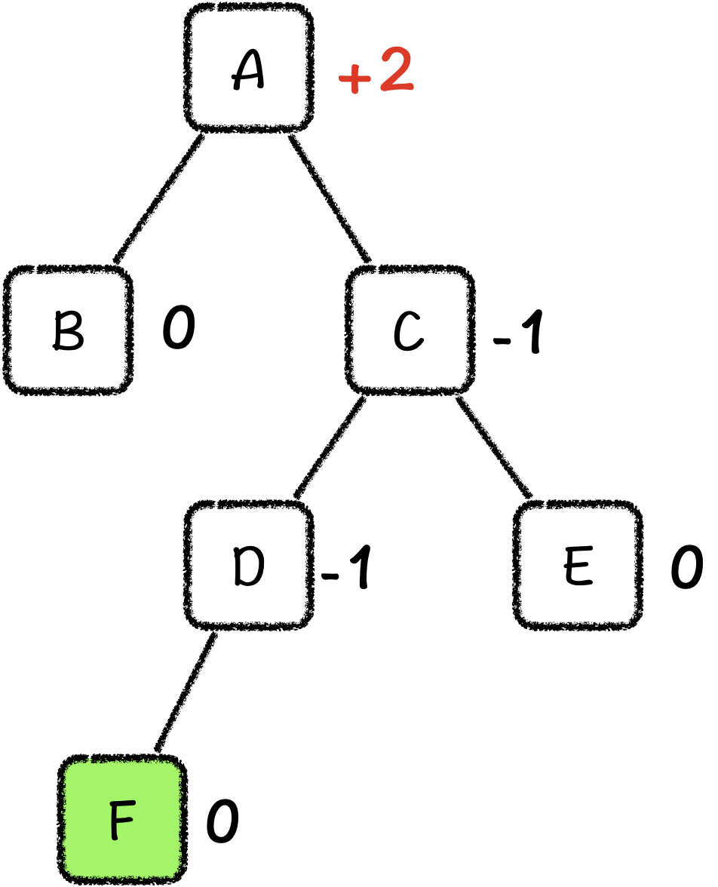
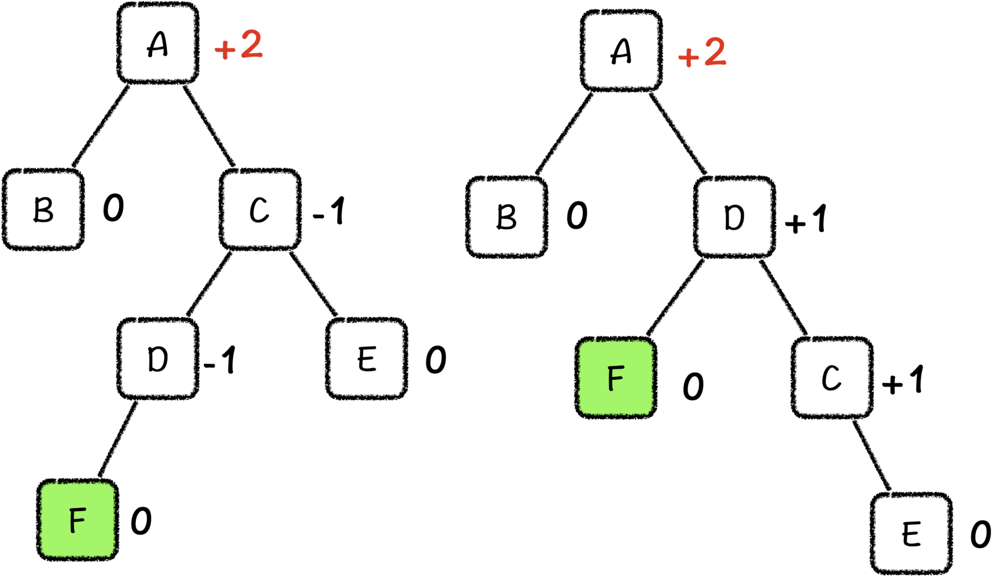
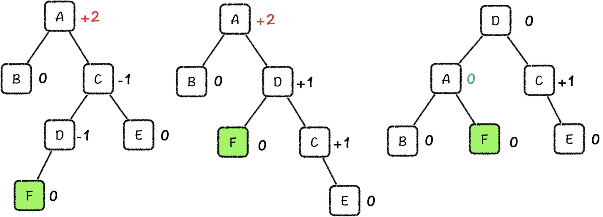

---
date: "2019-06-23"
---  
      
# 15 |  AVL树：如何让二叉排序树永远保持最优？
你好，我是胡光。

上节课，我们学习了二叉排序树，并且利用它解决了动态查找第k大元素的问题。但是这还不够，因为二叉排序树中存在退化现象，极端情况下，二叉排序树的操作效率并不会比线性表高。虽然我们也学习了最优二叉排序树的求解算法，但是它的代价依旧不低。

为了解决这个问题啊，曾经也有人提出来过，在维护一个动态更新的有序序列的时候，我们先不管二叉排序树是否是最优的，只要是在维护过程中树高超出了一定的限制（如\$5\\times log\_2N\$\)，我们就重新求解二叉排序树。

这是一种比较折中的办法，但仍然要我们间歇性花费不低的代价去保持树的效率。那么有没有什么办法，能够让二叉排序树拥有自适应的能力，在每一次插入、删除之后可以随时调整自己，让自己保持最优状态呢？

当然是有办法的，早在1962年，就有两位数学家提出来了一种方法，这种方法可以做到在二叉排序树上进行增、删、查，以及查找动态第k大元素等操作，时间复杂度都是\$O\(log\_2N\)\$，这个方法就叫做**平衡树**，也叫做**AVL树**。


在平衡树中，“平衡”的意思，就是将二叉树左右两棵子树的高度看作是这两棵树的重量，把这两个重量放在一个天平上，尽可能保持这个天平是平衡的。也就是说，一棵平衡树的**左右两棵子树的树高之差不会超过1**。由此我们知道，平衡树就是一个最优的二叉排序树，平衡树的树高也就一直保持在\$log\_2N\$左右（实际上是在\$log\_2\(N+1\)\$和\$1.4405\\times log\_2\(N+2\)-0.3277\$之间）。正因为维持了树高，所以一棵有N个节点的平衡树，每一个操作的时间复杂度都可保持在\$O\(log\_2N\)\$。

在正式讲平衡树之前，我们还要引入二叉树上的一个关键的操作，旋转（Rotate）操作，这个操作也是平衡树能够改变形态、保持平衡的关键。

## 二叉树的旋转：二叉树自适应能力的关键

旋转操作的字面意思，就是将二叉树转了一下。旋转后的二叉排序树也依然会保持二叉排序树的性质。也就是说，我们在进行了一次旋转操作之后，最终的产物仍然是一棵二叉排序树，这棵二叉树排序上的每一个节点，总是**大于它的左孩子，小于右孩子，而且中序遍历后的结果也保持不变**。

树的旋转究竟是怎么操作的呢？打个比方，我们可以把树上的每一个节点看作是弹珠，每一条边看作是绳子。平常这棵树，我们都是用手拎着它的根节点那颗弹珠，让其他的弹珠自然垂下。然后我们有一天突发奇想，想要换一颗弹珠来拎着，比如我们想要拎根的左子节点那颗弹珠，然后让其他的弹珠继续自然垂下。这样，左子节点成为了新的树根，而根节点成为了新树根的右子节点。

但是，只是这么简单的操作是不够的。如果我们把图1中左子节点，也就是4当作根节点，最终的结果就是节点4除了原有的两个子节点之外，根节点也成为了它的子节点，那它就有3个孩子节点，这显然就不符合二叉树的定义了。所以我们还要进一步明确旋转的细节。

我们把这个问题放到一个比较简单，但却足以代表所有情况的例子中。如下图中左边这棵树，我们将它按照上面描述的方式进行了一次操作之后，2变成了根节点，1、3、4都变成了它的孩子节点。


为了保持二叉树的性质，我们就需要选出一个孩子节点移动到另一个空位上。这个时候，1、3、5有两个空位，4有一个空位。我们可以把其中一个孩子节点移到5上吗？你千万不要被这个简单的例子迷惑了，5 号节点完全可以代表一棵左右孩子双全的子树。

因此，我们需要找到唯一一个一定会出现一个空位的节点。没有错，就是原来的根节点，所以我们应该把2 号节点多出来的一个孩子节点放到原根节点，也就是4的下面。

相信你也看到了，根节点空出来的位置刚好是左孩子的位置，而新的根节点 2 号节点，由于它原本就是 4 号节点的左孩子，因此它的所有子树节点的值都小于 4 号节点。也就是说，2 号节点的任意一个孩子都可以放到 4 号节点的左孩子位置。

但是别忘了，我们还有一个目标，那就是保持原二叉树的中序遍历序列不变。如果我们把2号节点的左孩子变成了4号节点的左孩子，那在中序遍历之后，我们就无法先遍历到这些节点了，所以，我们只能把2号节点的右孩子，变成4号节点的左孩子。这也就保持了4号节点的中序前驱在新的树中，依旧是中序前驱。


```
    Node *right_rotate(Node *root) {
        Node *temp = root->lchild;
        root->lchild = temp->rchild;
        temp->rchild = root;
        update_height(root);
        update_height(temp);
        return temp;
    }
    

```

这种把二叉树的左孩子作为根进行的旋转操作，也被称作是**右旋操作**（Right Rotate），那与之对称的就是左旋操作（Left Rotate）。


```
    Node *left_rotate(Node *root) {
        Node *temp = root->rchild;
        root->rchild = temp->lchild;
        temp->lchild = root;
        update_height(root);
        update_height(temp);
        return temp;
    }
    

```

看到这里，相信你也发现了，**二叉树的旋转操作可以有效地改变左右两棵子树的树高差**，所以，旋转操作是平衡树保持平衡的关键操作。接下来，我们就来聊一聊，平衡树是怎样利用旋转操作保持平衡的。

## AVL树的基本操作

为了保持树的平衡，我们首先需要知道现在这棵树是不是平衡的。这里，我们可以直接计算平衡树的树高差，我们用**右子树的树高减去左子树的树高**，把得到的差叫做**平衡因子**。在平衡树中，平衡因子只可能有3个值：+1，-1和0，一旦某一个节点的平衡因子出现了这3个值之外的数值，就说明这棵子树需要调整。


我们知道，旋转操作可以有效地改变左右两棵子树的高差，所以，我们也主要依赖旋转操作来调整平衡因子。那具体怎么做呢？我们可以结合平衡树的更新操作一起来学习。

```
    //AVL树节点定义，需要增加数据域h记录当前节点树高
    #define H(root) (root)->h
    #define K(root) (root)->key
    #define L(root) (root)->lchild
    #define R(root) (root)->rchild
    
    typedef struct Node {
        int key, h;
        struct Node *lchild, *rchild;
    } Node;
    

```

### AVL树的插入

首先，是插入操作。我们先想两个问题，在向平衡树中插入节点的时候，树上会发生什么样的变化？我们怎么利用旋转操作让二叉排序树回归到平衡中呢？

因为影响平衡的主要因素是树高，所以我们主要考虑插入节点后对树高的影响就好啦。

最简单的情况，就是我们插入一个节点之后，并没有影响到子树的树高，这个时候，我们不需要进行调整。

第二种情况，我们插入一个节点之后，虽然影响到了子树的树高，但没有影响到子树平衡。这种情况其实还能细分成三种情况。第一种，我们把节点插入到根节点平衡因子为0的子树中的任意一处，第二种，我们把节点插入到根节点的平衡因子为+1的子树的左子树中，第三种，我们把节点插入到根节点的平衡因子为+1的子树的右子树中。这三种情况听起来可能有点绕，你可以结合任意一张示意图来理解。

所以，我们需要考虑的情况，只有**插入了节点之后，确实影响到了树的平衡**。其实，这种情况还能进行细分。下面，我就详细来说说。

首先，我们向一棵平衡因子为+1的子树的右子树中插入一个节点，这样右子树的会树高增加，这个节点的平衡因子就变成了+2。



我们看到，节点A的平衡因子超出了限制，所以我们需要降低A节点的平衡因子。那么这棵树只要经历一次**左旋操作**就能恢复平衡了。



这种情况其实还有一种对称的情况：我们向平衡因子为-1的子树的左子树中插入节点，因为影响了左子树的树高，所以平衡因子就变成-2，怎么恢复平衡，相信我不说，你也知道了。

其实前面这些情况，都是**向一个方向插入的节点**。比如说，刚才我们插入的位置是子树A的最右子节点下面，这样A的右子树C的平衡因子就变成了+1。但是，还有一种情况是，我们插入了节点之后，C的平衡因子就变成了-1。



如果我们把这种情况直接做左旋处理的话，很显然，右子树C的左子树D就会直接成为A的右子树，那么左子树的树高则变成了3，右子树由于只有一个E节点，树高变成了1，根节点C的平衡因子变成了-2，树仍旧是不平衡的。这个时候，我们该怎么办呢？

我们最终还是要经过左旋让这棵树变平衡，所以我们只能想办法让树在左旋之后，左子树的树高不会增加那么多。因此，我们需要做的是，减少掉右子树C的左子树的树高。那由于C的平衡因子是-1，我们对C子树进行右旋，也不会影响该子树的平衡性，还可以让左子树的树高变成-1。



发现了吗，这种情况刚好又和第一种情况是一样的了，我们再进行一次左旋，就可以将这棵树重新调整到平衡状态了。



当然，这种情况也是有对称情况的，对称情况是什么，怎么解决，你可以自己操作试试。

说了这么多，这里我再带你做个总结。我们通过旋转操作来调整二叉树的平衡性的原则是，如果插入节点破坏了树的平衡，我们就需要找到这一次的插入操作，到底影响了哪一棵子树的树高，无非是左、右两种。

当我们向右子树中插入节点，导致树不平衡时，我们最终一定是通过左旋操作让树重归平衡。但如果我们插入节点的位置是右子树的左子树，那在左旋的时候，这棵左子树会被新的左子树继承，它不平衡的树高也会被继承，所以我们仍然是要通过一次额外的旋转，将不平衡的左子树解决掉。对称情况同理。

```
    //AVL树调整平衡
    Node *maintain(Node *root) {
        if (abs(H(L(root)) - H(R(root))) <= 1) return root;
        if (H(L(root)) > H(R(root))) {
            if (H(R(L(root))) > H(L(L(root)))) {
                root->lchild = left_rotate(root->lchild);
            }
            root = right_rotate(root);
        } else {
            if (H(L(R(root))) > H(R(R(root)))) {
                root->rchild = right_rotate(root->rchild);
            }
            root = left_rotate(root);
        }
        return root;
    }
    

```

实际上，插入节点导致平衡树不平衡的情况，归根到底就是这两种，或它们的对称情况。所以在插入节点的过程中，我们只需要利用这两种处理方式，就可以一直让树保持平衡状态，这也就保证了这棵树的树高最小，每次插入索引的时间复杂度都是\$O\(log\_2N\)\$。

除了插入节点会导致树不平衡，平衡树的插入操作的其他部分就和一般二叉排序树是一样的了，相信你也能理解，我就不多说了。

当然，平衡树的删除操作也是类似的，在删除了一个节点之后，我们也要解决树不平衡的问题。那除此之外，它的删除操作也和二叉排序树的删除操作一样。

### AVL 树的级联合并

在解决了平衡树的基本操作之后，我们来讨论一个更加有挑战性的问题。怎么把两棵平衡树合并成一棵平衡树，并且我们假设，一棵树中的所有值都比另一棵树大。

首先，最直观合并方法，就是把其中一棵平衡树的N个节点逐一插入到另一棵带有M个节点的平衡树中，那么合并的时间复杂度就是\$O\(Nlog\_2M\)\$。这种合并的代价看上去也可以接受。

但是，我们还有一种更加巧妙的方法，就是利用有序序列的边界信息。

假设，我们要合并的两棵树分别是\$T\_1\$和\$T\_2\$，并且，这两棵树的值之间的关系是\$max\(T\_1\)\<min\(T\_2\)\$，这两棵树之间高度的关系是\$height\(T\_1\)\\ge height\(T\_2\)\$。

第一步，我们要找到\$T\_2\$中最小的节点J，把它删除，得到树\$T\_2’\$，那\$T\_2\$中剩余的节点就全都在J的右子树之中了。

第二步，我们在\$T\_1\$中，不断向右下走，找到一棵子树P，让\$height§-height\(T\_2’\)=0或1\$。

由于\$T\_1\$中的值都比\$T\_2\$中的值小，我们就可以推出，J的值一定比P的值大，因此我们就把P当作J的左子树，\$T\_2\$剩余的节点当作J的右子树，再把P的父亲当作J的父亲。

因为P是向右下寻找得到的，所以\$T\_1\$中剩余的值依旧符合二叉排序树的性质。而由于我们控制了节点P所在的高度，因此，这个问题我们可以看作是把J节点插入到了\$T\_1\$中。对称情况的解决方法也是类似的。

## 课程小结

平衡树的内容讲完了，我们一起来做个总结。

这节课，我们先学习了二叉排序树上，一种非常基础也非常重要的操作，二叉树的旋转操作。旋转操作，分成左旋操作和右旋操作，它们都能有效改变树高，所以利用旋转操作，我们可以时刻保持平衡树是平衡状态的。这也让我们在平衡树上的查找，变得非常地容易。

接着，我们又一起讨论了平衡树的合并和分解操作。其实核心原则就是在插入和删除节点之后，如果树不平衡了，我就进行左旋或者右旋操作，让它恢复平衡。这让我们可以更加灵活地操纵有序序列。

不过，即使平衡树在索引上保持了如此优秀的效率，但为了能让树在频繁更新的时候依然保持平衡，我们仍旧要付出相当大的代价。

因此，在实际的应用中，我们很可能不需要让树时刻保持严格的平衡，而只需要让树保持一个相对平衡的状态就行了，当树的不平衡程度打破了我们的忍耐限度时，再让树通过少量的调整恢复到相对平衡的状态中。这种二叉排序树也被称作近似平衡二叉排序树，它可以应用于需要频繁更新的结构上。

那在接下来的课程中，我会带你学习一种应用非常广泛的近似平衡二叉树，也就是红黑树。

## 课后练习

今天，我们在讨论平衡树中插入或者删除元素的时候，还有一些对称情况没有细说。你能结合你的理解，把这些对称情况的算法实现出来吗？

欢迎在留言区分享你的答案，也希望你能把这节课的内容转发出去。那今天就到这里了，我是胡光，我们下节课见！