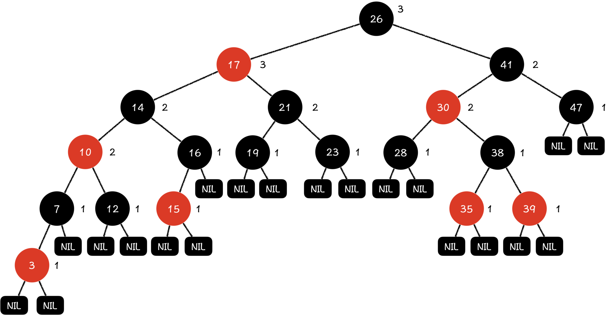
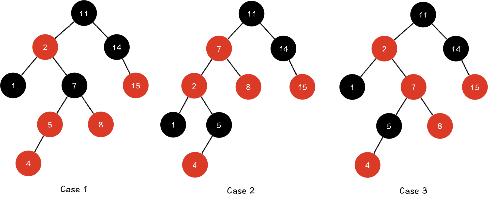
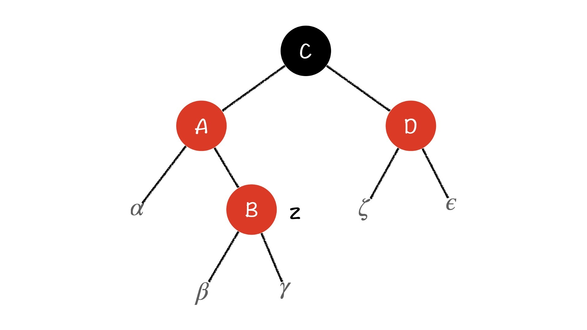
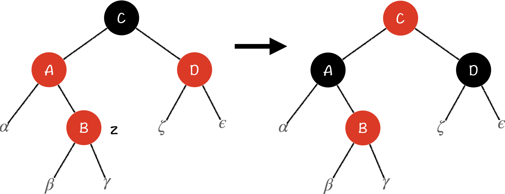
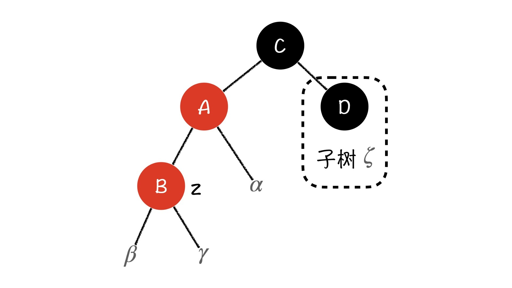
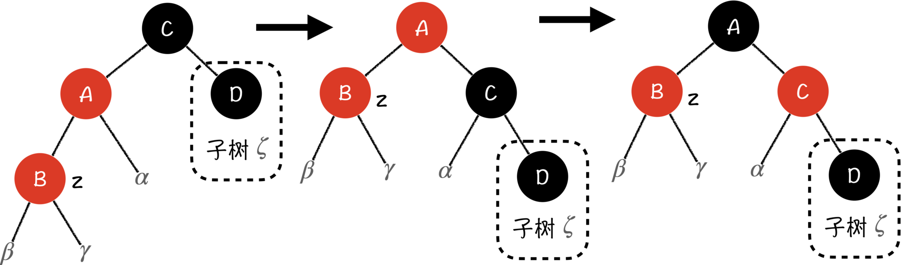
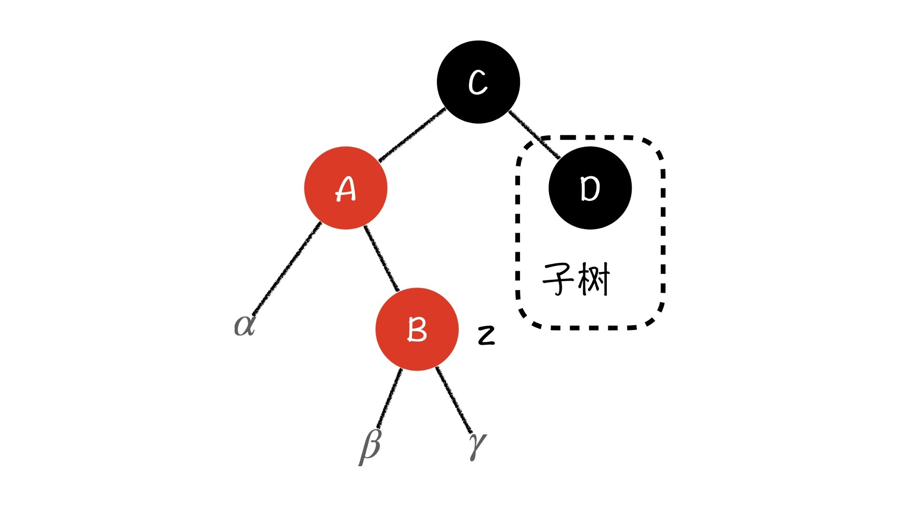
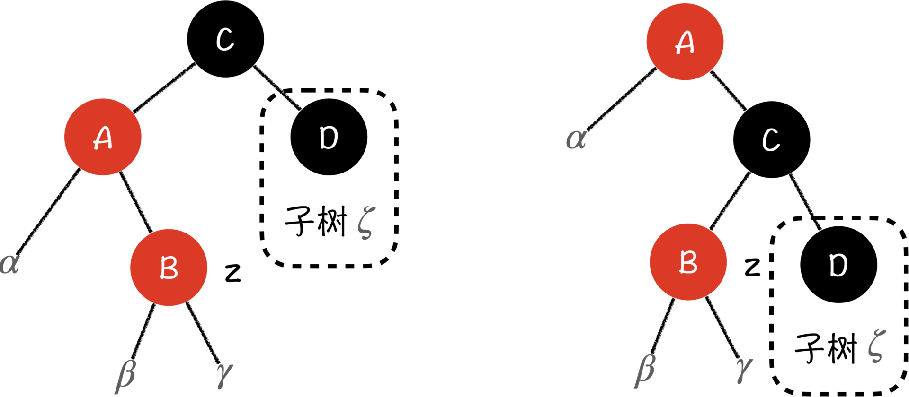
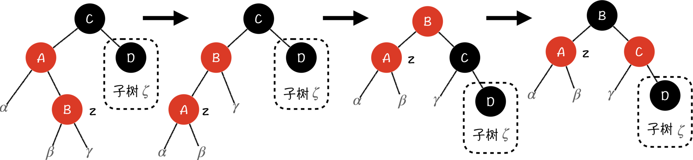

---
date: "2019-06-23"
---  
      
# 16 | 红黑树（上）：红黑树基础与插入调整操作
你好，我是胡光。

上节课我们讲了，AVL树能时刻保持平衡，所以它拥有非常优秀的检索性能，但它每一次更新之后都需要调整自己，强调自己的平衡性。因此，我们在维护频繁更新的有序序列的时候，就要付出相应的代价。

在实际的应用中，为了保持排序二叉树的检索性能，我们经常不需要它有那么严格的平衡性，只要保持一种近似的平衡就可以了。这该怎么做呢？我今天就给你讲一种非常常用的近似平衡二叉排序树，红黑树。因为红黑树的内容比较多，我会花两节课的时间去讲。这节课我们先讨论，红黑树的基础和插入调整操作，下节课再讨论删除调整操作。

## 什么是红黑树？

红黑树在计算机科学中有非常广泛的应用，例如C++ STL中的 `set` 、 `map` ，JAVA中的 `TreeMap` 都是用红黑树来实现的。顾名思义，红黑树就是一种每一个节点都被染上黑色或者红色的二叉排序树。我们会利用每个节点的颜色，来决定红黑树上的一些简单或者复杂的操作。

上图就是一棵红黑树，通常我们在画图的时候会省去空指针叶子，为了方便讲解，我在这里都标出来了。那么，红黑树究竟是怎样保证自己性能的呢？

首先，我们对照着示意图，来记一下红黑树的5个重要性质：

* 每一个节点的颜色不是红色就是黑色的；

* 根节点是黑色的；

* 每一个叶子节点（Nil，最下层节点的空指针孩子）都是黑色的；

* 如果一个节点是红色的，那它的两个孩子都是黑色的；

* 对于每一个节点，从它出发到它的后代叶子节点的所有简单路径上，黑色节点的数量都是相同的。

你会发现，在红黑树的五条性质中，我们对**黑色节点的规定**比较多，尤其是第5条，从某一个节点出发到后代的黑色节点数量是相同的。那我们就假设，从某一个节点T出发，到叶子节点的一条简单路径上，黑色非叶子节点的数量是black\_height\(T\)，我们管它叫**子树的阶**。如果T的两个孩子都非空，那T节点两个孩子的黑树高就有可能是black\_height\(T\)或者black\_height\(T\)-1，这主要取决于那两个子节点的颜色。

所以，对于有N个节点的两个孩子，以它们为根的子树分别会有至少\$2\^\{black\_height\(T\)-1\}\$个节点，而以N为根的子树至少会有\$2\^\{black\_height\(T\)-1\}\\times 2+1=2\^\{black\_height\(T\)\}-1\$个节点。

然后根据性质4，每个红色节点的两个孩子一定是黑色的，我们就能得出，从节点N出发到叶子节点的一条简单路径上，一定有至少一半的节点都是黑色的（因为没有限制黑色节点的孩子的数量）。由此，我们就能得到，以N节点为根节点的子树的树高h满足\$height\(T\)\\le 2\\times black\_height\(T\)\$，那以N为根的子树，它的节点数满足：

\$\$count\(T\)\\ge 2\^\{black\_height\(T\)\}-1=2\^\{\\frac\{height\(T\)\}\{2\}\}-1\$\$

则有：

\$\$count\(N\)+1\\ge 2\^\{\\frac\{height\(N\)\}\{2\}\}\$\$

两边同时取对数，则有：

\$\$log\_2\(count\(T\)+1\)\\ge \\frac\{height\(T\)\}\{2\}\$\$

也就是说，一棵有N个节点的红黑树的树高不会超过\$2\\times log\_2\(N+1\)\$，这就保证了红黑树的检索效率仍然是对数级别的。

从前面的推导过程中我们不难看出，红黑树通过性质5保证了红黑树树高的相对平衡性，通过性质4又保证了红黑树的树高不会相差太大。这其中，红色节点起到了调节的作用，能够让红黑树在不那么平衡的情况下，仍保证黑色节点的数量，同时又保证了红色节点不会泛滥，树上的性能不会被破坏。毕竟如果红黑树上没有红色节点，那它就是一棵严格的平衡树了。

可以说正是红黑树这五条性质，保证了红黑树的优秀性能。但也正因为要维持红黑树的这5条性质，红黑树的基础操作就和我们之前讲过的二叉排序树有一定的区别了。那区别都有哪些呢？接下来，我们就来说说红黑树的插入操作。

## 理解红黑树的插入操作

我们知道，红黑树也是一种二叉排序树，所以向一棵红黑树中插入节点的步骤和二叉排序树是相同的，都是**找到正确的位置，并新建节点插入**。而我们要重点注意的是，在插入一个节点的时候，在什么情况下，有哪些红黑树的性质会被打破，我们又该怎样把红黑树调整回来。

我们以插入节点z为例。对于这个新的z节点，我们首先要将它初始的颜色设置为**红色**。因为如果我们将插入节点的初始颜色定义为黑色，就会直接打破性质5（从根节点到叶子节点的每条路径上黑色节点数量是一样的），调整起来也比较麻烦。同时红色节点受到周围节点的限制也比黑色节点要少一些，就算出现了打破的情况，也比较好调整。

在插入了红色节点z之后，我们重新来看红黑树的5条性质，首先，性质1和3是完全不会被打破的。由于z节点的初始颜色是红色，而我们插入的位置一定是一个空指针（黑色），同时z自己也会有两个空指针，它们都是黑色的。所以，在插入z节点之后，z所在的路径上减少了一个黑色的空指针，增加了一个红色的z节点，同时z节点下又会增加一个黑色的空指针，性质5同样会保持下来。

接下来，我们再来看看性质2和性质4。我可以提前告诉你，**只有性质2（根节点是黑色的）和性质4（红色节点的儿子都是黑色的）在插入的过程中有可能被打破**。

首先我们来看性质2，性质2被打破的唯一一种可能：我们插入的位置就是根节点（实际上就是将z插入到了一棵空树中）。在这种情况下，其实我们直接把z变成黑色节点就可以了。由于z的位置是根节点，那从根出发的每条路径上的黑色节点都会多一个，这也保持了性质5的稳定。

而性质4被打破的情况，就是我们插入的节点z在一个红色节点的下面，而当这种情况发生，z节点的叔叔，也就是其祖父的另一个子节点的颜色就至关重要了。我们可以分三种情况讨论：

1.  z节点的叔叔是红色节点

2.  z节点是其父亲的左子节点，z节点的叔叔是黑色节点

3.  z节点是其父亲的右子节点，z节点的叔叔是黑色节点

当然，这三种情况只考虑了z节点的父亲是其祖父左子节点的情况，因为其他情况都是对称情况，只要你掌握了这三种情况，对称情况自然就可以掌握了。

那为什么要分三种情况讨论呢？在二叉排序树的旋转操作中，我们讲过，当二叉排序树旋转的时候，被转到根的那个节点的某一棵子树会被原来的根节点重新继承。在红黑树中也是一样，如果发生了右旋，则原左子节点的右子树就会被原根节点继承，右子树中的黑色节点会被根节点继承。如果原根节点也是一个黑色的节点，那么旋转后的子树，右边的黑色节点数就会发生变化，这种变化和性质5息息相关，所以在旋转的时候，我们要小心考虑这种情况。因此，z节点的叔叔是黑色节点的时候，我们要分为两种情况讨论。

明白了这一点，接下来，我再来详细说说，当面对这三种情况的时候，我们具体该怎么操作。

### Case 1：z节点的叔叔是红色节点

如果我们是把节点z插入到一棵符合性质的红黑树中，那z的祖父C节点就一定是黑色的节点，否则原来的树就不符合性质4了。同时，图上的这几棵子树\$\\alpha、\\beta、\\gamma、\\zeta、\\epsilon\$的阶（black\_height）也都是相等的。

注意，这棵子树和其他子树还要共同在整棵树上保持性质5，所以每条路径上黑节点的数量不能发生变化，那我们为了保持性质5，也为了修复性质4，就需要在每一条路径上去掉一个红色节点，增加一个黑色节点。因此，处理方法就很简单了，把z节点的父亲和叔叔，也就是A节点和D节点变成黑色，这样z的祖父C节点就变成红色了。

但要注意的是，我们调整了这个子树之后，因为更改了C节点的颜色，很有可能会影响上面子树的性质（例如原本C节点的父亲是红节点），所以这棵子树调整过之后，事情还没有结束，我们应该再从C节点出发，向上调整。而由于树结构的递推性质，子树符合红黑树的性质，那它的祖先也一定会符合红黑树的性质，因此我们也只需逐级向上调整，将整条路径调整到完全符合性质即可，无需担心会牵一发而动全身。

### Case 2：z节点是其父亲的左子节点，z节点的叔叔是黑色节点

当z节点的叔叔D是黑色节点的时候，显然Case1中以一换一，只通过染色来解决问题就行不通了。如果我们还是将A节点染黑，则这条路径上多了一个黑色节点，打破性质5。如果同时将C节点染红，虽然可以保持左路径上黑色节点数量不变，但右路径又少了一个黑色节点，这仍旧会打破性质5。那我们该怎么办呢？

别着急，我们还有一个法宝没有用，那就是树的旋转。

我们注意到，在这棵树中，\$\\alpha\$、\$\\beta\$、\$\\gamma\$和\$\\zeta\$四棵子树的阶是相等的，并且它们都利用了黑色的根节点C，但\$\\beta\$和\$\\gamma\$上面有两个红色的节点。这就意味着，无论我们怎么染色，左右两边路径的黑色节点数都没办法相等。但是，我们可以通过旋转操作，将黑色的节点集中到一边，在一条路径里进行以一换一的操作。

没错，就是直接针对C节点进行一次右旋，这样A节点（红）就成了子树的根节点，C节点成为了右子节点。这个时候，右边路径的黑色节点数刚好多出来了一个黑色节点（C）。你会发现，如果我们将C节点换成红色节点的话，那C也是红的、B也是红的，这会打破性质4，同时，整棵子树所有路径上都会少一个黑色节点，这又打破了整棵树的性质5。

因为它们共同的父亲是根节点A（红），所以我们把A节点换成黑色节点，就能满足性质4，同时由于根节点是黑色的，所有的路径上又加回来了一个黑色节点，这又重新满足了性质5。

### Case 3：z节点是其父亲的右子节点，z节点的叔叔是黑色节点

这种情况就更复杂一些了。解决它最直观想法，就是直接对树进行右旋。

右旋之后，z节点就直接成为C节点的左子节点，\$\\beta\$子树和\$\\gamma\$子树的上面将会有B、C两个节点，而根节点A的左边只剩下了\$\\alpha\$子树。也就是说，无论我们怎么调整A、B、C这三个节点的颜色，最终子树都会打破性质5。

还记得上一节课我们讲AVL树插入的时候提到的情况2吗？其实Case 3和那种情况是类似的，为了防止右旋的时候将左子树的右子树的树高整块继承下来，我们必须要先缩减左子树和右子树的树高。具体来说，我们要先在A节点上进行左旋，把B旋转成C的左儿子，然后，你发现了吗，现在的情况和Case 2就一样了，我们再进行一次右旋，将B的颜色染成黑色，C的颜色染成红色，问题就解决了。

以上就是红黑树的插入操作，你理解了吗？理解起来确实不容易，记得结合示意图多看几遍。

总的来说，红黑树在插入元素调整的时候，至多会向上调整一条路径，也就是整体的树高，所以红黑树的插入操作，索引及调整都是\$O\(log\_2N\)\$的。而且多数情况下，我们可能不需要调整那么多步，就可以保持红黑树的性质了。从这点上来看，红黑树的调整频率是低于AVL树的，所以红黑树也常常用来维护动态序列。

## 课程小结

这节课，我带你认识了红黑树。

我们先学习了红黑树的基础知识，红黑树具有5个非常重要的性质。分别是，红黑树中每一个节点的颜色不是红色就是黑色；红黑树的根节点都是黑色的；而且它的每一个叶子节点都是黑色的；如果一个节点是红色的，那它的两个孩子都是黑色的；对于每一个节点，从它出发到它的后代叶子节点的所有简单路径上，黑色节点的数量都是相同的。这5个性质保证了红黑树的优秀性能。

然后，我们一起讨论了红黑树插入元素之后的调整操作。因为向红黑树插入元素，只有性质2和性质4有可能被打破。所以我们要分三种情况分别讨论。既然有插入操作，肯定也有删除操作。相对于插入，删除操作就更复杂了，需要讨论的情况也更多，我会在下节课和你详细讨论。

## 课后练习

如果在插入节点的时候，我们将节点初始化成为黑色节点，会发生什么？

欢迎在留言区分享你的答案，也希望你能把这节课的内容转发出去。那今天就到这里了，我是胡光，我们下节课见！