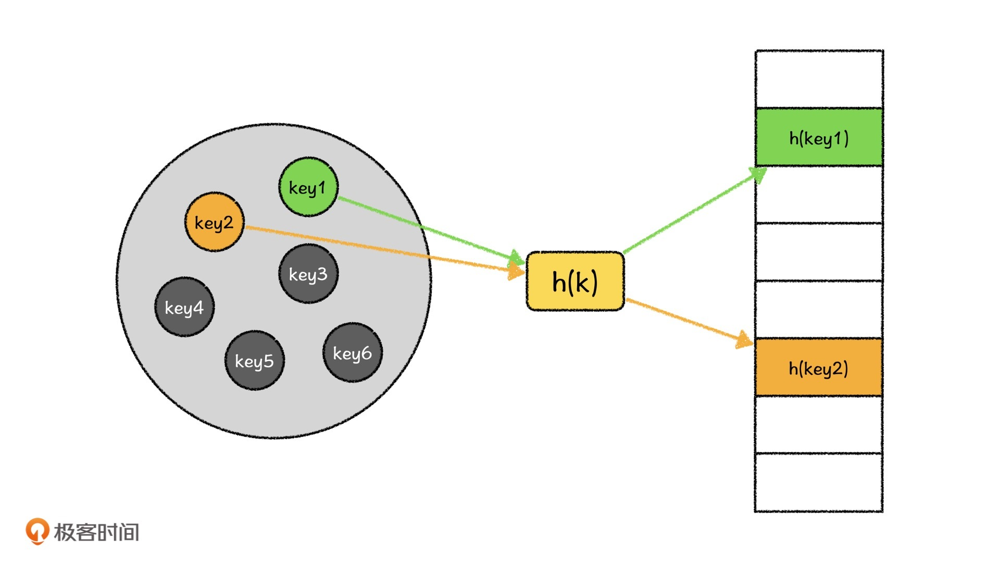
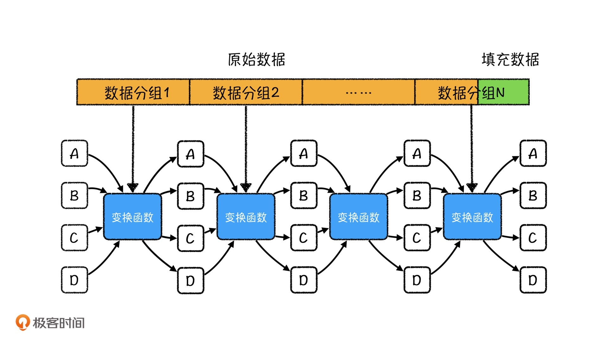
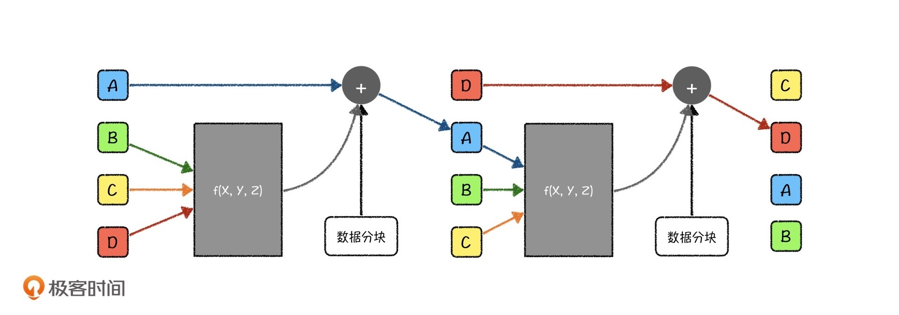
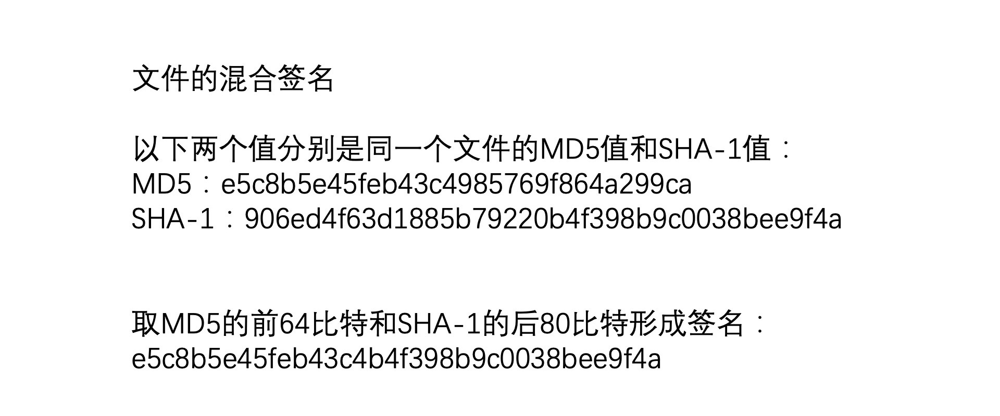

---
date: "2019-06-23"
---  
      
# 18 | 哈希表：文件的身份认证系统是如何实现的？
你好，我是胡光。

平常，我们在互联网上下载文件，文件的下载页面有的时候会专门列出来一栏 `sha` 或 `md5` ，里面是一长串的数字和字母的混合。其中， `md5` 或 `sha` 叫做数据签名，是下载网站为了防止文件被篡改，而提供的一种校验数据一致性的方式。如果下载下来的文件运行相应的算法，计算出来的 `sha` 或 `md5` 是一样的，就说明这个文件没有被篡改过，我们仍然可以使用。

这就让我们联想到了杀毒软件的应用场景，杀毒软件在扫描计算机中文件的时候，仿佛每一个文件也有一个标记，如果检查出了那个标记，我们就可以认为这个文件是病毒。这到底是怎么做到的呢？

这个技术的实现，依靠的就是我们今天要讲的**哈希表**（Hash Tables），也叫做**散列表**。哈希表在我们的日常生活中应用非常广泛，比如我们的姓名、身份证号、学号、护照编号，地区的邮政编码、电话号码、电话区号。这些编码都是实际事物的重要信息的编码认证方式，例如我们看到了010的电话区号，就知道这是北京的电话号码，公安系统得到了一个人的身份证号，就可以调取这个人的相关信息等等。

说了这么多，哈希表到底是什么呢？

## 哈希函数：数据的“身份证”

哈希表是一种将集合U映射到表\$T\[0\\cdots m-1\]\$中的方法，其中，集合U中的元素我们称之为**键值**（key），表T中每一个位置我们称之为**槽位**（slots），将键值映射到槽位上的方法我们称之为**哈希函数**。

看了这样的定义之后，你可能要问了，我们直接将键值当成下标，数组存储不就可以了吗？为什么还要那么麻烦呢？当然可以，**数组也是一种特殊的哈希结构**，但是想象一下，计算机中的文件浩如烟海，且呈井喷式增长，如果我们直接用数组编号存储，这将会是爆炸式的数据量。

比如说，中国每天出生的婴儿非常多，我们会利用出生婴儿信息对他们编码，这在信息存储和检索上，比直接使用顺序编号要方便太多了。所以，哈希表利用元素本身的信息，可以将原本取值范围很大的复杂数据映射成原始数据唯一的“身份标识”，方便我们检索、比对和存储等。

这个操作其实就是哈希函数来完成的，哈希函数是将原始数据转换成为编码的计算方法。



以我国的身份证号为例，假设现在有一个刚刚出生的人叫张三，他本身就可以看作是一条数据，而他的身份证号可以看作是一个哈希值，那计算一个人身份证号的哈希函数就可以看作：

户口所在省/直辖市+户口所在地市行政区域+户口所在县区级行政区域+出生年月日+当天同一区域出生顺序编号（最后一位代表性别）+校验位

我们可以看到，张三的身份证编号就是把张三的重要信息编码形成的。当然，未来，我们也可能会把基因、指纹等等信息也都编码集成身份认证。

因此，哈希表中最关键的部分就是哈希函数，而**哈希函数最重要的作用就是利用被映射数据的重要信息来计算最终的映射值**。

同时，哈希算法还需要满足一个条件，那就是分布均匀，也就是键值映射到槽位的概率是相等的，这可以显著降低相似数据碰撞的概率。同时，在一些应用，如数字签名、数据一致性检验上，也不容易通过相似数据来伪造函数计算的结果。

哈希算法在实际工作中是怎么应用的呢？一开始我们讲到的 `sha` 和 `md5` ，其实就是摘要了文件中的部分重要信息，通过对应的哈希函数所计算出来的哈希值，它们是现在非常常用的两种哈希函数。想要弄明白这些哈希算法的基本框架，我们还得先弄明白另一个算法，MD4。

## MD4：常用哈希函数族的基础

MD4算法在1992年被发现，是现在常用的MD5算法和SHA算法的基础。它将文件分为若干个512比特（bit）的分组，然后对每一个分组执行MD变换函数，共执行三轮，最后将三轮的结果相加，形成一个128bit的编码再输出。



理解了思路，我们再来看看算法的执行过程，主要可以分4步。

1.  填充原始数据，让原始数据的最终长度满足\$l\_f\\ mod\\ 512=448\$。

因为最终要处理的数据必须是512的倍数，所以我们在数据的末尾要使用64比特记录原始数据的长度。因此，我们要将数据填充到448（|512-64|=448）。数据填充的方式为：在原始数据的末尾填充一个1，剩余位数补位为0。


例如，我们将 `abc` 填充为MD4算法的输入。

首先，因为 `abc` 共占据了24比特，所以我们在abc的末尾填充一个1，再填充\$448-24-1=423\$个0，接着我们要将它表示成为64个比特，填充到原始数据的末尾，所以最终数据为：

```
    [0100 0001 0100 0010 0100 0011][1][000000...(423个0)][(0000)*14 0001 1000]
    

```

之后，我们将得到的这一串数据分为512比特一组。当，然`abc`被填充之后总共也就只有512位，也就只有这一组。

这个填充规则在之后的MD5、以及SHA算法家族中都被沿用了下来。

 2.     初始化4个32比特特征值A、B、C、D，其中：

```
      A=0x67452301
       B=0xefcdab89
       C=0x98badcfe
       D=0x10325476
    

```

这4个特征值跟随着填充后的每一组数据变换，最终会形成MD4的输出

3.  我们将每一组数据切分成16块子数据，让每一块的长度都是32比特，再依次将每一块输入到MD变换函数中进行变换，变换过程如下：



这个变换过程一共要执行3轮，每一轮函数\$f\_j\$都是不一样的。每一次左移的位数S也是周期变化的，每一轮的变换周期也是不一样的。有啥规律呢？

我们来看个例子。当我们处理第一块子数据的时候，变换函数为：

\$\$A=\(A+f\_j\(B, C, D\)+X\_0\)\\times 2\^S\$\$

而当我们处理第二块子数据的时候，变换函数为：

\$\$D=\(D+f\_j\(A, B, C\)+X\_1\)\\times 2\^S\$\$

处理第三块子数据的时候，变换函数为

\$\$C=\(C+f\_j\(D, A, B\)+X\_2\)\\times 2\^S\$\$

依此类推，一直到计算完16块子数据为止，再开始下一轮。

3轮终止之后，A、B、C、D都会迭代成为新的值，再将其分别和原来的A、B、C、D值相加，得到新的A、B、C、D特征值，就是MD变换函数最终的输出，也是再进入下一组的数据。

4.  处理完所有的数据分组后，我们将A作为最低位，D作为最高位拼接输出，最终形成了128比特的MD4编码。其中，变换函数\$f\_j\$是完全基于位运算的。

我们看到，MD4算法中有大量的数据分组、分块、移位、取模等过程，所以该算法几乎是无法逆向的。也就是说，除了暴力穷举以外，我们无法通过最终的哈希值反推回原来的数据是什么样子的。这就是MD4算法的完整架构了。

虽然这个算法早已被证实不安全，并且已经过时了，但是其基本的思路被沿袭了下来，科学家们在它的基础上，衍生出了MD5算法、SHA算法家族等。

其中MD5算法则是在MD4算法的基础上增加了一个“安全带（Safe Belt）”机制，并且将原有的三轮变换变成了四轮变换。不过，最终生成的数据也是128比特。

而SHA-1算法则是在MD5的基础上又增加了一些变换操作，并且将数据切分成为了5块，最终生成了长度为160比特的编码。它的长度更长，碰撞几率更低，但相应地，算法的效率也比MD5稍慢了些。

除此之外，SHA-2算法将数据分成了8块，最终产出256比特长的数据，算法更加复杂，但是产出的编码也更加安全。SHA-2算法，也有不同的变种，如SHA-256（生成256比特长度的编码），SHA-224（生成224比特长度的编码）等，我就不再详细说了。

## 哈希的实际应用

哈希算法的基础结构讲完了，我们再回过头来，看看开头说的**文件签名和病毒扫描**，这两个哈希算法的经典应用是怎么实现的。

### 文件签名

首先，我们来说说文件签名的应用。

哈希函数的特点就是利用数据中的重要信息计算数据的编码值，并且在最终取值上分布均匀、不易碰撞。但是它有一个缺点，真实的数据哪怕有一些非常微小的修改，也可能导致最终计算出来的哈希值有很大差别，这也被称为雪崩效应。

例如，现在有一个很长的文本文件，我们只修改它其中的一个字。修改前后，文件的 `md5` 如下：

```
    修改前：9dea372891cf7cc669c9a4b96b9b7727
    修改后：e5c8b5e45feb43c4985769f864a299ca
    

```

因此，哈希算法被当作非常好的文件一致性校验工具。当我们在网站上下载的时候，下载网站上就会贴出这个文件的哈希值。如果我们下载到这个文件之后，用计算机计算出它的哈希值和原来的不一样了，那这个文件就很有可能已经被篡改过，比如说被嵌入了病毒等等。

还有一个常见的例子，网站数据库在存储密码的时候，也会用一些哈希函数将明文密码映射之后再存储到网站的后台中。这样在用户登录的时候，只要输入的密码经过同样的哈希算法计算后与网站后台密码比对一致，就可以完成校验，成功登录（当然为了防止抓包，在信息传输的过程中往往还会进行一重加密）。这样一来，哪怕网站的数据库被攻破了，也不至于将明文密码暴露在黑客面前。

不过我们之前也提到过，哈希算法总归是存在碰撞的，在了解了这些算法原理之后，其实我们已经可以找到碰撞的规律，利用碰撞也能在修改文件的时候，保证文件的哈希值不变，这是所有哈希算法都可能存在的漏洞。同时，一些古老的哈希算法，例如MD4、MD5、SHA-1也已经实质性地被攻破了（例如可以直接生成某种算法的碰撞），甚至还有人通过暴力穷举记录一些数据的哈希值，并提供些非法的查询服务（cmd5）。

与此同时。我们也看到，哈希算法也在不断地发展，编码越来越长，算法越来越复杂，这样碰撞的概率就越来越低，从而模拟碰撞和暴力穷举的成本越来越大。比如说，有一些签名算法（比如说，举个例子吧）会同时利用不同的哈希算法计算数据的哈希值，将每一个哈希值取一部分拼接起来形成混合编码，或者在原始数据的前后拼接一些额外的数据再进行哈希。



### 病毒扫描

哈希算法的另一个常用领域就是病毒扫描中的特征码扫描技术。

我们知道，每一个杀毒软件都会有一个病毒库，它在每一次扫描的时候实际上都是在扫描文件是否能够命中病毒库。但是我们也知道，杀毒软件的病毒库中不可能存有真正的计算机病毒，而且在文件比对的时候，我们也不可能真实地比对每一个文件中的所有数据，去判定这个数据是不是病毒。

所以，杀毒软件的病毒库中存储的也是病毒的特征值，本质上就是安全专家们对病毒的行为分析之后，定位到了某种病毒或某一类病毒（包括某一病毒的变种、变形）的关键部分，使用某一种哈希算法\$hv\$计算出这一部分的特征值再存到病毒库之中。因此，我们如果打开病毒库的文件，就会看到里面有很多看起来长得很像MD5的东西。而扫描的过程，实际上是在做这样3件事儿：

1.  假设特征码对应的原始数据长度是\$w\$字节，那我们就对待扫描的文件，每个长度为\$w\$字节窗口取一段
2.  利用计算特征码同样的哈希算法\$hv\$，计算取出的\$w\$字节长度的特征值
3.  将计算出来的特征值与病毒库中的特征值比较，如果命中则为感染，未命中则为安全

这种方法的实现是早期人们对病毒的一种人为的判断：某一种病毒或者某一类病毒，它们都会含有相同的代码。所以从病毒的数据中分析出来这样一个关键部分，把它存储为特征值，再对计算机中的每个文件逐节判断，杀毒软件就可以判断出计算机是否感染了某一种已知的病毒。

特征码扫描技术虽然很方便，但也具有极大的局限性。首先，它依赖于人类对于病毒的分析与信息摘要。实际上，从一个比较长的病毒中取部分字节计算特征码，本身可能是不精确的，会造成一定的误杀、误报；其次，某些病毒中可能带有反追踪技术，比如作者在病毒中增加了一些干扰性的代码片段，或者一些很容易影响到哈希算法的随机填充、变形方法等。所以在实际上的反病毒技术中，除特征码之外，也有虚拟机技术、规则探测、灾难恢复等一系列的技术。

## 课程小结

这节课，我们先学习了哈希算法的基本原理。哈希算法就是利用被映射数据的重要信息来计算最终的映射值。这能让哈希表将原本取值范围很大的复杂数据映射成唯一的“身份标识”，方便我们检索、比对、存储等等。

接着，我们讲了经典的MD4哈希算法，它开创了现在我们常用的哈希算法的基本框架，所以你一定要好好理解。

最后，我们讲了哈希算法的两种重要的应用。从中我们也看到，哈希算法由于充分利用了原始数据中的重要信息，又具有易检索、不易碰撞，不易分析，无法逆向等特点，在众多领域中都起着非常重要的作用。

不过，除了前面提到的两个安全性方面的应用之外，哈希算法还在很多其他领域占据着非常重要的位置。比如，在分布式系统中，我们就利用一致性哈希算法作为服务器运维的基础部分，再比如，Google开发的SimHash算法，就是利用哈希值快速计算了文本的相似程度，甚至GeoHash算法会把某一地理区域映射成为哈希值，让复杂的地图数据便于缓存。

好啦，关于哈希表的基础知识，你都理解了吗？可以在留言区写下你的疑惑，也希望你能把这节课的内容转发出去。那今天就到这里了，我是胡光，我们下节课见！