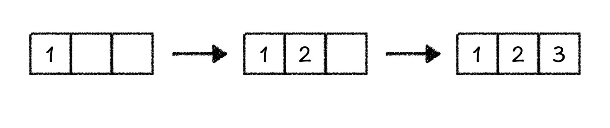
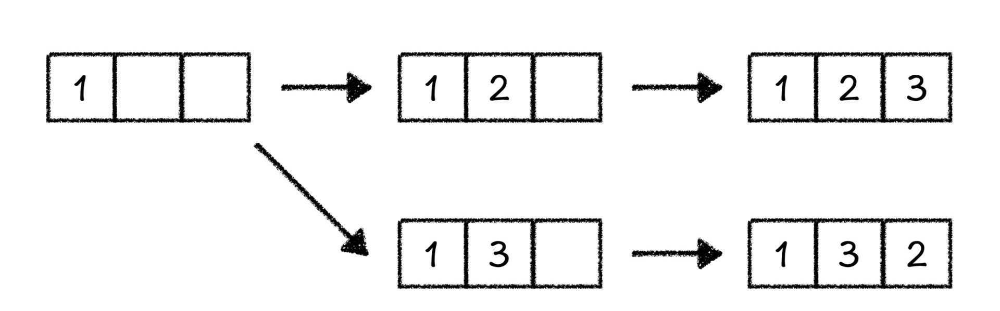
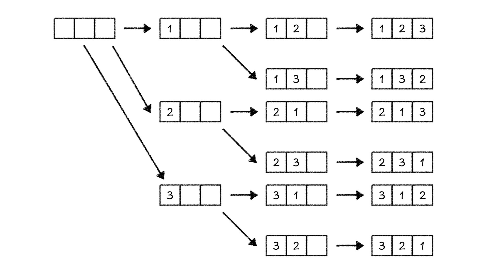
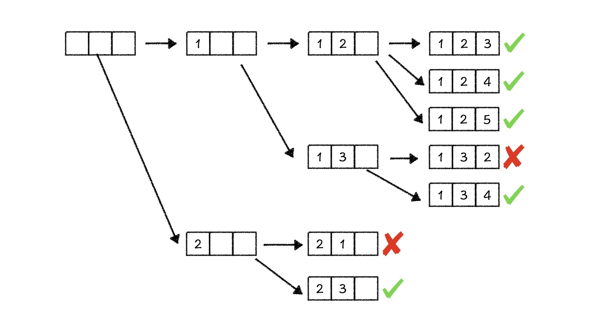
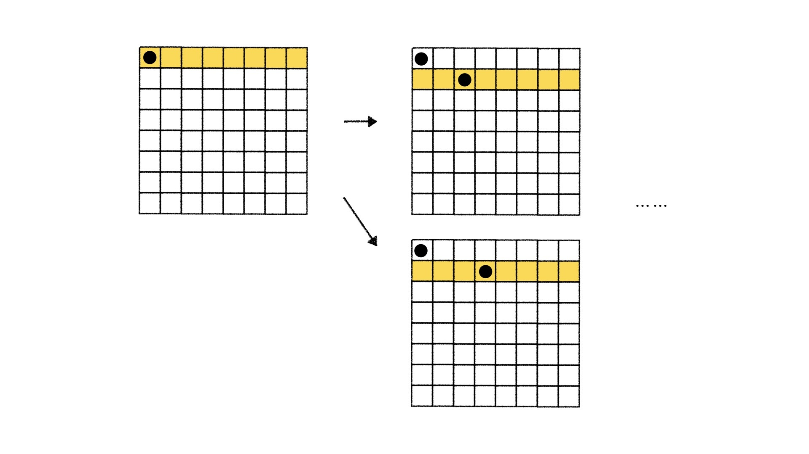
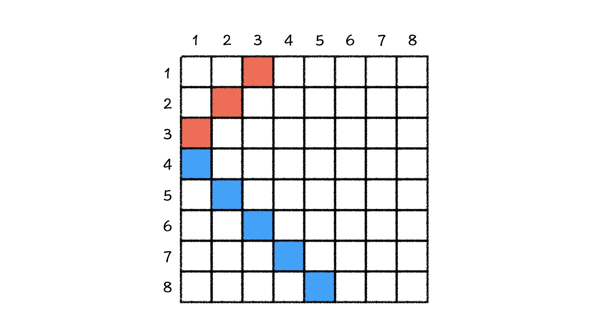

---
date: "2019-06-23"
---  
      
# 19 | 深度优先搜索：理解搜索状态树，快速输出序列的排列组合
你好，我是胡光。从这节课开始，我们学习搜索算法。

在岳云鹏的相声段子中，有这么一个段子，说孙越的爸爸带他参观家里面的聚宝盆，走到了一个密室门前，密室的门上上了一把锁，孙越的爸爸身上带了一万多把钥匙，他还忘了哪一把钥匙能打开个门了，于是就一把把试，试到了最后一把，门开了。

这个段子中，孙越的爸爸找钥匙开门的过程就是一个搜索过程。简而言之，搜索就是尝试问题中所有的可能性，在所有的可能性中找到正确的结果。那搜索算法就是帮助我们快速找到正确结果的手段。

今天，我就从求解序列的全排序和组合这两个问题入手，带你学习初步理解搜索算法中的常见概念，再一起去解决一个经典的题目，八皇后问题。

## 序列的全排列

我们先来看第一个问题：现在有一个长度为N的序列，序列中不含有重复元素，我们要输出这个序列的所有排列，该怎么做？

假设，这个序列是 `[1, 2, 3]` ，则它的所有排列就是：

```
    1, 2, 3
    1, 3, 2
    2, 1, 3
    2, 3, 1
    3, 1, 2
    3, 2, 1
    

```

这些排列是怎么得到的呢？以序列 `[1, 2, 3]` 为例，我们准备3个空位，那排列的过程就是我们将这3个数填到3个空位中的过程。首先，我们在第一个空位填1，在第二个空位填2，在第三个空位填3，序列里面所有的数用完了，所有的空也都填上了，我们就得到了第一种排列123。



接着，我们去寻找下一个排列。我们想到，是不是可以从最后一个数开始替换。首先，当把3从第三个空里面拿出来的时候，我们发现没有其他的数字可以填上，所以我们只能把2再从第二个空里面取出来，重新填充。这个时候，我们在第二个空中填一个3，在第三个空里面填剩下的2，就得到了第二个排列132。



我们接着之前的流程向下走，再将3和2分别从空里面取出，这个时候我们又发现，第二个空和第三个空没有其他的数可以填了，那我们只能把1从第一个空里面取出，将2填到第一个空里面……。

总之，我们不断地重复这个尝试过程，将每一个数填进每一个空里面尝试，直到所有的数都填过所有的空为止。这样，我们也就找到了序列的所有排列。



我把全排列的整个过程画了下来，如上图所示。仔细观察，你会看到一种熟悉的数据结构——树。这是怎么看出来的呢？我们将求解过程中的某一个时刻中，三个空的状态表示成为了树上的节点，由一种状态变成另一种状态的转移表示成树上的边。这样的一棵树就叫做这个问题的**状态树**，树上的节点称作**状态**，树上的边称作**状态转移**，**状态**和**状态转移**是设计搜索算法的关键。

因此，我们在求解全排列问题的过程中，相当于是从树上的根节点出发，不断地向下走，走到叶节点为止，这样求出来了第一个解。求出解，再取出数重新填的过程相当于是回溯到上位节点重新向下走。也就是说，这个搜索过程会不断地走到树的深处，所以这个方法叫做**深度优先搜索**。

通过状态树我们也看到，深度优先搜索过程的每一步都在继承上一步的状态，而继续向下搜索，如果走到尽头又会回溯到之前的状态，所以深度优先搜索要用到**栈**或**递归**来实现：

```
    //全排列递归实现
    void dfs(int depth, int n) {
        if (depth >= n) {
            for (int i = 0; i < 3; i += 1) {
                cout << a[i] << " ";
            }
            cout << endl;
          return;
        }
        for (int i = 1; i <= n; i += 1) {
            if (used[i] == false) {
                used[i] = true;
                a[depth] = i;
                dfs(depth + 1, n);
                used[i] = false;
            } 
        }
    }
    

```

上面的代码就是对N个数进行全排列问题的解决方法，我们只要对这个过程稍作修改，就可以快速求出\$A\_n\^m\$。这个问题非常简单留给你解决，这里我就不再多说啦。

## 求解组合问题

解决了排列数之后，我们继续来看，如果现在要求的不是输出排列数\$A\_n\^m\$，而是要求输出组合数\$C\_n\^m\$（从 n 个物品中选出 m 个物品的方案数）呢？

以\$C\_5\^3\$为例，我们仍旧把求解的过程看作是将5个数填进3个空里的过程。在第一个空里面填1，在第二个空里面填2，剩下一个空里面则分别可以填3，4，5。在输出过 `[1, 2, 5]` 这个序列之后，我们也就处理完了 `[1, 2, *]` 状态下所有的情况，所以我们需要回溯到 `[1, *, *]` 状态中继续向下搜索。

这个时候，我们就需要在第二个空里面填上3，当前状态变成了 `[1, 3, *]` 。但是你要注意，这个时候，2已经不能填到第三个空里面了，因为 `[1, 3, 2]` 这三个数的组合已经出现过了，所以，第三个空里面只有4和5可以填。

同样，当我们进行到 `[1, 4, *]` 状态的时候，2和3已经不能填到第三个空里面了，第三个空只有5可以填。

当我们回溯到序列全空的时候，在第一个空里面填上一个2，处于 `[2, *, *]` 的状态中，第二个空如果填1也是不对的，因为 `[2, 1, *]` 状态下，无论最后一个空填什么，都会和 `[1, 2, *]` 之后出现的组合重复。

发现规律了吗？每一个空填上的数必须要比前面的数大，否则就会和前面出现过的组合重复，那么也就是说，我们省去了很多不必要的搜索。



这就好像是我们在状态树上剪掉了很多不必要的树枝，只留下来了有效的部分，这个方法有一个形象的名字，就叫做**剪枝**。

```
    void dfs(int depth, int n) {
        if (depth >= n) {
            for (int i = 0; i < 3; i += 1) {
                cout << a[i] << " ";
            }
            cout << endl;
            return;
        }
        int start = 1;
        if (depth > 0) start = a[depth - 1] + 1;
        for (int i = start; i < 6; i += 1) {
            if (used[i] == false) {
                used[i] = true;
                a[depth] = i;
                dfs(depth + 1, n);
                used[i] = false;
            } 
        }
    }
    

```

为什么要学习这个方法呢？我们知道，一般来说搜索方法会检查这个问题的所有可能性来确认最终的结果，但在实际应用中，问题的可能性总是非常多的，如果完全不进行剪枝，直接搜索会非常耗费时间。有了剪枝技术，就可以有效帮助我们去掉那些不可能的分支，大幅度地减少运算代价。

> 例如\$A\_n\^m\$排列问题中，我们实际默认了一个数只能被填进一个空中，而不能重复使用，而全排列问题实际的可能性是每个数可以重复填在每个空中，那么这个问题的可能性则是\$n\^m\$种，我们增加了可重复的条件之后，问题的可能性则变成了\$\\frac\{n\!\}\{\(n-m\)\!\}\$种。

例如，密文破译就是一个典型的搜索问题。当我们面对一个被打乱字母加密过的英文消息的时候，就是在面对一个可能性极其庞大的搜索问题。如果一个长度为L的英文消息，它的可能性就有\$26\^L\$种，哪怕只是破解出原文和密文之间字母的对应关系，面对的可能性都是\$26\!=403291461126605635584000000\$种，这是非常的庞大。

但是根据统计我们知道，英文中，字母e出现的最频繁，q和u经常连在一起出现等等。借助这些规律，在破解这段密文的搜索过程中，我们就可以剪掉大量的分支，让这个工作变得相对简单一些。

同样，自然语言处理中的中文分词问题、词性标注问题、翻译问题等等，都是典型的搜索问题，它们也都是通过统计方法，帮助我们找到某一个状态下最有可能的状态转移，从而大幅节省计算的时间。

## 搜索实战：八皇后问题

接下来，我们来看一个经典的问题：八皇后问题。我们要在一个\$8\\times 8\$的棋盘上放置8个皇后，其中，如果两个皇后处于同一行、同一列、同一对角线，就可以攻击对方。要求：放置8个皇后之后，它们互相不会攻击到对方。

首先，我们来看问题的状态和状态转移分别是什么。这个问题的状态很简单，就是棋盘上当前哪个位置已经被摆了皇后，而状态转移是什么呢？

我们很容易想到，棋盘上每一个格子都可以当作一个状态转移。以这种视角来看，棋盘上有64个格子，要从里面选出来8个格子放皇后，会有\$C\_\{64\}\^8=4426165368\$种可能性，这是非常大的一个数，不用说，做起来也比较困难。但我们看到题目中还有一个条件，皇后之间互相不能处在同一行、同一列、同一对角线。

也就是说，我们每一次放新皇后的时候，完全不用考虑转移到当前这个状态时皇后所在的那一行，直接考虑下一个皇后应该放在下一行的哪个位置就可以了。那这个问题的状态可以是，当前 `i` 行已经合理地摆上了皇后之后，状态转移可以是在第 `i+1` 行的哪个位置摆上皇后。



接着，不能放在同一列这个条件就非常好满足了，我们只需要记录哪一列已经被放上皇后就可以了。但是，不能放在同一对角线，这个条件满足起来有点复杂，我们来看一看该怎么来解决。首先，我们在这个\$8\\times 8\$的棋盘中，随意找到两条对角线。



我们先看红色对角线，它经过的格子分别是 `[1, 3]` 、 `[2, 2]` 、 `[3, 1]` 。我们看到，这个对角线经过的所有格子的横纵坐标相加是相等的，在这个方向上再画一条对角线也会有这样的规律。我们再看图中蓝色的对角线，它依次经过了 `[4, 1]` 、 `[5, 2]` 、 `[6, 3]` 、 `[7, 4]` 、 `[8, 5]` 。我们发现，这条线上每个格子的横纵坐标之差是相等的。

好，这样我们就有了记录某一条对角线是否被放过皇后的方法了，当然，也就利用了题目中给出的所有条件进行剪枝。接下来，我们只需要一行行尝试着放皇后，就可以搜索出所有的放置方法了。

```
    void dfs(int depth) {
        if (depth >= 8) {
            for (int i = 0; i < 8; i++) {
                for (int j = 0; j < 8; j++) {
                    if (j == row[i]) cout << "* ";
                    else cout << "O ";
                }
                cout << endl;
            }
            cout << endl;
            return;
        }
        for (int i = 0; i < 8; i++) {
            if (!col[i] && !left_diag[depth + i] && !right_diag[depth - i + 7]) {
                col[i] = left_diag[depth + i] = right_diag[depth - i + 7] = true;
                row[depth] = i;
                dfs(depth + 1);
                row[depth] = -1;
                col[i] = left_diag[depth + i] = right_diag[depth - i + 7] = false;
            }
        }
    }
    

```

## 课堂小结

这节课，我们学习了深度优先搜索算法和一些简单的剪枝应用。

状态和状态转移是设计搜索算法的关键。在求解实际问题的时候，所有的答案会形成一棵树，状态是树上的每个节点，从一种状态变成另一种状态的转移就是树上的边。

深度优先搜索过程的每一步都在继承上一步的状态，继续向下搜索，如果走到尽头，又会回溯到之前的状态，所以深度优先搜索要用到栈或递归来实现。

在使用深度优先搜索的时候，为了大幅减少运算代价，我们会借助一些规律和已知条件，剪掉状态树上很多不必要的树枝，只留下来了有效的部分，这就是剪枝。

深度优先搜索是一种盲目搜索算法，它尝试每一种可能性来解决问题的方法看上去虽然笨拙，却也是搜索算法家族的重要基础算法，有着很广泛的应用，例如在机器学习的图嵌入方法中，有时就是利用深度优先搜索方法建立节点的特征空间。

同时，深度优先搜索也是一种非常有效的算法思维，往往当我们在解决一些问题的时候，从深度优先搜索入手，再在其基础上增加各种优化手段，如记忆化搜索、贪心等，往往也能利用搜索方法高效地解决问题。

## 课后练习

现在，我给你一个有向图\$G\(V, E\)\$，你能试着利用深度优先搜索算法求出图中是否存在环路吗？

这就是深度学优先搜索的基础内容了，你学会了吗？欢迎你把这节课转发出去。下节课，我会带你学习另外一个重要的基础算法，广度优先搜索，并用它来解决迷宫问题。好了，今天就到这里了，我是胡光，我们下节课见。