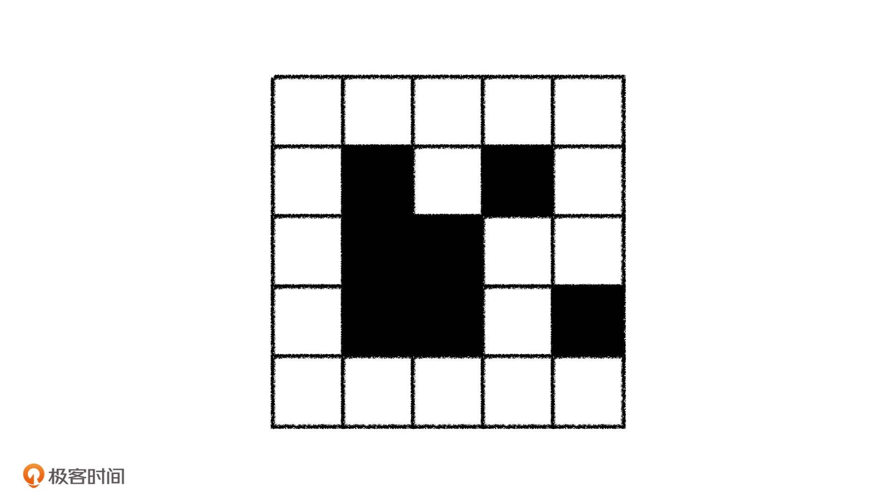
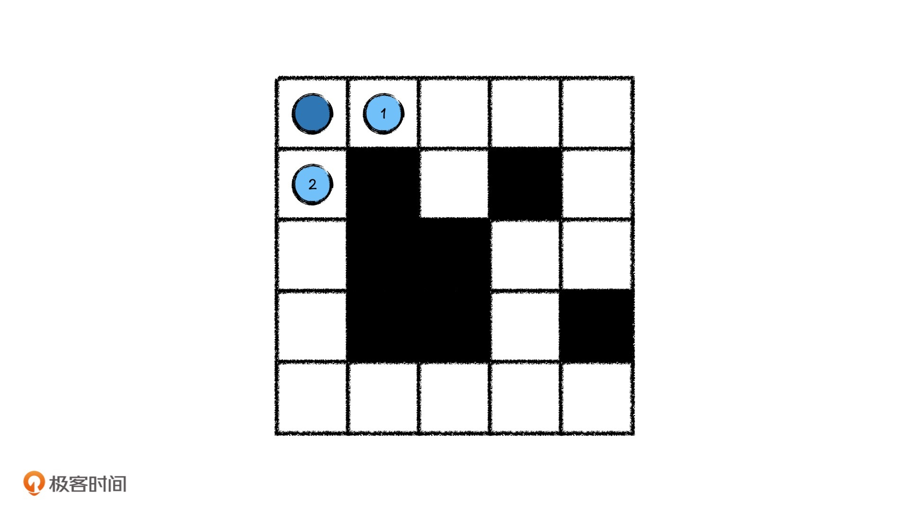
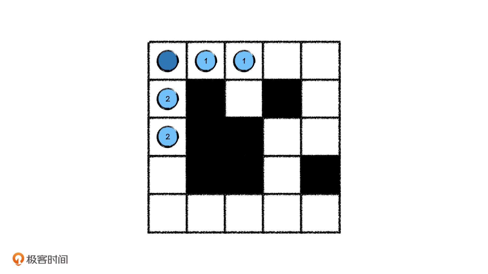
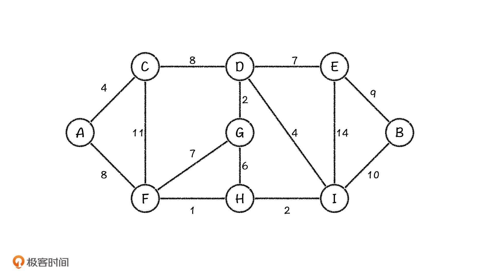
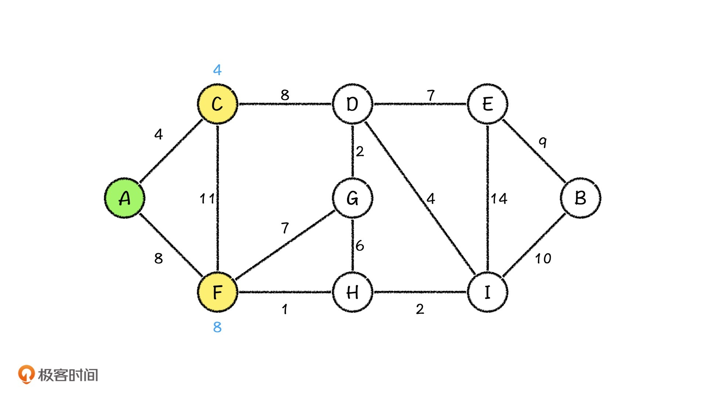
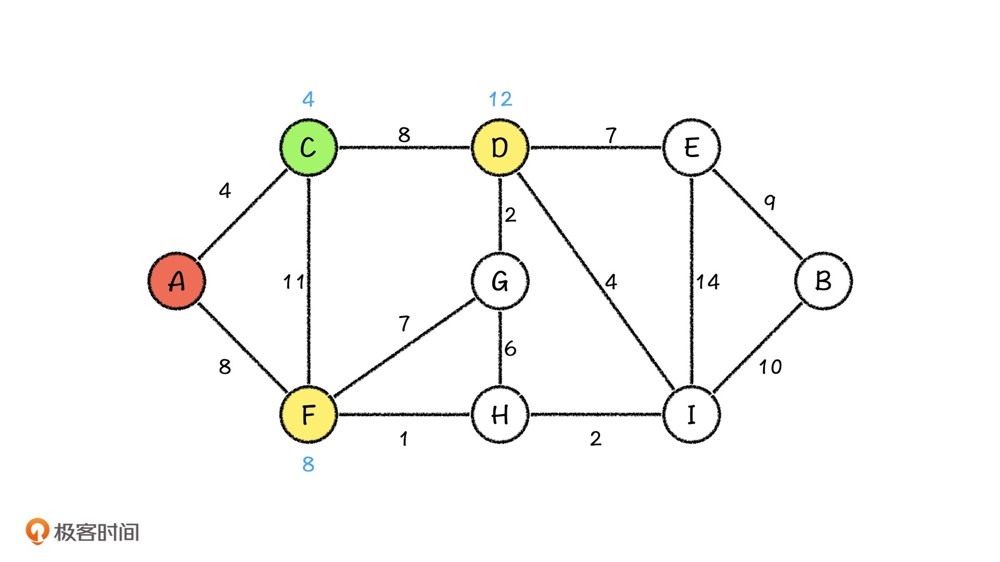
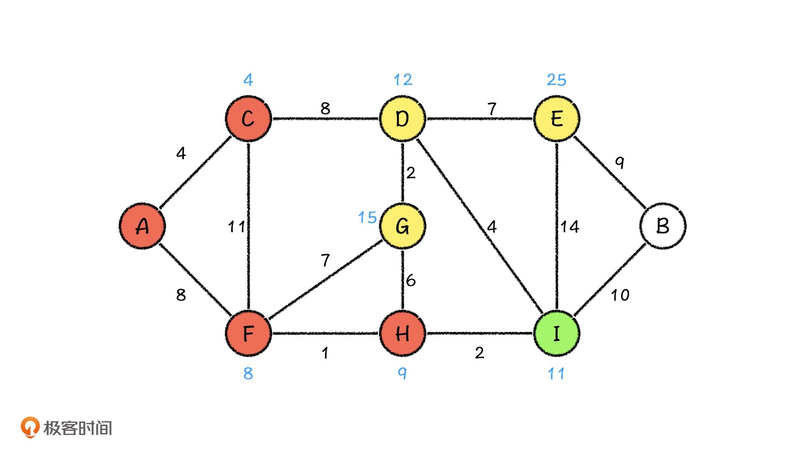
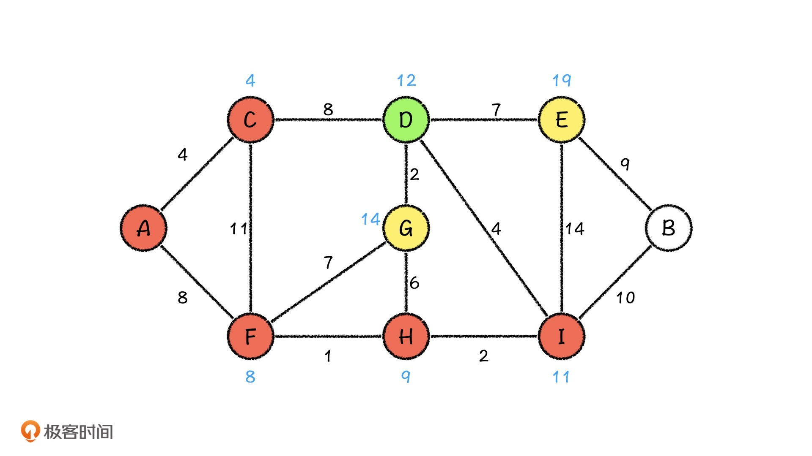

---
date: "2019-06-23"
---  
      
# 20 | 广度优先搜索：如何快速解决迷宫问题？
你好，我是胡光。

上节课，我们一起学习了深度优先搜索和状态树，以及一些简单的剪枝技巧。这节课，我们继续学习搜索算法，解决另外一种常见的问题：迷宫问题。

迷宫问题是这样的，现在有一个\$N\\times M\$大小的迷宫，我们可以从迷宫的某一个格子出发，向上、下、左、右四个方向走。但是，迷宫中存在一些障碍格子，我们不能走上去。比如下图中，白色的格子代表可以走，黑色的格子代表障碍不能走。假设迷宫的起点是左上角，终点是右下角，那我们从起点走到终点，最短的路径是多长，又是哪一条呢？



针对这个问题，我们可以使用上节课学过的深度优先搜索去解决吗？

我们尝试之后发现，使用深度优先搜索的时候，就像我们独自身处在这个迷宫中，从起点出发之后，碰到了岔路就一条一条去尝试。如果走到了死路，就原路返回，接着尝试下一条路，再碰到了岔路还是用同样的方法继续尝试。而当我们终于走到终点的时候，走的却又未必是最短的那一条路。如果想要确认走的是不是最短的那一条，我们只能回到前面，继续尝试，直到走完所有的路才能确认。

这样做显然非常浪费时间，于是我们就开始设想，我们在迷宫中遇到岔路的时候，能不能像漩涡鸣人一样，用一次分身术生出许多分身，让它们同时走所有的路径。当某一个分身再遇到岔路的时候，就再使用一次分身术，让这些分身继续走新的岔路，并且让走到死路上的分身直接解除掉。最后，所有走到终点的分身来报告走的路径长度，这样我们就能找到最短的那个路径了。

当然了，这个想法在现实中是没有办法实现的，但在搜索算法中却可以做到，这就是我们今天要讲的搜索方法，广度优先搜索。

## 广度优先搜索：搜索中的“影分身术”

还是以刚才的迷宫为例，首先我们从起点 `[0, 0]` 出发。不巧，起点就是一个岔路，它的右边和下边都可以走，那我们只能派出两个分身分别走到 `[0, 1]` 和 `[1, 0]` ，为了方便，我们先分别称它们为分身1号和分身2号。



然后我们先看分身1号，它的前面没有岔路了，所以只能往右边再走一步。同时，分身2号面前也没有岔路，只能向下再走一步。



这之后，我们再去看分身1号，发现分身1号面对一个岔路。这个时候，它只能再使用一次分身术，分别代替它往下和往右走……就这样，直到所有的分身都走到终点。

这里你要注意了，我们刚才描述的过程虽然是同时进行的，但在程序实现中我们做不到同时，它们总会有一个先后关系。比如说，当分身1号向右边走了一步之后，我们就需要知道分身2号走到哪儿了，然后才能让分身2号继续走下一步。同样，在分身2号走完了之后，我们还要回去更新分身1号，知道分身1号走到哪儿了，再去更新分身1号的状态。也就是说，我们每一次的搜索，所有的分身都得向前走一步。

如果是这样的话，我们就得能够依次取出所有分身的位置才能更新。

想要实现这个功能，我们就必须使用一个**先进先出**的数据结构来维护每个节点上的状态，所以我们需要借助**队列**来实现这一算法。接下来，我们就来正式描述一下解决迷宫问题的算法是什么样的。

首先，我们在每个格子上记录的是，**目前从起点到当前格子的最短路径长度**。那我们每次到达这个节点的时候，如果走过的路径比它现在记录的值短就更新它。同时，我们还要记录，从哪个格子到的当前格子，才能得到这个最小值。因为到达每个格子的最短路径一定是由上一个格子的最短路径而来，那依次回溯回去，我们就能找到这条最短路径了。

那么问题来了，我们该怎么结合队列来实现呢？

最开始，我们当然是把起点的路径长度置为0，再把起点放到队列中，然后开始搜索过程。

在每一次搜索更新过程中，我们都会先取出队首，分别检查它的上、下、左、右四个格子。检查分两步，一是查看它们是不是障碍，如果不是障碍，再看它们有没有被走过，如果没被走过，再更新格子上的值和前驱格子，入队列。如果被走过了，我们就看由当前格子出发到这个格子是不是最短的路，如果是最短的路，就跟新格子上的值和前驱格子入队列，反之就不管它。

我们一直重复这个过程，直到这个队列为空。最后，我们再从终点出发一步步地向回找，就能找出这条最短的路径了。

在我们刚才进行的搜索过程中，检查从当前格子出发到下一个格子是否构成最短路径，并且更新的操作，叫做**松弛操作**。正因为这个操作的存在，我们搜索的过程中才不会走回头路，也就不会出现在两个格子上反复横跳这种事情了。代码如下：

```
    void bfs(int n, int m) {
        int pos_x, pos_y;
        queue<pair<int, int> > que;
    
        // 起点入队
        que.push(pair<int, int>(0, 0));
        dis[0][0] = 0;
    
        while (!que.empty()) {
            pair<int, int> cur_pos = que.front();
            que.pop();
            pos_x = cur_pos.first;
            pos_y = cur_pos.second;
    
            // 判断向下走一步
            if (pos_x < n - 1 && a[pos_x + 1][pos_y] != -1) {
                if (dis[pos_x + 1][pos_y] == -1 || (dis[pos_x][pos_y] + 1 < dis[pos_x + 1][pos_y])) {
                    dis[pos_x + 1][pos_y] = dis[pos_x][pos_y] + 1;
                    father[pos_x + 1][pos_y] = cur_pos;
                    que.push(pair<int, int>(pos_x + 1, pos_y));
                }
            }
    
            // 判断向上走一步
            if (pos_x > 0 && a[pos_x - 1][pos_y] != -1) {
                if (dis[pos_x - 1][pos_y] == -1 || (dis[pos_x][pos_y] + 1 < dis[pos_x - 1][pos_y])) {
                    dis[pos_x - 1][pos_y] = dis[pos_x][pos_y] + 1;
                    father[pos_x - 1][pos_y] = cur_pos;
                    que.push(pair<int, int>(pos_x - 1, pos_y));
                }
            }
    
            // 判断向右走一步
            if (pos_y < m - 1 && a[pos_x][pos_y + 1] != -1) {
                if (dis[pos_x][pos_y + 1] == -1 || (dis[pos_x][pos_y] + 1 < dis[pos_x][pos_y + 1])) {
                    dis[pos_x][pos_y + 1] = dis[pos_x][pos_y] + 1;
                    father[pos_x][pos_y + 1] = cur_pos;
                    que.push(pair<int, int>(pos_x, pos_y + 1));
                }
            }
    
            // 判断向左走一步
            if (pos_y > 0 && a[pos_x][pos_y - 1] != -1) {
                if (dis[pos_x][pos_y - 1] == -1 || (dis[pos_x][pos_y] + 1 < dis[pos_x][pos_y - 1])) {
                    dis[pos_x][pos_y - 1] = dis[pos_x][pos_y] + 1;
                    father[pos_x][pos_y - 1] = cur_pos;
                    que.push(pair<int, int>(pos_x, pos_y - 1));
                }
            }
        }
    }
    

```

如果我们要输出这条最短的路径，一步步找回去就好了。代码如下：

```
    void dfs_output(int x, int y) {
        if (x == 0 && y == 0) {
            printf("(%d, %d)\n", x, y);
            return;
        }
        dfs_output(father[x][y].first, father[x][y].second);
        printf("(%d, %d)\n", x, y);
    }
    

```

由于在这个过程中，我们每进行一次操作，都会关注当前状态的所有可能的下一个状态，非常注重广度，所以这个算法就叫做广度优先搜索，也叫做宽度优先搜索，简称就是广搜、宽搜。

总的来说，虽然我们不断地派出分身去走每一条岔路，可实际上整个广搜的过程，我们还是走了迷宫中所有可能的节点，所以广度优先搜索的时间复杂度是\$O\(N\\times M\)\$的，也是一种盲目搜索算法。

广度优先搜索图结构相关算法中占有非常重要的地位，很多相关算法其实都是广度优先搜索思想的延续，例如在图结构上求解单源最短路的Dijkstra算法、SPFA算法，都是利用广度优先思想进行的。那广度优先思想到底是怎么应用在这些算法中的呢？

## Dijkstra算法：城市路程问题

接下来，我就以实际的城市路程问题为例，来和你详细讲讲Dijkstra算法的思路。

假设，现在有N个城市，各个城市相互之间修了一条路，这些路的长度都不相等。如果张三想要从A城市开车出发到达B城市，请问：他怎么走，距离才最短？



我们依据广度优先搜索的思想，先从A出发，而从A出发能直接到达的节点是C和F，那在当前阶段，从A出发到C和F的最短距离就得到了。提前说下，在这个过程中，我会用绿色表示当前在处理的节点，黄色表示待处理的节点，红色表示已经处理过的节点。



然后，按照正常广搜的思路，我们要依次从C城市和F城市出发，再去摸索接下来能到达什么城市，对吧？但到了这里，我们的做法就有变化了，我们会从已经知道的城市中，找到距离A城市最近的那个城市，从它出发去向下找。

为什么要这么做呢？仔细想想就知道了，因为我们要求的是最短路程，那从目前路程最短的城市出发去摸索新的路径，就是一个非常直观的优化想法了。其实，我们还可以从另一个角度来证明这个做法是正确的。那就是从A城市出发，到达某一个城市的最短路程，例如B城市，**一定是从A城市到其相邻的城市，也就是E城市和I城市的最短路径获得的**。

我们可以看到，下图中A城市到C城市的路程是最短的，那我们就从C城市出发，更新它相邻的城市的路程。我们发现，D城市我们没有访问过，所以我们可以更新A城市到它的路程，而F节点我们已经访问过了，并且发现如果从C城市到F城市的话，距离反倒是更远了，那我们就不去更新它。



当C城市处理完了之后，我们再从A城市出发，这个时候路程最短的城市就变成了F城市，那我们继续从F城市出发，看看会发生什么。就这样，我们依次到达H和I城市。



接下来，我们再来看D城市。这个时候，我们发现，从D城市出发，相邻的两个城市都被访问过了。但是呢，从D城市出发，到G城市的路程，比之前计算出来的A城市到G城市的路程要小，那我们就利用松弛操作，更新G城市的路程。而且，我们也发现，从D城市出发到E城市的距离也比之前的路程要短，所以我们同样利用松弛操作，来更新E城市的路程。



我们就继续这样的操作，最终走到B节点。这样，我们就可以求出，从A节点到B节点的最短路程是21。

好了，我刚才讲的就是Dijkstra算法的基本思想，它利用了广度优先搜索当做基础，但在每次更新的时候，都有一个关键的筛选条件，就是找到当前已经更新的节点中路程最短的那个节点。Dijkstra算法使用了这样的技巧避免了多次搜索，提升了效率。

关于这个最短路程的节点，你还能想到什么手段来进一步加速这个查找过程呢？没错，就是**堆**。也就是说，Dijkstra算法是有专门的堆优化技巧，从而很快得到所有节点的单源最短路径。这里，你可以尝试结合堆来解决一下，我就不展开说了。

## 课程小结

这节课，我们又学习了一种非常重要的基础搜索算法，广度优先搜索算法。并且利用广度优先搜索解决了迷宫问题。广度优先搜索算法利用“分身术”，不断地派出分身走遍迷宫中所有可能的节点，并且，每一次更新都会关注当前状态的所有可能的下一个状态，从中选出最短的路径。因此，广度优先搜索的时间复杂度是\$O\(N\\times M\)\$的，是一种盲目搜索算法。

不过，在使用广搜算法的实际应用中，我们可以通过增加一些筛选条件，来提升它的效率，这让它的应用非常广泛。比如我们最后讲到的Dijkstra算法，就是一种重要的寻路算法，在很多图结构的应用中都会用到它。

同时广搜算法也广泛应用于游戏之中，比如，基于启发式搜索的寻路算法，它和Dijkstra一样，都是在每次更新的次序上做文章。另外，在人工智能领域相关应用中，搜索也是重要的解码算法。

因此，在接下来的课程中，我们会继续学习搜索算法的优化技巧，遇到的题目也都非常有趣，你可以期待一下！

## 课后练习

解决了初级版的迷宫问题之后，我们再来解决进阶的迷宫问题，现在有一个非常大的迷宫，长宽量级\$10\^5\$那么大，迷宫里面还是有一些不能走的障碍，但是这些障碍的数量要远小于迷宫中的格子数。请问，如果我们从起点出发，能不能走到终点。

欢迎在留言区分享你的答案，也希望你能把这节课的内容转发出去。那今天就到这里了，我是胡光，我们下节课见！