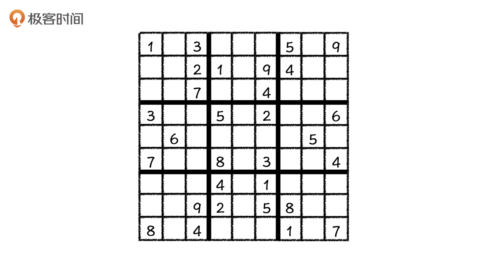
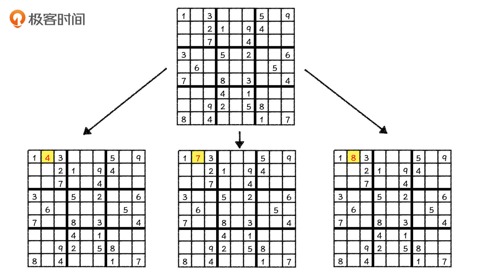
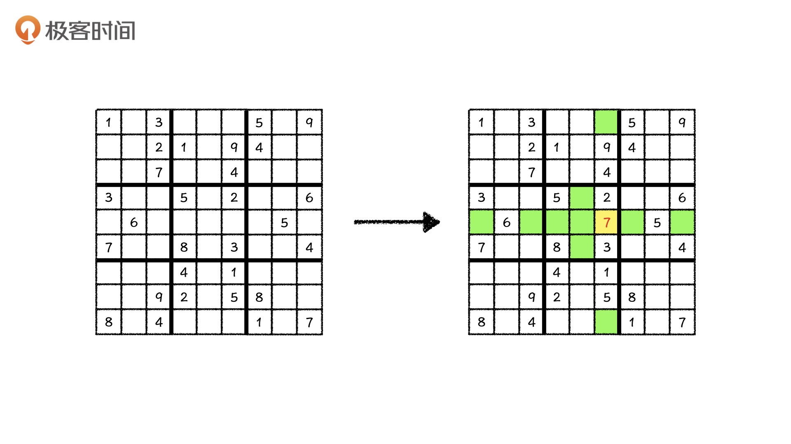
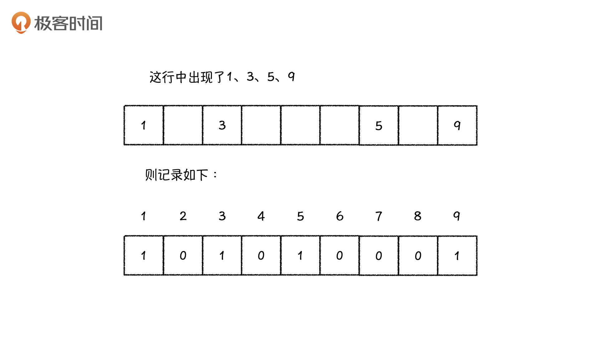
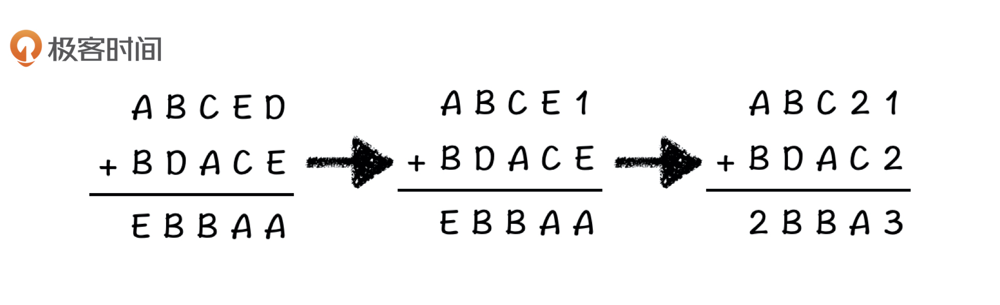
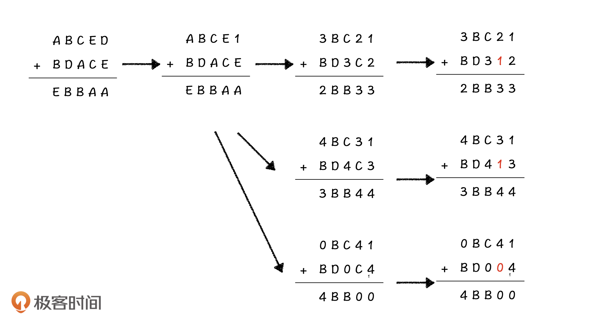

---
date: "2019-06-23"
---  
      
# 21 | 深度优先搜索进阶：数独游戏如何快速求解?
你好，我是胡光。

上节课，我们学习了深度优先搜索算法和一些简单的剪枝技巧。不过，我们在深度优先搜索上的探索还没有结束，这节课我们将通过数独和虫食算这两类经典题目，继续学习深度优先搜索的优化技巧，学习怎么让深度优先搜索的效率更高、速度更快。

首先，我们来看看今天要解决的数独问题。数独游戏是一个经典游戏，其规则就是在9个\$3\\times3\$方阵的空格里填上1-9这9个数字，最终填满整个\$9\\times9\$的大方阵，并且要求每一行、每一列、每一个\$3\\times3\$的小方阵中不能有重复的数。那这个问题该怎么用计算机求解呢？



## 如何利用深度优先搜索解决数独问题？

一看到这个题目，想必你就已经有了解决它的办法。没错，我们直接使用深度优先搜索就可以求解，搜索状态就是当前这个方阵的状态，每一步的状态转移就是填上一个格子，其他的什么都不用管，就这样一直搜索下去就行了。

的确，直接这么搜索下去一定可以求出数独的解。但从实际的运行效率来讲，这种方法其实就是在碰运气。为什么这么说呢？在今天的例子中，第`[1, 2]`是第一个空格子，它可以填上4、7、8三个数字，我们要分别尝试依次把它们填到这个格子中。如果走到某一步走不下去了，我们还要再向上回溯，一步步走回来，回到数独最原始的状态重新进行尝试。也就是说，这个格子有几种可能性，我们就要重新遍历几次这个状态树。



这么做显然非常浪费时间，就算在现实生活的数独游戏中，我们也不会这么去填数字。那我们在现实生活中是怎么玩数独游戏的呢？相信你和我一样，都会选择先填待选数字最少的那个格子。那当把一个格子填上之后，它同行、同列、同块的其他格子的可能行就都被占用了，这就相当于是在消减其他格子的状态数，这可以减少整个数独的不确定性。

在这个数独中也是一样，我们发现`[5, 6]`格子似乎只可以填上7这一个数字。给这个格子填上数字之后，整个数独中的不确定性就更少了，并且由于这个格子只有7这一种可能性，因此我们不会再回溯到原始状态重新尝试，搜索次数也会大幅度减少。



在搜索中我们当然也可以这么做：每一步状态转移，我们都找到现在这个方阵中可以填的数最少的节点，就可以有效减少状态数了。这种搜索技巧就是通过**修改搜索的次序而完成的剪枝操作**。

不过，使用这种剪枝技巧，我们需要去判断每一个格子中能填几个数，以及都有哪些数能填。可是如果判断每一个格子的时候，我们都要去枚举它所在的行、列、块，这需要循环\$81\\times 27=2187\$次，也是非常麻烦的。

这该怎么优化呢？我们可以利用一个数组去记录某一行都用了哪些数，以及哪些数没用。举个例子，对于今天这个数独例子的第一行，我们可以把这一行里面可以用（也就是没有出现的）的数标成1，不可以用的数标成0，由于数独中只会出现1到9这九个数字，因此我们给这一行开一个长度为10的数组就可以记录了。



但是这样记录的话，我们还是要询问1到9所有的数字是否在这一行里面出现过，这还有点儿麻烦，那我们能否把这个操作也省掉呢？

答案已经在这个数组中了，这个数组只记录9个数是否出现，而且分别是用0和1来记录的。这自然而然就对应了位运算，那这个记录就可以转变成我们用一个9比特的数记录这一行中1到9的使用情况。具体来说，我们用右数第一位代表1的使用情况，第二位代表2的使用情况，第三位代表3的使用情况……依此类推。

如果这一行的值是\$\(4\)\_\{10\}=\(000000100\)\_\{2\}\$，那这一行里面只有3可以使用，如果这一行的值是\$\(21\)\_\{10\}=\(000010101\)\_2\$，则代表1、3、5都可以填到这一行中。再回到上面这个例子中，数独的第一行对应的值就是\$\(100010101\)\_2=277\$，我们很容易就可以记录下来。

不仅如此，利用位运算我们还能同时实现三个功能。首先，利用位运算，我们可以直接计算某一个数在这一行中能否使用。比如说，要计算5能否填在这行中，我们只需要计算`(1 << (5 \- 1)) & row[i]的值`，如果是0就不能使用，否则就可以使用。其次，如果某一个格子填上了数或者拿下了数，我们也可以通过异或运算轻松更新这几个值。最后，通过位运算，我们也可以快速计算一个数中有多少个1，计算过程如下：

```
    while (a > 0) {
        a = a & (a - 1);
        count += 1;
    }
    

```

利用位运算之后，我们每操作一次都会去掉原来数组中一个低位的1，例如\$\(1011\)\_\{2\}\\\&\(1010\)\_\{2\}=\(1010\)\_\{2\}\$，\$\(1010\)\_\{2\}\\\&\(1001\)\_\{2\}=\(1000\)\_\{2\}\$。

不过这样做了之后，还是会有极端情况出现，比如当这个数的二进制表示全都是1的时候，还是相当于循环了很多次。但是，根据上面的操作，我们可以总结出来一个递推的规律：一个数`x`中含有1的个数，一定是`x >> 1`中含有1的个数加上`x`的最低位是否有1，公式如下：

```
    nums_1[x] = nums_1[x >> 1] + (x & 1)
    

```

那么，我们就可以先用\$2\^9\$的代价，先枚举出来每个数的二进制表示中有多少个1，把它们记录下来，判断的时候直接利用\$O\(1\)\$时间查表就行了。这样一来，我们分别使用三个数组，记录每一行、每一列、每一块的状态就可以大大减少运算量了。

你看到了吗？位运算也是一种强有力的优化技巧，利用位运算，我们有效地将循环判断变成了一次操作。不过，即便使用位运算能大幅减少我们每一次搜索判断的时间，但每次要找出所有的空格子，还是要枚举到所有的格子，那我们能不能把这一块运算也减少呢？

你还记得我们之前是怎么优化八皇后问题的吗？我们把一个格子拆成了行和列两个维度去解决这个问题，对于数独问题，我们也可以尝试应用这个思路。我们把每一步从方阵中找到一个可以填的数最少的格子拆分成两步，我们先在方阵中找到可以填的数最少的行`x`，然后在行`x`中找到可以填的数最少的格子`y`，最后以格子`[x, y]`作为状态转移去搜索下一步。这样一来，每一次搜索查找的运算量就从\$9\\times9=81\$变成了\$9+9=18\$，考虑到数独这个问题的搜索深度（空格子数，往往几十个），这已经大幅度减少运算量了。

以上就是我们解决数独问题所有的剪枝优化思路，我们一起来做个总结。总的来说，搜索的剪枝操作有4个优化思路可以用来参考：

1.  改变搜索次序：**将分支少的状态尽可能往前放**，让前面的状态限制后面的分支，来大幅减少搜索分支；
2.  修改状态转移方式，减少无用搜索：如八皇后问题中，我们将格子之间的状态转移转换成为行之间的状态转移，这避免了很多无用的搜索；
3.  去掉等效的状态。如组合数问题中，我们已经知道了`[1, 2, *]`状态和`[2, 1, *]`状态是一样的，自然不会再进行搜索；
4.  去掉不可行的状态，这种剪枝技巧几乎应用到了我们讲过的所有搜索例题中。比如，八皇后问题中，我们对行、列、对角线的限制；再比如，数独问题中我们对行、列、块的限制等等。

## 搜索优化实战：解决虫食算问题

解决了数独问题，学到了剪枝操作的4个优化思路之后。接下来，我们就利用这4个优化思路一起来解决虫食算问题。所谓虫食算，就是原先的算式中有一部分被虫子啃掉了，需要我们根据剩下的数字来判定被啃掉的字母。我们先来看一个简单的例子：

```
      43#9865#045
    +   8468#6633
    = 44445506678
    
    

```

其中`#`号代表被虫子啃掉的数字。根据算式，我们很容易判断：第一行的两个数字分别是5和0，第二行的数字是5。

现在，我给出一个N进制的加法算式，其中N=5，让你用计算机来求出这个算式原本是什么样子的，你会怎么做？算式的形式如下（其中，不同字母的值不相同）：


接下来，我们依旧试着用搜索来解决这个问题。

**首先，我们还是要确定这个问题的状态。**这个问题有两种搜索状态可以选择：每一个字母填什么或者每一个位置填什么。显然，第一种状态数量比较少，看上去比较好搜，但是我们无法利用算式上的规则去剪枝，而使用位置当状态，我们可以轻松地利用算式之中的规律当做剪枝条件。

比如，在上面的算式中，由于两个数的和与两个数的位数相同，就说明最高位的两个数相加之后没有进位，则有`A+B<N`，同时也有`A + B = E`或`A+B+1=E`（考虑到B+D的进位）。

虽然我们搜索的状态是每一个位置上填什么，但实际上，某一个字母确定了，这个字母所在的其他位置也就都确定了，并且，我们还可以利用加法运算的规则，直接判断出矛盾来减少搜索次数。比如在之前的状态中，我们搜索到A是3，但是向下搜索再碰到A的时候，发现A必须是2才能使这一列的等式成立，这就遇到了矛盾，接下来我们就没必要继续搜索了。

**确定了状态之后，最后我们确定搜索的次序。**我们讲了这么久的加法运算规则，到这里就能利用上了，我们应该从最低位开始，一位一位地去确定这个算式的值。

针对上面的例子，我们从最上面的D开始搜索，先把0到4依次填到D中尝试。首先，0肯定不能填到D里面，因为如果D是0，那`0 + E = E`，但算式最下面是A就会出现矛盾，所以D只能填1。

将最上面的D填上1之后，D下面的那个E同样不能填0，那我们只能从2开始试。根据加法运算规则`(D + E) % 5 = A`，则A=3。



确定了E、D、A的值之后，我们再搜右数第二列E下面的C。这个时候矛盾又出现了，根据`(2 + C) % 5 = 3`，当E=2、A=3的时候，C只能是1（否则C就得是\$\(6\)\_\{10\}=\(11\)\_5\$，不符合题目要求），可是1已经被D占用了。因此，这个状态不合理，我们就没有必要接着往下搜了。

那我们只能回溯回来重新搜索E，这次尝试让E=3，又发现3也和C有矛盾，我们就接着尝试4。这时候我们发现，右数第一列的等式是1 + 4 = 5，需要进位，那么A就等于0。当A=0 的时候，右数第二列的等式就变成了`(4 + C + 1) % 5 = 0`。这个等式要成立的话，C必须是0才可以，这个时候A和C又出现矛盾了，所以我们也没有必要搜索下去了。

就这样，我们尝试了D=1的所有情况，接下来我们就可以尝试D=2的情况了，尝试的方法还是一样，我就不再详细来说了。



通过这个例子，相信你也看到了，我们将搜索次序由横向搜索变成了从右向左、从上到下、一列一列的搜索。这样一来，我们可以很早就剪掉大量的状态，不用搜索5层才能去判断合理性。这也就是我们刚才说的，改变搜索次序来大幅减少搜索分支的搜索优化方法。

## 课程小结

这节课我们通过数独问题和虫食算问题练习了深度优先搜索的剪枝技巧，让深度优先搜索变得不那么盲目，也可以高效起来。从中，我们总结了深度优先搜索的4个优化思路，分别是改变搜索次序。比如在刚才说过的虫食算问题中，我们就把搜索次序由横向搜索改成了纵向搜索，来大幅减少搜索分支。接着是修改状态转移方式，减少无用搜索。然后是去掉等效的状态。最后是去掉不可行的状态。

我希望在日后搜索算法的应用实践中，你也可以灵活运用这几种思路去提升算法的效率。

## 课后练习

假设，有若干根一样长的木棍被切成了n个小木棍，我们已知这n个木棍和它们分别的长度，求木棍原来的长度最短是多长。你会怎么做？

欢迎在留言区分享你的答案，也希望你能把这节课的内容转发出去。今天就到这里了，我是胡光，我们下节课见！