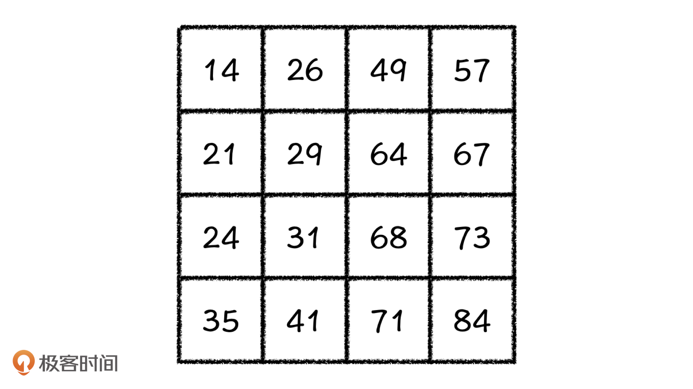
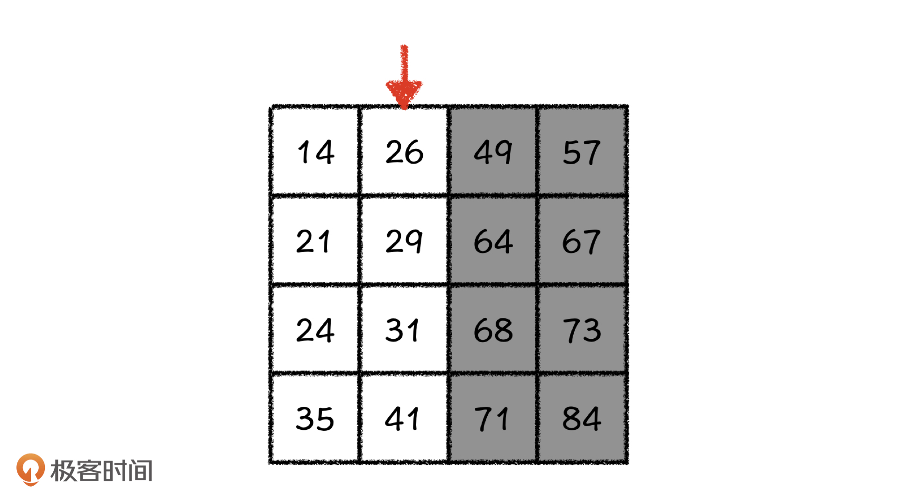
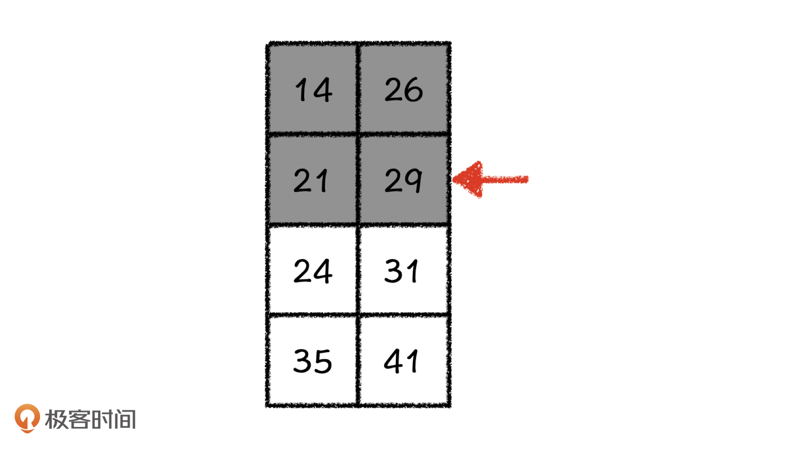

---
date: "2019-06-23"
---  
      
# 22 | 排序与查找：抓住关键，2-Sum问题的多种解法
你好，我是胡光。

经常有人问我，老师，你说学算法最重要的是学习它具体的设计过程，可是学完之后，我好像还是用不好？为了帮助你更好地应用我们讲过的各种排序、查找、搜索算法，从这节课开始，我们一起进入实战。

今天，我会先带你一起来解决2-Sum问题。这里，你可能会疑惑，2-Sum问题我们不是在第[12课](https://time.geekbang.org/column/article/284707)里面讲过了吗，怎么这里又要再讲一遍？首先，2-Sum问题本身就非常经典，而且我们已经知道它的经典解法，这样你再理解今天的内容就会更容易。其次，2-Sum问题的解法非常多，这些解法能把我们学过的算法知识都串联起来，是一类非常具有代表性的问题。

话不多说，我们正式开始今天的课程吧！

## 2-Sum问题的多种解法

首先，我们来回顾一下2-Sum问题，以及第12课里讲过的经典解法。

> 给定一个整数数组 nums 和一个目标值 target，请你在该数组中找出和为目标值的那两个整数，并返回它们的数组下标。你可以假设每种输入只会对应一个答案。但是，数组中同一个元素不能使用两遍。  
>    
> 示例：  
> 给定 nums = \[2, 7, 11, 15\], target = 9  
> 因为 nums\[0\] + nums\[1\] = 2 + 7 = 9  
> 所以返回 \[0, 1\]

经典解法是在有序的nums序列中，使用前后双指针就能在\$O\(N\)\$的时间复杂度内得到解。而如果nums是无序的，我们也可以通过排序先将这个问题简化到双指针再来解决。双指针解决这个问题的依据是二维思维的杨氏矩阵。今天，我们还是利用杨氏矩阵来进一步讨论这个问题的解法。

### 利用二分查找解决2-Sum问题

首先，我们来看一个杨氏矩阵问题。现在给你一个如下图的杨氏矩阵，让你找出31是否在这个矩阵中，你要怎么做？

正常来讲，我们从右上角开始与目标值比较，如果目标值小于元素值，就向左走一步查找；如果目标值大于元素值，就向下走一步查找，依此类推，一直走下去就可以找到它。事实上，这种方法已经非常高效了。不过，我们还可以找到更加高效的解法。

认真看这个矩阵，我们会发现它的每一行，每一列都是有序的。那我们每一步的查找，实际上都是试图在最上面`r0`行中找到第k列，让它满足：`a[r0][k] < 31 && a[r0][k + 1] > 31`，当k=2的时候是满足这个关系式的。

接下来，我们就从`a[r][k + 1]`元素开始查找，我们发现它下面和右面的所有元素都比它大。也就是说，以49为左上角的子矩阵中，49就是这个矩阵中的最小值。因为最小值49还大于31，所以我们就能推出目标值31一定不在这个子矩阵中，那这个子矩阵就可以被去掉。

那除了顺序查找之外，在杨氏矩阵这个有序序列中找到符合这样条件的位置，我们还有更快的方式吗？相信你心中已经有答案了，没错，就是二分查找法。

当我们用上面的方法纵向地去掉了矩阵的一部分之后，就要在得到的新矩阵的最右列上重复一次这样的操作。我们得到的新矩阵的最右列就是第k列，那我们就要在第k列上找到一行r，使得：`a[r][k] < 31 && a[r + 1][k] > 31`，我们定位到这个第`r`行之后，矩阵自然也被分成了两个子矩阵，而我们定位到的元素`a[r][k]`就是以它为右下角的子矩阵的最大值。当k=2、r=2的时候，`a[r][k]`就是29，我们就能推知目标值31一定不在这个子矩阵中，这个子矩阵自然也可以去掉了。

这次切分之后，我们继续在新暴露出来的最上面一行，也就是`r+1`行上做二分查找操作，直到找到目标值或者矩阵被删空为止。这样一来，我们把2-Sum转换成杨氏矩阵之后，再利用杨氏矩阵的行、列与序列中元素之间的对应关系，就可以更快地解决2-Sum问题了。并且，由于使用了二分查找，解决2-Sum问题的时间复杂度被我们进一步降到了对数级别。实际上，在有序序列上进行查找操作的时候，我们都可以考虑用这种方式来做。

到这里，第一种解法就说完了。接下来，我们继续来讨论这个问题的其他解法。

### 2-Sum问题的其他解决办法

这次我们再好好思考一下题干，这道题让我们从`nums`序列中取出两个数`a`和`b`，并且让`a + b = target`。那这是不是可以转换成为：在确定第一个数`a`的情况下，查找`target-a`这个数是否在nums序列中呢？的确可以。这样一来，这个问题的另一种解法我们就得到了，就是先确认一个数，再查找另一个数是否在这个数之后的子序列中。既然这个序列是有序的，查找过程自然也可以使用二分法来做，这个解法的时间复杂度是\$O\(N\\times log\_2N\)\$。

那么除了**先排序再二分的做法**之外，还有更快的解决办法吗？我们要注意，解决这个问题的关键在于查找一个数在序列中是否存在。这就让我们想到了之前学过的一种高效的查找结构，哈希表。哈希表可以用\$O\(1\)\$的时间查找元素是否存在，对吧？

这样，2-Sum问题的第三个解法也就得到了。我们先将序列`nums`所有的元素都放到一个哈希表中，然后按照前面的思路，去查找`target-a`这个数是否在nums序列中就可以了。这种方法使用起来与无序序列一样，时间复杂度都是\$O\(N\)\$，它们的快慢主要取决于哈希函数的操作效率。

讲完了2-Sum问题的3种解法，我还想把这个问题拓展一下，带你看看怎么解决3-Sum问题和4-Sum问题。

## 3-Sum问题和4-Sum问题的解法

首先，我们来看3-Sum问题。

> 给定一个整数数组 nums 和一个目标值 target，请你在该数组中找出和为目标值的那三个整数，并返回它们的数组下标。你可以假设每种输入只会对应一个答案。但是，数组中同一个元素不能使用两遍。  
>    
> 示例：  
> 给定 nums = \[2, 7, 11, 15\], target = 24  
> 因为 nums\[0\] + nums\[1\] + nums\[3\] = 2 + 7 + 15 = 24  
> 所以返回 \[0, 1, 3\]

其实延续2-Sum问题的解题思路，我们很容易就能想到一个比较高效的解法：首先确认一个数`a`，然后在序列中找到两个数`b`和`c`，使得`b + c = target \- a`。看到了吗，这就又变成了一个2-Sum问题。这样，我们只需要依次确定一个数，将序列中剩下的元素当作2-Sum问题来做就好了。这么做的时间复杂度，相当于在2-Sum问题的时间复杂度上再乘上一个\$N\$，最好情况下，时间复杂度就是\$O\(N\^2\)\$或者\$O\(N\^2\\times log\_2N\)\$。

好，简单地解决了3-Sum问题之后，我们再来看4-Sum问题，也就是说，这次我们要在序列中找出来4个数，使得它们的和等于目标值。

看到这里，你可能会有一个惯性的思维：继续按照3-Sum问题的解决思路，确定了一个数之后，在序列剩下的元素中去解决3-Sum问题不就可以了吗？的确可以，但这个做法相当于在3-Sum的时间复杂度上又乘上了一个N，时间复杂度就成了N的立方。这该怎么优化呢？

你还记得之前在第12篇中，我们学习用杨氏矩阵的思想来解决2-Sum问题的时候，提到了一种算法思维，就是**用二维的思维去解决一维的问题**。那我们是否可以尝试使用这个思维去优化4-Sum问题的解决方案呢？

按照这个思路，我们实际上要在序列中事先确认两个数`a`和`b`，然后在序列余下的元素中解决目标值为`target \- (a + b)`的2-Sum问题。那么，事先确定`a`和`b`的操作，是否可以直接组合，然后继续计算呢？

没问题，我们先将序列`nums`中的元素两两加和，得到一个新的序列`sum_nums`。这个新序列的长度，用简单的组合数公式就可以算出来：\$C\_N\^2=\\frac\{N\\times\(N-1\)\}\{2\}\$，结果大概是N平方的复杂度。由于序列`sum_nums`之中全都是元素加和，那么我们直接对这个新的序列做2-Sum问题，最终求得的结果就是4-Sum的结果。

不过，这个解法中有一个细节问题需要你注意，题目中要求选取的元素是不可以重复的。但是，如果我们使用这个方法去求解这个问题，不同的加和之间很可能会存在重复使用的元素。比如说，我们找出来的结果有可能是`a + b + b + c = target`，我们应该在求解过程中把它规避掉。

这个解法的时间复杂度也是\$O\(N\^2\)\$，它和3-Sum的时间复杂度是一样的。总的来说，对于4-Sum问题，我们打破了3-Sum问题带来的思维定式，使用二维的算法思维去解决一维的问题，解题的基本思路与3-Sum问题完全不同，解题效率更高。

## 课程小结

这节课，我们重新讨论了2-Sum问题的多种解法。这些解法实际上都是在解决同一个问题，就是找到线性序列中更高效的查找方式。

针对2-Sum问题，我们讲了三种解法。首先，我们借助杨氏矩阵每一行、每一列都是有序的这一特性，利用了二分查找法来解决问题。后来，我们又将问题转换成在确定第一个数`a`的情况下，查找`target-a`这个数是否在nums序列中，也就是**先排序再二分的做法**。这种解法的关键在于查找一个数是否存在于序列中，最后，我们借助哈希表对第二种解法进行了优化。

此外，我们又拓展学习了3-Sum问题和4-Sum问题的解法。3-Sum问题的解法其实就是延续2-Sum问题第二种解法的思路。而4-Sum问题的解法，应用到了我们学过的利用多维算法思维去解决一维问题。

通过今天的学习，我希望你能明白一点，那就是我们在解决实际问题的过程中，一定不要被问题本身的形式、结构，或者是相似问题给限制住，要打破思维定势，利用问题本身的特性去寻求更高效的解法。

## 课后练习

1.你能试着把杨氏矩阵的二分解法应用到2-Sum问题上吗？

2.你可以利用我们今天学到的知识，试着讨论一下k-Sum问题的解法吗？

欢迎在留言区分享你的答案，也希望你能把这节课的内容转发出去。那今天就到这里了，我是胡光，我们下节课见！