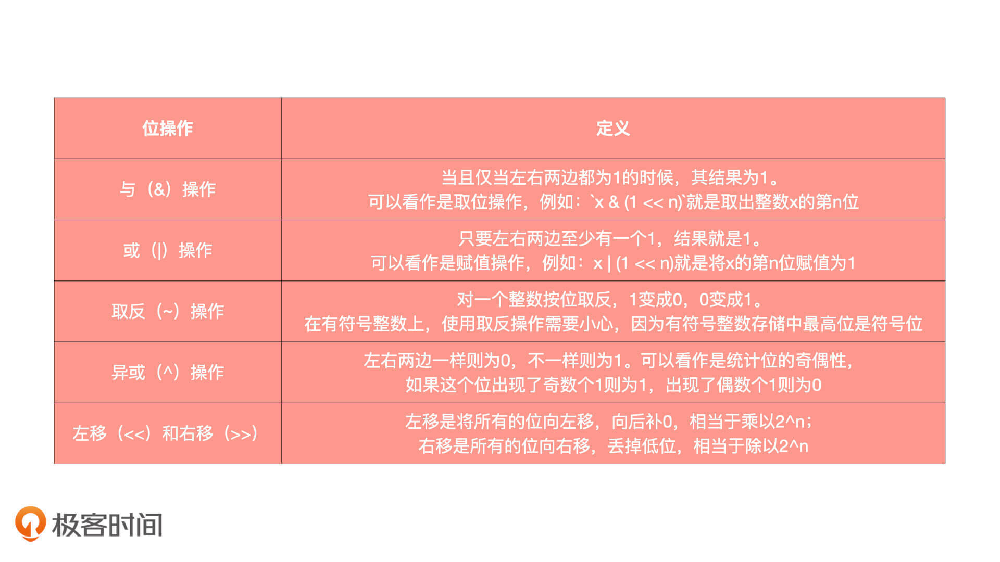
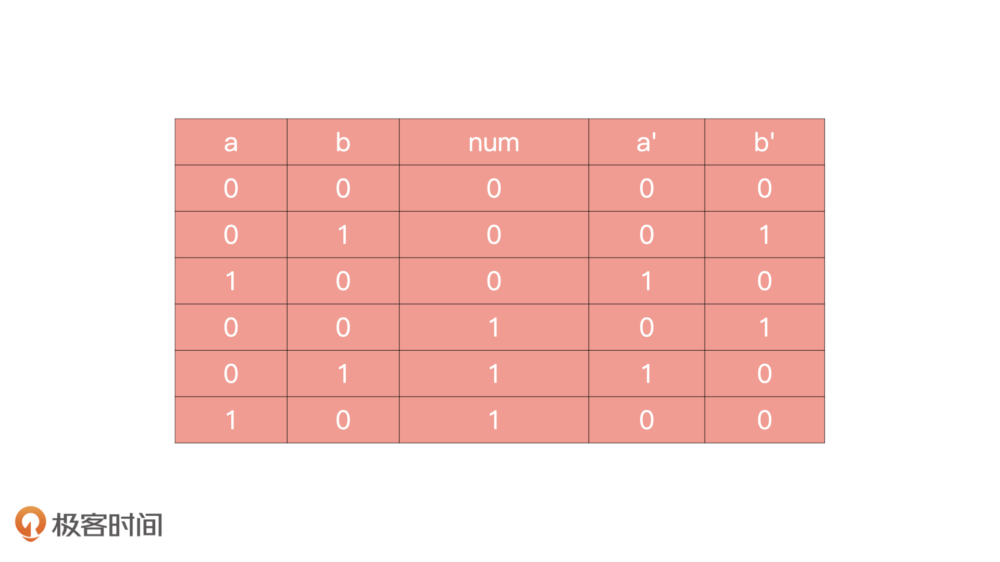
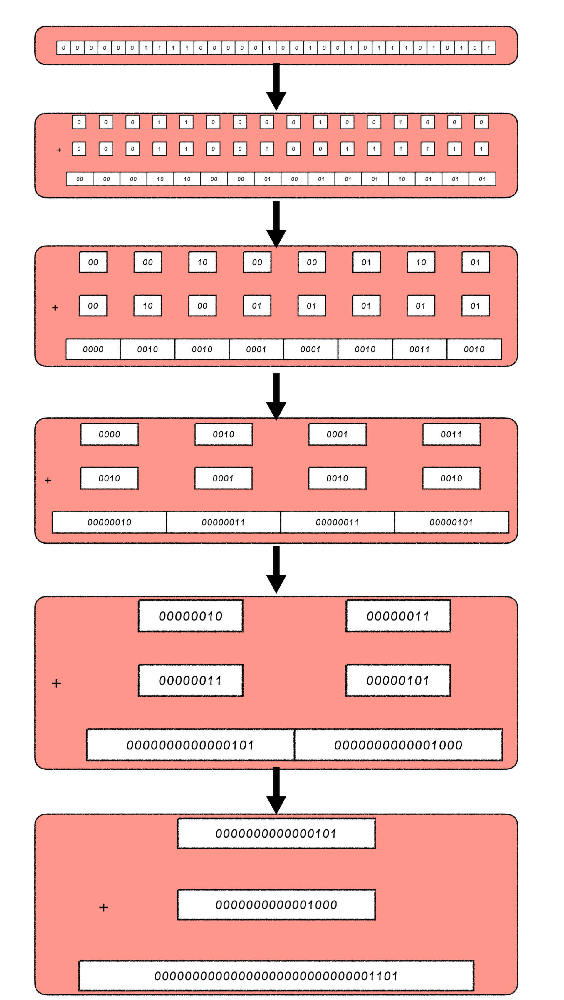

---
date: "2019-06-23"
---  
      
# 23 | 位运算：位=数据结构，算=算法
你好，我是胡光。今天，我们学习位运算。

还记得吗？第21课里，我们在用深度优先搜索和剪枝技巧来解决数独问题的时候，使用位统计了数独中每行、每列、每块的状态，利用了位运算来计算状态转移。这让原本需要在序列上进行的操作，只需要在整数上就可以完成。

位运算这种强有力的优化技巧，帮助我们减少了统计所需要的空间消耗和时间消耗，加速了搜索过程。在实际应用中，很多对效率有着绝对要求的领域（如游戏领域）也经常会使用位运算技巧来加速。

不过，同学们对位运算的了解可能并没有那么深，虽然我们在学习C语言的时候都会接触到位运算，但往往浅尝辄止。那今天，我就结合几道实战题目带你深入学习位运算的技巧，让它成为你实战过程中的“最佳”助力！

## 位运算的基础知识

在开始实战之前，我们先来回顾一些位运算的基础知识。首先是位，位也是一种数据结构。它有两种状态，分别是0（false）和1（true）。而位运算，就是对这种数据结构进行的基础操作，一共有6种，分别是与（\&）、或（|）、取反（\~）、异或（\^）、左移（\<\<）和右移（>>）。接下来，我们分别看一下它们的概念。



好了，现在我们已经重新回顾了位运算的基础知识，接下来，我们正式开始实战。

## 位运算的应用技巧

在解决实际问题的时候，我们经常会使用2种位运算技巧，分别是按位统计法和分组统计法。接下来，我就结合几道典型例题，来和你详细讲讲它们的应用。

### 1\. 按位统计法

如果要在所有的4位素数中，找到数字组成是一样的素数（素数是指在大于1的自然数中，除了1和它本身以外不再有其他因数的自然数）。比如说，9937和9973，它们两个都是由2个9、1个7、1个3组成，所以它们两个的数字组成就是一样的。这个时候，你会怎么做？

要解决这个问题，我们就要先找到所有的4位素数。这好像有点难办啊，没关系，我们可以利用素数筛这个方法来解决。它的基本思路就是将素数的倍数全都标记成为合数（合数是指在大于1的整数中除了能被1和本身整除外，还能被除0以外的其他数整除的数），剩余的没有被标记的数自然就都是素数了。

我把具体的方法总结在了下面这张图上。结合它，我们来举个例子。假设，我们先找到了第一个素数2，然后我们把2的倍数都标记成合数。接着我们找到未标记的第一个数，它肯定还是一个素数，我们重复刚才这个过程，直到把4位数中的所有素数都找出来。


找到所有的4位素数之后，我们就要去统计计算每个素数的组合。最简单的办法就是，我们给每一个4位数开一个长度为10的数组，记录其中0到9出现的次数。计算完之后，我们再判断一下这些统计数组中是否有完全相同的就可以了。这个方法想想就比较麻烦，那我们有没有更好的解决方法呢？

首先，我们可以想一想，在4位的素数中，每一个数字至多出现几次呢？你首先想到的可能是4次，但这并不可能。因为如果一个四位数每一位都是一样的，那它一定可以被11整除，也就是说它不会是一个素数。所以，4位素数中，每一个数字出现的次数最多是3次。因此，在一个4位素数中，每个数字只会有4种状态，那就是出现0次、1次、2次和3次，这4种状态我们用两个bit就能够存储起来了。

所以，我们可以分别用两个bit来存储每个数字的状态。因为一共有10个数字，那我们用20bit就可以将它们都存储下来。这么一看，刚好一个整数（32 bit）就可以把这10个数字的状态存储下来了。统计一个数x的具体操作如下：

```
    int count = 0;
    while (x > 0) {
        count += 1 << (x % 10);
        x /= 10;
    }
    
    

```

最后，我们用哈希表存储下每个统计结果对应的数，就可以得到组成一样的4位素数了。这种方法就叫做**按位统计法**。简单来说，就是分别统计所有可能出现的数的状态。还记得吗？在数独问题中，我们也是使用这种技巧去记录数独中的状态的。

### 2\. 分组统计法

第一种方法讲完了，我们接着来看第二种方法，分组统计法。我们还是先来看一道题。

已知一个序列中，其他数出现了偶数次，只有一个数出现了奇数次，你能求出出现奇数次的那个数吗？

这道题可能你之前就见过了，甚至你可能已经知道了它的解法。运行下面这段代码之后，最终的x就是我们要找的那个数。

```
    int x = 0;
    for (int i = 0; i < n; i++) {
        x ^= a[i];
    }
    
    

```

不过，我们要解决的是一道和它类似的题目：在一个序列中，其他数出现了3次，只有一个数的出现次数小于3次，请你求出出现次数小于3次的那个数 。

这道题显然就不像上一道题那么简单了，我们使用直接异或没有办法解决。不过，想要解决这个问题，我们可以从第二题出发，借助它的思路。我们先来想想在解决第二题的过程中，我们使用异或运算到底是在算什么。

题目中给出的信息很明确，每一个bit的状态有两个，分别是奇和偶，奇为1、偶为0。所以，我们可以用一个bit来存储这两个状态，用异或操作来统计bit上的奇偶性。简单来说，我们实际上就是在统计所有数中，在每个bit上出现1的次数的奇偶性。

那我们回到这个问题中想一想，每个bit上的状态有几种呢？其实是4种，分别是出现0次1、1次1、2次1和3次1，而出现3次的数是需要排除掉的，那出现3次可以被视作出现0次。因此，这4种状态我们就可以用2个bit来存储，分别是出现0次1就是00，1次就是01，2次就是10，3次就是00。

那当这个bit遇到一个新的数的时候，状态会怎么转换呢？假设a和b是分别存储每个bit状态的高位和低位：



通过上面的表格，我们看到，要想让`a' = 1`，则必有`a == 1 && b == 0 && num == 0`或`a == 0 && b == 1 && num == 1`，因此我们就得到了`new_a = (a & ~b & ~num) | (~a & b & num)`这个状态转移代码。同理，要想让b’ = 1，就会有`new_b = (~a & b & ~num) | (~a & ~b & num)`这个状态转移代码。这个式子我们还可以化简一下，首先化简低位`b`，得到`new_b = ~a & ((b & ~num) | (~b & num)) = b ^ num & ~a`。然后我们用计算好的`b'`去重新求取`a'`，就能得到`new_a = (a & ~num & ~new_b) | (~a & num & ~new_b) = ~new_b & ((a & ~num) | (~a & num)) = a ^ num & ~new_b`。

由于我们要求的那个数要么出现了2次，要么出现了1次，因此，这个数要么存储在了a中，要么存储在了b中。想要取出它，我们只需要求`a | b`即可。

上面的这种技巧，就叫做**分组统计法**。简单来说，分组统计法就是将bit按照一定规则分成若干个不同的组分别统计。

其实，到这里，两种常见的位运算技巧我们就讲完了。不过我还想给你讲讲基于分组统计法的进阶技巧。

### 3\. 分治思想结合分组统计法

下面，我们来看一道题：给定一个整数，请你求出这个整数二进制表示中1的个数。

你可能发现了，这个问题在数独问题中，我们已经讲过了也介绍过了，当时给出的方法是：

```
    int count = 0;
    while (x > 0) {
        x = (x & (x - 1));
        count += 1;
    }
    

```

最终得到的`count`就是1的个数，我们通过这个方法得到了打表方法，用来快速查找有限个数的结果。

这个方法的时间复杂度是有多少个1就计算多少次，最坏情况是\$O\(log\_2N\)\$的，其实这个方法的效率已经非常高了。但如果是在相当频繁的操作中，这个效率还是有些吃力的，比如在游戏这种追求极致效率的应用场景中。接下来，我们就一起来探索更快的解决思路。

那么，我们先来看一个数的二进制表示，例如62989781的二进制表示为11110000010010010111010101。我们知道，在计算机中，一个整数通常是32个bit的，所以我们会在11110000010010010111010101的前面补齐0。好，那么我们想求取这个二进制表示里面有多少个1，除了一个一个地把1消掉之外，是不是也可以想办法把所有的1都累加到低位上，使得最终的计算结果就等于1的个数呢？

这个想法看似天马行空，但我们可以慢慢尝试去实现它。我们从最高位开始，两位两位地计算，将两位中的高位拿出来加到低位上。

那我们怎么才能分别取出高位数和低位数呢？这就用到了，我们刚才讲的与（\&）操作。两个bit取低位就是使用`0b01`来操作，取高位就是`0b10`。那么，32bit的数分别来取高位和地位，就是16个`0b01`和16个`0b10`。与二进制最方便转换的一种进制就是16进制，16个`01`就是8个`0101`，所以取低位的16进制数就是`0x55555555`，同理，16个`10`就是8个`1010`，所以取高位的16进制数就是`0xAAAAAAAA`。这样，我们让x = x \& 0x55555555 + \(\(x \& 0xAAAAAAAA\) >> 1\)，就可以把相邻位置的高位1累加到低位1上。

做完了这个操作之后，下一步我们就是要把之前的2bit分组再每两个取一组，将高位累加到低位上。这次我们取低位用的数是8个`0011`，也就是`0x33333333`，取高位用的数是8个`1100`，也就是`0xCCCCCCCC`。

接下来，我们再次取相邻分组，这次相邻分组是8位。那我们取低位是4个`00001111`，即`0x0F0F0F0F`，取高位是4个`11110000`，即`0xF0F0F0F0`，依此类推。



最终，我们得到的数字就是我们当前这个数中1的个数。我们的最终计算结果是13个1，你可以去验证一下。

```
    int count_one(int x) {
        x = x & 0x55555555 + ((x & 0xAAAAAAAA) >> 1);
        x = x & 0x33333333 + ((x & 0xCCCCCCCC) >> 2);
        x = x & 0x0F0F0F0F + ((x & 0xF0F0F0F0) >> 4);
        x = x & 0x00FF00FF + ((x & 0xFF00FF00) >> 8);
        x = x & 0x0000FFFF + ((x & 0xFFFF0000) >> 16);
        return x;
    }
    

```

整个过程中，我们一共只计算了5次就可以得到一个数的二进制表示中1的个数，是不是很神奇？

这个解法实际上是利用了分治的基本思想，结合分组统计法得到了最终的结果，由于整数的bit长度是固定的32个，所以在有限次操作（5次）一定能够得到结果它的时间复杂度是\$O\(log\_2log\_2N\)\$。

## 课程小结

今天，我们先一起回顾了位运算中的基本操作。位运算有6种基本操作，分别是与、或、取反、异或、左移和右移。我们今天重点提到了其中两种，与操作和异或操作。

然后，我们通过3道实战题目，一起学习了位运算的常见技巧，按位统计法和分组统计法，以及分组统计发结合分治思想的进阶方法。其中，按位统计法就是分别统计所有可能出现的数的状态。分组统计法就是把bit按照一定规则分成若干个不同的组，再分别统计。

总的来说，当我们将bit看作是一种数据结构的时候，往往就可以利用其特性完成一些高效的算法设计。对于今天讲解的这几道题目来说，我们的目的不仅仅是学会这些算法，或者学会几种解题技巧，而是要去不断尝试。只有我们正视了这样一种数据结构，才能知道怎么样利用它的特性设计出来高效、巧妙的算法，真正解决问题。

一句话总结就是，解题不是目的，学会思维方式才是目的。

## 课后练习

1.  你能尝试用位运算优化八皇后算法吗？
2.  你能求出62989781的二进制表示反转之后的整数吗？

欢迎在留言区分享你的答案，也希望你能把这节课的内容转发出去。那今天就到这里了，我是胡光，我们下节课见！