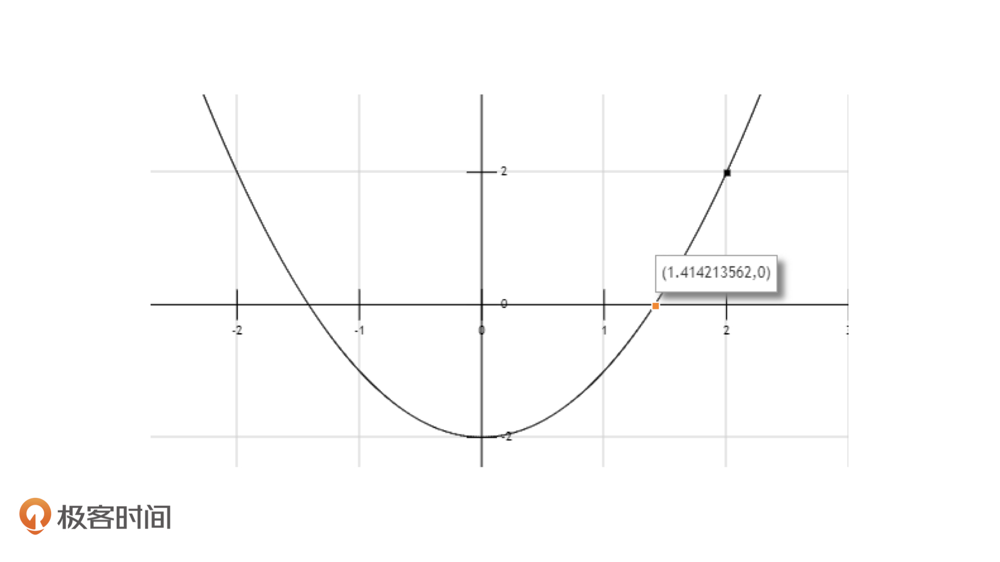
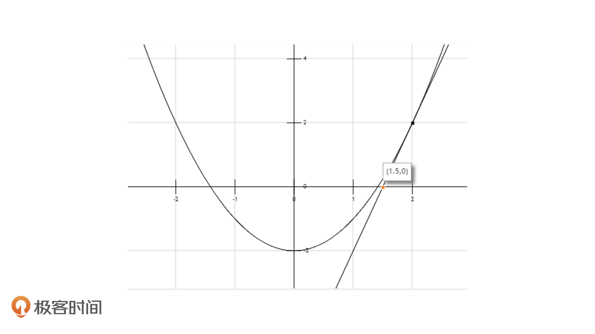
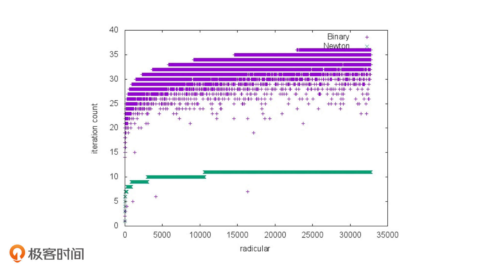
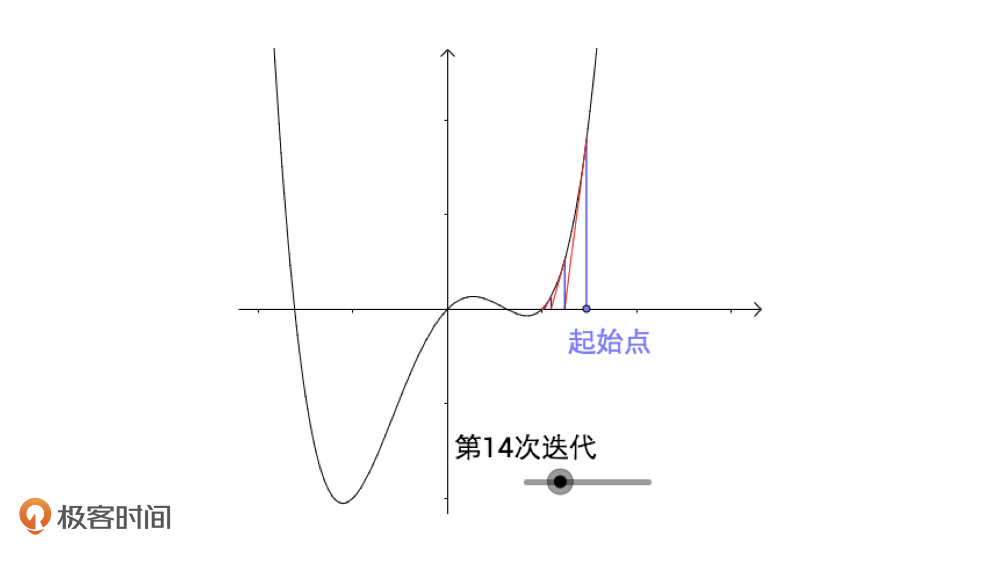
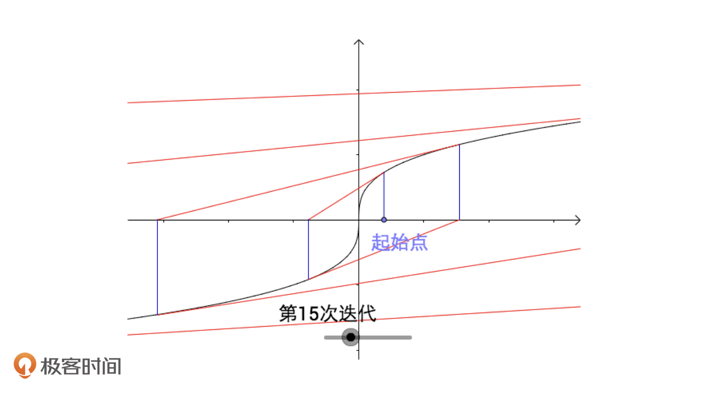

---
date: "2019-06-23"
---  
      
# 24 | 牛顿迭代：如何用O(1)的时间复杂度求sqrt？
你好，我是胡光。

我们知道，特定的方程如二次方程有特定的求根公式。但是，多数方程是不存在求根公式的，而我们用数学工具去手动求解也未必能够得到方程的解，那计算机就更难计算了。

为了能够快速求出方程的解，这节课，我会给你讲一种计算机中快速求解方程根的方法，即牛顿迭代法，并利用它快速求解数的平方根。

## 使用二分法求解方程的根

我们知道，计算机相比于人有一个天然的优势，就是它可以快速、准确地执行重复操作。比如说，我们只能去反复猜测、逼近方程的解，要想达到一定的精度很难，但计算机通过不断迭代就可以很容易地完成这个工作。因此，在计算机上，我们可以使用**迭代方法**去求解方程的根。

以开平方函数`sqrt`为例，如果在计算机中我们想求某一个正实数`a`的正平方根，我们其实可以把这个问题转换成为求方程\$x\^2-a=0\$在一定精度下的解（例如小数点后6位）。这个问题怎么解决呢？下面，我们一起来看看。

首先，我们能想到的最简单的方法就是二分法。具体来说，就是我们每找到一次中间值\(l+r\)/2之后，就取它的平方和`a`比较。这样我们一直使用二分来迭代，直到误差符合要求为止。

这个代码，我们很轻松就可以写出来：

```
    c++
    float bi_sqrt(float x) {
        float l = 0.0f, r = x;
        float mid = (l + r) / 2.0f;
        float last = 0;
        while (abs(mid - last) > eps) {
            printf("%.7f %.7f %.7f\n", l, r, mid);
            last = mid;
            if (mid * mid > x) {
                r = mid;
            } else {
                l = mid;
            }
            mid = (l + r) / 2.0f;
        }
        return mid;
    }
    
    

```

虽然二分法的确可以完成方程求解的过程，看上去效率也还可以。但我们还要考虑到`sqrt`是一个非常基础的数学操作，它的调用频率非常频繁。那使用二分法来求解，计算机需要迭代多少次才能达到`1e-6`的精度呢？我们得到\$\\sqrt\{2\}=1.4142135\\cdots\$，利用二分法的确达到了精度，但它的迭代次数看起来实在是有点儿多。而且，`sqrt`作为一个非常基础且会被频繁调用的数学操作，这样的迭代次数看起来好像不是那么好。甚至，如果我们要求更高的精度，迭代的次数也会变得更多。这该怎么办呢？

```
    0.0000000 2.0000000 1.0000000
    1.0000000 2.0000000 1.5000000
    1.0000000 1.5000000 1.2500000
    1.2500000 1.5000000 1.3750000
    1.3750000 1.5000000 1.4375000
    1.3750000 1.4375000 1.4062500
    1.4062500 1.4375000 1.4218750
    1.4062500 1.4218750 1.4140625
    1.4140625 1.4218750 1.4179688
    1.4140625 1.4179688 1.4160156
    1.4140625 1.4160156 1.4150391
    1.4140625 1.4150391 1.4145508
    1.4140625 1.4145508 1.4143066
    1.4140625 1.4143066 1.4141846
    1.4141846 1.4143066 1.4142456
    1.4141846 1.4142456 1.4142151
    1.4141846 1.4142151 1.4141998
    1.4141998 1.4142151 1.4142075
    1.4142075 1.4142151 1.4142113
    1.4142113 1.4142151 1.4142132
    

```

## 利用牛顿迭代法求解方程的根

接下来，我就给你讲一种更常用、更快速的迭代求解方法，它就是牛顿迭代法。我们先从几何角度上来直观认识一下牛顿迭代法。

### 认识牛顿迭代法

我们还是以方程\$x\^2-a=0\$为例，假设此时\$a=2\$，那我们要求的就是\$\\sqrt\{2\}\$的值。这个时候，\$x\^2-a=0\$方程可以看作是一个函数\$f\(x\)=x\^2-2\$，而我们想要求的值就是\$f\(x\)=0\$时x的值，也就是这个函数图像和x轴的交点。

在迭代法中，我们可以从任意一个值不断迭代到正确的值。假设，这次我们从\$x\_0=2\$这个点开始迭代。



如上图，橙色的那个点就是目标值，而上面那个黑色的点就是我们设置的\$x\_0=2\$时的初始值\$x\_i\$。根据上面的图像，我们每一次迭代都要将\$x\_i\$向目标值逼近，那怎么逼近效率最高呢？当然是按照切线去逼近，也就是说，我们要按照函数在\$x\_i\$点上的切线来逼近。

既然是函数图像的切线，我们就要知道函数的导数。在这个问题中，\$f\(x\)\$的导数为：\$f'\(x\)=2x\$。经过推导，这个切线的方程就是\$f'\(x\)=4x-6\$。由此，我们知道这条切线和x轴的交点为`(1.5, 0)`。



看到了吗，一下子\$x\_i\$就离目标值近了这么多。接着，我们就以（1.5, 0）这个点为新的起点，再按照上面的方式用切线逼近一次，就能得到下面的效果。


如果我们不把这个图片放大，你甚至都无法区分这两个点。这个时候，新的点变成了\$\[1.41\\dot\{6\},0\]\$，精度实际上已经达到了小数点后2位。实际上，有人计算过，按照这种方式来迭代，每一步能增加3位的精度，这是非常强大的。

好了，牛顿迭代法的过程讲完了，我们一起来总结一下，主要有3步：

1.  选取一个初始值\$x\_0\$，以它作为迭代的起始；

2.  求出函数在点\$\(x\_i, f\(x\_i\)\)\$处的切线（i从0开始）与x轴的交点，让它作为新的\$x\_i\$；

3.  反复执行第2步，直到得到符合精度要求的结果为止。

这个过程用公式表示就是，我们先得到函数\$f\(x\)\$在\$x\_i\$处的切线方程为\$f\(x\_i\)+f'\(x\_i\)\(x-x\_i\)\$

然后，我们要让\$x=x\_\{i+1\}\$的时候，上面这个式子等于0。此时，公式为：\$f\(x\_i\)+f'\(x\_i\)\(x\_\{i+1\}-x\_i\)=0，则x\_\{i+1\}=x\_i-\\frac\{f\(x\_i\)\}\{f'\(x\_i\)\}\$，这个公式就是牛顿迭代法的核心。

### 牛顿迭代法和二分法对比

好了，理解了什么是牛顿迭代法，那它是怎么实现`sqrt`的呢？事不宜迟，我们把牛顿迭代法先带入到`sqrt`对应的那个方程中，则有：

\$\$  
\\begin\{aligned\}  
x\_\{i+1\} \&=x\_\{i\}-\\frac\{x\_\{i\}\^\{2\}-a\}\{2 x\_\{i\}\} \\\\\\  
\&=\\frac\{2 x\_\{i\}\^\{2\}-x\_\{i\}\^\{2\}+a\}\{2 x\_\{i\}\} \\\\\\  
\&=\\frac\{x\_\{i\}+a / x\_\{i\}\}\{2\}  
\\end\{aligned\}  
\$\$

对应的实现代码如下：

```
    C++
    float newton_sqrt(float x) {
        float y = x;
        float last;
        while (abs(y - last) > eps) {
            printf("%.7f\n", y);
            last = y;
            y = (y + x / y) / 2.0f;
        }
        return y;
    }
    
    

```

接下来，我们再来看一下，同样初始值的情况下，利用牛顿迭代法求取\$\\sqrt\{2\}\$的迭代次数：

```
    CQL
    2.0000000
    1.5000000
    1.4166667
    1.4142157
    1.4142135
    

```

没错，我们仅仅经过5次迭代，就能计算出高于`1e-6`精度的结果。这不仅比二分法迭代次数少，计算结果的精度还高。如果我们的精度要求更高的话，二者的差距会更加大。实际上，有人确实做过二分法和牛顿迭代法在求`sqrt`的迭代次数对比，如下图：



从上面这张图中我们可以看到，虽然有个别数二分的迭代次数要比牛顿迭代的迭代次数少一些，但整体上，牛顿迭代法的发挥非常稳定，迭代次数是二分迭代法的1/3\~1/2。

这就是牛顿迭代法的全部内容了。牛顿迭代法是最优化理论中一个非常重要的基础算法，它在机器学习领域中也起到了很重要的作用，比如条件随机场的一种优化方法，使用的就是根据牛顿法进一步而提出来的拟牛顿法，这里我就不展开了。

### 牛顿迭代法的应用

看到这里，你可能会有一个疑问，最开始我们说的明明是要在\$O\(1\)\$的时间复杂度求解`sqrt`，但是上面的牛顿迭代，一个明晃晃的`while`循环摆在那里，显然不是\$O\(1\)\$的时间复杂度啊，这不是有点儿标题党的嫌疑吗？实际上，如果我们真去测试牛顿迭代法实现的函数，它和系统的`sqrt`函数相比，在性能上还是有一定差距的。

别着急，接下来就是见证牛顿迭代法力量的时刻了。这里，我想给你讲一个故事，这个故事是发生在游戏引擎中的。上世纪90年代，计算机的性能远没有当今这么发达，那个年代的计算机，别说是运行一个流畅的3D画面的游戏，想要渲染一个流畅的3D动画，都足以让人惊叹一番。这时，有一款游戏横空出世，它就是雷神之锤3，它的画面在那个年代非常不错，同时又可以在低配置的PC上运行，这都归功于一个名为约翰·卡马克（John Carmack）的人开发的3D引擎。而后来，在这个3D引擎开源之后，有人打开了它的数学库，找到了一段神奇的代码：

```
    
    float Q_rsqrt( float number )
    
    {
    
    long i;
    
    float x2, y;
    
    const float threehalfs = 1.5F;
    
    x2 = number * 0.5F;
    
    y = number;
    
    i = * ( long * ) &y; // evil floating point bit level hacking
    
    i = 0x5f3759df - ( i >> 1 ); // what the fuck?
    
    y = * ( float * ) &i;
    
    y = y * ( threehalfs - ( x2 * y * y ) ); // 1st iteration
    
    // y = y * ( threehalfs - ( x2 * y * y ) ); // 2nd iteration, this can be removed
    
    #ifndef Q3_VM
    
    #ifdef __linux__
    
    assert( !isnan(y) ); // bk010122 - FPE?
    
    #endif
    
    #endif
    
    return y;
    
    }
    
    

```

这段代码求的是\$\\frac\{1\}\{\\sqrt\{n\}\}\$，我们能看到，它使用的显然就是牛顿迭代，但它仅仅进行了一次运算就结束了，它求解\$\\sqrt\{2\}\$的结果是1.41456711。

看到了吗，一次运算就精确到了小数点后3位，这相当于牛顿迭代法的第4步。你可能会觉得，这个可能就是巧合，那我们再找一个数看一下，比如\$\\sqrt\{15\}=3.872983346207417\$，牛顿迭代法的结果是3.87971568。我们发现，这次的精度稍微差了一些，只精确到了小数点后2位，但也相当于牛顿迭代法的第4次迭代了。

经过这两次实验，相信你也看出来了，这个方法里面最大的玄机就是他所选择的这个初始值，即`i = 0x5f3759df \- ( i >> 1 );`。

那初始值究竟是怎么计算出来的呢？我们看这一行代码上面的其他操作，计算机存储浮点数的规则是用bit来表示浮点数，浮点数是32bit存储的数据。一个浮点数x，它在计算机中的存储方式是，最高位是符号位，紧接着8bit是指数位\$E\_x\$，最后23bit是有效数字位\$M\_x\$。

因此，一个浮点数在计算机中的存储数据可以看作是，\$x=1.M\_x\\times2\^\{E\_x-127\}\$（注意，指数上的那个`-127`是考虑到指数也可以有正有负做出的权衡）。这样一来，将一个浮点数表示成为一个整数就可以是：\$I\_x=2\^\{23\}\\times E\_x+M\_x\$。然后，我们才能去筛选初始值。在选择初始值之后，我们再将初始值用浮点数表示的方法转换回来，就可以开始牛顿迭代了。

但是，这个神秘的初始值常数`0x5f3759df`究竟是怎么被选出来的，我们还是不知道，这也很可会成为一个永远的谜团了。曾经，有一位数学家试图去研究这个猜测之有什么奥秘，在精细的研究和实验过后，他从理论上推导出来了一个最佳猜测值，`0x5f37642f`，但是在实际计算中，使用这个数值却没有卡马克的数值快，也没有它精确。

最后，那位数学家一怒之下，使用暴力枚举的方法，才找到了一个比卡马克的数字稍微一丁点儿的数字`0x5f375a86`，但是谁也解释不了这个数字的来源，所以也没有人能解释卡马克是怎么样想到的那个猜测值的。因此还是归结到那句话：我们要永远对力量抱有敬畏之心。

## 课程小结

这节课，我们学习了快速求解方程的解的牛顿迭代法，它的实现过程可以总结为三步。首先，我们要选取一个初始值\$x\_0\$，以它作为迭代的起始。然后，我们要求函数在点\$\(x\_i, f\(x\_i\)\)\$处的切线（i从0开始）与x轴的交点，让它作为新的\$x\_i\$。最后，我们反复执行第2步，直到得到符合精度要求的结果为止。

我们要记住\$x\_i+1\$的公式，它是牛顿迭代法的核心。利用它，我们去实现了`sqrt`函数。在同样初始值的情况下，使用二分迭代法的迭代次数是牛顿迭代的2\~3倍。

不过，牛顿迭代法虽然可以快速求解方程，但是这个方法也有一定的局限性，比如说，方程如果存在多个解，牛顿迭代法可能无法完整求解。



再比如说，方程的解对应的点如果是不可导的，如绝对值函数、三次开方函数，那么牛顿迭代法是无法收敛的。



以及，如果初始值我们恰好选择在了某一个极值点上，它的导数会是0。


总的来说，虽然牛顿迭代法在求解方程根的时候非常有优势，但我还是希望你能结合它的局限性来灵活应用。

## 课后练习

请使用牛顿迭代法试着求解你所熟悉的其他函数，并把程序实现出来。

欢迎在留言区分享你的答案，也希望你能把这节课的内容转发出去。那今天就到这里了，我是胡光，我们下节课见！