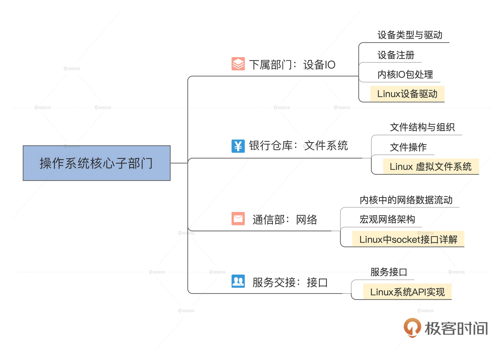
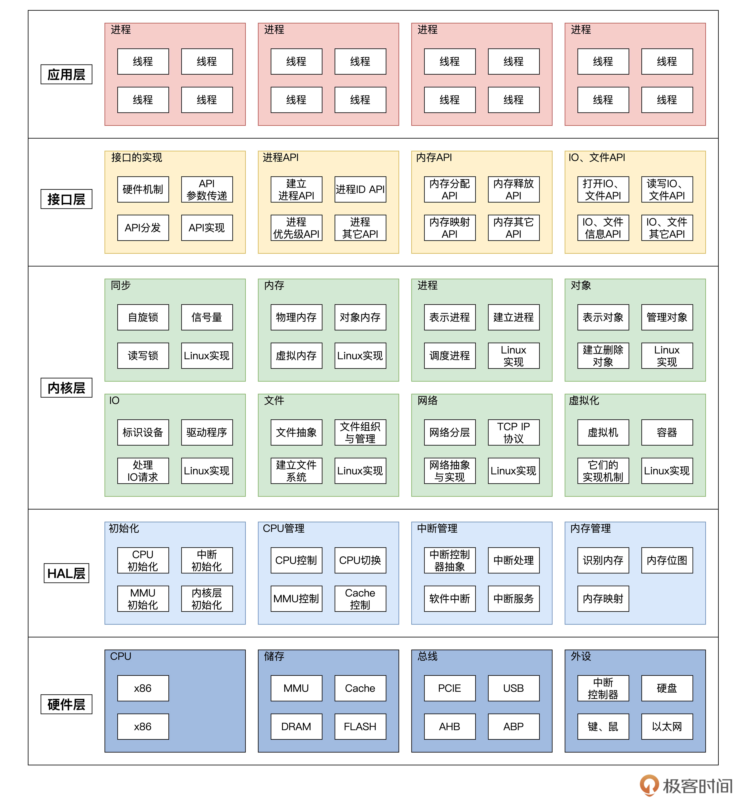

---
date: "2019-06-23"
---  
      
# 开篇词 | 为什么要学写一个操作系统？
你好，我是彭东，网名LMOS，欢迎加入我的专栏，跟我一起开启操作系统的修炼之路。

先来介绍一下我自己。我是Intel 傲腾项目开发者之一，也是《深度探索嵌入式操作系统》这本书的作者。

我曾经为Intel做过内核层面的开发工作，也对Linux、BSD、SunOS等开源操作系统，还有Windows的NT内核很熟悉。这十几年来，我一直专注于操作系统内核研发。

LMOS（基于x86平台支持多进程、多CPU、虚拟化等技术的全64位操作系统内核）跟LMOSEM（基于ARM处理器平台的嵌入式操作系统内核）是我独立开发的两套全新的操作系统内核，其中LMOS的代码规模达到了数十万行，两个系统现在仍在更新。

当时是基于兴趣和学习的目的开始了这两套操作系统，在这个过程中，我遇到了各种各样的技术问题，解决了诸多疑难杂症，总结了大量的开发操作系统的方法和经验。非常希望能在这个专栏与你一起交流。

### 每个工程师都有必要学好操作系统吗？

经常会有同学问我这样一些问题：我是一个做应用层开发的工程师，有必要学习操作系统吗？我的日常工作中，好像用不到什么深奥的操作系统内核知识，而且大学时已经学过了操作系统课程，还有必要再学吗？

对于这些问题，我的答案当然是**“有必要”**。至于理由么，请听我慢慢为你道来。

<!-- [[[read_end]]] -->

你是否也跟我一样，曾经在一个数千万行代码的大项目中茫然失措？一次次徘徊在内存为什么会泄漏、服务进程为什么会dang掉、文件为什么打不开等一系列“基础”问题的漩涡中？

你是否惊叹于Nginx的高并发性？是不是感觉Golang的垃圾回收器真的很垃圾？除了这样的感叹，你也许还好奇过这样一些问题：MySQL的I/O性能还能不能再提升？网络服务为什么会掉线？Redis中经典的Reactor设计模式靠什么技术支撑？Node.js 的 I/O 模型长什么模样……

如果你也追问过上面的这些问题，那这会儿我也差不多可以给充满求知欲的你指一条“明路”了。这些都将在后面的学习中，找到答案。

### 为什么说操作系统很重要？

首先我们都知道，**操作系统是所有软件的基础**，所有上层软件都要依赖于操作系统提供的各种机制，才能运行。

而我在工作中也认识了很多技术大牛，根据我的观察，他们的基本功往往十分扎实，这对他们的架构视野、技术成长都十分有帮助。

如果你是后端工程师，在做高性能服务端编程的时候，内存、进程、线程、I/O相关的知识就会经常用到。还有，在做一些前端层面的性能调优时，操作系统相关的一些知识更是必不可少。

除了Web开发，做高性能计算超级计算机的时候，操作系统内核相关的开发能力也至关重要。其实，即使单纯的操作系统内核相关的开发能力，对于工程师来说也是绕不过的基本功。

对于运维、测试同学，你要维护和测试的任何产品，其实是基于操作系统的。比如给服务配置多大的内存、多大的缓存空间？怎样根据操作系统给出的信息，判断服务器的问题出现在哪里。随着你对操作系统的深入理解和掌握，你才能透过现象看本质，排查监控思路也会更开阔。

除了工作，操作系统离我们的生活也并不遥远，甚至可以说是息息相关。要知道，操作系统其实不仅仅局限于手机和电脑，你的智能手表、机顶盒、路由器，甚至各种家电中都运行着各种各样的操作系统。

可以说，操作系统作为计算机的灵魂，眼前的工作、日常的生活，甚至这个行业未来的“诗与远方”都离不开它。

### 操作系统很难，我能学得会么？

但即使是大学时期就学过操作系统的同学，也可能会感觉学得云里雾里。更别说非科班的一些人，难度更甚，甚至高不可攀。那为什么我这么有信心，给你讲好操作系统这门课呢？这还要从我自己的学习经历说起。

跟许多人一样，我看的第一本C教程就是那本“老谭C”。看了之后，除了能写出那个家喻户晓的“hello world”程序，其它什么也干不了。接着我又开始折腾C++、Java，结果如出一辙，还是只能写个“hello world”程序。

还好我有互联网，它让我发现了数据结构与算法，经过一番学习，后来我总算可以写一些小功能的软件了，但或许那根本就称不上功能。既然如此，我就继续折腾，继续学习微机原理、汇编语言这些内容。

最后我终于发现，**操作系统才是我最想写的软件。**我像着了魔一样，一切操作系统、硬件层相关的书籍都找来看。

有了这么多的“输入”，我就想啊，既然是写操作系统，**为什么不能把这些想法用代码实现出来，放在真正的计算机上验证一下呢？**

LMOS的雏形至此诞生。从第一行引导代码开始，一次又一次代码重构，一次又一次地面对莫名的死机而绝望，倒逼我不断改进，最终才有了现在的LMOS。因为一个人从零开始，独立开发操作系统这种行为有点疯狂，我索性就用LMOS（liberty，madness，operating，system）来命名了我的操作系统。

经过我这几年的独立开发，现在LMOS已经发布了**8个测试版本**。先后从32位单CPU架构发展到64位多CPU架构，现在的LMOS已经是多进程、多线程、多CPU、支持虚拟内存的x86\_64体系下的全64位操作系统内核，代码量已经有**10万多行了**。

后来，我又没忍住自己的好奇心，写了个嵌入式操作系统——LMOSEM。由于有了先前的功底，加上ARM体系很简单，所以我再学习和实现嵌入式操作系统时，就感觉驾轻就熟了。

经过跋山涉水，我再回头来看，很容易就发现了为什么操作系统很难学。

操作系统需要你有大量的知识储备，但是现在大多的课程、学习资料，往往都是根据目前已有的一些操作系统，做局部解读。所以，我们学的时候，前后的知识是无法串联在一起的。结果就会越看越迷惑，不去查吧，看不懂，再去搜索又加重了学习负担，最后只能遗憾放弃。

那怎样学习操作系统才是最高效的呢？理论基础是要补充的，但相对来说，实践更为重要。我认为，千里之行还得始于足下。

所以，通过这个专栏，我会带你从无到有实现一个自己的操作系统。

我会使用大量的插图代码和风趣幽默的段子，来帮助你更好地理解操作系统内核的本质。同时在介绍每个内核组件实现时，都会先给你说明白为什么，带着你基于设计理解去动手实现；然后，再给你详细描述Linux内核对应的实现，做前后对比。这样既能让你边学边练，又能帮你从“上帝视角”审视Linux内核。

### 我们课程怎么安排的？

操作系统作为计算机王国的权力中枢，我们的课程就是讲解如何实现它。

为此，我们将从了解计算机王国的资源开始，如CPU、MMU、内存和Cache。其次要为这个权力中枢设计基本法，即各种同步机制，如信号量与自旋锁。接着进行夺权，从固件程序的手中抢过计算机并进行初始化，其中包含初始化CPU、内存、中断、显示等。

然后，开始建设中枢的各级部门，它们分别是内存管理部门、进程管理部门、I/O管理部门、文件管理部门、通信管理部门。最后将这些部门组合在一起，就形成了计算机王国的权力中枢——操作系统。

我们的课程就是按照上述逻辑，依次为你讲解这些部门的实现过程和细节。每节课都配有可以工作的代码，让你能跟着课程一步步实现。你也可以直接使用我提供的[代码](https://gitee.com/lmos/cosmos)一步步调试，直到最终实现一个基于x86平台的64位多进程的操作系统——**Cosmos**。

### 你能获得什么？

走这样一条“明路”，一步一个脚印，最终你会到达这样一个目的地：拥有一个属于自己的操作系统内核，同时收获对Linux内核更深入的理解。

学完这门课，你会明显提升操作系统架构设计能力，并且可以学会系统级别的软件编程技巧。我相信，这对你拓展技术深度和广度是大有裨益的。之后你在日常开发中遇到问题的时候，就可以尝试用更多维度的能力去解决问题了。

同时，由于操作系统内核是有核心竞争力的高技术含量软件，这能给你职业生涯的成长带来长远的帮助。如今，在任何一家中大型互联网公司都使用大量的Linux服务器。

操作系统相关的内容，已经成为你涨薪、晋升的必考项，比如 Linux 内核相关的技术，中断、I/O、网络、多线程、并发、性能、内存管理、系统稳定性、文件系统、容器和虚拟化等等，这些核心知识都来源于操作系统。

而跳出个人，从大局观出发的话，计算机作为20世纪以来人类最伟大的发明之一，已经深入人们生活的方方面面，而计算机系统作为国家级战略基础软件，却受制于人，这关系到整个国家的信息安全，也关系到互联网信息行业以及其它相关基础行业的前途和未来。

而要改变这一困局，就要从培养技术人才开始。对于我们工程师来说，树高叶茂，系于根深，只有不断升级自己的认知，才能让你的技术之路行稳致远。

下面，我给出一个简化的操作系统知识体系图，也是后面课程涉及到的所有知识点。尽管图中只是最简短的一些词汇，但随着课程的展开，你会发现图中的每一小块，都犹如一片汪洋。

现在让我们一起带着好奇，带着梦想，向星辰大海进发！

订阅后，[点此加入](https://jinshuju.net/f/I8cmAO)彭东老师的课程交流群。