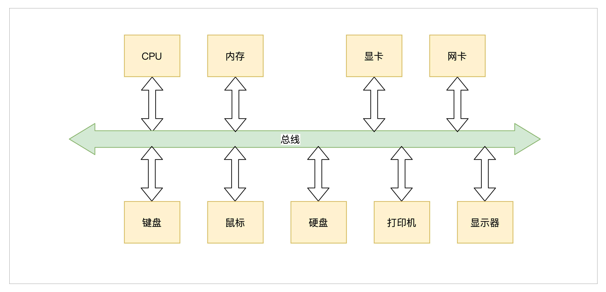

---
date: "2019-06-23"
---  
      
# 03 | 黑盒之中有什么：内核结构与设计
你好，我是LMOS。

在上节课中，我们写了一个极简的操作系统——Hello OS，并成功运行，直观地感受了一下自己控制计算机的乐趣，或许你正沉浸在这种乐趣之中，但我不得不提醒你赶快从这种快乐中走出来。

因为我们的Hello OS虽然能使计算机运行起来，但其实没有任何实际的功能。

什么？没有实际功能，我们往里增加功能不就好了吗？

你可能会这样想，但是这样想就草率了，开发操作系统内核（以下简称内核）就像建房子一样，房子要建得好，就先要设计。比如用什么结构，什么材料，房间怎么布局，电路、水路等，最后画出设计图纸，依据图纸按部就班地进行建造。

而一个内核的复杂程度要比房子的复杂程度高出几个数量级，所以在开发内核之前先要对其进行设计。

下面我们就先搞清楚内核之中有些什么东西，然后探讨一下怎么组织它们、用什么架构来组织、并对比成熟的架构，最后设计出我们想要的内核架构。

## 黑盒之中有什么

从用户和应用程序的角度来看，内核之中有什么并不重要，能提供什么服务才是重要的，所以内核在用户和上层应用眼里，就像一个大黑盒，至于黑盒里面有什么，怎么实现的，就不用管了。

不过，作为内核这个黑盒的开发者，我们要实现它，就必先设计它，而要设计它，就必先搞清楚内核中有什么。

<!-- [[[read_end]]] -->

从抽象角度来看，内核就是计算机资源的管理者，当然管理资源是为了让应用使用资源。既然内核是资源的管理者，我们先来看看计算机中有哪些资源，然后通过资源的归纳，就能推导出内核这个大黑盒中应该有什么。

计算机中资源大致可以分为两类资源，一种是硬件资源，一种是软件资源。先来看看硬件资源有哪些，如下：

1.总线，负责连接各种其它设备，是其它设备工作的基础。  
2.CPU，即中央处理器，负责执行程序和处理数据运算。  
3.内存，负责储存运行时的代码和数据。  
4.硬盘，负责长久储存用户文件数据。  
5.网卡，负责计算机与计算机之间的通信。  
6.显卡，负责显示工作。  
7.各种I/O设备，如显示器，打印机，键盘，鼠标等。

下面给出一幅经典的计算机内部结构图，如下：

而计算机中的软件资源，则可表示为计算机中的各种形式的数据。如各种文件、软件程序等。

内核作为硬件资源和软件资源的管理者，其内部组成在逻辑上大致如下：

1.**管理CPU，**由于CPU是执行程序的，而内核把运行时的程序抽象成进程，所以又称为进程管理。  
2.**管理内存**，由于程序和数据都要占用内存，内存是非常宝贵的资源，所以内核要非常小心地分配、释放内存。  
3.**管理硬盘**，而硬盘主要存放用户数据，而内核把用户数据抽象成文件，即管理文件，文件需要合理地组织，方便用户查找和读写，所以形成了文件系统。  
4.**管理显卡**，负责显示信息，而现在操作系统都是支持GUI（图形用户接口）的，管理显卡自然而然地就成了内核中的图形系统。  
5.**管理网卡**，网卡主要完成网络通信，网络通信需要各种通信协议，最后在内核中就形成了网络协议栈，又称网络组件。  
6.**管理各种I/O设备**，我们经常把键盘、鼠标、打印机、显示器等统称为I/O（输入输出）设备，在内核中抽象成I/O管理器。

内核除了这些必要组件之外，根据功能不同还有安全组件等，最值得一提的是，各种计算机硬件的性能不同，硬件型号不同，硬件种类不同，硬件厂商不同，内核要想管理和控制这些硬件就要编写对应的代码，通常这样的代码我们称之为**驱动程序**。

硬件厂商就可以根据自己不同的硬件编写不同的驱动，加入到内核之中。

以上我们已经大致知道了内核之中有哪些组件，但是另一个问题又出现了，即如何组织这些组件，让系统更加稳定和高效，这就需要我们从现有的一些**经典内核结构**里找灵感了。

## 宏内核结构

其实看这名字，就已经能猜到了，宏即大也，这种最简单适用，也是最早的一种内核结构。

宏内核就是把以上诸如管理进程的代码、管理内存的代码、管理各种I/O设备的代码、文件系统的代码、图形系统代码以及其它功能模块的代码，把这些所有的代码经过编译，最后链接在一起，形成一个大的可执行程序。

这个大程序里有实现支持这些功能的所有代码，向用户应用软件提供一些接口，这些接口就是常说的系统API函数。而这个大程序会在处理器的特权模式下运行，这个模式通常被称为宏内核模式。结构如下图所示。

尽管图中一层一层的，这并不是它们有层次关系，仅仅表示它们链接在一起。

为了理解宏内核的工作原理，我们来看一个例子，宏内核提供内存分配功能的服务过程，具体如下：

1.应用程序调用内存分配的API（应用程序接口）函数。  
2.处理器切换到特权模式，开始运行内核代码。  
3.内核里的内存管理代码按照特定的算法，分配一块内存。  
4.把分配的内存块的首地址，返回给内存分配的API函数。  
5.内存分配的API函数返回，处理器开始运行用户模式下的应用程序，应用程序就得到了一块内存的首地址，并且可以使用这块内存了。

上面这个过程和一个实际的操作系统中的运行过程，可能有差异，但大同小异。当然，系统API和应用程序之间可能还有库函数，也可能只是分配了一个虚拟地址空间，但是我们关注的只是这个过程。

上图的宏内核结构有明显的缺点，因为它没有模块化，没有扩展性、没有移植性，高度耦合在一起，一旦其中一个组件有漏洞，内核中所有的组件可能都会出问题。

开发一个新的功能也得重新编译、链接、安装内核。其实现在这种原始的宏内核结构已经没有人用了。这种宏内核唯一的优点是性能很好，因为在内核中，这些组件可以互相调用，性能极高。

为了方便我们了解不同内核架构间的优缺点，下面我们看一个和宏内核结构对应的反例。

## 微内核结构

微内核架构正好与宏内核架构相反，它提倡内核功能尽可能少：仅仅只有进程调度、处理中断、内存空间映射、进程间通信等功能（目前不懂没事，这是属于管理进程和管理内存的功能模块，后面课程里还会专门探讨的）。

这样的内核是不能完成什么实际功能的，开发者们把实际的进程管理、内存管理、设备管理、文件管理等服务功能，做成一个个服务进程。和用户应用进程一样，只是它们很特殊，宏内核提供的功能，在微内核架构里由这些服务进程专门负责完成。

微内核定义了一种良好的进程间通信的机制——**消息**。应用程序要请求相关服务，就向微内核发送一条与此服务对应的消息，微内核再把这条消息转发给相关的服务进程，接着服务进程会完成相关的服务。服务进程的编程模型就是循环处理来自其它进程的消息，完成相关的服务功能。其结构如下所示：

为了理解微内核的工程原理，我们来看看微内核提供内存分配功能的服务过程，具体如下：

1.应用程序发送内存分配的消息，这个发送消息的函数是微内核提供的，相当于系统API，微内核的API（应用程序接口）相当少，极端情况下仅需要两个，一个接收消息的API和一个发送消息的API。  
2.处理器切换到特权模式，开始运行内核代码。  
3.微内核代码让当前进程停止运行，并根据消息包中的数据，确定消息发送给谁，分配内存的消息当然是发送给内存管理服务进程。  
4.内存管理服务进程收到消息，分配一块内存。  
5.内存管理服务进程，也会通过消息的形式返回分配内存块的地址给内核，然后继续等待下一条消息。  
6.微内核把包含内存块地址的消息返回给发送内存分配消息的应用程序。  
7.处理器开始运行用户模式下的应用程序，应用程序就得到了一块内存的首地址，并且可以使用这块内存了。

微内核的架构实现虽然不同，但是大致过程和上面一样。同样是分配内存，在微内核下拐了几个弯，一来一去的消息带来了非常大的开销，当然各个服务进程的切换开销也不小。这样系统性能就大打折扣。

但是微内核有很多优点，首先，系统结构相当清晰利于协作开发。其次，系统有良好的移植性，微内核代码量非常少，就算重写整个内核也不是难事。最后，微内核有相当好的伸缩性、扩展性，因为那些系统功能只是一个进程，可以随时拿掉一个服务进程以减少系统功能，或者增加几个服务进程以增强系统功能。

微内核的代表作有MACH、MINIX、L4系统，这些系统都是微内核，但是它们不是商业级的系统，商业级的系统不采用微内核主要还是因为性能差。

好了，粗略了解了宏内核和微内核两大系统内核架构的优、缺点，以后设计我们自己的系统内核时，心里也就有了底了，到时就可以扬长避短了，下面我们先学习一点其它的东西，即分离硬件相关性，为设计出我们自己的内核架构打下基础。

## 分离硬件的相关性

我们会经常听说，Windows内核有什么HAL层、Linux内核有什么arch层。这些xx层就是Windows和Linux内核设计者，给他们的系统内核分的第一个层。

今天如此庞杂的计算机，其实也是一层一层地构建起来的，从硬件层到操作系统层再到应用软件层这样构建。分层的主要目的和好处在于**屏蔽底层细节，使上层开发更加简单。**

计算机领域的一个基本方法是增加一个抽象层，从而使得抽象层的上下两层独立地发展，所以在内核内部再分若干层也不足为怪。

分离硬件的相关性，就是要把操作硬件和处理硬件功能差异的代码抽离出来，形成一个独立的**软件抽象层**，对外提供相应的接口，方便上层开发。

为了让你更好理解，我们举进程管理中的一个模块实现细节的例子：进程调度模块。通过这个例子，来看看分层对系统内核的设计与开发有什么影响。

一般操作系统理论课程都会花大量篇幅去讲进程相关的概念，其实说到底，进程是操作系统开发者为了实现多任务而提出的，并让每个进程在CPU上运行一小段时间，这样就能实现多任务同时运行的假象。

当然，这种假象十分奏效。要实现这种假象，就要实现下面这两种机制：

1.**进程调度**，它的目的是要从众多进程中选择一个将要运行的进程，当然有各种选择的算法，例如，轮转算法、优先级算法等。  
2.**进程切换**，它的目的是停止当前进程，运行新的进程，主要动作是保存当前进程的机器上下文，装载新进程的机器上下文。

我们不难发现，不管是在ARM硬件平台上还是在x86硬件平台上，选择一个进程的算法和代码是不容易发生改变的，需要改变的代码是进程切换的相关代码，因为不同的硬件平台的机器上下文是不同的。

所以，这时最好是将进程切换的代码放在一个独立的层中实现，比如硬件平台相关层，当操作系统要运行在不同的硬件平台上时，就只是需要修改硬件平台相关层中的相关代码，这样操作系统的**移植性**就大大增强了。

如果把所有硬件平台相关的代码，都抽离出来，放在一个独立硬件相关层中实现并且定义好相关的调用接口，再在这个层之上开发内核的其它功能代码，就会方便得多，结构也会清晰很多。操作系统的移植性也会大大增强，移植到不同的硬件平台时，就构造开发一个与之对应的硬件相关层。这就是分离硬件相关性的好处。

## 我们的选择

从前面内容中，我们知道了内核必须要完成的功能，宏内核架构和微内核架构各自的优、缺点，最后还分析了分离硬件相关层的重要性，其实说了这么多，就是为了设计我们自己的操作系统内核。

虽然前面的内容，对操作系统设计这个领域还远远不够，但是对于我们自己从零开始的操作系统内核这已经够了。

首先大致将我们的操作系统内核分为三个大层，分别是：

1.内核接口层。  
2.内核功能层。  
3.内核硬件层。

内核接口层，定义了一系列接口，主要有两点内容，如下：

1.定义了一套UNIX接口的子集，我们出于学习和研究的目的，使用UNIX接口的子集，优点之一是接口少，只有几个，并且这几个接口又能大致定义出操作系统的功能。  
2.这套接口的代码，就是检查其参数是否合法，如果参数有问题就返回相关的错误，接着调用下层完成功能的核心代码。

内核功能层，主要完成各种实际功能，这些功能按照其类别可以分成各种模块，当然这些功能模块最终会用具体的算法、数据结构、代码去实现它，内核功能层的模块如下：

1.进程管理，主要是实现进程的创建、销毁、调度进程，当然这要设计几套数据结构用于表示进程和组织进程，还要实现一个简单的进程调度算法。  
2.内存管理，在内核功能层中只有内存池管理，分两种内存池：页面内存池和任意大小的内存池，你现在可能不明白什么是内存池，这里先有个印象就行，后面课程研究它的时候再详细介绍。  
3.中断管理，这个在内核功能层中非常简单：就是把一个中断回调函数安插到相关的数据结构中，一旦发生相关的中断就会调用这个函数。  
4.设备管理，这个是最难的，需要用一系列的数据结构表示驱动程序模块、驱动程序本身、驱动程序创建的设备，最后把它们组织在一起，还要实现创建设备、销毁设备、访问设备的代码，这些代码最终会调用设备驱动程序，达到操作设备的目的。

内核硬件层，主要包括一个具体硬件平台相关的代码，如下：

1.初始化，初始化代码是内核被加载到内存中最先需要运行的代码，例如初始化少量的设备、CPU、内存、中断的控制、内核用于管理的数据结构等。  
2\. CPU控制，提供CPU模式设定、开、关中断、读写CPU特定寄存器等功能的代码。  
3.中断处理，保存中断时机器的上下文，调用中断回调函数，操作中断控制器等。  
4.物理内存管理，提供分配、释放大块内存，内存空间映射，操作MMU、Cache等。  
5.平台其它相关的功能，有些硬件平台上有些特殊的功能，需要额外处理一下。

如果上述文字让你看得头晕，我们来画幅图，可能就会好很多，如下所示，当然这里没有画出用户空间的应用进程，**API接口以下的为内核空间，这才是设计、开发内核的重点。**

从上述文字和图示，可以发现，我们的操作系统内核没有任何设备驱动程序，甚至没有文件系统和网络组件，内核所实现的功能很少。这吸取了微内核的优势，内核小出问题的可能性就少，扩展性就越强。

同时，我们把文件系统、网络组件、其它功能组件作为虚拟设备交由设备管理，比如需要文件系统时就写一个文件系统虚拟设备的驱动，完成文件系统的功能，需要网络时就开发一个网络虚拟设备的驱动，完成网络功能。

这些驱动一旦被装载，就是内核的一部分了，并不是像微内核一样作为服务进程运行。这又吸取了宏内核的优势，代码高度耦合，性能强劲。

这样的内核架构既不是宏内核架构也不是微内核架构，而是这两种架构综合的结果，可以说是混合内核架构，也可以说这是我们自己的内核架构……

好了，到这里为止，我们已经设计了内核，确定了内核的功能并且设计了一种内核架构用来组织这些功能，这离完成我们自己的操作系统内核又进了一步。

## 重点回顾

内核设计真是件让人兴奋的事情，今天的内容讲完了，我们先停下赶路的脚步，回过头来看一看这一节课我们学到了什么。

我们一开始感觉内核是个大黑盒，但通过分析通用计算机有哪些资源，就能推导出内核作为资源管理者应该有这些组件：I/O管理组件、内存管理组件、文件系统组件、进程管理组件、图形系统组件、网络组件、安全组件等。

接着，我们探讨了用两种结构来组织这些组件，这两种结构分别是宏内核结构和微内核结构，知道了他们各自的优缺点，**宏内核有极致的性能，微内核有极致的可移植性、可扩展性。**还弄清楚了它们各自完成应用程序服务的机制与流程。

然后，我们研究了分层的重要性，为什么分离硬件相关性。用实例说明了分离硬件相关性的好处，这是为了更容易扩展和移植。

最后，在前面的基础上，我们为自己的内核设计作出了选择。

我们的内核结构分为三层：内核硬件层，内核功能层，内核接口层，内核接口层主要是定义了一套UNIX接口的子集，内核功能层主要完成I/O管理组件、内存管理组件、文件系统组件、进程管理组件、图形系统组件、网络组件、安全组件的通用功能型代码；内核硬件层则完成其内核组件对应的具体硬件平台相关的代码。

## 思考题

其实我们的内核架构不是我们首创的，它是属于微内核、宏内核之外的第三种架构，请问这是什么架构？

欢迎你在留言区跟我交流互动。如果这节课对你有启发，也欢迎分享给你的朋友或同事。