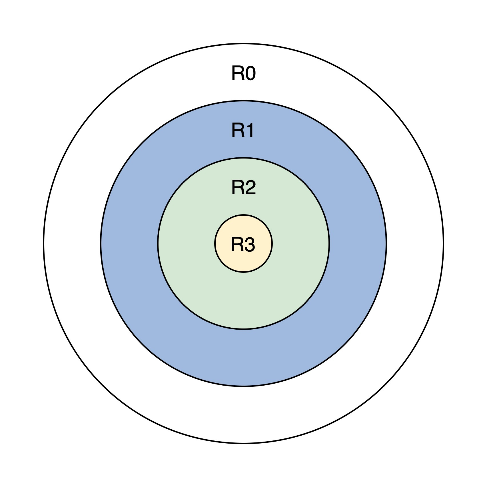
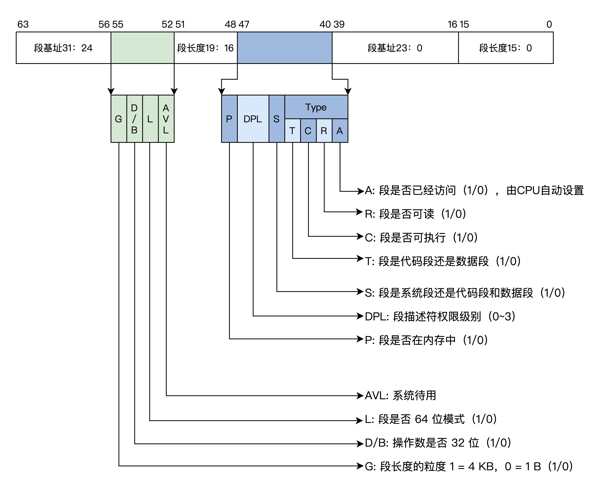
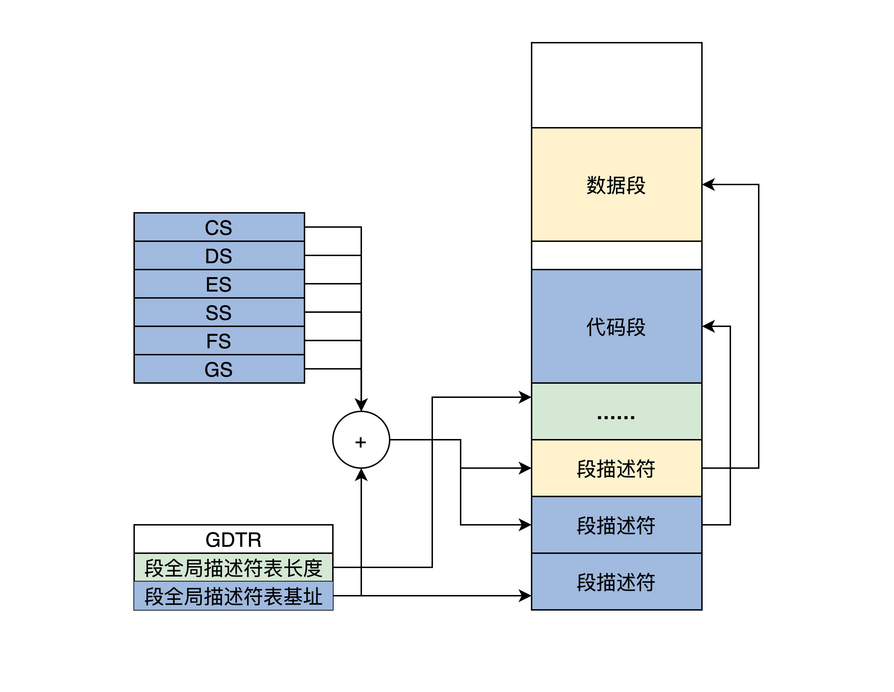
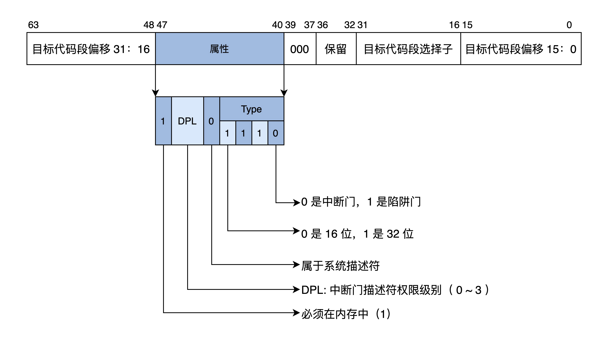
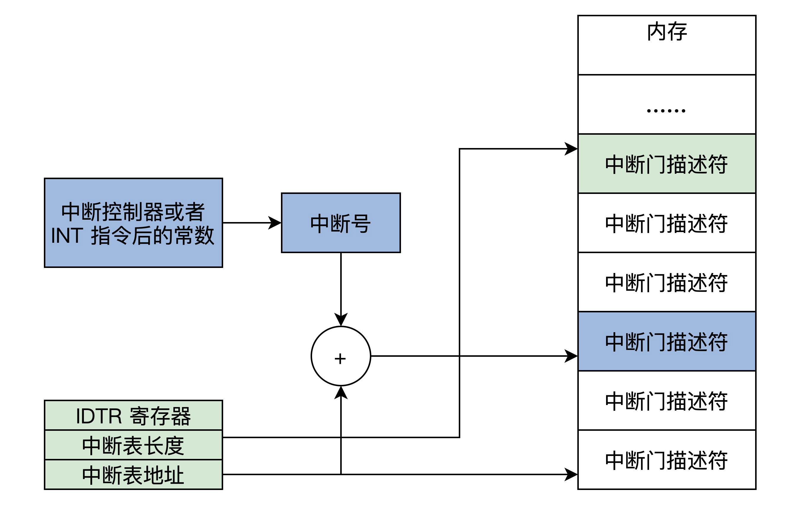
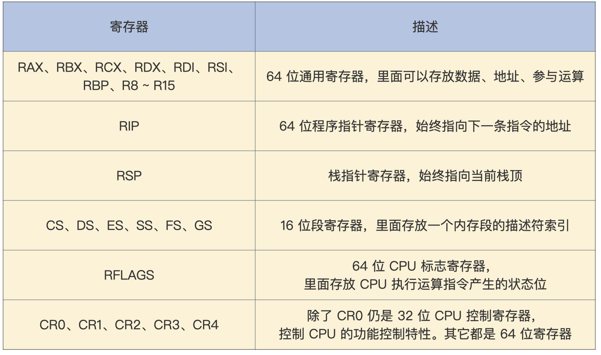
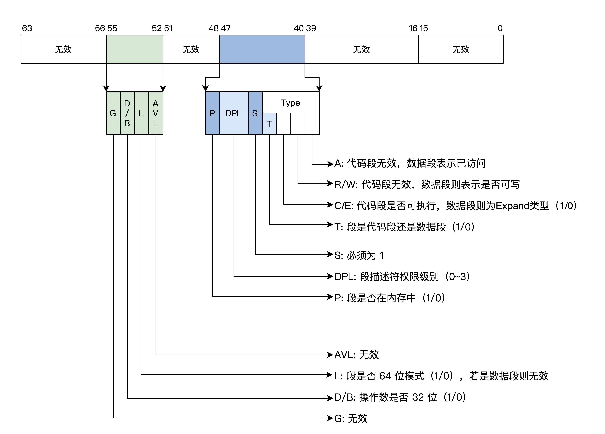
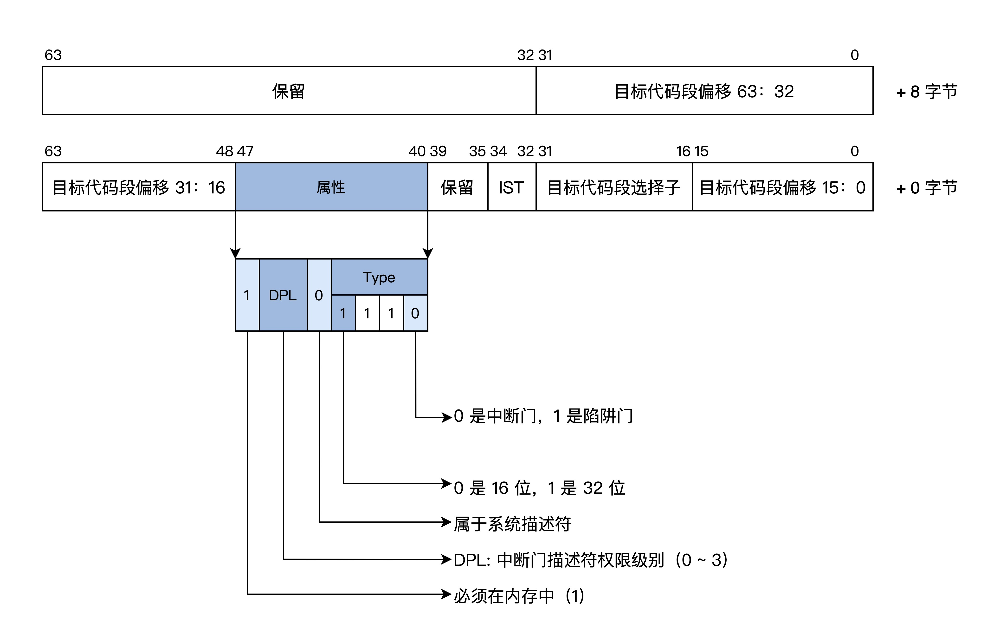

---
date: "2019-06-23"
---  
      
# 05 | CPU工作模式：执行程序的三种模式
你好，我是LMOS。

我们在前面已经设计了我们的OS架构，你也许正在考虑怎么写代码实现它。恕我直言，现在我们还有很多东西没搞清楚。

由于OS内核直接运行在硬件之上，所以我们要对运行我们代码的硬件平台有一定的了解。接下来，我会通过三节课，带你搞懂硬件平台的关键内容。

今天我们先来学习CPU的工作模式，硬件中最重要的就是CPU，它就是执行程序的核心部件。而我们常用的电脑就是x86平台，所以我们要对x86 CPU有一些基本的了解。

按照CPU功能升级迭代的顺序，CPU的工作模式有**实模式**、**保护模式**、**长模式**，这几种工作模式下CPU执行程序的方式截然不同，下面我们一起来探讨这几种工作模式。

## 从一段死循环的代码说起

请思考一下，如果下面这段应用程序代码能够成功运行，会有什么后果？

```
    int main()
    {
        int* addr = (int*)0;
        cli(); //关中断
        while(1)
        {
            *addr = 0;
            addr++;
        }
        return 0;
    }
    

```

上述代码首先关掉了CPU中断，让CPU停止响应中断信号，然后进入死循环，最后从内存0地址开始写入0。你马上就会想到，这段代码只做了两件事：一是锁住了CPU，二是清空了内存，你也许会觉得如果这样的代码能正常运行，那简直太可怕了。

不过如果是在实模式下，这样的代码确实是能正常运行。因为在很久以前，计算机资源太少，内存太小，都是单道程序执行，程序大多是由专业人员编写调试好了，才能预约到一个时间去上机运行，没有现代操作系统的概念。

<!-- [[[read_end]]] -->

后来有DOS操作系统，也是单道程序系统，不具备执行多道程序的能力，所以CPU这种模式也能很好地工作。

下面我们就从最简单，也是最原始的实模式开始讲起。

## 实模式

实模式又称实地址模式，实，即真实，这个真实分为两个方面，一个方面是**运行真实的指令**，对指令的动作不作区分，直接**执行指令的真实功能**，另一方面是**发往内存的地址是真实的**，对任何地址**不加限制**地发往内存。

### 实模式寄存器

由于CPU是根据指令完成相应的功能，举个例子：ADD AX,CX；这条指令完成加法操作，AX、CX为ADD指令的操作数，可以理解为ADD函数的两个参数，其功能就是把AX、CX中的数据相加。

指令的操作数，可以是寄存器、内存地址、常数，其实通常情况下是寄存器，AX、CX就是x86 CPU中的寄存器。

下面我们就去看看x86 CPU在实模式下的寄存器。表中每个寄存器都是16位的。


### 实模式下访问内存

虽然有了寄存器，但是数据和指令都是存放在内存中的。通常情况下，需要把数据装载进寄存器中才能操作，还要有获取指令的动作，这些都要访问内存才行，而我们知道访问内存靠的是地址值。

那问题来了，这个值是如何计算的呢？计算过程如下图。


结合上图可以发现，所有的内存地址都是由段寄存器左移4位，再加上一个通用寄存器中的值或者常数形成地址，然后由这个地址去访问内存。这就是大名鼎鼎的分段内存管理模型。

只不过这里要特别注意的是，**代码段是由CS和IP确定的，而栈段是由SS和SP段确定的。**

下面我们写一个DOS下的Hello World应用程序，这是一个工作在实模式下的汇编代码程序，一共16位，具体代码如下：

```
    data SEGMENT ;定义一个数据段存放Hello World!
        hello  DB 'Hello World!$' ;注意要以$结束
    data ENDS
    code SEGMENT ;定义一个代码段存放程序指令
        ASSUME CS:CODE,DS:DATA ;告诉汇编程序，DS指向数据段，CS指向代码段
    start:
        MOV AX,data  ;将data段首地址赋值给AX                
        MOV DS,AX    ;将AX赋值给DS，使DS指向data段
        LEA DX,hello ;使DX指向hello首地址
        MOV AH,09h   ;给AH设置参数09H，AH是AX高8位，AL是AX低8位，其它类似
        INT 21h      ;执行DOS中断输出DS指向的DX指向的字符串hello
        MOV AX,4C00h ;给AX设置参数4C00h
        INT 21h      ;调用4C00h号功能，结束程序
    code ENDS
    END start
    

```

上述代码中的结构模型，也是符合CPU实模式下分段内存管理模式的，它们被汇编器转换成二进制数据后，也是以段的形式存在的。

代码中的注释已经很明确了，你应该很容易就能理解，大多数是操作寄存器，其中LEA是取地址指令，MOV是数据传输指令，就是INT中断你可能还不太明白，下面我们就来研究它。

### 实模式中断

中断即中止执行当前程序，转而跳转到另一个特定的地址上，去运行特定的代码。在实模式下它的实现过程是先保存CS和IP寄存器，然后装载新的CS和IP寄存器，那么中断是如何产生的呢？

第一种情况是，中断控制器给CPU发送了一个电子信号，CPU会对这个信号作出应答。随后中断控制器会将中断号发送给CPU，这是**硬件中断**。

第二种情况就是CPU执行了**INT指令**，这个指令后面会跟随一个常数，这个常数即是软中断号。这种情况是软件中断。

无论是硬件中断还是软件中断，都是CPU响应外部事件的一种方式。

为了实现中断，就需要在内存中放一个中断向量表，这个表的地址和长度由CPU的特定寄存器IDTR指向。实模式下，表中的一个条目由代码段地址和段内偏移组成，如下图所示。


有了中断号以后，CPU就能根据IDTR寄存器中的信息，计算出中断向量中的条目，进而装载CS（装入代码段基地址）、IP（装入代码段内偏移）寄存器，最终响应中断。

## 保护模式

随着软件的规模不断增加，需要更高的计算量、更大的内存容量。

内存一大，首先要解决的问题是**寻址问题**，因为16位的寄存器最多只能表示\$2\^\{16\}\$个地址，所以CPU的寄存器和运算单元都要扩展成32位的。

不过，虽然扩展CPU内部器件的位数解决了计算和寻址问题，但仍然没有解决前面那个实模式场景下的问题，导致前面场景出问题的原因有两点。第一，CPU对任何指令不加区分地执行；第二，CPU对访问内存的地址不加限制。

基于这些原因，CPU实现了保护模式。保护模式是如何实现保护功能的呢？我们接着往下看。

### 保护模式寄存器

保护模式相比于实模式，增加了一些控制寄存器和段寄存器，扩展通用寄存器的位宽，所有的通用寄存器都是32位的，还可以单独使用低16位，这个低16位又可以拆分成两个8位寄存器，如下表。


### 保护模式特权级

为了区分哪些指令（如in、out、cli）和哪些资源（如寄存器、I/O端口、内存地址）可以被访问，CPU实现了特权级。

特权级分为4级，R0\~R3，每个特权级执行指令的数量不同，R0可以执行所有指令，R1、R2、R3依次递减，它们只能执行上一级指令数量的子集。而内存的访问则是靠后面所说的段描述符和特权级相互配合去实现的。如下图.



**上面的圆环图，从外到内，既能体现权力的大小，又能体现各特权级对资源控制访问的多少，还能体现各特权级之间的包含关系。**R0拥有最大权力，可以访问低特权级的资源，反之则不行。

### 保护模式段描述符

目前为止，内存还是分段模型，要对内存进行保护，就可以转换成对段的保护。

由于CPU的扩展导致了32位的段基地址和段内偏移，还有一些其它信息，所以16位的段寄存器肯定放不下。放不下就要找内存借空间，然后把描述一个段的信息封装成特定格式的**段描述符**，**放在内存中**，其格式如下。



一个段描述符有64位8字节数据，里面包含了段基地址、段长度、段权限、段类型（可以是系统段、代码段、数据段）、段是否可读写，可执行等。虽然数据分布有点乱，这是由于历史原因造成的。

多个段描述符在内存中形成全局段描述符表，该表的基地址和长度由CPU和GDTR寄存器指示。如下图所示。



我们一眼就可以看出，段寄存器中不再存放段基地址，而是具体段描述符的索引，访问一个内存地址时，段寄存器中的索引首先会结合GDTR寄存器找到内存中的段描述符，再根据其中的段信息判断能不能访问成功。

### 保护模式段选择子

如果你认为CS、DS、ES、SS、FS、GS这些段寄存器，里面存放的就是一个内存段的描述符索引，那你可就草率了，其实它们是由影子寄存器、段描述符索引、描述符表索引、权限级别组成的。如下图所示。


上图中**影子寄存器**是靠硬件来操作的，对系统程序员不可见，是硬件为了**减少性能损耗**而设计的一个段描述符的高速缓存，不然每次内存访问都要去内存中查表，那性能损失是巨大的，影子寄存器也正好是64位，里面存放了8字节段描述符数据。

低三位之所以能放TI和RPL，是因为段描述符8字节对齐，每个索引低3位都为0，我们不用关注LDT，只需要使用GDT全局描述符表，所以TI永远设为0。

通常情况下，CS和SS中RPL就组成了CPL（当前权限级别），所以常常是RPL=CPL，进而CPL就表示发起访问者要以什么权限去访问目标段，当CPL大于目标段DPL时，则CPU禁止访问，只有CPL小于等于目标段DPL时才能访问。

### 保护模式平坦模型

分段模型有很多缺陷，这在后面课程讲内存管理时有详细介绍，其实现代操作系统都会使用分页模型（这点在后面讲MMU那节课再探讨）。

但是x86 CPU并不能直接使用分页模型，而是要在分段模型的前提下，根据需要决定是否要开启分页。因为这是硬件的规定，程序员是无法改变的。但是我们可以简化设计，来使分段成为一种“虚设”，这就是保护模式的平坦模型。

根据前面的描述，我们发现CPU32位的寄存器最多只能产生4GB大小的地址，而一个段长度也只能是4GB，所以我们把所有段的基地址设为0，段的长度设为0xFFFFF，段长度的粒度设为4KB，这样所有的段都指向同一个（（段的长度+1）\* 粒度 \- 1）字节大小的地址空间。

下面我们还是看一看前面Hello OS中段描述符表，如下所示。

```
    GDT_START:
    knull_dsc: dq 0
    ;第一个段描述符CPU硬件规定必须为0
    kcode_dsc: dq 0x00cf9e000000ffff
    ;段基地址=0，段长度=0xfffff
    ;G=1,D/B=1,L=0,AVL=0 
    ;P=1,DPL=0,S=1
    ;T=1,C=1,R=1,A=0
    kdata_dsc: dq 0x00cf92000000ffff
    ;段基地址=0，段长度=0xfffff
    ;G=1,D/B=1,L=0,AVL=0 
    ;P=1,DPL=0,S=1
    ;T=0,C=0,R=1,A=0
    GDT_END:
    
    GDT_PTR:
    GDTLEN	dw GDT_END-GDT_START-1
    GDTBASE	dd GDT_START
    

```

上面代码中注释已经很明白了，段长度需要和G位配合，若G位为1则段长度等于0xfffff个4KB。上面段描述符的DPL=0，这说明需要最高权限即CPL=0才能访问。

### 保护模式中断

你还记得实模式下CPU是如何处理中断的吗？如果不记得了请回到前面看一看。

因为实模式下CPU不需要做权限检查，所以它可以直接通过中断向量表中的值装载CS:IP寄存器就好了。

而保护模式下的中断要权限检查，还有特权级的切换，所以就需要扩展中断向量表的信息，即每个中断用一个中断门描述符来表示，也可以简称为中断门，中断门描述符依然有自己的格式，如下图所示。



同样的，保护模式要实现中断，也必须在内存中有一个中断向量表，同样是由IDTR寄存器指向，只不过中断向量表中的条目变成了中断门描述符，如下图所示。



产生中断后，CPU首先会检查中断号是否大于**最后一个中断门描述符**，x86 CPU最大支持256个中断源（即中断号：0\~255），然后检查描述符类型（是否是中断门或者陷阱门）、是否为系统描述符，是不是存在于内存中。

接着，检查中断门描述符中的段选择子指向的段描述符。

最后做**权限检查**，如果CPL小于等于中断门的DPL，并且CPL大于等于中断门中的段选择子所指向的段描述符的DPL，就指向段描述符的DPL。

进一步的，CPL等于中断门中的段选择子指向段描述符的DPL，则为同级权限不进行栈切换，否则进行栈切换。如果进行栈切换，还需要从TSS中加载具体权限的SS、ESP，当然也要对SS中段选择子指向的段描述符进行检查。

做完这一系列检查之后，CPU才会加载中断门描述符中目标代码段选择子到CS寄存器中，把目标代码段偏移加载到EIP寄存器中。

### 切换到保护模式

x86 CPU在第一次加电和每次reset后，都会自动进入实模式，要想进入保护模式，就需要程序员写代码实现从实模式切换到保护模式。切换到保护模式的步骤如下。

第一步，准备全局段描述符表，代码如下。

```
    GDT_START:
    knull_dsc: dq 0
    kcode_dsc: dq 0x00cf9e000000ffff
    kdata_dsc: dq 0x00cf92000000ffff
    GDT_END:
    GDT_PTR:
    GDTLEN	dw GDT_END-GDT_START-1
    GDTBASE	dd GDT_START
    

```

第二步，加载设置GDTR寄存器，使之指向全局段描述符表。

```
    lgdt [GDT_PTR]
    

```

第三步，设置CR0寄存器，开启保护模式。

```
    ;开启 PE
    mov eax, cr0
    bts eax, 0                      ; CR0.PE =1
    mov cr0, eax         
    

```

第四步，进行长跳转，加载CS段寄存器，即段选择子。

```
    jmp dword 0x8 :_32bits_mode ;_32bits_mode为32位代码标号即段偏移
    

```

你也许会有疑问，为什么要进行长跳转，这是因为我们无法直接或间接mov一个数据到CS寄存器中，因为刚刚开启保护模式时，CS的影子寄存器还是实模式下的值，所以需要告诉CPU加载新的段信息。

接下来，CPU发现了CRO寄存器第0位的值是1，就会按GDTR的指示找到全局描述符表，然后根据索引值8，把新的段描述符信息加载到CS影子寄存器，当然这里的前提是进行一系列合法的检查。

到此为止，CPU真正进入了保护模式，CPU也有了32位的处理能力。

## 长模式

长模式又名AMD64，因为这个标准是AMD公司最早定义的，它使CPU在现有的基础上有了64位的处理能力，既能完成64位的数据运算，也能寻址64位的地址空间。这在大型计算机上犹为重要，因为它们的物理内存通常有几百GB。

### 长模式寄存器

长模式相比于保护模式，增加了一些通用寄存器，并扩展通用寄存器的位宽，所有的通用寄存器都是64位，还可以单独使用低32位。

这个低32位可以拆分成一个低16位寄存器，低16位又可以拆分成两个8位寄存器，如下表。



### 长模式段描述符

长模式依然具备保护模式绝大多数特性，如特权级和权限检查。相同的部分就不再重述了，这里只会说明长模式和保护模式下的差异。

下面我们来看看长模式下段描述的格式，如下图所示。  


在长模式下，CPU不再对段基址和段长度进行检查，只对DPL进行相关的检查，这个检查流程和保护模式下一样。

当描述符中的L=1，D/B=0时，就是64位代码段，DPL还是0\~3的特权级。然后有多个段描述在内存中形成一个全局段描述符表，同样由CPU的GDTR寄存器指向。

下面我们来写一个长模式下的段描述符表，加深一下理解，如下所示.

```
    ex64_GDT:
    null_dsc:	dq 0
    ;第一个段描述符CPU硬件规定必须为0
    c64_dsc:dq 0x0020980000000000  ;64位代码段
    ;无效位填0
    ;D/B=0,L=1,AVL=0 
    ;P=1,DPL=0,S=1
    ;T=1,C=0,R=0,A=0
    d64_dsc:dq 0x0000920000000000  ;64位数据段
    ;无效位填0
    ;P=1,DPL=0,S=1
    ;T=0,C/E=0,R/W=1,A=0
    eGdtLen	 equ $ - null_dsc	;GDT长度
    eGdtPtr:dw eGdtLen - 1	;GDT界限
    		 dq ex64_GDT
    

```

上面代码中注释已经很清楚了，段长度和段基址都是无效的填充为0，CPU不做检查。但是上面段描述符的DPL=0，这说明需要最高权限即CPL=0才能访问。若是数据段的话，G、D/B、L位都是无效的。

### 长模式中断

保护模式下为了实现对中断进行权限检查，实现了中断门描述符，在中断门描述符中存放了对应的段选择子和其段内偏移，还有DPL权限，如果权限检查通过，则用对应的段选择子和其段内偏移装载CS:EIP寄存器。

如果你还记得中断门描述符，就会发现其中的段内偏移只有32位，但是长模式支持64位内存寻址，所以要对中断门描述符进行修改和扩展，下面我们就来看看长模式下的中断门描述符的格式，如下图所示。



结合上图，我们可以看出**长模式下中断门描述符的格式变化**。

首先为了支持64位寻址中断门描述符在原有基础上增加8字节，用于存放目标段偏移的高32位值。其次，目标代码段选择子对应的代码段描述符必须是64位的代码段。最后其中的IST是64位TSS中的IST指针，因为我们不使用这个特性，所以不作详细介绍。

长模式也同样在内存中有一个中断门描述符表，只不过表中的条目（如上图所示）是16字节大小，最多支持256个中断源，对中断的响应和相关权限的检查和保护模式一样，这里不再赘述。

### 切换到长模式

我们既可以从实模式直接切换到长模式，也可以从保护模式切换长模式。切换到长模式的步骤如下。

第一步，准备长模式全局段描述符表。

```
    ex64_GDT:
    null_dsc:	dq 0
    ;第一个段描述符CPU硬件规定必须为0
    c64_dsc:dq 0x0020980000000000  ;64位代码段
    d64_dsc:dq 0x0000920000000000  ;64位数据段
    eGdtLen	 equ $ - null_dsc	;GDT长度
    eGdtPtr:dw eGdtLen - 1	;GDT界限
    		 dq ex64_GDT
    

```

第二步，准备长模式下的MMU页表，这个是为了开启分页模式，**切换到长模式必须要开启分页**，想想看，长模式下已经不对段基址和段长度进行检查了，那么内存地址空间就得不到保护了。

而长模式下内存地址空间的保护交给了MMU，MMU依赖页表对地址进行转换，页表有特定的格式存放在内存中，其地址由CPU的CR3寄存器指向，这在后面讲MMU的那节课会专门讲。

```
    mov eax, cr4
    bts eax, 5   ;CR4.PAE = 1
    mov cr4, eax ;开启 PAE
    mov eax, PAGE_TLB_BADR ;页表物理地址
    mov cr3, eax
    

```

 3.     加载GDTR寄存器，使之指向全局段描述表：

```
    lgdt [eGdtPtr]
    

```

 4.     开启长模式，要同时开启保护模式和分页模式，在实现长模式时定义了MSR寄存器，需要用专用的指令rdmsr、wrmsr进行读写，IA32\_EFER寄存器的地址为0xC0000080，它的第8位决定了是否开启长模式。

```
    ;开启 64位长模式
    mov ecx, IA32_EFER
    rdmsr
    bts eax, 8  ;IA32_EFER.LME =1
    wrmsr
    ;开启 保护模式和分页模式
    mov eax, cr0
    bts eax, 0    ;CR0.PE =1
    bts eax, 31
    mov cr0, eax 
    

```

 5.     进行跳转，加载CS段寄存器，刷新其影子寄存器。

```
    jmp 08:entry64 ;entry64为程序标号即64位偏移地址
    

```

切换到长模式和切换保护模式的流程差不多，只是需要准备的段描述符有所区别，还有就是要注意同时开启保护模式和分页模式。原因在上面已经说明了。

## 重点回顾

好，这节课的内容告一段落了，我来给你做个总结。

今天我们从一段死循环的代码开始思考，研究这类代码产生的问题和解决思路，然后一步步探索CPU为了处理这些问题而做出的改进和升级。这些功能上的改进和升级，渐渐演变成了CPU的工作模式，这也是系统开发人员需要了解的编程模型。这三种模式梳理如下。

1.实模式，早期CPU是为了支持单道程序运行而实现的，单道程序能掌控计算机所有的资源，早期的软件规模不大，内存资源也很少，所以实模式极其简单，仅支持16位地址空间，分段的内存模型，**对指令不加限制地运行，对内存没有保护隔离作用**。

2.保护模式，随着多道程序的出现，就需要操作系统了。内存需求量不断增加，所以CPU实现了保护模式以支持这些需求。

保护模式包含**特权级**，对指令及其访问的资源进行控制，对内存段与段之间的访问进行严格检查，没有权限的绝不放行，对中断的响应也要进行严格的权限检查，扩展了CPU寄存器位宽，使之能够寻址32位的内存地址空间和处理32位的数据，从而CPU的性能大大提高。

3.长模式，又名AMD64模式，最早由AMD公司制定。由于软件对CPU性能需求永无止境，所以长模式在保护模式的基础上，把寄存器扩展到64位同时增加了一些寄存器，使CPU具有了能处理64位数据和寻址64位的内存地址空间的能力。

长模式**弱化段模式管理**，只保留了权限级别的检查，忽略了段基址和段长度，而地址的检查则交给了MMU。

## 思考题

请问实模式下能寻址多大的内存空间？

期待你在留言区跟我交流互动，如果你身边有对CPU工作模式感兴趣的朋友，也欢迎把这节课的内容转发给他，我们一起学习进步。