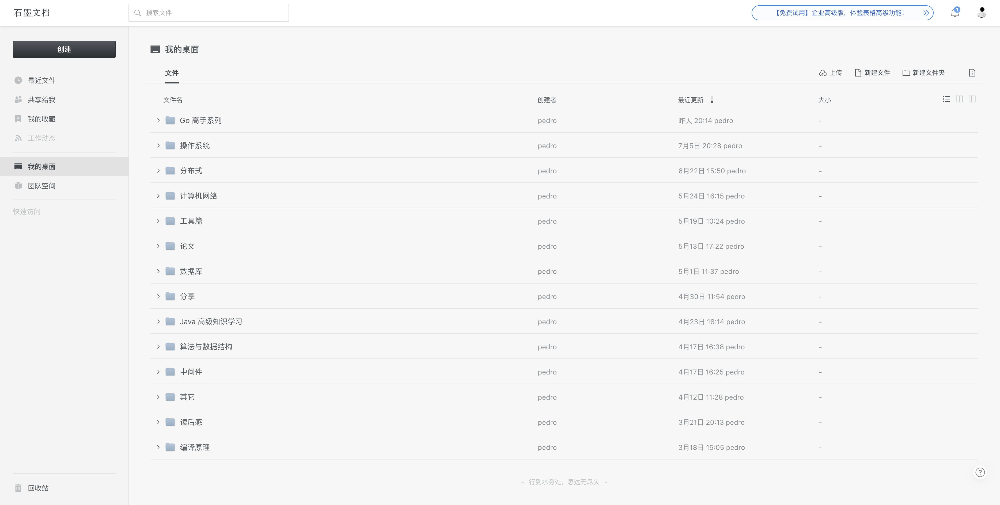

---
date: "2019-06-23"
---  
      
# 用户故事 | 成为面向“知识库”的工程师
你好，我是pedro，目前是一名后端小研发。

很早的时候，就收到了小编的邀请，让我来写一写用户故事。但是因为我手上有很多事情，这事儿就被耽搁了下来，所以导致这篇小故事迟到了很久。

虽然是在操作系统这个专栏下，但是我不想受到领域的限制，我想和你们分享一下我的学习思路、学习方法和收获，真诚地和你说说话，唠唠嗑，吹吹水。

## 学习思路

你自己知道你需要什么，这才是最重要的！

我想能来这里学习的人，大多数都是希望提升自己的小伙伴，我也和你们一样，都遇到这样的问题，那就是——好书这么多，视频这么多，专栏这么多，博文又这么多，我缺的真的不是资源，而是时间！

几年前，我想要提升自己的心态十分迫切，在B站上收藏了N多视频，在浏览器主页上收藏了 N多博文，也买了很多好书和极客专栏。然而，这一堆接着一堆的东西，让我感到焦虑和茫然，实在是太多了，我哪里学得完呀。

而且我还时不时接到各式各样的推送，告诉我：你要学习数据库，这很重要；你要学习编译原理，这很重要；你要学习这个框架，面试必考；你要学习这个技术，工作必备；你要学习如何看画，审美很重要；你要学习如何读诗，远方很重要……

可我就是一个普通人，哪能学这么多？即使是时间管理大师罗志祥也办不到。我们不妨仔细想想，这些东西真的有这么重要吗？可能很重要，但是对我们来说，我觉得**辨识力最重要，知道你自己需要什么，才最重要！**

<!-- [[[read_end]]] -->

> 什么都舍弃不了的人，什么也改变不了！

这是《巨人》里面有名的金句。我之所以放到这里和你分享，是因为我觉得把这句话放在学习上同样很有效。

聊到这里，我想说说我自己的学习思路，其实也很简单。那就是，**二八定律，80\%的功利主义，学对工作最有帮助的，20\%的情怀主义，学自己最感兴趣的。**

结合你自身的工作情况和个人爱好，选择那么几门去开始学习，不要贪多，不要把买了就当成学了，用这样的方式来缓解自己的焦虑。

以我个人为例，我自校招入职以来，主要在学习与工作相关的知识，但也没有放弃个人兴趣。这里我把我正在学习探索的方向整理成了一张导图，也分享给你做参考。

在我看来，功利主义和情怀主义二者并不冲突，相反二者是相得益彰的，可以共同帮助你成长。因为工作以后，解决工作问题是最主要的事情，所以把大部分时间花在上面是值得的，这属于功利主义。

但是，工作内容并不一定只是为了解决工作问题，在工作中也可以找到有趣的事情。比如Go 语言底层的调度实现其实是非常有意思的，也可以本着情怀主义来学习，但同时在未来这部分知识又可以帮你解决更多的工作问题。

其实我也是出于情怀来学习操作系统的。操作系统可以说是打开技术底层大门的钥匙，一方面可以开拓视野，另一方面恰好也能在工作需要的时候帮助我们解决困难。

## 学习方法

输出是学习的最佳途径！

光有学习思路是不够的，我曾遇到过这些问题：一个Bug遇到了两次，可是每次都得去 Google上搜，下次遇到了还是忘了。或者明明看了相关的视频，可是一到用的时候，突然发现自己好像只记得几个名词。

你看，明明花费了时间，却收获极小，这会严重打击我们的学习积极性。究其根本，是因为**学习方法不对，导致学不到东西。**

几年前，我刚步入这行的时候，由于原来没有接触过计算机，每次都是对着黑框框终端一顿操作，遇到问题到处百度（后来才转向Google），虽然稀里糊涂地解决了问题，可是下次遇到这个问题的时候，又得再百度，知识毫无积累，水平毫无提升，成了名副其实的面向“浏览器”工程师。

后面，我发现记笔记是一个有效的学习方法，可以直接提高对知识的熟练度。

因为在记笔记的过程里，我们会思考步骤、流程的合理性，重新审视这个知识点，同时记笔记也需要我们在内心里面揉碎这个知识点，加以消化，然后重新写出来。这是极佳的思考和输出的过程，有了这个过程，你不再是走马观花，而是经过了自己大脑的“解码”和“编码”，学习自然就会变得高效起来。

我记笔记最开始使用纸来写，但是效率太低，容易丢失；再后来，我学会了Markdown，开始在Markdown上记下自己踩坑的过程，写下自己的心得体会；可是很多时候我一会儿在笔记本上，一会儿又在台式机上，也有时候我需要和别人分享，甚至邀请别人一起来协作记笔记，于是我又将记笔记的地方转向了云端，开始使用石墨文档。

石墨文档支持多人协作，而且个人就算多PC、终端也可以登录，很好地解决了我的问题。下面附上我石墨文档的桌面截图，也推荐你使用。

慢慢地，我开始有了自己的积累，因为输出是更深层次的理解过程，很多坑点，我都能记下来，下次直接解决，即使遗忘了，我也能搜索自己的笔记。渐渐地我开始有了自己的知识库。**从面向浏览器工程师变成了面向知识库工程师。**这样的成长蜕变绝非朝夕之功，但我相信点滴的积累，终会聚沙成塔。

当然记笔记只是输出的一种，你也可以选择其它方式，比如技术分享，和同事、同学之间进行讨论，**甚至给专栏留言**。这里我就不得不骄傲一把了，操作系统专栏每一个小节，我都认真阅读了，思考和回答了问题，并且做了输出——留言，所以这个专栏让我收获巨大。你也可以借鉴！

## 收获

技术能力应该是最基础的收获，收获更多的应该是生态！

开始时，我把学习和工作的目标定为提升技术能力，一路坚持下来，我的技术确实有了进步，但是我更大的收获是生态。

这个生态可能你不太理解，我来详细解释一下，我把因为学习和工作而结交到的**朋友**、**业务理解**、**商业模式**和**思考方式**等等统称为生态。

拿这个专栏来说，我重新对操作系统进行了梳理和复盘，把很多原来一知半解的知识彻底弄懂了，这只是第一层的收获。

更上层的是，我认识了大佬东哥（作者）和他的一些朋友，可爱又有责任心的小编 Sara，人美心善的小运营洁仔，还有一堆天天在群里吹水的小伙伴，他们在群里分享了很多实用的知识，我也订阅了好几个公众号。

我们因为这个专栏而认识，我们志同道合，我们一起努力来完善这个专栏，用反馈去给专栏增值，这个因大家一起努力贡献而组建起来的生态，才是我本次最大的收获。

我希望你在学习和工作的时候，不要仅仅着眼于技术本身，而是要试着切换视角，跳脱出固有的框架，并且尝试鸟瞰全局，这样你才能收获更多。同时也建议你把专栏当作学习交友的平台，希望你能在本次专栏的学习中能够与我们成为好朋友，鼓励更多的人加入进来。

除了课程正文的干货，我总是能在课程留言区发现惊喜。其实我们才是专栏真正的主人，也是专栏增值的核心力量，专栏是我们跟作者共同的作品。

还是拿我自己来说吧，加入专栏成为助教后，我的学习激情一下子就“膨胀“了。认真学习专栏不仅仅只是兴趣，还有责任感与使命感，仿佛不追完就觉得白来了一趟。也正因如此，我才能收获如此巨大，相信你也可以。

## 写在最后

今天的分享，我从思路、方法和收获三个方面跟你聊了聊学习这件事情，下面我来谈一谈我对操作系统的看法。

操作系统是我个人认为**最应该掌握的计算机必修课**！因为我们的每个程序、每个应用以及每个服务都跑在操作系统这个地基上面，可以说现代互联网完全构建在了操作系统上。

操作系统是计算机软件的集大成者，是架构的极致！无论是Windows、Linux还是macOS都有几百万行代码，在保证高效运行的同时，又能将各种能力通过开放接口提供给我们，这是优良架构才能带来的能力。

东哥将操作系统的精华浓缩，并将其实现为Cosmos，用专栏的形式提供给我们，让我们有机会去一睹操作系统的风采，去汲取最有营养的养料，让你在学习操作系统的路上少走弯路，少走弯路就是走捷径。

希望每个看到这篇用户故事的小伙伴，重新拿起这个专栏。行百里者半九十，很多人行了十里就落下了，专栏行程虽然过半，但仍然可以赶上，大家，加油！