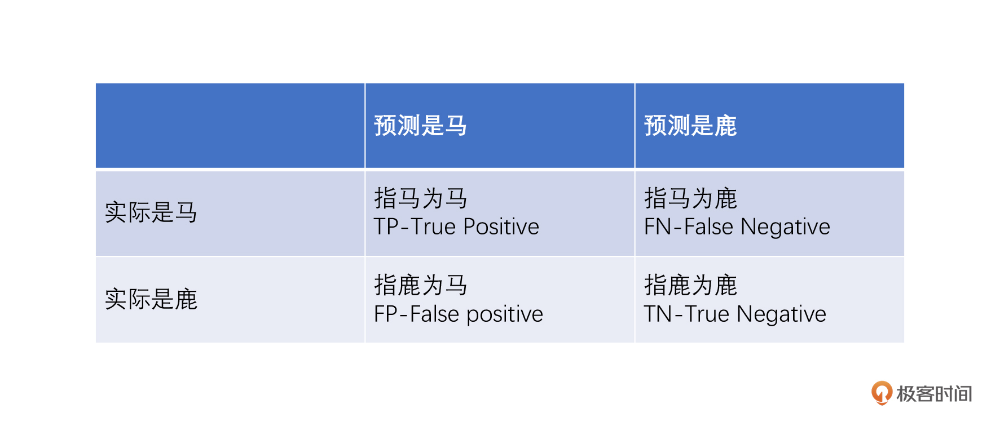

---
date: "2019-06-23"
---  
      
# 12 | 精确率与置信区间：两种预测，你究竟应该相信哪一个？
数据给你一双看透本质的眼睛，这里是《数据分析思维课》，我是郭炜。

从今天开始，我们就要进入数据算法基础部分了。一说到算法，很多人都会觉得神秘、复杂、高大上……那究竟什么是算法呢？

官方把算法定义为一个计算过程，这个过程输入某一个值或一个值的集合，终会产生一个值和一个值的集合作输出，这就是一个算法。官方的说法比较抽象，简单来说，你可以把算法当成一个具有科学依据的算命箱子，你给这个箱子输入你的面相、体重生辰八字，最终它会根据你的需求给你算出一个很有可能的结果，比如最近你买比特币会发大财，生的孩子是男孩一类的。这个输入输出的箱子就是一个算法，箱子里面装的我们就叫做算法模型。

看到这，你可以停个五秒钟想一想，这种感觉是不是似曾相识？我们前面讲了很多的统计分布，假如我们知道收入和投资是成正相关的，我们是不是就可以知道在未来某一个投入情况下，收入会有多少了？之前我们介绍的统计分布是不是算法模型呢？

是的，我们在数据分析基础里介绍的各种分布，就是算法模型的一种。其实数据算法模型包括很多大类，简单说来可以分为统计分析、数据挖掘和人工智能几大类，聚类、分析、关联、神经网路等等很多种算法。我们有非常多的算法模型，到底哪个算得准呢？今天这节课，我就给你讲几个衡量这些算法模型的重要指标：准确率、精确率、召回率和置信区间。

<!-- [[[read_end]]] -->

## 准确率/精确率 /召回率

衡量一个算法准不准，我们的第一感觉就是要看这个模型的准确率。的确，在算法衡量里就有一个指标就叫准确率，英文叫做Accuracy。顾名思义，准确率就是看整体里预测准确的概率是多少。

**准确率 = 预测正确的样本数量/预测总的样本数量**

这个公式乍一看很有作用，但是用这样的方式来评估一个算法模型是有问题的。假设我设计了一个算法来辨别鹿的照片。我准备了100张图片，图片里边有1张鹿，99张马。现在，我要让算法来识别这个图片里到底是鹿还是马。

假如这个算法模型很准确，把一个鹿识别出来了，然后我们看这个准确率是多少呢，用刚刚的那个公式，你容易得出是1/100，也就是说只有1\%的准确率。这个和我们当时预期的明显不对。

那怎么样更好的去衡量这个算法模型呢？我们就有了一个新的概念，叫做精确率，英文叫做precision，也叫作P值、查准率。这个概念稍微复杂了一些。还用刚才预测鹿和马的这个例子，我们先把几种预测结果的情况都列出来，整体上就是4种：预测马，它的确是马；本来是鹿，预测成马；本来是马，把它预测成鹿了；本来是鹿，预测对了还是鹿。你可以参考下面这个表，会更为直观一些。

官方说法是精确率为预测正确的正例\(TP\)在**所有预测为正例的样本**中出现的概率，即分类正确的正样本个数占分类器判定为正样本的样本个数的比例。是不是有点绕？你可以把表格和下面这个公式对照起来看，会更容易理解一些。

**精确率=TP（指马为马）/\(TP（指马为马）+FP（指鹿为马）\)**

比如说，现在有马和鹿共100匹，其中40只鹿，60匹马。预测出来的结果，如下面这个表。

那么AI算法模型精确率就是40/（40+10）=80\%。

光有精确率不够，如果我们现在下个指令，要把那些指鹿为马的AI算法都给干掉，这样可以把精确率直接提到100\%（指鹿为马变成0）。

这样做，看起来精确度足够高、足够精确了。但却会导致最后很多的马识别不出来，因为AI看到很多稍微长得像鹿的马，完全不敢识别成马，宁愿说这些马是鹿。

那我们怎么能避免这种情况出现呢，我们就会用到另外一个指标——召回率（recall，也叫作查全率）。召回率用官方的说法是预测正确的正例\(TP\)在**原始的所有正例样本**中出现的概率，即分类正确的正样本个数占真正的正样本个数的比例。用公式来表示就是下面这样。

**召回率=TP（指马为马）/\(TP（指马为马）+FN（指马为鹿）\)**

那么上面这个AI算法模型召回率就是40/\(40+20\)=66.7\%。

简单来说，召回率就是看你查得全不全。目标就是不让你太过于严查指马是鹿，出现上面说的AI即使看到真的马也不敢指出来它是马的情况。

我们现在把精确率和召回率放在一起看，精确率80\%，召回率67.7\%。这个数据说明什么呢，说明AI算法怕把马认错了，宁可指马为鹿，也不指鹿为马。在这样一个结论下，接下来我们可以适当优化模型，去找一个最优解。

精确率和召回率（也叫查准率和查全率）是一对孪生兄弟，一般情况下它们是成对出现，用来衡量一个算法模型到底好不好。**单一指标高并没有意义，避免指鹿为马也避免指马为鹿才是最好的模型。**

## 置信区间

光有精确率和召回率就可以衡量一个算法到底好不好么？其实还是不够的，我们现实中很多时候不是光看鹿和马的，而是要去预测一些连续的数字。举个例子，你高考完不知道多少分，你找算命先生帮你预测一下高考成绩。有一个算命先生告诉你，我有100\%的把握，你考的分数在0到750分之间。另外一个算命先生说，我有95\%的把握，你在600到630之间。

这两个算命先生，谁强谁弱，一眼就看出来了，对吧？为了解释每个算命先生（算法）的识别能力范围，我们有了一个新的衡量指标，叫做置信区间。

用官方说法来说，置信区间估计是参数估算的一种，它是用一个区间来估计参数值，英文叫做confidence interval 也就是一定信心下的区间。这个信心我们可以用前面讲到的准确率来去衡量，这个时候准确率有了一个新名字，叫做置信度。刚刚提到的95\%、100\%就是置信度，\[0，750\]和\[600，630\]就是置信区间。

一般来讲置信度和置信区间是同向的，啥意思呢？就是置信度和置信区间一般是相同趋势。当置信度很高时，置信区间也会很大；当置信区间很大时，置信度也会很高。不过越高其实这个算法越没有用处。如果一个算命先生告诉你，我有100\%把握你生命是在1岁到200岁之间，虽然置信度高，但显然是一句废话。所以**置信度和置信区间是一组参数，来告诉你这个算法模型误差有多大。**

我在附录部分给你举了一个置信区间计算的例子，你要是感兴趣，可以去进一步学习。

## 取舍的艺术

精确率、召回率、置信区间这三个参数是衡量一个数据算法的核心指标，算命先生既要算得准、算得全还不能范围猜得太大，这才是好的算命先生。但是现实工作中，要想达到这样的效果，其实是很难的。

就拿最近比较火爆的“自动驾驶遇到行人自动刹车”这个算法来说，精确率代表着识别出来一个人他就是人的准确度（不要指鹿为马）；召回率代表着算法不会把人当成其他物体而不判断（不要指马为鹿）。置信区间代表着置信度比较好的时候，能识别多少种物体（人行道红绿灯、卡车、广告牌里的人涵盖不涵盖，置信度是多少）。

现在自动驾驶这么难，就是因为对于现在的算法来说，这几个指标很难同时都达到最高。这时候，我们就要学会取舍。

如果你的精准度低了，代表着你遇到不是人的物体时，算法会把它判断成人，然后刹车。这个系数太低，你开车就经常会出现莫名其妙的刹车的情况。如果我们召回率低了，代表着本来路上有一个人，我没有把人识别出来，直接撞上去了，这个也不行。置信区间代表着能识别出多少物体，广告牌上的人像要不要考虑？如果考虑了，会不会影响模型的召回率和精确率？

所以如果让你只能选择一个参数作为最关键的核心调优指标，你会选择哪一个参数呢？如果是我，我会优先选择召回率，这样算法如果不好，至多也就会和新手一样，宁可多刹点车也不要撞到人。毕竟对于汽车驾驶来讲，安全最重要。

所以在实际的场景当中，**我们要结合当下的情况来设置这些参数，结合你自己的业务场景来选择最合适的算法。**如果有数据科学家对你说某个算法精确率特别高时，你可以追问两句，召回率如何？置信区间如何？

当然在数据挖掘和人工智能领域还有很多复杂的方法去衡量一个算法的好坏，例如AUC曲线、F1 Score、PR曲线、增益和提升图等等。你要是感兴趣，我们可以在留言区进一步交流。

## 小结

最后依旧是我们的小结时间。今天我们主要讲了准确率、精确率、召回率和置信区间、置信度，这些是在衡量算法好坏时，使用频率最高的指标：

* 准确率衡量整体准确情况；
* 精确率规避指鹿为马；
* 召回率是保证马都能认出来，避免指马为鹿；
* 置信区间和置信度是用来表示识别出来的范围以及你在这个范围内的信心。

其实在具体场景里，没有十全十美的算法，总是要做一些取舍。这个时候我们就更要去理解这些指标背后的含义，做到“断舍离”，根据我们实际的业务场景去选择最优的算法。

生活和工作做决策的时候也是如此，现实世界里很少有“两好选其优”的机会，大部分都是“两害取其轻”。究竟哪个害处更大不可接受，我们要自己衡量好。这样才可以在我们自己的生活和工作当中逐步的优化自己生活工作的算法，提高我们自己生活的最终的精确率，召回率和置信区间。

数据给你一双看透本质的双眼，**做好断舍离，选好自己生活的精确率和置信区间。**

## 课后思考

你在你的工作当中遇到某些算法和一些业务场景需要做取舍的时候，对于精确率，召回率和置信区间你的选择是什么？同时，你觉得在你生活里，什么时候也是可以用到这些指标的？分享出来我们一起共同提高。

## 附录：置信区间计算过程

现在我们要去调查某一地区男性的平均身高，通过抽样得到100人的身高样本，样本平均值为170cm，样本标准差为0.2cm。

如果我们现在要95\%的置信度，我们就可以算出来置信区间在\[169.9608，170.0392\]之间，也就是说，我们用100个人去推测这个地区的男性平均身高，尽管我们只调研了100个人，但是我们有95\%的这些男性的平均身高是在\[169.9608，170.0392\]之间。

计算过程如下。

1.样本大小大于30，符合正态分布，我们要通过样本的平均值来估计总体的平均值。

2.标准误差：标准误差为se=0.2/√100=0.02。

3.置信度95\%，左右标准误差各2.5\%。查正态分布表，标准分z=-1.96；

置信区间下限=170-1.96\*0.02=169.9608；

置信区间下限=170+1.96\*0.02=170.0392。

因此，此区域男性平均身高在置信度95\%情况下，置信区间为\[169.9608，170.0392\]。