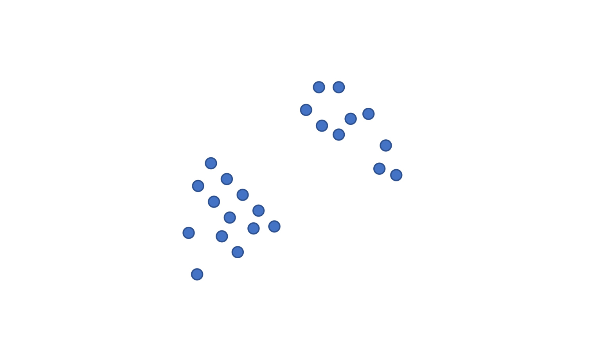
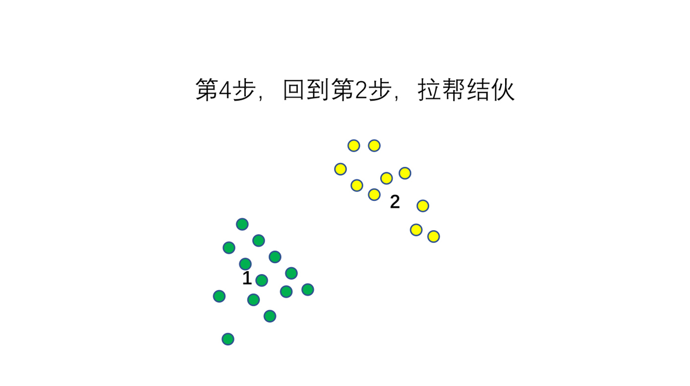
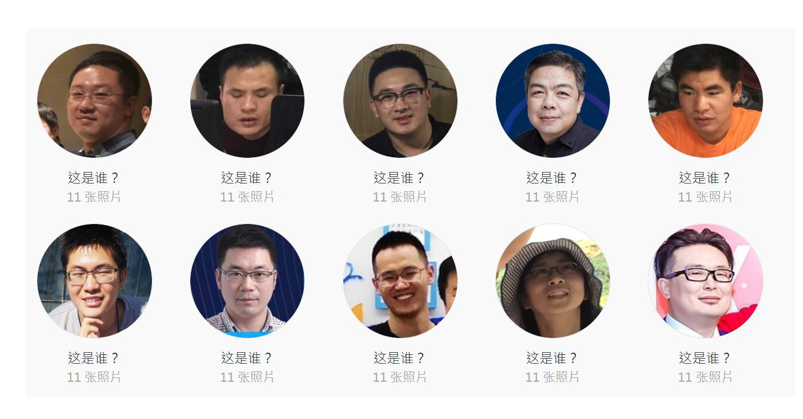
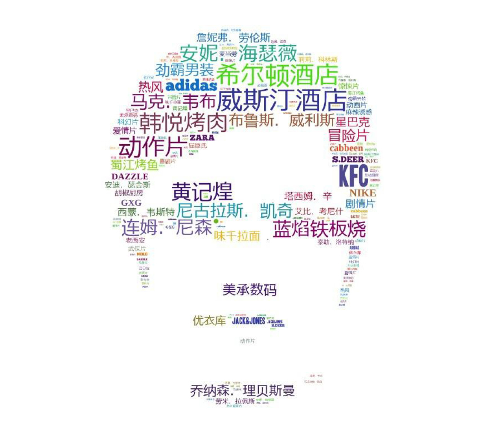

---
date: "2019-06-23"
---  
      
# 14 | 初识聚类算法：物以类聚，让复杂事物简单化
数据给你一双看透本质的眼睛，这里是《数据分析思维课》，我是郭炜。

“物以类聚”这个成语想必你肯定不陌生，我们会自然地把很多类似的事物放到一起，给出一个统一的定义。因为我们的大脑空间有限，无法接收太多零碎的信息。

比如我们会把动物按照门纲目科属种来进行归类：对于一只小狗来说，无论它是白毛还是黑毛，秋田还是藏獒，我们都会知道它属于狗。这其实就是我们面对纷繁复杂的世界的一种算法。

对于数据来说也是如此，如果大量的数据没有一个很好的算法来进行整理，那么这些数据可能我们就无法理解。如何将大数据分门别类聚集起来让人理解，就是今天要给你讲的算法——聚类。

## 聚类问题与场景

花对你来说肯定很熟悉，我们在生活中会看到各种各样的花。无论是梅花、菊花还是鸢尾，我们都会把它称作是花，而不是把它叫做叶子。因为它们身上有类似的特征，和叶子有比较大的区别。

简单来说，不同的花之间有一些比较相近的特性：花都有花瓣也有花蕊，颜色也都比较鲜艳。我们把这种现象叫做**内聚**。而花和叶子相比，叶子在大多情况下形状不会特别复杂，并且大多是绿色，所以花和叶子之间的差异很大。我们把这个特性叫做**分离**。

**聚类就是通过一些算法，把这些事物自动全都聚集起来，让这些聚好的类别（花类和叶子类）达到内聚和分离的特性。**你可以从下面的图里更直观地看到，一个好的聚类算法算出来以后，可以把相近的东西全都聚到一起，并且不相近的全都能区分开。

<!-- [[[read_end]]] -->

做人群探查的时候，我们可以先用聚类的方式，把你不知道的这些用户先分出几个类别，然后再看每个类别的一些特性。如果直接看每一个用户的特性，分析不出来什么结果。先聚类再分析，这样我们不会一叶障目，不见森林了。

在投资过程当中，我们经常会把股票通过一些特征值（利润、收入等财务数据）进行归类，再进行一些风险的评估。最典型的就是股市里我们经常听到“蓝筹股”“白马股”都是通过类似聚类的方法总结出来的。

所以当你面对一堆数据，担心其中特性差异过大的时候，你可以先使用聚类算法把不同的小类聚集出来，再通过其它的统计手段，针对每一个类别里面的数据进行描述。

因为这个过程是我们让这些数据自己去聚集出组别来，所以我们也把聚类算法叫做无监督学习。顾名思义就是没有人告诉你最终正确答案是什么，你自己看着办，把它们分成比较合适的类别就可以了。组内的相似性越大，组间差别越大，聚类就越好。所以在你面对很多数据想探查其中的规律时，先用聚类算法再进行深度分析可以事半功倍。

抽象一下，**聚类算法输入就是一群杂乱无章的数据，输出是若干个小组，并且这些小组里面会把数据都分门别类。组内的对象相互之间是相似的（内聚），而不同组中的对象是不同的（分离）。**组内的相似性越大，组间差别越大，聚类就越好。

## 聚类算法初探

人类本身就具备这种归纳和总结的能力，能够把类似的事物放到一起作为一类事物识别，尽管它们之间还是有细微差别，但是我们心里有一个“差异距离”。只要在这个差异距离内，特征稍有区别无关大碍，它们仍然还是这一类事物，超过这个“差异距离”我们就会当做另外一个事物。例如下面这个图中的点，我们可能一眼就能看出来，这个点是可以分成两堆的。但是计算机怎么能学会把这些点分成两堆呢？

这里我给你讲一个最常见的聚类算法K-Means，具体实现方法我称作“选大哥”。

**第1步，我随意挑两个点，作为开始的大哥。**

**第2步，“拉帮结派”。**算每一个点和大哥的距离，这些点里谁离哪个大哥更近，我们就给它归到这个大哥的团伙里去。

**第3步，我们开“帮派大会”重新选大哥。**每个大哥的团队里小弟，都算一下这个团队里面最中心点在哪里（也就是X坐标和Y坐标的平均值），离中心点最近的那个点成为新大哥。

**第4步，重新回到第2步，根据帮派选出来的新大哥再去分自己的小队伍。**

这样重复下去，直到最后这个帮派稳定下来，那我们就能看到这些群组的点到底应该怎样区分了。

总结一下，K-Means“选大哥”算法，就是先把一群点分成K类，根据K类中间均值的距离去选择（Means就是均值）到底它属于哪一个聚类。最终当聚类稳定下来的时候，聚类也就完成了。

可能你会问，刚才这个例子里，我们怎么知道一开始我应该分成两类呢？这其实就是业务专家和个人的经验选择了。你拿到这些数据的时候，背后业务逻辑可能会告诉你大概率要选择几类。或者你可以多尝试几次，聚成几类更容易来解释你的业务，你就可以最后聚成几类。

可能你还会问，从第4步回到第2步的过程中，我们会不会陷入死循环，一直在第2步和第3步当中选大哥找小弟，永远选不出来最后的结果呢？放心，有[数学证明](https://zhuanlan.zhihu.com/p/149597282)，我们的这种方法一定会收敛出结果。

还有一个问题，图上表示的这些点可以看得很明白，但实际工作过程当中很多事情很难表示成点和点之间的距离。例如用户群的划分，这怎么来计算呢？简单来讲，在算法的世界里，我们可以有各种方法把人和人之间的属性和行为的差异数字化，然后把它们算成“欧几里得距离”或者“余弦相似度”，你现在只需要理解，**最终任何事物的特征属性都可以变成类似距离的东西来计算**就可以了。

常见的聚类算法除了K-Means，还有KNN、DBSCAN、EM等等，所有的这些聚类算法其实都可以和K-Means类似简化成三种问题：

1.选大哥，找聚类中心的问题；

2.找小弟，解决距离表示的问题；

3.帮派会议，聚类收敛方法问题。

这里要注意的是，**使用聚类算法的时候要先把一些异常点尽量剔除掉，或者单独把它们单独聚成一类。否则有一些很异常的数据就会影响我们聚类算法最终的准确性。**

## 未来场景的展望

聚类已经逐步由过去的只是针对数据的聚类，变成现在可以实现图片、声音、视频的聚类了。最常见的比如我们手机相册现在可以把你过去拍的人脸照片聚类，然后再让你贴上标签。比如下图里，里面有每个人都是一类，背后都有他们的很多照片。

手机先帮我先计算出来，我再统一标注成我自己，这样做直接省去了每一张照片都要告诉手机这个照片是谁的时间，将来也能让我很容易找到自己的照片。

我们在做用户画像的时候，也会用聚类把一个人最常见的行为属性聚集出来。比如下面这个我自己的用户画像就来自于我在万达的时候，通过大数据聚类算法建立起的一套大数据用户画像系统。你能看到我喜欢住威斯汀和希尔顿，我喜欢吃韩悦烤肉，我喜欢安妮海瑟薇和尼古拉斯凯奇的电影，这些都是从我日常琐碎行为里面聚出来的一些行为特征。

同样在一些线下的行为轨迹当中，也可以用一些聚类的方法找到人群最密集的地方，比如下面这个图就是当年我们在万达广场做过的一个聚类实验。你能看到，我们可以用聚类算法来推测出来到底哪些地方是人群最聚集的（红色的地方）。这样的话，我们就可以有针对性地去放置广告牌或者进行一些活动，这样就有效避免这些广告牌或活动放在不合适的位置上。

聚类在很多领域都非常有用，例如辅助医疗科研研究、辅助医疗管理、辅助医生的临床诊断、辅助生物学里的蛋白质表达等等。**聚类是一个最基础的数据挖掘算法，也是最经久不衰的算法之一。**

## 小结

好了，今天的课程到这里也就接近尾声了，最后我们来小结一下。今天我们讲了聚类算法，物以类聚，这是我们天生就有的一种思维方式。

聚类算法可以帮助我们在非常复杂的数据环境里面快速聚出一些类别，从而看到这些数据里面的特征。同时，聚类能够避免直接使用平均值去看事物发生[辛普森悖论](https://time.geekbang.org/column/article/400764)，也能避免我们过度深入细节看不到事物的全貌。在图像、基因、医疗等方面都有聚类算法的身影。聚类的算法原理也很简单，我给你介绍了K-Means算法，也就是“选大哥”的算法。

不知道你会不会有这样一种感觉：总是每天很忙，全都深入在不同的生活、业务细节里，但一天忙下来，却不知道自己到底忙了些什么。

你不妨试试用类似聚类算法的思路，把你觉得纷纷扰扰一些小事统一归到一个篮子里去，用一整块的时间或者类似通用的方法去解决它们，说不定会有奇效。因为**多用聚类算法的方式去思考，可以把你的思维锻炼得更加结构化，助你更快理清琐碎的生活。**

数据给你一双看透本质的眼睛，希望我们可以通过聚类，把纷繁复杂的世界变得简单一些，最终看清这复杂的世界。

## 课后思考

请你想一想，在工作或者生活中，你遇到的哪些复杂事物可以用聚类算法或者聚类思想来解决，分享出来我们一起提高。