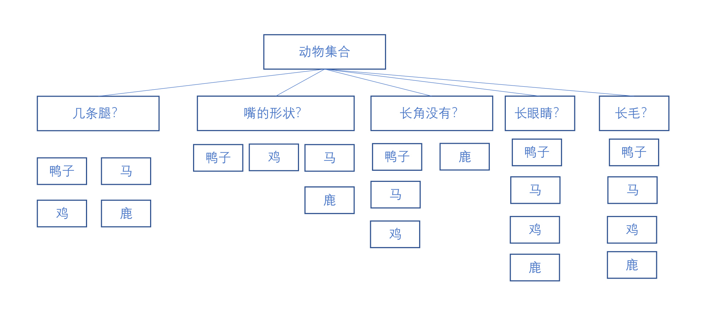
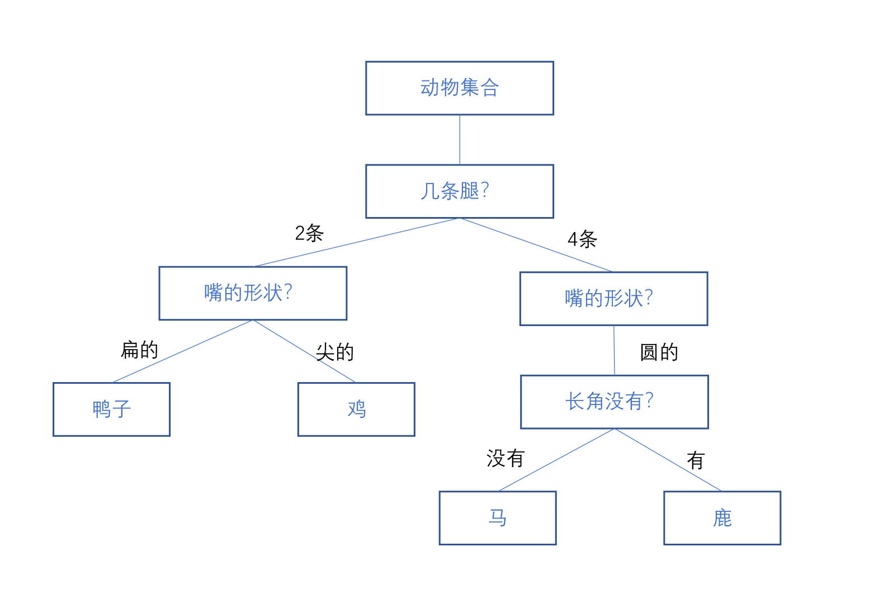
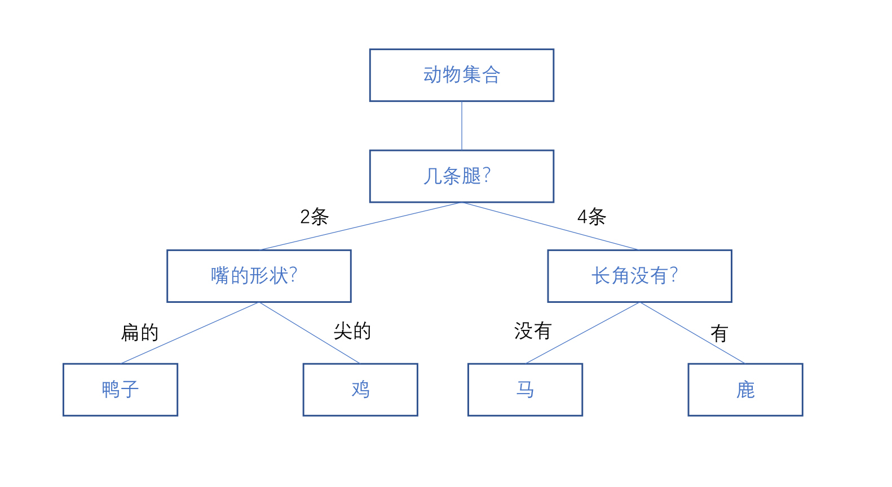
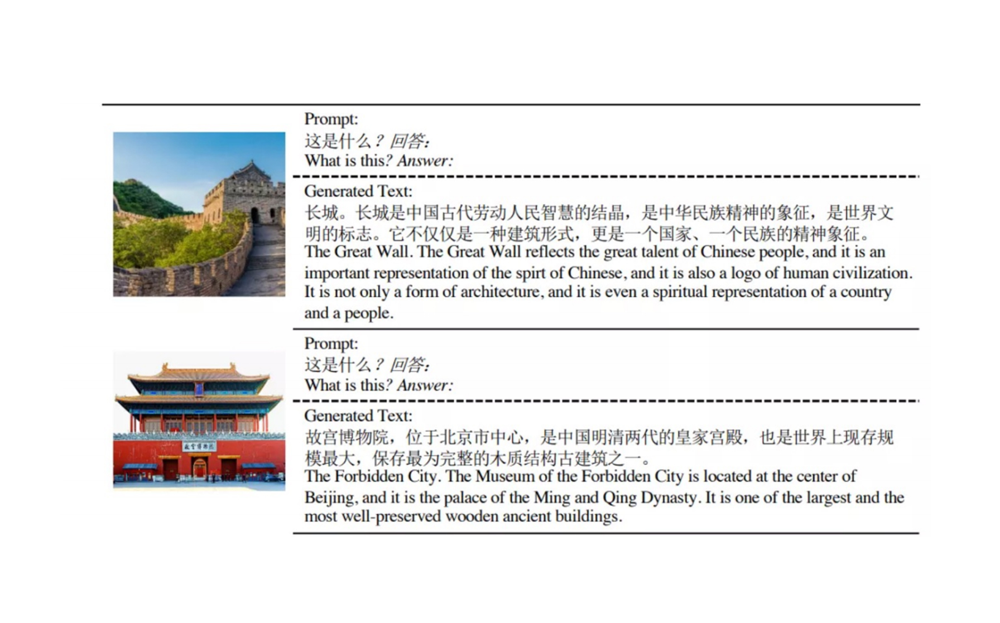
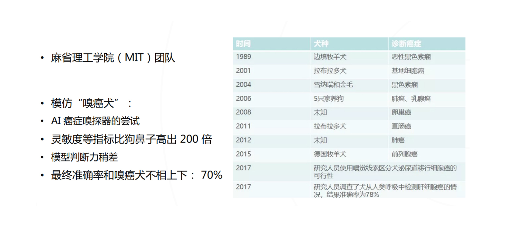
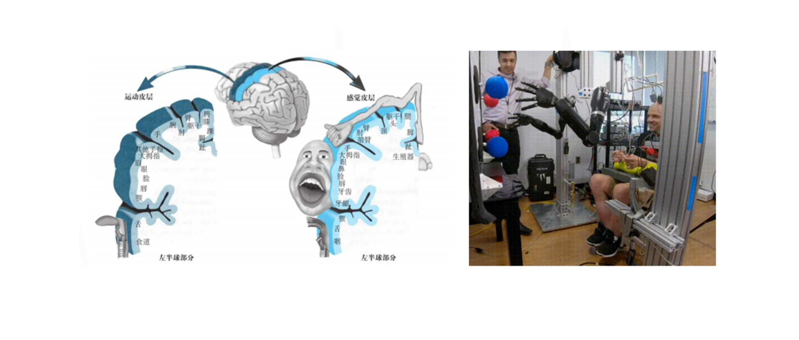

---
date: "2019-06-23"
---  
      
# 15 | 初识分类算法：分而治之，不断进化
数据给你一双看透本质的眼睛，这里是《数据分析思维课》，我是郭炜。

通过上节课讲的聚类算法，你应该知道了我们经常把一些复杂的事物通过聚类来进行简化处理。但是，不一定所有事物在一开始我们都要把它们进行聚类。有的东西我们一开始就知道一些正确和错误事例，例如我们知道什么是好人什么是坏人，然后得让孩子慢慢明白好人和坏人的差别，让孩子去学会鉴别哪些人是好人还是坏人。

又比如说在上海做垃圾分类的时候，有这么一个段子：你去倒垃圾，一个阿姨就会在那里看着你，看到你就会问“你是什么垃圾？”你如果把垃圾分类做错了，她会告诉你榴莲壳属于干垃圾，瓜子壳属于湿垃圾。下次如果你去倒垃圾还不对，她还会纠正你，直到你最后学会为止。刚刚给你举的这两个例子其实就和我们这节课的主角分类算法脱不开干系。

## 分类算法定义与场景

和聚类算法不同，分类算法是有训练数据集的，也就是我们在一开始就已知有一系列正确的数据和正确的分类结果，然后你需要经过不断地学习去找到其中的规律，然后做一些测试数据，最终在生产环境里去帮你去判断一些事物的分类。

可能这么解释有点绕，其实这就像我们让孩子去做算术题一样，先告诉他计算正确的一些案例，让他去领悟其中的一些规则，然后继续做一些算术题练习，最后再去做考试。

<!-- [[[read_end]]] -->

所以分类和聚类算法不同，分类算法会不停告诉你这个分类是哪种，直到你学会，最后再让你自己单独去进行区分。所以分类也叫做**有监督学习**，也就是得有人看着你做。

我们来看个例子。比如现在你想知道有哪些客户可能会流失到竞争对手那里去。这个时候我们可以用叫“客户流失预警”的分类算法来解决这个问题，也就是你的客户流失之前，算法会提前先给你一个预警。

具体是怎么做的呢？我们先是输入很多过去流失的客户信息，让这个算法学习大概哪些特征是流失客户会有的，这个分类器算法学会了分辨哪些客户会流失后，你再来一个客户给它，算法就会告诉你这个人流失的概率有多大。这样你就可以有备无患，针对这些要流失的客户进行营销活动来挽留住他们。

你在停车场会用到的车牌的自动识别也是用分类算法做到的。把各种各样的车牌告诉这个分类算法，说这个图像是1，这个图像是A，经过不断训练和学习，最后当你的车到一个停车场的时候，它就会自动把你的车牌识别出来了。

其实我们自己也是一个非常精妙的分类器，它能够处理非常复杂、抽象的输入（图像、文字、触觉、味道等），我们都可以根据当时的情况进行合理输出（躲闪、愤怒、皱眉或者情感上的喜怒哀乐）。所以从某种意义上来讲，我们作为一个精密的分类器，其实就是在根据世界的不同情况来做出我们自己的分类决策，最终形成了我们各自的生活。

概括一下，分类的算法也叫做有监督的学习，它是先拿一些正确或者错误的案例给分类算法，让这个分类算法学会了以后，再给它一些新的输入，那么这个算法就会根据它前面的学习到的结果，对这些新的输入进行分类。

## 分类算法初探

那如果我已知一些条件和试验的结果，具体怎样能让计算机像人一样发现其中的这个逻辑呢？我来给你分享一个最常见的分类算法C4.5——决策树。

我们可以把一个分类器抽象成一棵倒着生长的树，它就是一些不同条件走向了不同的分支，最后走到叶子得出一个分类的结果。比如我们设计一棵树来区分鸡、鸭子、鹿和马，我们可以用下面这个树来进行表示分类。

任何一个人或者机器拿到这棵树，都可以根据这个规则把这些动物区分出来，我们把这棵树叫做决策树。顾名思义，根据这棵树我们就可以做出决策了。这棵树就是这个分类算法的最核心的部分。

但是我们怎么能让计算机把这棵树生成出来呢？关键就在于**我们应该拿什么条件去判断这棵树上的分支节点。**

哪些属性是有用的，哪些属性是没用？究竟应该先拿哪个条件作为最初始的判断条件呢？这些问题的答案就在我下面要给你介绍的C4.5决策树算法中。

C4.5决策树算法我把它也叫做“逐级找领导”算法。

这个分类算法的整体逻辑很简单，最开始计算机也不知道用哪个条件区分出来最好，于是干脆把每个属性都当“领导”全试一遍，能够做出最明显区分的就当这一级的领导，然后逐级“找领导”，最后再“剪枝”。具体的步骤如下。

**第1步，我们把每一个属性都当领导全试一下**，你参考下面这个图会更直观一些，也就是把各种属性测试一遍。

**第2步，把按这个情况分群出来的差异性通过一个叫信息熵的指标计算出来。**信息熵这个词在算法里会经常用到。它表示每一个消息里面所包含信息的平均量有多少。简单来说，言简意赅的人说的话每个字信息熵比较高，废话连篇的人说的每个字信息熵就比较小。在这里，我们希望根据这个领导给出的决策逐步减少下一步整体的信息熵，这样将来的小领导更好干活，直到最后做出接近事实的分类。

**第3步，我们要比对一下这几个领导做完决策之后各自信息熵的大小。**我们发现这些动物全都长毛也全都有眼睛，用这两个属性来当领导做决策完全没用。那这两个属性我们就不会选到决策树里。同时，长几条腿这个“领导”的信息熵最小，我们就把它放在第1个节点的大领导位置上。

**第4步，大领导有了，现在我们需要一些小领导。**我们来重复前面的123步，你就有可能会画出下面的这样的一棵树。

**第5步，精简领导班子。**上面的这棵决策树看上去还是有点冗余，怎么办呢？决策树算法里面还有一个东西叫做“剪枝”，就是把一些没有用的节点去掉。经过剪枝之后，就得到了我们最终要的这个决策树。

最终我们可以用一组测试数据来验证一下我们这棵树分得好不好，衡量的标准就是[精准率和召回率](https://time.geekbang.org/column/article/410422)。这棵树到底应该有多少个特征和属性呢？这就是前面讲到的过拟合和欠拟合的问题，你需要结合业务具体问题来分析。关于精简领导班子这个点，我们要把它减恰到好处，才最能适应现实状况。

分类算法除了C4.5决策树（现在有C5.0算法了）外还有很多算法，例如朴素贝叶斯、支持向量机SVM、随机森林，还有我们之前讲过的逻辑回归等等。简单来说，所有的分类算法主要是要解决两个问题：一个是用什么样的算法决定用哪个属性区来做分类（也就是选领导），一个是怎么来计算不同属性的信息价值（信息熵，也就是领导管不管用）。其实只要解决这两个问题，其实这个类就很容易分出来了。

## 未来场景的展望

分类算法现在也被广泛地应用在人工智能图像识别等场景中，例如自动驾驶中针对人、路的识别，其实都是分类算法。我们要通过大量的训练模型告诉电脑什么是人、什么是车、什么是路，再告诉它每一个场景应该怎样去做处理，这其实就是一个复杂的分类算法。

现在最新技术也可以通过识别一个图片里面的场景，从而实现一些自动的问答。例如给到一个长城的图片，分类算法能告诉你这就是长城，给算法一个故宫的图片它会告诉你这是故宫，然后还会给你各种各样针对长城和故宫的介绍。实现这些动作的基础其实都是分类算法，只不过不仅是要识别图片中的物体，还要识别图片当中的场景。

现在还有通过分类训练让机器去模拟小狗的鼻子的。例如麻省理工学院就做一个AI嗅觉探测器，让它模拟小狗去判断最后人类是得了哪种癌症。现在这种“嗅癌犬”已经达到了70\%左右的准确率，灵敏度比狗鼻子要高200倍，这背后也是通过分类算法来实现的。

更先进的分类算法可以支持用脑机接口加上深度学习的方式去训练脑电波，让我们可以用意念来控制两只机械臂独立完成类似吃蛋糕这样的复杂任务，帮助四肢瘫痪的人重获自由。

所以和聚类算法不同，分类算法结合人工智能可以有大量的更深层次的应用，最终可能会造出一个类似人类的智能模型来。因为归根结底，我们人类自己其实也不过就是一个超级复杂的分类器而已。

## 小结

回顾一下，分类算法其实就是机器模拟人类学习的过程，通过各种各样的案例帮助计算机去学习，最终形成一个类似人类做单独决策的过程。

其实，**分类算法的核心就是在于经验不断积累，不断迭代自己的规则，从而得到最好的答案。**而我们在工作和生活当中，其实就接触的场景和得到反馈的结果来说，要比电脑当中的分类算法多得多。但我们有像分类算法一样，把这些场景和反馈结果分类整理记录下来，然后下次遇到情况时再去优化么？其实我相信大多数的人都是没有的。

所以很多人会经历了很多事情后依然庸庸碌碌。我们需要让大脑这个超级分类器不仅去接收好结果、差结果，还要在结果之外找背后的原因来不断优化自己的算法。而那些成功的人，就是通过不断地思考，不断地学习优化自己的思维，最终他们的大脑进化成为超级分类器当中的佼佼者，通过现象看到了本质。

所以今天这节课我希望能够教会你用分类算法的视角去看待“**复盘**”这件事。只有我们不断思考、不断积累，才能不断进化，否则我们真的可能被人工智能进化出的某一个分类器所超越。

数据给你一双看透本质的眼睛，我们要持续迭代自己的分类规则，持续进化！

## 课后思考

关于分类算法 C4.5 这种分层找领导分而治之，最终得到优秀结果的方式，你在生活和工作当中有过类似的体验么，分享出来我们一起提高。