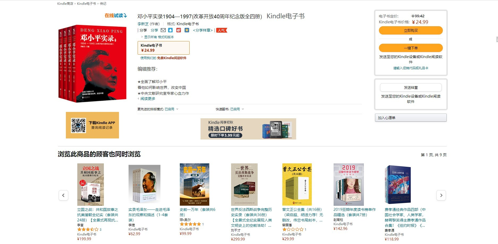
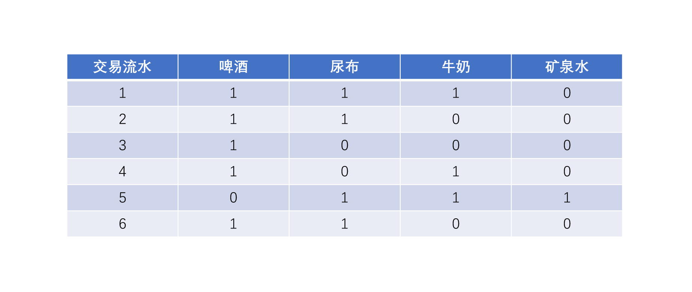
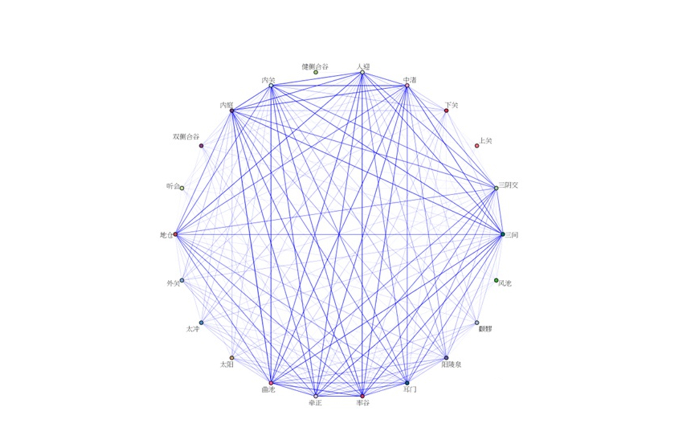

---
date: "2019-06-23"
---  
      
# 16 | 关联规则：为什么啤酒和尿布一起卖？
数据给你一双看透本质的眼睛，这里是《数据分析思维课》，我是郭炜。

世间万物都有一定的联系，你应该听说过这样一个说法：一只南美洲热带雨林的蝴蝶扇动了几下翅膀，两周后美国得克萨斯州就形成了一个龙卷风。

我们不停地搜索一些公司情况，最终很可能会影响这个公司的股价的波动；你打一个喷嚏，第二天发现中了一个彩票；你今天右眼皮起床时跳了跳，结果今天打麻将一直输。

每天都会发生各种各样的事情，我们怎么能发现在这么多的事物之间到底谁和谁有关联性，从而能去描述一些事物出现的规律和模式呢？这就是今天要给你讲的关联规则算法。

## 关联规则定义和使用场景

关联规则挖掘经常会应用在各种各样的数据场景里，用于检测数据和数据之间的潜在关系。最早也是最著名的案例，就是我当年所在的Teradata公司提出来的一个案例，也就是啤酒和尿片的故事。

这个故事是这样的，当你去美国沃尔玛超市，你会看到一个非常有趣的现象：**货架上啤酒和尿布经常放在一起售卖。**这两个看上去是完全不相关的东西，为什么会放到一起卖呢？

Teradata公司针对人们每次去超市一次交易清单里的物品进行关联挖掘，发现啤酒和尿布经常会在一次购买清单当中购买。这件事情上沃尔玛的管理者也非常不解，后来经过调研发现，妈妈们经常会嘱咐她们的老公下班后去给孩子买一点尿布回来（你知道孩子用尿布的速度是非常快的）。而丈夫买完尿布的时候，大多会顺手给自己买一瓶喜欢的啤酒。

<!-- [[[read_end]]] -->

Teradata通过针对一年多原始交易的关联规则挖掘，发现了这个神奇的组合，于是就推荐沃尔玛将啤酒和尿布摆到一起销售。结果这两个产品放到一起后，造成了啤酒和尿布销售量整体增长，这个摆放的位置也就延续至今。你现在去超市经常能看到很多商品也不是按照类别摆放的，例如卖方便面的地方经常有一些泡椒鸡爪、火腿肠、榨菜等等。这些其实背后都是关联规则数据挖掘在起作用。

当然，这个故事有很多人说是当时的人们杜撰出来的，因为那个时候数据分类无法那么精确，数据量也不够大。我觉得不用去讨论故事的真伪，它的意义在于在那个时代，让人们知道原来关联规则通过数据挖掘，我们能够发现一些我们自己完全想象不到的知识。

当然，刚刚我们讲的这个案例只是一个起点，现在关联规则挖掘已经被广泛应用在各行各业中。例如在金融行业当中，它可以预测银行客户的需求：某个高信用额度的客户更换了地址，可能表示他近期购买了一个更大的豪宅，因此可能需要更多的信用额度或者需要一个住房贷款，这些信息可以帮助银行做二次营销。

同样，在股票分析当中，美国高盛投行公司以及其他的量化交易公司会经常监测人们在Twitter和Facebook上发的一些新闻，根据这些新闻来动态调整股票的售卖。

在互联网里使用的案例就更多了，在亚马逊书城里面你能看到“浏览此商品的顾客也同时浏览”的推荐，其实这背后就是关联数据挖掘出来这本书和其他书之间的关联关系，促进你购买更多类似的书籍。

## 关联规则算法初探

刚才看了很多案例，那么我们怎么能发现这些强关联之间的数据逻辑呢？先给你介绍三个比较简单的概念。

**支持度（support）**：某个商品组合出现的次数与总次数之间的比例，也就是这个商品组合整体发生的概率怎样。

5次购买，4次买了啤酒，啤酒的支持度为4/5=0.8；

5次购买，3次买了啤酒+尿布，啤酒+尿布的支持度为3/5=0.6。

**置信度（confidence）**：购买了商品A后有多大概率购买商品B，也就是在A发生的情况下B发生的概率是多少。

买了5次啤酒，其中2次买了尿布，\(尿布→啤酒\)的置信度为2/5=0.4；

买了4次尿布，其中2次买了啤酒，\(啤酒→尿布\)的置信度为2/4=0.5。

还有一个叫做提升度的概念，你可以简单了解一下。

**提升度（lift）：**衡量商品A的出现对商品B的出现概率提升的程度，A和B

提升度\(A→B\)=置信度\(A→B\)/支持度\(B\)。

提升度>1，证明A和B的相关性很高，A会带动B的售卖；

提升度=1，无相关性，相互没作用；

提升度\<1，证明A对B有负相关，也就是这两个商品有排斥作用，买了A就不会买B。

如果支持度很小，证明大多数人不会将这种组合进行购买。如果置信度低，代表即使两个商品销量都不错，但他俩的关系也不紧密。**我们想要做的是要找到置信度高且支持度高的场景。**

给你举个例子，在下面这个表格里，每个商品下面出现的1代表购买了，0 代表没有购买。

根据前面的定义，交易1、2、3、4、6购买了啤酒，交易1、2、6同时购买了啤酒和尿布。我们可以计算出支持度为0.5，置信度为0.6。如果我们把支持度和置信度定义成50\%的话，就会认为啤酒→尿布是一个有关联性的规则。

根据这个关联的规则的定义，有一个特别原始且粗暴的方法找到关联规则：找出所有组合并加以计算，然后根据每一种组合的支持度和置信度去提取整体符合关系的规则。但这个方法的计算强度是几何级上升的，几乎是一个阶乘的逻辑，这个致命的问题让我们很难通过暴力计算来获取关联规则。

有一个叫Apriori的算法可以解决我们的问题。它的基本的逻辑其实也不复杂，我把它称为“**连坐算法**”。我们的目标是去掉过多的组合，如果按个去统计有价值的组合，那么在所有组合中有关联性的组合会有如下逻辑：

* 如果一个组合是频繁组合，则它所有的非空子集也是频繁组合——连坐，一家子都是明星组合，任何跳出来两个人也都是明星组合；
* 如果一个非空组合是非频繁组合，则其所有的父集也是非频繁组合——连坐，如果有一个人不是明星，他和谁组合都不会是明星组合。

例如，如果123是频繁组合，则12、13、23也是频繁组合；若12是非频繁组合，则123也是非频繁组合，即其他数据集里只要含12都可直接判定其为非频繁组合。**这种方法能够帮我们去掉很多没有必要测试的组合。**这样我们再去分析余下组合的支持度和置信度，就可以得到我们的最终要的规则了。

Apriori算法的优点是可以产生相对较小的候选集，而它的缺点是要重复扫描数据库，且扫描的次数由最大频繁项目集中项目数决定，因此Apriori适用于最大频繁项目集相对较小的数据集中。后续的FP-growth算法修正了这些问题。当然用于关联规则挖掘算法还有很多，例如setm、Eclat等等，你要是感兴趣，可以去进一步了解这些算法。

目前关联规则的挖掘过程大致可以总结为两步：

* 找出所有频繁组合；
* 由频繁组合产生规则，从中提取置信度高的规则。

当然关联规则有它的一些局限性，它需要有足够的数据才能发现这些规则，而在现实世界中想获得这些足够的数据可不容易。而且如果获取的数据出现偏差，关联规则会容易得到错误的结果，还可能生成太多无用的规则。

所以在使用关联规则算法之前**一定要通过业务的梳理，先规避掉有偏差的脏数据，选择最终真正对业务有用的规则。**

当然，我们也反复强调过，关联规则挖掘出来的结果只是代表这两件事情有很强的相关性，但不能代表有因果关系，因果关系的确定要结合实际的业务经验。

## 未来场景的展望

关联规则已经不仅仅使用在交易当中，而是根据物联网和人工智能算法的发展，出现在越来越多有意思的场景中。

例如下面这个图就是我在万达的时候，在某万达广场通过每一个会员客户在不同商店停留的的情况，分析出的一个关联规则的图。这个图里面，两个商店之间线颜色越深的代表它们之间的关联性越强，线颜色越浅的代表它们之间的关联的性越少。

你能惊奇地发现原来喜欢去星巴克的人也经常会喜欢去必胜客，而且在那个时候喜欢去星巴克的人经常会逛H\&M。同时你也会发现经常去麦当劳的人他不一定去必胜客，也不怎么去喝星巴克。这些都是一些有意思的发现，如果要做促销，我们就可以在星巴克客户里发一些必胜客的优惠券，这样就可以相互去引流，能够帮助门店创造更多收入。

同样，现在在医学领域里也有很多用关联挖掘的案例。我们知道中医针灸非常神秘，比如在这些针灸的穴位之间到底有什么关系呢？

现在就有很多人去通过针灸药方挖掘去寻找一些针灸的规律。比如下面这个图就是一个老中医的针灸穴位之间的关联关系图。如果将来这些数据积累到一定程度，是不是未来我们就可以用一个人工智能的老中医来给我们开药和针灸呢？我觉得随着科技的发展，这件事情一定可以实现。

还有，对于我这种理科直男来讲，选衣服搭配简直比让我去做一个关联算法还要难。现在简单了，很多的门店里面会有类似下面这样的“魔镜”帮你去推荐衣服的穿搭。你穿上某一件衣服，一照镜子就会自动生成配套的搭配，如果满意的话，直接点击就可以在店里面一下能买好几件衣服，这对于我这种没有审美的直男简直太方便了。

这背后其实是通过百万级购买的记录去找到这些衣服之间的搭配的规则，然后再推荐给你个人。这样的话可以给你提供更加个性化的优质穿衣搭配方案，能够提高整体商品的销量。

## 小结

简单回顾一下，今天给你讲了关联规则的一些定义，也给你分享了怎样去发现事物之间关联规则的算法（Apriori），也展望了一下未来，和你分享了一些最新的应用场景。

利用关联规则挖掘，我们可以找到复杂事物当中有强相关的一些组合，根据这些组合的分析，我们可以提高整体的销售的销量或者进行有效的关联促销。利用关联规则挖掘也可以去做一些深度的科学计算，发现事物之间背后隐藏的规律。

关联规则的算法其实对我们自己也很有启发。人的一生其实很短暂，我们会经历很多事情，感觉很多的事情有关联又不关联，就像开头提到的，眼皮跳真的和你今天的运气关联性很高吗？

其实我们要和关联算法一样，把和你关联关系最强的那些事情把握住，把关联不强的这些事情舍弃掉。我们的一生非常短暂，学完这节课，你可以试试**用关联算法的思想，盘一盘你现在手里的资源，看看能不能用“连坐”算法把整体无关的事务、人脉做到断舍离，留下精力把和你最强的关联关系的事情做好。**

如果你分不清什么事情对你关联关系最强，什么事情对你无关紧要，你的生活很有可能变成一团毛线球，不知道从哪下功夫，就算发力也有可能忙活一些不痛不痒的小事。人的一生重要的事情和重要的人脉可能就这么几个，你抓住了，人生才能成功。

数据给你一双看透本质的眼睛，利用好关联规则思路找到和自己生命置信度、支持度最高的频繁集，规划好自己的人生。

## 课后思考

在你工作和生活当中遇到像“啤酒和尿布”这样看似没有道理，但是通过数据算法发现他们有很强相关性的故事么？分享出来我们共同提高。