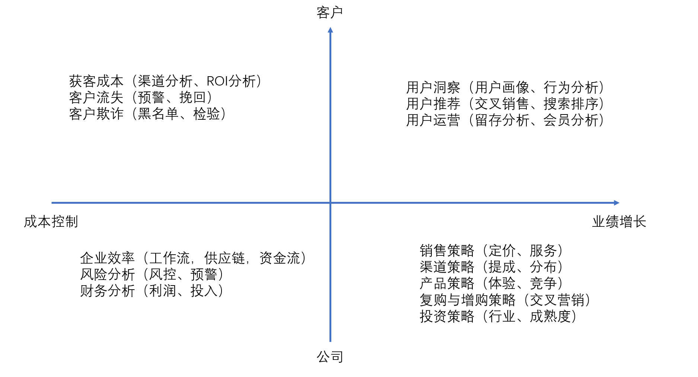
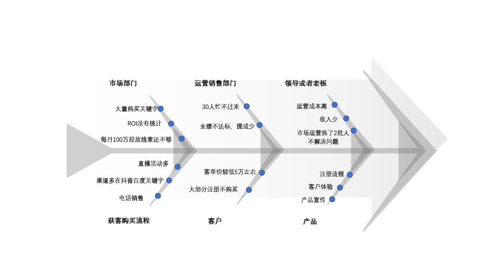
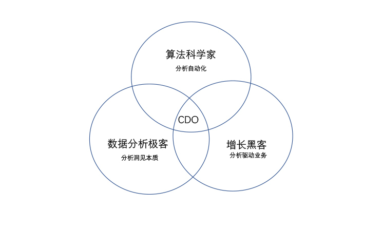

---
date: "2019-06-23"
---  
      
# 21 |  确定问题：与利益无关的问题都不值得数据分析和挖掘
数据给你一双看透本质的眼睛，这里是《数据分析思维课》，我是郭炜。

前面给你讲了数据分析的基础概念和算法，这有些像西医的检测和器械部分，紧接着来到“如何用数据说话”这章，我将试图用比较简单的逻辑给你讲清楚怎样对一个事物进行系统的数据分析，也就是我们之前说的中医部分。

其实学完数据分析基础和数据算法基础后，你很容易觉得自己有很多的“武器”了。但这个时候就会出现我们在开篇词里提到的一个问题：我们已经掌握了最先进的人工智能冲锋枪，但是在企业数据这个大森林里面，我们究竟应该向哪里开枪？具体怎么去狩猎？

这是本章要重点关注的部分。本节课，我们就先讲讲到底应该选择哪些问题进行数据分析。

## 和利益无关的问题都不值得做数据分析

观点先行。我的观点很明确：**和利益无关的问题都不值得做数据分析。**我们经常能看到很多数据分析报告，除了博人眼球之外都是一些无关痛痒的结果。这样的报告看了也就图一乐，并不能够给企业和个人带来实际的业务价值。

那么哪些方向可以给企业和个人带来业务价值呢？其实不外乎有两个，一个是带来更多的收入，一个是帮着节约成本。那么对一个企业来讲，我们要用户、公司两手抓。这样一组合就出现了下图里的四个象限，你可以在这个图里看到我们最常见的一些企业数据分析方向。

<!-- [[[read_end]]] -->

你可以这样去理解，**但凡不在这些象限里面的数据分析问题，其实都可以忽略不计，因为它不是在公司的主干线上要解决的问题。**

你从图中会发现，如果要去做业绩增长，在客户层面我们就要会做用户洞察、用户推荐、用户运营；而在公司层面我们就要基于数据分析来做销售策略、渠道策略、产品策略、复购和增购策略，以及投资策略等等相关的分析。

从成本控制来讲，在客户层面，我们可以降低获客的成本、挽留客户的流失、识别客户的欺诈；在公司层面我们可以提高企业的效率，通过风险分析降低整体的风险以及做财务分析。当然这些话题都有子话题，我把子话题也放在了图中，你要是感兴趣可以再琢磨一下。

对于一个数据极客来说（数据极客是我们数据分析行业的一种个人发展方向，如果你想进一步了解可以去看看这节课的附录），针对一个具体问题，正确的步骤是确定问题、探索数据、总结讨论，实践、迭代你的理论。这个过程是把问题逐渐收敛聚焦到关键问题上，而且并不是单向的，后面在执行步骤过程中，可能还会反复到上一个步骤里进行数据优化或者数据补充。

不知道你有没有经常遇到这样一个场景，在工作和生活当中往往遇到要分析的问题只是领导或家人的一句话：“现在XXX情况不太好，你来给我们分析总结下问题在哪里。”这种问法其实只有一个大致方向，而没有具体任务。这时候你往往会无从下手，怎么快速去梳理出要分析的具体问题呢？我给你推荐一个十分简单的两步法。

**第一步，把理想与现状对比。**这个做法其实有点咨询的味道在里面，因为一开始在找到问题的关键前，你需要先要知道你的需求方也就是老板（或者家人），他的心里到底是怎么想的？他的计划是什么？你可以列出如下这么一个表格，一个是现状，一个是理想状况。

这里要注意对于提出来的问题，我们不能只去关注问题本身，还要留意问题之外的问题，你可以从以下这几个角度来扩展下思维。

* 当前是理想值的多少？
* 如果理想值提高10\%，你可以从哪些方面下手？
* 如果理想值提高100倍，你可以从哪些方面下手？

其实思考到一些新的问题之后，你就可以重新定义这些问题了。然后你可以进行更深入一些的访谈，去完善你的现状和未来的列表，比如我把上面的表格扩展之后，就变成了下面这样。

完善之后，整体感觉还是太高层次了，看到了这些大的方向，我们现在怎么来落地到具体的问题呢？这个时候我们就要**进行第二步了，那就是6W2H法。**

这个方法主要可以帮助我们拓展思考的范围，去逻辑性地梳理各种基本问题。

* **Who**：指的是涉及这件事情的人、组织职务等等，一般会涉及到决策者、行动者、客户等；
* **What**：列出跟我们讨论相关的这个方向整体的事实或者架构，这些问题和哪些因素有关？他们的条件是什么？重点是什么？与什么有关系？
* **Whom**：紧接着列出这个目标是针对谁来做的，工作对象是谁？关键干系人有哪些？谁会受益？
* **When**: 明确实施的时间周期，预期何时能完成？需要几天才合理？
* **Where**：确认渠道、地点位置、周边的环境，资源在什么地方；
* **Why**：列出可能的原因，一些前提条件或者意图；
* **How**：思考一下现在的问题，未来有可能用哪些手段、方法提高和改进这个问题；
* **How Much**：确认最后要花的时间、人力资源、费用等。

## 具体场景

下面我们进入一个具体的假设场景当中，来看看一个简单的数据分析过程应该怎么来做。

假设我们现在供职于一个做销售工具的SaaS公司，老板让我们针对现在运营投入的情况做一份数据分析，我们应该怎么下手呢？

我相信大多数人遇到这样的问题时，第一反应都会想到先把过去运营的数据做一下统计，然后用柱状图和折线图对比一下每年的增长，接下来再根据不同的产品和用户群进行分类做相关分析。

但这样做其实是错误的，你做了这些分析之后，经常就会陷入到一个困境里，那就是接下来应该怎么做呢？就像我们面临生活中的买房问题一样：你可以拿到各种数据，却不知道该如何决策。

**之所以我们会陷入这种困境中，是因为我们只看到了一些代表结果的数据，没有分析具体问题。**销售额、利润率这些数据其实很容易收集，也容易得到我们的关注，但是紧盯着这些数据结果进行分析，你的效率会非常低下，基本没办法进行结果改进或解决问题。

所以，数据驱动不是只是利用“数据”做驱动，而是要用数据思维来驱动。我们要先确定分析的问题，再采集数据。我们利用前面的As Is-To Be方法来进行迭代。通过和领导的访谈，你发现在领导心目中，现在的问题是运营获客效率低，开销占成本一半，他期待的是提高运营效率，成本降低到50\%。

这个问题只是大方向，我们可以想象，降低到50\%其实并不是最终目标，我们跳出这个框架，来想一下理想状态下，这个目标应该是什么。这个时候其实你可以和老板一起头脑风暴一下，沟通过后未来的目标更清楚了，理想（To Be）为：“形成自动化获客体系、提高运营效率、长期获客成本逐年降低”。这些目标虽然看上去宏大，但是即使短期内无法达到，也不会整体方向上错误，让我们陷入短视的陷阱里。

有了这些目标，我们再进行第二步，用6W2H法进行拆解。整体上运营客户效率低，其实涉及的部门很多，从老板的角度来看这个问题，就会有下面这个图。

然后我们去每一个相关部门带着领导的As-IS和To-Be的设想以及6W2H来访谈，细化问题，例如我们现在去市场部门进行访谈，进一步拆分问题如下。

* Who：市场部；
* Whom：新客户；
* When：从公司成立以来；
* What：购买大量关键字费用很高；
* How Much：费用在每月100万元；
* Where：搜索引擎和抖音；
* Why：关键字转化ROI没法获得，没有数据支撑；
* How：希望前后台数据拉通，评估数据。

类似的，我们还可以去走访运营部、电销部、产品部，还可以访谈部分客户，可能有些数据情况还不清楚，不过没有关系，我们可以在第二步采集数据之后再设计具体目标，现在我们先把具体方向列出来。

这时候如果还用As-Is To-Be的图表就会不够清晰了，所以这个时候我们可以用一个叫[鱼骨图](https://baike.baidu.com/item/%E9%B1%BC%E9%AA%A8%E5%9B%BE/6514245?fr=aladdin)的新工具来梳理一下我们整体的思路。

有了这个鱼骨图，基本上我们把领导的这一句让你找“运营问题”的话，已经拆解成若干部门的若干问题了。注意，就像开始的流程图一样，所有的这些工作流程并不单向的，在我们根据这些问题去采集数据的时候，很可能会发现新的问题，我们依然可以把新问题补充在这个鱼骨图里。

这样一来，我们把上面的大问题进行拆解，将这些问题再细分，然后用下节课“采集数据”的方式逐步找到相关的数据再进行分析，最后就可以解决问题了。

如果今天的课程你只能记住一句话，我希望你记住，**数据分析重点在要分析的问题，而不是在数据，不要一上来就先用手头数据进行分析，要先针对问题利用As-Is To Be和6W2H方法进行细化。**

## 小结

讲到这里，今天的内容也就快结束了。我们回顾一下今天的内容，在开始一个数据分析问题前，我们会先确定和利益相关的数据分析问题范围。这里你要注意，我们要提高一个维度去留意问题之外的问题。在高层次问题向下细分的时候，我们可以通过As-Is To-Be以及6W2H的方法去细化问题，这个过程中我们还用到了一个叫鱼骨图的工具。

我们把所有的问题先罗列出来后，其实在数据探索当中，还可以在这个鱼骨图上增加新的问题，或者发现有些问题不是重要问题后进行删减。这个思考问题和数据探查的过程，本身也是数据分析的意义所在。

这个过程就像在画一个数据地图，我们先把大方向确定，然后一步一步把城区画出来，然后画街区、每个小区，紧接着我们用道路把它们穿起来进行试运行，去调整道路和街区的设计，最终得到最合适这个业务的地图与道路。如果一开始就陷入细节，你很容易走弯路，甚至无法到达目的地。

其实要在企业的森林里找到我们的目标，需要有更多的经验和知识。这一章的内容更多地是给你讲数据分析的思维方式（也就是中医的部分），希望这种思维方式能够成为你工作生活的一部分，它会随着你自己对行业了解的加深、经验的积累，越来越值钱。

数据给你一双看透本质的眼睛，希望我们最后都能成为一个中西医结合的大咖。

## 课后思考

你自己生活和工作当中有哪些As Is和ToBe？ 升维思考后，你能画出鱼骨图吗？期待你的分享，我们在这一章接下来的课程里，会逐步教会你用数据思维的方法解决问题。

## 附录：数据行业个人发展方向

我把数据分析行业个人发展大概方向给你介绍一下，你可以看下将来自己会走向哪里。数据分析领域非常宽阔，整体来讲未来顶尖的专家可以分成三类人。

第一类人是算法科学家。这是一群算法开发和自动化的专家，他们擅长的是利用手中的算法或者自创的算法，发现现实当中的规律并把它们程序化，最终形成自动化的机制，从而为企业、个人源源不断提供价值。典型代表就是投资银行里的自动化交易设计师（《征服市场的人》当中的西蒙斯）或者是互联网公司当中的算法科学家（像李飞飞这样的教授）。

第二类人是增长黑客。他们熟练掌握数据分析基础知识，同时可以把业务的想法以及创意通过数据的方法进行试验、测试迭代，最终帮助公司提升业务。他们结合了创意营销、数据分析、产品迭代多项技能，最终用数据和运营手段帮助公司实现收入和用户数的快速增长。

第三类人是数据分析极客。他们熟练掌握各类数据工具，有非常强的数据思维。他们可以根据业务的各种情况来进行数据实验和数据分析，有些人走向数据分析师的岗位，有些人走向运营和产品的岗位。他们可以通过数据洞察业务的走向，结合数据分析的基本知识和算法，快速对业务进行调整，最终达到可以洞见业务和世界趋势的境界（投行或者企业当中的数据分析师）。

这三类人就像下面这个图一样，技能结合到一起的就是一个企业的CDO，也就是首席数据官，哪一条路径都可以让你走到最顶点的位置，取决于你坚持学习的程度和认知的广度。

